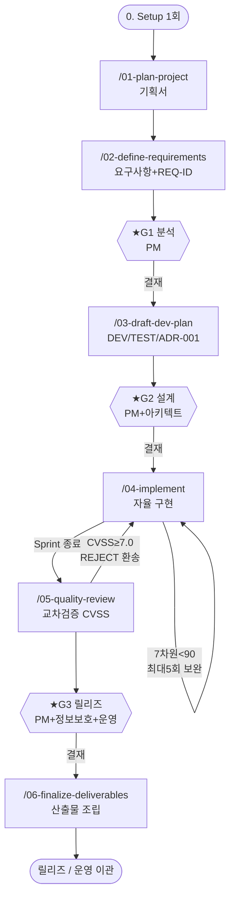

# 개발자 실행 워크플로우 가이드 (Developer Execution Workflow)

> **대상**: 신규/진행 프로젝트에서 표준 하네스를 **직접 실행하는 개발자·실무자**
> **목적**: 실행 스킬 `01` → `06`, 검증 스킬 `07`, 보완 가이드 `08-harness` 를 turn-by-turn 으로 사용하는 방법
> **기준 도구**: **Claude Code** (slash command). Codex / Cursor 차이는 [부록 A](#부록-a--codex--cursor-차이) 참조
> **작성일**: 2026-06-01

---

## 이 문서의 경계 (먼저 읽기)

이 가이드는 **"어떻게 실행하는가(HOW-TO-RUN)"** 에만 집중합니다. 다음은 재서술하지 않고 링크만 둡니다.

| 알고 싶은 것 | 보는 문서 |
|--------------|-----------|
| **무엇이 있는가** (자산 카탈로그·매핑 표) | [PACKAGE-INDEX.md](PACKAGE-INDEX.md) |
| **왜·원칙** (프로세스 정의·근거) | [HARNESS-PROCESS-STANDARD.md](HARNESS-PROCESS-STANDARD.md) |
| **패키지 개요·5분 빠른시작** | [README.md](README.md) |
| **각 스킬의 정식 정의** | [.claude/skills/](.claude/skills/) `0X-*/SKILL.md` |

> ⚠ 각 스킬의 **입력·출력 경로·DoD 의 권위 있는 정의는 항상 해당 `SKILL.md`** 입니다. 이 가이드와 `SKILL.md` 가 충돌하면 `SKILL.md` 가 우선합니다.

---

## 0. 사전 준비 (Setup — 첫 스킬 전 1회)

첫 `/01-plan-project` 를 실행하기 전에 **딱 한 번** 수행합니다.

### 0.1 패키지를 신규 프로젝트로 복사

```bash
# 표준 하네스 패키지를 받아둔 위치
HARNESS=~/workspaces/project/harness-standards

# 신규 개발 프로젝트
PROJ=~/workspaces/project/my-new-project
mkdir -p $PROJ/docs
cd $PROJ

cp -r $HARNESS/.claude     $PROJ/     # 스킬 8 + 에이전트 13 (AI 도구가 자동 로드)
cp -r $HARNESS/templates   $PROJ/     # 산출물 템플릿 21
cp -r $HARNESS/hooks       $PROJ/     # 보안 Hook 3단계
cp -r $HARNESS/scripts     $PROJ/     # parity-check / generate-codecs
cp $HARNESS/HARNESS-PROCESS-STANDARD.md $PROJ/docs/
```

### 0.2 git 초기화 + 보안 Hook L1 (gitleaks) 설치

```bash
cd $PROJ
git init -b main

# 훅 설치 (이 저장소에서 검증된 방식)
cp hooks/pre-commit-gitleaks.sh .git/hooks/pre-commit
chmod +x .git/hooks/pre-commit

# gitleaks 바이너리가 없으면 훅이 모든 커밋을 차단합니다. 미설치 시:
#   Linux: ~/.local/bin 등 PATH 경로에 gitleaks v8.18.0 설치
#   gitleaks version  # 설치 확인
```

> L1 훅이 없으면 시크릿이 그대로 커밋될 수 있습니다. **0.2 는 선택이 아니라 필수**입니다. 자세한 동작은 [hooks/pre-commit-gitleaks.sh](hooks/pre-commit-gitleaks.sh) 참조.

### 0.3 AI 도구 실행 + 스킬 로드 확인

```bash
cd $PROJ
claude                 # Claude Code 실행
```

Claude Code 안에서 스킬 목록에 `01-plan-project` ~ `08-harness` 8개와 13개 에이전트가 보이면 정상 로드된 것입니다. (`.claude/` 를 복사했기 때문에 자동 인식)

### 0.4 사전 점검 체크리스트

- [ ] `.claude/`, `templates/`, `hooks/`, `scripts/` 복사 완료
- [ ] `git init` + L1 훅 설치 + `gitleaks version` 확인
- [ ] AI 도구에서 스킬 8 + 에이전트 13 로드 확인
- [ ] PM(또는 결재권자)과 **1:1 대화 가능 상태** (스킬 1·2·6 은 대화 필수)
- [ ] 금융/규제 프로젝트면 [§금융권 주의](#금융권규제-프로젝트-공통-주의)를 미리 숙지

---

## 워크플로우 한눈에

```
 [0] Setup ── 1회
   │
 [1] /01-plan-project ........ Phase 1 ─┐
   │                                     │ (대화)
 [2] /02-define-requirements . Phase 1 ─┘──▶ ★G1 (PM)
   │
 [3] /03-draft-dev-plan ...... Phase 2 ─────▶ ★G2 (PM+아키텍트)
   │
 [4] /04-implement ........... Phase 3   ↺ 7차원 90점 루프(최대5회) · Sprint 반복
   │
 [5] /05-quality-review ...... Phase 4   교차검증(CVSS) · CVSS≥7.0 차단 ─▶ ★G3 (PM+정보보호+운영)
   │
 [6] /06-finalize-deliverables Phase 4 ─────▶ PM 최종결재 → 릴리즈
```

`/08-harness` 는 07 검증 결과를 받아 **보완할 내용을 우선순위로 가이드**하는 후속 스킬입니다(진행 중 프로젝트의 다음 행동 안내도 겸함). `/07-validate-standard`는 선형 단계가 아니라 setup 직후, 하네스 변경 후, G1/G2/G3 직전에 반복 실행하는 읽기 전용 검증 스킬입니다. 각 실행 스킬은 시작 시 `lead_agent`가 Support 에이전트를 배정하고 산출물을 통합합니다.

★ = **사람 결재 게이트 (우회 금지)**. 아래 §1~§8 은 동일한 구조로 기술합니다:
**① 진입조건 · ② 실행 · ③ 진행 중 일어나는 일 · ④ 산출물 · ⑤ 체크포인트/게이트 · ⑥ 다음으로 · ⑦ 트러블슈팅**

---

## 1. `/01-plan-project` — 프로젝트 기획서

정식 정의: [.claude/skills/01-plan-project/SKILL.md](.claude/skills/01-plan-project/SKILL.md)

**① 진입조건** — 없음 (본 표준 진입점). 기존 기획서/RFP/화면 시안이 있으면 미리 프로젝트에 두면 분석에 활용.

**② 실행**
```
/01-plan-project
```

**③ 진행 중 일어나는 일** — 기존 기획서가 있으면 자동 분석 후 공백만 보완 질문. 없으면 **표준 12문항을 한 번에 하나씩** 1:1 로 묻습니다(1줄 정의 → 비즈니스 문제 → 페르소나 → 핵심 시나리오 TOP3 → 화면 → 외부연동 → NFR → 제약 → KPI → 위험 → 선호 스택 → 결재구조). 금융 키워드(계좌·송금·결제)가 나오면 규제 점검 항목이 자동 추가됩니다. (소요 2~6시간)

**④ 산출물**
- [docs/planning/PROJECT-PROPOSAL.md](templates/planning/PROJECT-PROPOSAL.template.md) (기획서)
- [docs/planning/BUSINESS-REQUIREMENTS.md](templates/planning/BUSINESS-REQUIREMENTS.template.md) (비즈니스 요구)
- (선택) `docs/planning/stakeholder-map.md`

**⑤ 체크포인트** — 게이트 없음. 단 DoD: 12문항 모두 답변 또는 명시적 `[보류]`, PROPOSAL PM 1차 확인 완료.

**⑥ 다음으로** — `PROJECT-PROPOSAL.md` 가 존재하면 `/02-define-requirements` 진입 가능.

**⑦ 트러블슈팅**

| 증상 | 대응 |
|------|------|
| 질문에 답을 모르겠음 | `[보류]` 로 표시하고 진행 — 나중에 02에서 구체화 |
| 기획자가 따로 있음 | 기존 기획서를 두면 12문항 대신 자동 분석 모드로 동작 |
| 답이 모호("빠르게") | AI 가 후보 ≥ 2 를 제시 — 하나 고르면 됨 |

---

## 2. `/02-define-requirements` — 요구사항 정의서 (★G1)

정식 정의: [.claude/skills/02-define-requirements/SKILL.md](.claude/skills/02-define-requirements/SKILL.md)

**① 진입조건** — `docs/planning/PROJECT-PROPOSAL.md` 존재 (Skill 1 산출물).

**② 실행**
```
/02-define-requirements
```

**③ 진행 중 일어나는 일** — 기획서를 파싱해 **공백·모순**을 식별(측정 불가 NFR, orphan use case, 충돌 요구)하고 1:1 대화로 해소합니다. 이후 Functional(`FR-`)/Non-Functional(`NFR-<영역>-`)/Constraint(`CONST-`) 3분류 + **REQ-ID 부여** + **추적 매트릭스**(REQ-ID × 출처 × 우선순위(MoSCoW) × 검증방법)를 생성. (소요 4~12시간)

**④ 산출물**
- [docs/requirements/REQUIREMENTS-SPEC.md](templates/requirements/REQUIREMENTS-SPEC.template.md)
- `docs/requirements/use-cases/UC-NNN.md` ([템플릿](templates/requirements/USE-CASE.template.md))
- `docs/requirements/requirements-matrix.csv`
- `docs/requirements/questions-log.md`

**⑤ 게이트 — ★G1 분석 (PM 결재)**. 통과 조건: 모든 요구에 REQ-ID(orphan 0), `[AMBIGUOUS]` 전부 회신/보류, 추적 매트릭스 100%, **PM 결재**.

**⑥ 다음으로** — G1 결재 완료 후에만 `/03-draft-dev-plan` 진입.

**⑦ 트러블슈팅**

| 증상 | 대응 |
|------|------|
| `[AMBIGUOUS]` 가 남아 G1 막힘 | PM 회신을 받거나 명시적 보류 표시 후 재시도 |
| 충돌 요구 발견 | 진행을 멈추고 PM 결재로 우선순위 결정 (강제 룰) |
| NFR 이 측정 불가 | SLA 수치로 환산(P95 < 500ms 등) — AI 가 후보 제시 |

---

## 3. `/03-draft-dev-plan` — 개발/테스트 계획 + ADR-001 (★G2)

정식 정의: [.claude/skills/03-draft-dev-plan/SKILL.md](.claude/skills/03-draft-dev-plan/SKILL.md)

**① 진입조건** — `REQUIREMENTS-SPEC.md` **G1 결재 완료**.

**② 실행**
```
/03-draft-dev-plan
```

**③ 진행 중 일어나는 일** — 요구사항을 Epic → Sprint → Task DAG 로 분해 → **기술 스택 후보 ≥ 2안 비교**(6차원 가중 평가) → ADR-001 자동 생성 → Mermaid 아키텍처 초안 → 테스트 전략(커버리지·7차원 임계 90) → **위험 등록부 ≥ 10건**. 차점안과 차이 < 10% 면 PM 결재를 요청합니다. (소요 1~3일)

**④ 산출물**
- [docs/design/DEV-PLAN.md](templates/design/DEV-PLAN.template.md)
- [docs/design/TEST-PLAN.md](templates/design/TEST-PLAN.template.md)
- `docs/design/architecture-overview.md`
- [docs/design/adr/ADR-001-tech-stack.md](templates/design/ADR.template.md)
- `docs/design/risk-register.md`, `docs/design/sprint-1-tasks.md`

**⑤ 게이트 — ★G2 설계 (PM + 아키텍트 결재)**. 통과 조건: DEV/TEST/아키텍처 작성, ADR-001(후보≥2), 위험 ≥10건, Sprint 1 task 확정.

**⑥ 다음으로** — G2 결재 완료 후에만 `/04-implement` 진입.

**⑦ 트러블슈팅**

| 증상 | 대응 |
|------|------|
| 스택 1안만 떠올림 | 강제 룰상 ≥ 2안 비교 필요 — AI 에 대안 후보를 요청 |
| 금융/규제 프로젝트 | 트랜잭션·PII·키관리 등 **추가 ADR(ADR-002~009) 작성 의무** |
| 7차원 임계를 90 외로 | 03 에서 PM 과 협의해 값 조정 (TEST-PLAN 에 명시) |

---

## 4. `/04-implement` — 자율 에이전트 팀 구현 (7차원 루프)

정식 정의: [.claude/skills/04-implement/SKILL.md](.claude/skills/04-implement/SKILL.md)

**① 진입조건** — `DEV-PLAN.md` / `TEST-PLAN.md` / `ADR-001` **G2 결재 완료**.

**② 실행**
```
/04-implement
```
> 본 스킬은 **Sprint 단위로 반복 실행**합니다. 첫 실행 시 스켈레톤(디렉터리 트리·빌드 스크립트·CI·L1 훅)을 1회 생성합니다.

**③ 진행 중 일어나는 일** — Team Leader 가 DAG 분석으로 병렬 task 를 dispatch → 에이전트가 **자신의 Write 디렉터리 1개만** 수정하며 코드+단위테스트 동시 작성(`// source:`/`// req:` 주석, 설계 변경 시 ADR 의무) → QA 에이전트 자동 테스트(실패 시 자가수정 루프) → **Leader 7차원 자체 평가(90점 임계)**. 90 미만이면 최저 차원을 보완·재생성하며 **최대 5회 반복**, 5회 후에도 미달이면 **PM Escalation**. (Sprint = 1~2주 권장)

7차원: 완성도20 · 추적성15 · 보안20 · 성능10 · 가독성15 · 표준준수10 · 테스트커버리지10.

**④ 산출물**
- `src/`, `tests/`
- `docs/sprints/SPRINT-N-LOG.md` ([템플릿](templates/implementation/SPRINT-LOG.template.md))
- `docs/design/adr/ADR-NNN-*.md` (Sprint 중 발생)
- `mapping/trace/c2j.csv` 또는 `requirements-trace.csv` ([템플릿](templates/implementation/TRACE-CSV.template.csv))

**⑤ 체크포인트 — Sprint 게이트 (PM)**. DoD: task 100%(또는 명시 이월), **7차원 ≥ 90**, CI 빌드+테스트 PASS, code-reviewer **APPROVE**, security-auditor 승인/조건부승인, PM 결재.

**⑥ 다음으로** — Sprint 종료 후 다음 Sprint 를 다시 `/04-implement` 로 돌리거나, 릴리즈 대상이면 `/05-quality-review` 진입.

**⑦ 트러블슈팅**

| 증상 | 대응 |
|------|------|
| 7차원이 5회까지 90 미달 | 자동으로 **PM Escalation** — 사람이 범위 축소/스택 재검토 결정 |
| 에이전트가 남의 디렉터리 수정 시도 | 1:1 권한 매핑 위반 — Leader 가 차단, 표준준수 차원 감점 |
| gitleaks(L1) 가 커밋 차단 | 시크릿을 환경변수/Vault 로 이동, 이미 푸시됐으면 **키 회전 + history rewrite** |
| 금액 계산에 `double` 사용 | ArchUnit 가 차단 — `BigDecimal` + `RoundingMode` 로 교체 |
| 파괴적 작업(대량 삭제 등) | **PM 인간 결재 의무** — 자동 진행 금지 |

---

## 5. `/05-quality-review` — 품질·교차검증 (★G3)

정식 정의: [.claude/skills/05-quality-review/SKILL.md](.claude/skills/05-quality-review/SKILL.md)

**① 진입조건** — Skill 4 의 **Sprint 종료** (또는 릴리즈 직전).

**② 실행**
```
/05-quality-review
```

**③ 진행 중 일어나는 일** — QA 팀 품질 테스트(회귀·부하·보안, 마이그레이션이면 Parity) → code-reviewer 정적 리뷰 → security-auditor 보안 감사(OWASP/PII/시크릿/규제) → **교차 검증(핵심 차별점): Claude 코드를 Codex 등 다른 벤더 LLM 이 독립 리뷰 → 결함을 CVSS v3.1 점수화**. **CVSS ≥ 7.0 은 즉시 차단(Skill 4 환송)**. 보안 Hook L1/L2/L3 통합 점검. Skill 4 의 7차원 점수를 **독립 재평가**(차이 > 10점이면 자기합리화 의심 → PM). (소요 3~10일)

CVSS 처리: ≥9.0 CRITICAL(4h 내) · 7.0~8.9 HIGH(본 Sprint) · 4.0~6.9 MEDIUM(다음 Sprint) · 0.1~3.9 LOW(백로그).

**④ 산출물**
- [reviews/code-review-sprint-N.md](templates/qa/REVIEW-REPORT.template.md)
- [reviews/cross-validation-N.md](templates/qa/CROSS-VALIDATION.template.md) (CVSS)
- [security/audit-N.md](templates/qa/SECURITY-AUDIT.template.md)
- [qa/test-report-N.md](templates/qa/QA-TEST-REPORT.template.md)
- [parity/parity-report-N.md](templates/qa/PARITY-REPORT.template.md) (마이그레이션 시) — `scripts/parity-check.sh` 활용
- `reviews/verdict-sprint-N.md` (종합 판정: APPROVE / CONDITIONAL / REJECT)

**⑤ 게이트 — ★G3 릴리즈 (PM + 정보보호 + 운영 결재)**. 통과 조건: 교차검증 ≥1회, CVSS ≥7.0 결함 0건(또는 리스크 수용 결재), 7차원 재평가 ≥90, 모든 리포트 작성. [hooks/prod-gate-checklist.md](hooks/prod-gate-checklist.md) 충족.

**⑥ 다음으로** — 판정 **APPROVE/CONDITIONAL** 이면 `/06-finalize-deliverables`. **REJECT** 면 `/04-implement` 로 환송.

**⑦ 트러블슈팅**

| 증상 | 대응 |
|------|------|
| 교차검증 LLM 이 없음 | 최소 1개 **다른 벤더**(Claude→Codex 등) 필요 — DoD 강제 항목 |
| CVSS ≥ 7.0 결함 발견 | 즉시 차단 → Skill 4 환송 후 수정(최대 5회 보완 루프) |
| Codex 지적이 false positive | **반박 가능**하되 근거를 코드/문서로 명시 + 룰 보완 기록 |
| 4·5 점수 차 > 10점 | Leader 자기합리화 의심 → PM 결재로 조정 |

---

## 6. `/06-finalize-deliverables` — 최종 산출물

정식 정의: [.claude/skills/06-finalize-deliverables/SKILL.md](.claude/skills/06-finalize-deliverables/SKILL.md)

**① 진입조건** — Skill 5 **G3 릴리즈 게이트 통과**.

**② 실행**
```
/06-finalize-deliverables
```

**③ 진행 중 일어나는 일** — **1:1 대화로 산출물 목록·형식 확정**(대상=발주처/임원/운영/감사, 형식=md/pdf/pptx/hwp/docx/png/xlsx). AI 가 표준 목록 대비 누락을 제안 → 분석/설계/구현/검증 산출물을 단계별로 조립 → 포맷 변환(pandoc/weasyprint/python-pptx 등, 한글 폰트 강제) → 대상별 분리(임원/기술/운영/감사) + 용어집 → INDEX 작성. (소요 1~3일)

**④ 산출물**
- `deliverables/` (분류별 폴더 `01-planning` ~ `07-executive`)
- `deliverables/INDEX.md` (산출물 카탈로그 — 실제 파일과 1:1 일치)
- 대상별: [EXEC-SUMMARY](templates/deliverables/EXEC-SUMMARY.template.md) · [RUNBOOK](templates/deliverables/RUNBOOK.template.md) · [ARCHITECTURE-OVERVIEW](templates/deliverables/ARCHITECTURE-OVERVIEW.template.md)

**⑤ 체크포인트 — PM 최종 확인 → 배포**. DoD: INDEX↔파일 1:1, 목록·형식 확정, 모든 산출물 PM 최종 확인, (해당 시) 임원 리허설·운영 리뷰 완료.

**⑥ 다음으로** — 프로젝트 종료 / 운영 이관.

**⑦ 트러블슈팅**

| 증상 | 대응 |
|------|------|
| hwp 직접 변환 실패 | `pandoc → docx → 한컴오피스 변환` 경로 사용 |
| 한글 폰트 깨짐(pdf) | 맑은 고딕 등 한글 폰트 강제 지정 |
| 산출물 누락 의심 | §표준 산출물 목록 체크리스트(SKILL.md §2)로 대조 |

---

## 7. `/07-validate-standard` — 표준 준수 검증

정식 정의: [.claude/skills/07-validate-standard/SKILL.md](.claude/skills/07-validate-standard/SKILL.md)

**① 진입조건** — 없음. 하네스 패키지 루트 또는 하네스를 적용한 프로젝트 루트에서 실행할 수 있습니다.

**② 실행**
```
/07-validate-standard
```

**③ 진행 중 일어나는 일** — 현재 위치가 표준 패키지인지 실제 프로젝트인지 판별한 뒤, 스킬 8개/에이전트 13개/템플릿 21개/Hook 3단계/스크립트 2개/게이트/G1-G3/Team-with-Leader/write_dirs/7차원 평가/CVSS 차단/산출물 결재 증적을 읽기 전용으로 점검합니다. seed.yaml 또는 bootstrap 기반 생성 흐름은 현재 표준의 필수 경로로 보지 않습니다.

**④ 산출물**
- `reviews/standard-validation-{YYYYMMDD}.md`

**⑤ 판정** — PASS / WARN / FAIL. FAIL은 해당 게이트 진입 차단, WARN은 PM 확인 후 진행 가능 여부를 결정합니다.

**⑥ 다음으로** — setup 직후 FAIL이 없으면 `/01-plan-project`로, 각 게이트 직전 FAIL이 없으면 다음 스킬로 진행합니다.

**⑦ 트러블슈팅**

| 증상 | 대응 |
|------|------|
| 문서의 스킬 수와 실제 파일 수 불일치 | README / PACKAGE-INDEX / WORKFLOW를 실제 파일 트리 기준으로 갱신 |
| L2 AI 감사가 TODO 상태 | CI에서 조용히 통과하지 않도록 프로젝트별 AI audit command 설정 |
| gitleaks 우회 승인 누락 | `security/gitleaks-bypass-approval.md`에 PM 승인 근거를 남긴 뒤 재시도 |
| seed.yaml 관련 경고 | Skill 기반 전환 이후 필수 흐름이 아니므로 제거하거나 legacy 참고로 격리 |

---

## 8. `/08-harness` — 검증 보완 가이드 (07 후속)

정식 정의: [.claude/skills/08-harness/SKILL.md](.claude/skills/08-harness/SKILL.md)

**① 진입조건** — 없음. 단 **07 검증을 한 번 실행한 뒤** 가장 유용합니다(진행 중 프로젝트면 아무 시점). 선형 게이트 단계가 아니라 **개발 흐름의 마지막 보조 스킬**입니다 — `01~06 개발 → 07 검증 → 08 보완` 순서.

**② 실행**
```
/08-harness            # 모드 선택 질문(감사/신규)
/08-harness audit      # [A] 표준 준수 감사 — 보완 가이드
/08-harness new        # [B] 신규 프로젝트 진행 안내
```

**③ 진행 중 일어나는 일** — 인자가 없으면 모드를 1회 묻습니다(CQ1).
- **[A] 감사 모드** — `/07` 을 읽기 전용으로 실행 → 최신 리포트 파싱 → **우선순위 보완 액션플랜**(FAIL→WARN→LOW, 동급 내  보안>추적성>문서) → **항목별 대화형 적용**(1건씩 적용/건너뜀/백로그 — CQ3, 승인분만 수정) → `/07` 재실행으로 **before/after 점수 비교**. ⚠ `/07` 스킬·리포트 원본은 수정하지 않습니다.
- **[B] 신규 프로젝트 모드** — `docs/.harness-state.yaml` 와 실제 산출물을 교차 확인(파일이 진실) → 진입 판정 테이블로 **다음 행동 1개** 제시("다음: /0X 진입 가능" 또는 "차단: GX 결재 대기") → 승인 시 해당 `/0X` 스킬로 진입 → 완료 시 상태파일 갱신.

**④ 산출물**
- (감사) `reviews/standard-validation-{YYYYMMDD}.md` — `/07` 경유 생성
- (신규) [docs/.harness-state.yaml](templates/implementation/HARNESS-STATE.template.yaml)

**⑤ 체크포인트** — 게이트 없음(본 스킬은 디스패처 + 상태 관리). 단 **게이트 결재(G1/G2/G3)는 사람 전용** — AI 가 `approved`/`approver` 를 임의 기록하지 않고 기록 방법만 안내합니다(§4.8 CQ3, 게이트 우회 금지). 보완 적용도 **항목별 사람 승인분만** 반영하고, `/07` 원본은 무변경.

**⑥ 다음으로** — (감사) 보완 적용 → 재검증 점수 확인 → 게이트 직전이면 통과 여부 판단. (신규) 안내된 다음 `/0X` 스킬로 진입.

**⑦ 트러블슈팅**

| 증상 | 대응 |
|------|------|
| 상태파일 없음 | 신규 모드에서 Setup §0 점검 후 `HARNESS-STATE.template.yaml` 로 생성 제안 |
| 상태파일 손상/불일치 | **실제 산출물 기준** 재구성 제안(사용자 확인 후) |
| `/07` 리포트 파싱 실패 | 원문 리포트 제시 + 수동 안내로 강등(진행은 막지 않음) |
| `harness_version` ≠ 패키지 버전 | drift 신호 — 감사 모드 실행 권고 |
| AI 가 게이트를 임의 승인하려 함 | 금지 — 사람이 직접 기록, 본 스킬은 방법만 안내 |

---

## 9. 전체 흐름 (Mermaid)



---

## 금융권/규제 프로젝트 공통 주의

스킬과 무관하게 **항상** 적용됩니다 (위반 시 해당 게이트에서 차단).

| 항목 | 룰 | 강제 시점 |
|------|----|-----------|
| 금액·금리·환율 | `BigDecimal` + `RoundingMode` (double 금지) | 04 — ArchUnit |
| PII 평문 로그 | 절대 금지 (마스킹 의무) | 04 — security-auditor |
| PII 컬럼 저장 | AES-256-GCM (ADR-005) | 03 ADR / 04 |
| 시크릿 하드코딩 | 0건 | 모든 커밋 — L1 gitleaks |
| 감사 로그 | 7년 보존 + 무결성 (ADR-006) | 03 ADR / 05 감사 |
| 외부 채널 인증 | mTLS/OAuth2/SSH Key (ADR-008) | 03 ADR / 05 |
| 메시지 무결성 | HMAC/서명 (ADR-004) | 03 ADR / 05 |

규제 적용 시 별도 점검: 전자금융감독규정 · 개인정보보호법 · 신용정보법 · ISMS-P · PCI-DSS · 금융보안원 가이드. 상세 [PACKAGE-INDEX.md §10](PACKAGE-INDEX.md).

---

## 부록 A — Codex / Cursor 차이

본문은 **Claude Code slash command** 기준입니다. 스킬·에이전트 자산(`.claude/`)은 동일하게 복사하되, **스킬 호출 방식만** 다릅니다.

| 도구 | 스킬 호출 | 비고 |
|------|-----------|------|
| **Claude Code** | `/01-plan-project` (slash) | 본 가이드 기준 |
| **Codex** | `skill 01-plan-project` (또는 도구의 skill 실행 명령) | 교차검증(Skill 5)에서 **다른 벤더**로 활용 권장 |
| **Cursor** | 명령 팔레트/채팅에서 스킬명 지정 (`.cursor/rules` 로 SKILL.md 주입 가능) | 자산 자동 로드 방식은 버전별 상이 |
| **Gemini CLI** | SKILL.md 를 컨텍스트/룰로 주입 후 스킬명 지시 | 교차검증 대안 벤더 |

> 본 표준은 **AI 도구 비종속**입니다(HARNESS-PROCESS-STANDARD §5.8) — Claude Code 는 기준 구현일 뿐, SKILL.md 는 어느 도구든 주입 가능하며 `recommended_llm` 은 등급(고급/표준/경량) 의미로 동급 모델로 대체합니다. 도구별 정확한 호출 문법은 각 도구의 최신 문서를 따르세요. **결과 산출물·게이트·DoD 는 도구와 무관하게 동일**합니다. 교차 검증(Skill 5)은 의도적으로 **본 구현과 다른 벤더 LLM** 을 쓰는 것이 핵심입니다.

---

## 부록 B — 명령 치트시트

```
0. (1회) cp -r .claude templates hooks scripts → 신규 프로젝트 / git init / L1 훅 설치
1. /01-plan-project            → docs/planning/PROJECT-PROPOSAL.md
2. /02-define-requirements     → docs/requirements/REQUIREMENTS-SPEC.md   ★G1 (PM)
3. /03-draft-dev-plan          → docs/design/DEV-PLAN.md + ADR-001        ★G2 (PM+아키텍트)
4. /04-implement               → src/ tests/ (7차원 90↺ 최대5회, Sprint 반복)
5. /05-quality-review          → reviews/ security/ qa/ (CVSS≥7.0 차단)   ★G3 (PM+정보보호+운영)
6. /06-finalize-deliverables   → deliverables/ + INDEX.md → 릴리즈
7. /07-validate-standard       → setup 직후 / G1·G2·G3 직전 / 하네스 변경 후 표준 준수 검증
8. /08-harness                 → 07 검증 후 보완 가이드 (점수화·우선순위 보완·재검증, 진행 안내 겸함)
```

| 게이트 | 시점 | 결재자 | 필수 산출물 |
|--------|------|--------|-------------|
| ★G1 분석 | 02→03 진입 전 | PM | REQUIREMENTS-SPEC.md |
| ★G2 설계 | 03→04 진입 전 | PM + 아키텍트 | DEV-PLAN / TEST-PLAN / ADR-001 |
| ★G3 릴리즈 | 05→06 진입 전 | PM + 정보보호 + 운영 | 전 검증 리포트 + prod-gate 체크리스트 |

---

## 부록 C — FAQ / 흔한 함정

**Q. 게이트를 건너뛰고 다음 스킬을 실행하면?**
→ 진입조건 미충족으로 중단합니다. **게이트 우회는 금지**(`--no-verify`, 결재 생략 모두 금지). 게이트는 사람 결재 지점입니다.

**Q. 7차원 점수가 계속 90을 못 넘습니다.**
→ 최저 차원을 집중 보완하며 **최대 5회** 재생성합니다. 5회 후에도 미달이면 **PM Escalation** — 사람이 범위 축소·스택 재검토·일정 조정을 결정합니다. 무한 루프는 없습니다.

**Q. gitleaks 훅 때문에 커밋이 안 됩니다.**
→ 정상 동작입니다(시크릿 탐지). 시크릿을 환경변수/Vault/KMS 로 옮기고, 이미 푸시됐다면 **키 회전 + git history rewrite**. 긴급 우회(`ALLOW_GITLEAKS_BYPASS=1`)는 감사 로그가 남고 PM 결재 없는 사용은 금지입니다.

**Q. 교차 검증(Skill 5)에 꼭 다른 LLM 이 필요한가요?**
→ 네. 같은 모델의 자기 검토는 같은 맹점을 공유합니다. **다른 벤더 LLM**(Claude↔Codex 등)이 DoD 강제 항목입니다.

**Q. 마이그레이션(C→Java 등) 프로젝트는 무엇이 다른가요?**
→ Skill 4·5 에 **Parity 테스트**(바이트 단위 동치, `scripts/parity-check.sh`)가 추가되고, 추적 매트릭스가 `c2j.csv`(C↔Java) 형태가 됩니다. 레거시 6개월 보존·컷오버 후 72시간 롤백 가능 유지.

**Q. 금액 계산에 `double` 을 쓰면?**
→ 04 단계 ArchUnit 가 차단합니다. `BigDecimal` + 명시적 `RoundingMode` 만 허용.

---

## 변경 이력

| 일자 | 버전 | 내용 |
|------|------|------|
| 2026-06-15 | 1.5 | `00-harness`→`08-harness` 리네임 + "07 검증 후 보완 가이드"로 재정의 |
| 2026-06-12 | 1.4 | 에이전트 13종(frontend-developer)·부록 A 확장(Gemini CLI·도구 중립성) 반영 |
| 2026-06-12 | 1.3 | `/08-harness` 통합 진입점(감사 가이드·스텝 안내) 추가. 8 스킬·21 템플릿 반영 |
| 2026-06-10 | 1.2 | 템플릿 17→20 반영. 표준 §4.8(질의 생성 기준)·§4.9(근거 표기 범례)·위협 모델(STRIDE)·공급망 보안(SBOM·라이선스)·Sprint 회고/인시던트 postmortem 연계. |
| 2026-06-10 | 1.1 | `07-validate-standard` 검증 스킬 추가. seed.yaml/bootstrap 흐름 제외 및 게이트 전 검증 절차 반영. |
| 2026-06-01 | 1.0 | 초안 — 개발자 실행 워크플로우(01→06 end-to-end, Claude Code 기준 + Codex/Cursor 부록). 6 스킬 SKILL.md 기준 작성 |

---

**참조**: [HARNESS-PROCESS-STANDARD.md](HARNESS-PROCESS-STANDARD.md) · [PACKAGE-INDEX.md](PACKAGE-INDEX.md) · [README.md](README.md) · [.claude/skills/](.claude/skills/)
