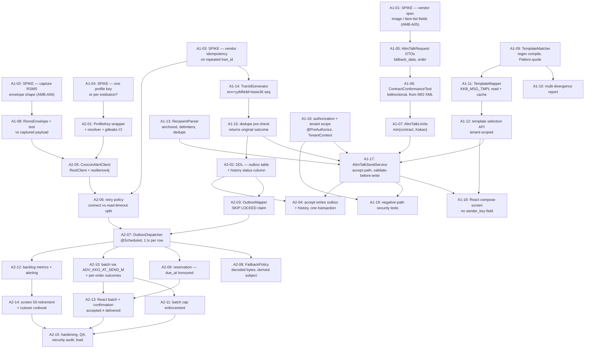

# Development Plan — 카카오 알림톡 (AlimTalk Compose · Send · Template Validation)

> **Version**: 1.0
> **Date**: 2026-08-18
> **Predecessor**: [REQUIREMENTS-SPEC-ALIMTALK.md](../requirements/REQUIREMENTS-SPEC-ALIMTALK.md) — **G1 PENDING**
> **Siblings**: [DEV-PLAN.md](DEV-PLAN.md) (문자내역), [DEV-PLAN-LOGIN.md](DEV-PLAN-LOGIN.md), [DEV-PLAN-INSTITUTION.md](DEV-PLAN-INSTITUTION.md), [DEV-PLAN-SENDERNO.md](DEV-PLAN-SENDERNO.md)
> **Design**: [architecture-overview-ALIMTALK.md](architecture-overview-ALIMTALK.md), [threat-model-ALIMTALK.md](threat-model-ALIMTALK.md), [TEST-PLAN-ALIMTALK.md](TEST-PLAN-ALIMTALK.md), [risk-register-ALIMTALK.md](risk-register-ALIMTALK.md)
> **ADRs**: [ADR-ATK-021](adr/ADR-ATK-021-outbound-contract-conformance.md) · [022](adr/ADR-ATK-022-template-matching.md) · [023](adr/ADR-ATK-023-send-consistency-outbox.md) · [024](adr/ADR-ATK-024-vendor-credential-management.md) · [025](adr/ADR-ATK-025-http-client-resilience.md) · [026](adr/ADR-ATK-026-tran-id-idempotency.md)

---

## 1. Overview

Legacy screen 61 (카카오 알림톡 템플릿 — a composer that sends nothing) and screen 50 (BIZTALK 전송 — the send path that actually sends) become one React screen over a new `alimtalk` service package, a transactional outbox and the programme's first outbound integration. Thirty-five defects are in scope and all are fixed. Screen 50 is retired at cutover.

> ⚠ **G1 not yet approved.** Written against a DRAFT specification, following the precedent of the three previous slices. G1 must cover **CONFLICT-A01**, **CONFLICT-A02**, **RESIDUAL-A01** and **RESIDUAL-A02** — see §10.

### 1.1 What design changed since Skill 2

**The stack reopens, narrowly — and this is the first slice for which that is true.** `grep -rE "RestTemplate|WebClient|HttpClient|RestClient|Feign" src/main/java` returns nothing, and `pom.xml` has no resilience library and no scheduler. Every prior slice recorded "no external channel added" under ADR-008. [ADR-ATK-025](adr/ADR-ATK-025-http-client-resilience.md) therefore performs a full weighted 6-dimension comparison: `RestClient` + resilience4j wins at 88.5 against 76.5 for WebFlux and 70.75 for a hand-rolled JDK client. The 13.6 % runner-up gap is above the 10 % threshold, so **no PM tie-break was required** under harness §2 — though PM was consulted and selected it regardless.

**Consistency drove the largest design decision, and it was not in the requirements.** FR-ATH-003 and NFR-OPS-A01 demand that history and delivery never disagree, but no transaction can span an HTTP call. [ADR-ATK-023](adr/ADR-ATK-023-send-consistency-outbox.md) resolves this with a transactional outbox. **The decisive argument was not consistency but arithmetic**: FR-ATS-012 (reserved sends) and NFR-PERF-A03 (async batch acknowledgement) each independently require a scheduled component. Once a scheduler exists, `due_at` handles immediate and reserved sends identically and the outbox costs almost nothing extra. The naive alternative — record `PENDING`, send inline — pays the same operational price for a weaker guarantee.

**The retry policy is the safety-critical decision, not the client choice.** At-least-once despatch means a retry after a request the vendor already accepted produces a **duplicate customer notification**. ADR-ATK-025 therefore splits retries by whether non-delivery is *provable*: connect failures retry immediately, read timeouts and 5xx do not. The default configuration every resilience4j example shows — retry on any failure — would be wrong here.

**One requirement turned out to be verifiable where the previous slice's was not.** RISK-S13 left the 발신번호 slice unable to test its headline defect, because that defect was a DB-function interaction and Docker is prohibited. This slice's three Critical defects (D-A1, D-A2, D-A3) are pure serialisation against a checked-in contract XML, so `ContractConformanceTest` covers them at tier 1 with no container. That is a material difference in G3 confidence and it was not obvious until the mitigation was designed.

### 1.2 Readiness

| Input | State |
|-------|-------|
| Requirements | 80 rows — 76 specific to this slice plus 4 inherited programme constraints (CONST-TECH-01, CONST-LEGAL-01/02, CONST-SEC-01); orphan 0, matrix complete |
| PM rulings | AMB-A00, A00b, A01, A02, A02b, A03, A05a resolved; CONFLICT-A01 resolved at design (replace screen 50) |
| Open items | AMB-A05 **blocking FR-ATC-003/008** — spike A1-01; AMB-A06 spike A1-02; AMB-A03/A04/A07/A08/A09 carry working assumptions |
| Threat model | 31 threats, orphan 0; no unmitigated CVSS ≥ 7.0 within our control |
| Reusable, already delivered | `SenderNumberService` + `SenderNumberValidator` (FR-ATS-004 is a call, not a build), `AuditService`, `TenantContext`, `PagedResult`, `SecurityConfig` |
| Not reusable | `SecretCipher` — bound to `iris.auth.otp.secret-key`; profile key needs its own path (ADR-ATK-024) |
| Unknowns gating design | Vendor image/item-list fields (A1-01); `RSMS` envelope shape (A1-02); **vendor idempotency on repeated `tran_id`** (A1-03); one profile key or many (A1-04) |

**Four spikes is more than any previous slice needed.** That is the honest cost of a first outbound integration: the contract is not ours, and four of its properties cannot be read from source. All four are scheduled in the first week and none is expected to take more than a day.

## 2. Technology stack

Settled by [ADR-001](adr/ADR-001-tech-stack.md) for the programme — Java 17, Spring Boot 3.x, MyBatis, React, PostgreSQL — and **extended here for the first time** by ADR-ATK-025:

| Addition | Version | Licence | Why |
|----------|---------|---------|-----|
| Spring `RestClient` | in `spring-boot-starter-web` | Apache-2.0 | Outbound HTTP; **no new dependency** |
| `resilience4j-spring-boot3` | current | Apache-2.0 | Retry, timeout, circuit breaker, bulkhead + Micrometer metrics |
| Spring `@Scheduled` | in `spring-boot-starter` | Apache-2.0 | Outbox dispatcher; no new dependency |

The unused `org.testcontainers:postgresql` declaration should be **removed** — it is dead weight per RISK-S13 and its presence implies a verification path that does not exist.

## 3. Architecture

See [architecture-overview-ALIMTALK.md](architecture-overview-ALIMTALK.md). New `alimtalk` sub-package under `com.webcash.iris.biztalk`, following the established `api` / `domain` / `infra.db` split, with `infra.vendor` added for the outbound channel. `common.tenant` and `common.audit` are consumed unmodified.

## 4. Sprint plan

| Sprint | Weeks | Scope | DoD |
|--------|-------|-------|-----|
| **Sprint A1** | 1–2 | Contract, validation and the accept path — four spikes, contract conformance test, template matcher, recipient parsing, `tran_id`, dedupe, authorization, compose UI | FR-ATC-\*, FR-ATV-\*, FR-ATT-\*, FR-AZ-A01…A05, FR-ATS-005…010. Closes D-A1…D-A23, D-A25, D-A28, D-A35 |
| **Sprint A2** | 3–4 | Despatch, secrets and cutover — DDL, outbox, dispatcher, vendor client, resilience, failback policy, reservation, batch, screen 50 retirement | FR-ATS-001…004, 011…014, FR-ATH-\*, NFR-OPS-\*, NFR-PERF-\*. Closes D-A24, D-A26, D-A27, D-A29…D-A34. 7-dimension ≥ 90 |

### 4.1 Task DAG

### 4.2 Why four spikes, and why they are first

Each spike answers one question whose answer selects between materially different implementations. None can be deferred without building on a guess.

| Spike | Question | What changes with the answer |
|-------|----------|------------------------------|
| **A1-01** | Does the vendor accept image and item-list fields, and under what names? | Whether FR-ATC-003/008 are built or descoped. **The contract test will reject these fields the moment it is written** (ADR-ATK-021), so this is build-blocking, not a documentation item |
| **A1-02** | What does the `RSMS` envelope actually look like? | ADR-ATK-021's marshalling. Until captured, our serialisation is unverified — and it is the only part of the payload path no contract describes |
| **A1-03** | Does the vendor deduplicate a repeated `tran_id`? | ADR-ATK-025's retry policy, and whether at-least-once despatch is safe. **The single assumption in ADR-ATK-023 we cannot verify from source** |
| **A1-04** | One shared profile key, or one per institution? | ADR-ATK-024's resolver shape. Source shows one key used for everything, which is consistent with both a shared key and a long-standing misconfiguration — with different remediations |

**A1-03 is the one to watch.** If the vendor does not deduplicate, at-least-once despatch can produce duplicate customer notifications, and ADR-ATK-025's conservative retry split becomes permanent rather than provisional. The design already assumes the worse answer, so a "no" costs no rework — but it makes T-A28 a standing risk rather than a closed one.

### 4.3 Why despatch is entirely in A2

The instinct is to get a message out end-to-end in week one. Deliberately not done, for two reasons.

**The accept path is where the defects are.** Twenty-three of the thirty-five defects are in composition, validation and contract conformance — all of which are testable with no vendor, no DDL and no credential. A1 closes them.

**Sending before the credential is managed would mean sending with the leaked key.** T-A1 is the highest-severity threat in the slice (CVSS ~9.1) and A2-01 is the task that addresses it. Wiring the vendor call first would put a working send path on a compromised credential, in a codebase where that is precisely the defect being fixed.

### 4.4 Operational prerequisites, not development tasks

| Item | Why | Owner | Deadline |
|------|-----|-------|----------|
| **Rotate the profile key** | Committed in cleartext and logged on every send (D-A24, D-A30). Must be treated as compromised. **No code we ship closes this** — T-A1 residual | Ops + PM + vendor | **Before the first send from the new path** |
| **Reconcile send history against vendor delivery records** | Colliding `tran_id`s and post-send failure reporting mean existing history may under- or over-state what happened. Operators may have re-sent messages customers already received (D-A25, D-A26) | Operator team + PM | Before cutover |
| **Screen 50 retirement + operator retraining** | CONFLICT-A01's resolution. Two writers on one contract is only acceptable during a bounded window | Ops + PM | Task A2-14 |
| **Obtain the vendor field specification** | Gates A1-01 and therefore FR-ATC-003/008 | Architect + vendor | Sprint A1 day 1 |
| **Confirm a staging vendor endpoint exists** | Without it, integration and load testing have no target — RISK-A08 | Ops + vendor | Sprint A1 day 1 |

### 4.5 Relationship to the other slices

- **발신번호** supplies `SenderNumberService`. FR-ATS-004 consumes it for caller-ID verification — **this is the slice where those controls are actually spent.** The 발신번호 work made the ledger trustworthy; this slice is the first to depend on that.
- **로그인** supplies `ROLE_OPERATOR`, `TenantContext`, `AuditService`. Consumed unchanged; no authentication surface added.
- **이용기관관리** supplies institution scope. Not the detail service that returns 인증키.
- **문자내역** is unaffected, but is the natural place a future delivery-receipt slice would land.
- **Sequencing:** can start immediately. It modifies no existing class. The two DDL items (A2-02) are additive; one is on a shared table — see §10.

## 5. Team composition

| Role | Count | Responsibility |
|------|-------|---------------|
| `architect` | 1 | Six ADRs, four spike adjudications, retry-policy sign-off, cutover design |
| `backend-developer` | 2 | Accept path, matcher, outbox, dispatcher, vendor client |
| `adapter-builder` | 1 | `CooconAlertClient`, `RsmsEnvelope`, resilience configuration — the outbound channel is this role's remit |
| `frontend-developer` | 1 | Compose screen, batch screen, confirmation step |
| `data-model-designer` | 1 | Outbox table, history status column, sequence, index form |
| `qa-engineer` | 1 | 35-defect regression suite, contract conformance, vendor stubbing, load |
| `security-auditor` | 1 | Threat model maintenance, credential sweep, log-redaction verification, `gitleaks` |
| `trace-mapper` | 1 | Requirement → task → test coverage |
| `team-leader` | 1 | Dispatch, 7-dimension assessment, single reporting channel to PM |

`adapter-builder` appears for the first time in this programme, for the same reason the stack reopens: this is the first slice with an external channel to adapt.

## 6. LLM model assignment

| Work | Model tier | Reason |
|------|-----------|--------|
| ADR adjudication, spike interpretation, retry-policy design, threat model | High reasoning | The retry split and the outbox trade-off both turn on distinguishing cases that look identical; getting them wrong sends duplicate messages to customers |
| Contract conformance test, template matcher | High reasoning | The bidirectional check and the backtracking analysis are subtle; a one-directional test passes on the defective payload |
| Service, mapper, dispatcher implementation | Standard | Well-specified, heavily tested |
| Vendor client + resilience configuration | Standard | Configuration-driven, with explicit tests per policy |
| React screens | Standard | Conventional forms over an existing design system |
| Regression and security test authoring | Standard | Derived from the 35 recorded defects |
| Traceability bookkeeping | Light | Mechanical matrix maintenance |

## 7. Staffing and schedule

Four weeks, two sprints, matching the cadence of the previous three slices. A1 front-loads all four spikes and the contract test — the items everything downstream depends on. A2 carries the heavier scope (DDL, dispatcher, vendor integration, cutover) and holds the buffer, because three of its dependencies are outside the team: the vendor spec, the staging endpoint, and the key rotation.

**The schedule's weakest assumption is third-party responsiveness.** A1-01 and RISK-A08 both wait on the vendor. If the specification does not arrive within Sprint A1, the AMB-A05 fallback (descope 이미지형 and 아이템리스트형) triggers at the sprint gate — a decision point that is scheduled rather than discovered.

## 8. Risk management

See [risk-register-ALIMTALK.md](risk-register-ALIMTALK.md) — 14 risks. The four that shape the plan:

- **RISK-A03** — the leaked profile key. Highest severity in the slice, and rotation is not ours to perform. Gates go-live.
- **RISK-A07** — vendor idempotency unknown, making at-least-once despatch a duplicate-message risk. Spike A1-03.
- **RISK-A01** — the vendor spec may never arrive, descoping two message forms. Decision point at the A1 gate.
- **RISK-A06** — DDL on a **shared** table widens the CONFLICT-S01 precedent slightly. G1/G2 sign-off.

## 9. Quality targets

| Dimension | Target |
|-----------|--------|
| Line coverage | ≥ 80 % |
| Branch coverage | ≥ 70 % |
| 7-dimension self-assessment | ≥ 90 / 100 |
| Defect regression tests | 1+ per fixed defect (35 defects) |
| Contract conformance | Bidirectional, from the IMO XML, in CI |
| E2E core scenarios | TOP 5 |
| Load | 2× the NFR-PERF SLA |
| Unmitigated CVSS ≥ 7.0 within our control | 0 |
| Secret scan | `gitleaks` clean, with the legacy literal as a positive fixture |

## 10. Governance

| Gate | Skill | Approver | Status |
|------|-------|----------|--------|
| G1 Analysis | Skill 2 | PM | **PENDING** — must cover CONFLICT-A01, CONFLICT-A02, RESIDUAL-A01, RESIDUAL-A02 |
| G2 Design | Skill 3 | PM + architect | This document |
| G3 Release | Skill 5 | PM + security | Later — **blocked on key rotation**, not only on code |

**What G1 and G2 now need to cover, restated after design.**

**CONFLICT-A01 is resolved, and it widened the slice.** PM ruled that the new path replaces screen 50, retired at cutover. This is the right call — it makes FR-ATS-008/009 hold system-wide instead of for our traffic only — but G1 should record that the slice now spans two legacy screens and carries a cutover with operator retraining (A2-14). The DB constraint from ADR-ATK-026 limits the damage during coexistence to a failed insert rather than a corrupted key.

**CONFLICT-A02 needs confirmation on the reading design adopted.** The requirement ruling was "Kakao published limits govern"; the IMO contract turned out to declare its own, disagreeing in both directions. Design enforces `min(contract, Kakao)` per field with contract lengths inviolable. G1 should confirm this rather than let it stand as an implementation choice.

**RISK-A06 is a marginally wider DDL precedent than the 발신번호 slice's.** ADR-SND-017 needed one new table; this slice needs one new table **plus a status column on the shared `KKB_ADMIN_SEND_HIS`**. Legacy readers select named columns and are unaffected. But the precedent G1 is being asked for is now *"this programme may add tables and additive columns"*, not just *"may add tables"*. It should be granted explicitly or the design re-derived.

**T-A1 gates go-live, not G2.** The leaked profile key is the highest-severity threat in the slice and no code closes its residual portion. G3 must not pass before rotation.

## 11. Backup and rollback

- **DDL is additive and reversible:** drop the outbox table, drop the status column, drop the sequence. No existing data is modified.
- **Application rollback to screen 50 is available until cutover** — it writes the same tables against the same contract. Note that rolling back reintroduces all 12 of its defects, **including sending with the leaked key**, so rollback is a security regression as well as a functional one. This should be stated in the cutover runbook rather than discovered during an incident.
- **The outbox is drain-safe.** On rollback, `PENDING` rows can be drained by the dispatcher before shutdown or exported for manual handling; they are not lost.
- **The irreversible step is despatch.** No rollback recalls a delivered message. This is why validation is exhaustive before acceptance and why the confirmation step (NFR-USE-A04) exists.

## 12. Financial-sector obligations

| Area | ADR | Applied here |
|------|-----|-------------|
| Transaction model | [ADR-002](adr/ADR-002-transaction-boundary.md), [ADR-ATK-023](adr/ADR-ATK-023-send-consistency-outbox.md) | Accept is one local transaction; despatch is one transaction per outbox row. The boundary a transaction *cannot* span is made explicit rather than ignored |
| Persistence | [ADR-003](adr/ADR-003-persistence-strategy.md) | MyBatis, named binding; `KKB_MSG_TMPL` and `KKB_DPNO_LDGR` read-only |
| Message integrity | [ADR-004](adr/ADR-004-message-integrity.md), [ADR-ATK-021](adr/ADR-ATK-021-outbound-contract-conformance.md) | Contract conformance asserted bidirectionally in CI; payload frozen at accept time and never updated |
| PII encryption | [ADR-005](adr/ADR-005-pii-encryption.md), [ADR-ATK-024](adr/ADR-ATK-024-vendor-credential-management.md) | Recipient numbers wrapped in a redacting type; outbox payload purged on a short cycle |
| Audit logging | [ADR-006](adr/ADR-006-audit-logging.md) | `AuditService` records accept, duplicate-rejection, validation-rejection and outcome — with counts, never numbers |
| Key management | [ADR-007](adr/ADR-007-key-management.md), [ADR-ATK-024](adr/ADR-ATK-024-vendor-credential-management.md) | Profile key environment-supplied, redacted by type, `gitleaks` in CI; resolver shaped for a future Vault backend |
| Channel auth | [ADR-008](adr/ADR-008-channel-auth.md), [ADR-ATK-025](adr/ADR-ATK-025-http-client-resilience.md) | **First external channel in the programme** — TLS, host from configuration and allowlistable, profile key as the vendor credential |
| Retry / idempotency | [ADR-009](adr/ADR-009-retry-idempotency.md), [ADR-ATK-026](adr/ADR-ATK-026-tran-id-idempotency.md) | Dedupe on `(is_cd, tran_id)` returning the original outcome; retries split by whether non-delivery is provable |

---

## 13. Traceability — requirement → task → verification

Every requirement in the specification, mapped to the sprint task that builds it and the test that proves it. Written as explicit IDs rather than ranges so the mapping is machine-checkable: `grep` for any requirement ID and it appears here exactly once.

**Orphan count: 0.** Two requirements carry no task by design and are marked `BLOCKED`.

### 13.1 Access control

| REQ-ID | Task | Verification | ADR |
|--------|------|-------------|-----|
| FR-AZ-A01 | A1-16 | TC-A002-21, A1-19 suite | — |
| FR-AZ-A02 | A1-16 | TC-A002-22 | — |
| FR-AZ-A03 | A1-16 | T-A25 test (compose-authz denied on send) | — |
| FR-AZ-A04 | A1-17 | TC-A002-23 | ADR-006 |
| FR-AZ-A05 | A1-18, A2-01 | TC-A001-16, T-A24 test | ADR-ATK-024 |

### 13.2 Compose

| REQ-ID | Task | Verification | ADR |
|--------|------|-------------|-----|
| FR-ATC-001 | A1-06 | `ContractConformanceTest` | ADR-ATK-021 |
| FR-ATC-002 | A1-05 | TC-A001-02, TC-A001-09 | ADR-ATK-021 |
| FR-ATC-003 | A1-01, A1-05 | TC-A001-03 | ADR-ATK-021 |
| FR-ATC-004 | A1-05 | TC-A003-02 | ADR-ATK-021 |
| FR-ATC-005 | A1-07, A1-18 | TC-A001-04, TC-A001-05 | ADR-ATK-021 |
| FR-ATC-006 | A1-05, A1-08 | TC-A003-07, `RsmsEnvelopeTest` | ADR-ATK-021 |
| FR-ATC-007 | A1-05, A2-09 | TC-A001-11, TC-A003-06 | ADR-ATK-023 |
| FR-ATC-008 | A1-01, A1-18 | TC-A001-13, TC-A003-08 | ADR-ATK-021 |
| FR-ATC-009 | A1-18 | TC-A001-08 | — |
| FR-ATC-010 | A1-18 | TC-A001-06, TC-A001-10 | — |
| FR-ATC-011 | A1-17 | TC-A001-07 | — |
| FR-ATC-012 | A1-13 | TC-A001-14 | — |
| FR-ATC-013 | A1-18 | E2E clipboard success/failure | — |

### 13.3 Send

| REQ-ID | Task | Verification | ADR |
|--------|------|-------------|-----|
| FR-ATS-001 | A2-07 | E1 | ADR-ATK-023 |
| FR-ATS-002 | A2-07 | Tier-2 response recording | ADR-ATK-025 |
| FR-ATS-003 | A2-01 | TC-A002-02, `gitleaks` | ADR-ATK-024 |
| FR-ATS-004 | A1-17 | TC-A002-18, TC-A002-19 | — |
| FR-ATS-005 | A1-13 | TC-A002-09, TC-A002-15 | — |
| FR-ATS-006 | A1-17 | TC-A002-12 | — |
| FR-ATS-007 | A1-17 | TC-A002-05, E3 | ADR-ATK-023 |
| FR-ATS-008 | A1-14 | TC-A002-03, TC-A002-04 | ADR-ATK-026 |
| FR-ATS-009 | A1-15 | TC-A002-16, TC-A002-17, E5 | ADR-ATK-026 |
| FR-ATS-010 | A1-14 | TC-A003-13 | ADR-ATK-026 |
| FR-ATS-011 | A2-08 | TC-A002-10, TC-A002-14 | — |
| FR-ATS-012 | A2-09 | TC-A002-13, E5 | ADR-ATK-023 |
| FR-ATS-013 | A2-10 | TC-A003-04 | ADR-ATK-023 |
| FR-ATS-014 | A2-11 | TC-A003-11, TC-A003-12 | — |

### 13.4 Template validation and registry

| REQ-ID | Task | Verification | ADR |
|--------|------|-------------|-----|
| FR-ATV-001 | A1-11 | TC-A004-14 | ADR-ATK-022 |
| FR-ATV-002 | A1-09 | TC-A004-04, E4 | ADR-ATK-022 |
| FR-ATV-003 | A1-11 | TC-A004-11 | ADR-ATK-022 |
| FR-ATV-004 | A1-09 | TC-A004-02, TC-A004-03 | ADR-ATK-022 |
| FR-ATV-005 | A1-09 | TC-A004-05 | ADR-ATK-022 |
| FR-ATV-006 | A1-10 | TC-A004-06 | ADR-ATK-022 |
| FR-ATV-007 | A1-09 | TC-A004-13 | ADR-ATK-022 |
| FR-ATV-008 | A1-09 | TC-A004-10 | ADR-ATK-022 |
| FR-ATT-001 | A1-12 | TC-A001-12 | — |
| FR-ATT-002 | A1-12 | E2E template selection | — |
| FR-ATT-003 | A1-12 | TC-A001-15, TC-A004-12 | — |
| FR-ATT-004 | A1-17 | TC-A002-20, TC-A003-14 | — |

### 13.5 Audit and history

| REQ-ID | Task | Verification | ADR |
|--------|------|-------------|-----|
| FR-ATH-001 | A1-17 | TC-A002-23 | ADR-006 |
| FR-ATH-002 | A1-17, A2-01 | TC-A002-11 | ADR-ATK-024 |
| FR-ATH-003 | A2-04 | TC-A002-07, ArchUnit ordering rule | ADR-ATK-023 |

### 13.6 Non-functional

| REQ-ID | Task | Verification | ADR |
|--------|------|-------------|-----|
| NFR-PERF-A01 | A1-09 | Load, P95 < 300 ms | ADR-ATK-022 |
| NFR-PERF-A02 | A2-07 | Load, P95 < 1 s | ADR-ATK-025 |
| NFR-PERF-A03 | A2-10 | Load, batch at cap < 5 s | ADR-ATK-023 |
| NFR-SEC-CRED-A01 | A2-01 | `gitleaks`, TC-A002-11 | ADR-ATK-024 |
| NFR-SEC-PII-A01 | A1-18 | E2E masking | ADR-ATK-024 |
| NFR-SEC-PII-A02 | A2-01 | TC-A002-11, log sweep | ADR-ATK-024 |
| NFR-SEC-PII-A03 | A1-12, A1-17 | Response-shape test | — |
| NFR-SEC-TX-A01 | A2-04 | TC-A002-23, audit review | ADR-004 |
| NFR-SEC-AUTHZ-A01 | A1-16 | A1-19 suite | — |
| NFR-SEC-CHANNEL-A01 | A2-05 | Configuration review | ADR-008 |
| NFR-SEC-INJ-A01 | A1-11 | T-A10 test, T-A7 metacharacter corpus | ADR-003 |
| NFR-OPS-A01 | A2-04, A2-07 | TC-A002-07, TC-A002-08 | ADR-ATK-023 |
| NFR-OPS-A02 | A2-07 | TC-A002-05, TC-A002-06, E2 | ADR-ATK-023 |
| NFR-OPS-A03 | A2-05 | Log-level inspection | ADR-ATK-025 |
| NFR-OPS-AUDIT-A01 | A1-17 | TC-A002-23 | ADR-006 |
| NFR-OPS-AUDIT-A02 | — | **BLOCKED — OI-02** (retention term undecided) | ADR-006 |
| NFR-SCALE-A01 | A2-11 | Load, sustained drain | ADR-ATK-023 |
| NFR-COMPAT-A01 | A1-18 | Cross-browser | — |
| NFR-COMPAT-A02 | A1-18 | Code review (no inline stylesheet) | — |
| NFR-USE-A01 | A1-18 | Code review (text externalised) | — |
| NFR-USE-A02 | A1-18 | E2E (no global handler reassigned) | — |
| NFR-USE-A03 | A1-10, A1-18 | Usability review | ADR-ATK-022 |
| NFR-USE-A04 | A2-13 | E2E confirmation step | ADR-ATK-023 |

### 13.7 Constraints

| REQ-ID | Task | Verification | ADR |
|--------|------|-------------|-----|
| CONST-DATA-A01 | A1-06 | `ContractConformanceTest` | ADR-ATK-021 |
| CONST-DATA-A02 | A1-07 | `ContractConformanceTest` | ADR-ATK-021 |
| CONST-DATA-A03 | A1-11 | Read-only assertion on `KKB_MSG_TMPL` | ADR-003 |
| CONST-DATA-A04 | A2-02 | C-A01 constraint test | ADR-ATK-026 |
| CONST-BIZ-A01 | A1-17 | TC-A002-18, TC-A002-20 | — |
| CONST-BIZ-A02 | A2-05 | Configuration review | ADR-008 |
| CONST-TECH-01 | — | Build (stack per ADR-001, extended by ADR-ATK-025) | ADR-001 |
| CONST-LEGAL-01 | A1-18, A2-01 | TC-A002-11, E2E masking | ADR-005 |
| CONST-LEGAL-02 | — | **BLOCKED — OI-02** (retention term undecided) | ADR-006 |
| CONST-SEC-01 | A1-16, A2-05 | A1-19 suite, configuration review | ADR-008 |

### 13.8 Coverage summary

| | Count |
|---|---:|
| Requirements specified | 80 |
| Traced to a sprint task | 78 |
| Blocked on OI-02 (audit retention) | 2 |
| **Orphans** | **0** |
| Defects with a named regression test | 35 / 35 |
| Threats with a test or recorded residual | 31 / 31 |

The two blocked items are both the same external dependency — the audit-retention term carried open since the 문자내역 slice. They are recorded as blocked rather than silently assigned a default, because a retention period guessed by this project would be a compliance statement it has no authority to make.
