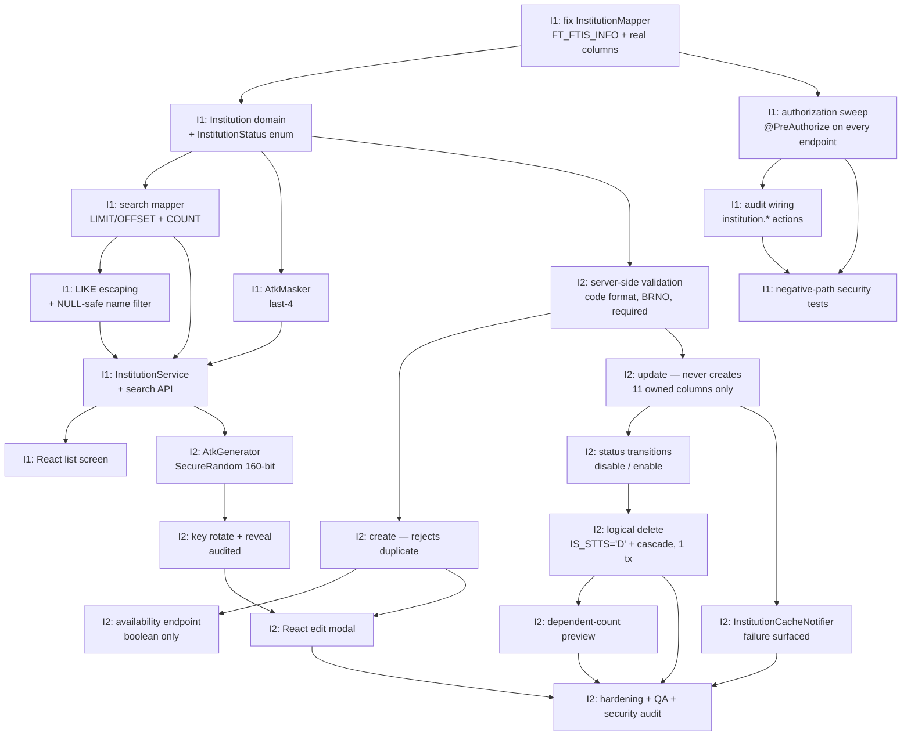
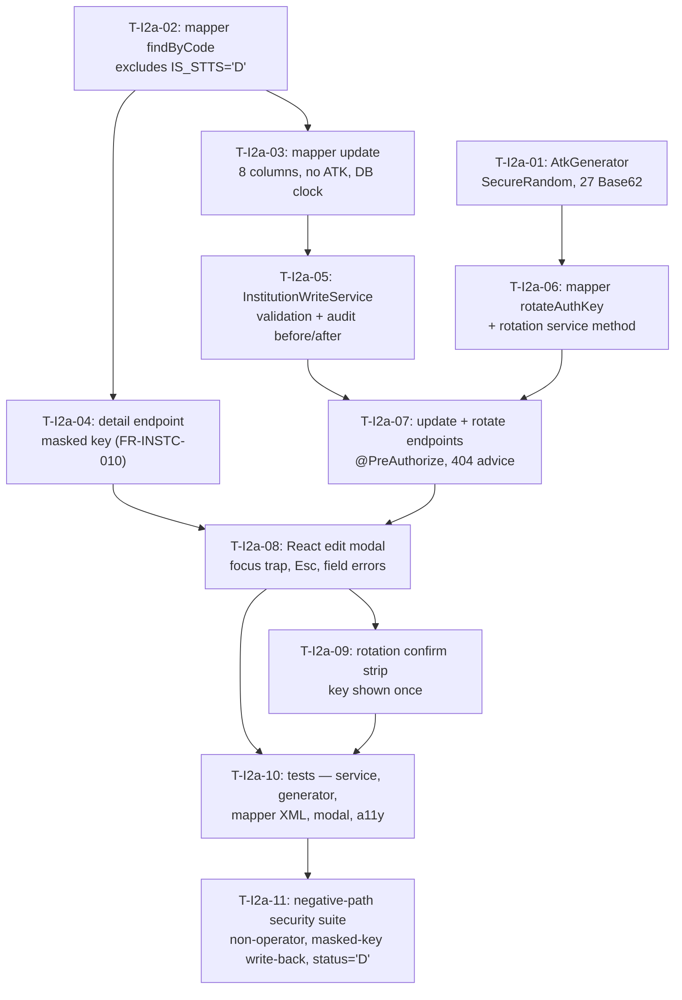

# 개발계획서 — 이용기관관리 (Client Institution Management)

> **Version**: 1.1
> **Date**: 2026-08-14 · **Revised**: 2026-08-20 — Sprint I2 split into I2a/I2b (§4.4), ADR-INST-017 added, `InstitutionCacheNotifier` dropped per AMB-I11
> **Predecessor**: [REQUIREMENTS-SPEC-INSTITUTION.md](../requirements/REQUIREMENTS-SPEC-INSTITUTION.md) — **G1 PENDING**
> **Companion plans**: [DEV-PLAN.md](DEV-PLAN.md) (문자내역), [DEV-PLAN-LOGIN.md](DEV-PLAN-LOGIN.md)
> **Status**: DRAFT — awaiting G2

---

## 1. Overview

| Item | Content |
|------|---------|
| Module | 이용기관관리 — registry list/search, registration/edit, lifecycle, 인증키 handling |
| Duration | 4 weeks — 3 sprints (I1 2w, **I2a 1w**, I2b 1w) |
| Team | 1–2 developers + agent team |
| Requirements | 44 FR · 16 NFR · 5 CONST (65 matrix rows) |
| Legacy defects to close | 20 (17 in scope; 3 belong to the excluded 담당자관리 screen) |
| Standard | harness-standards v1.0 (Team-with-Leader) |

**Why this module matters more than its size suggests.** It is two screens and eight legacy services, but it issues the `IS_CD` every other slice filters on and the `ATK` client companies authenticate with. It is also the first slice that **writes control data a second running system depends on** — the legacy send runtime reads the same table. That boundary, not the CRUD, is where the design effort went ([ADR-INST-016](adr/ADR-INST-016-legacy-coexistence.md)).

> ⚠ **G1 not yet approved.** Written against a DRAFT specification, following the precedent of DEV-PLAN-LOGIN. Two of the four Skill 2 rulings are already reflected in accepted ADRs. **CONFLICT-I02 no longer blocks G1** — design found it rested on a false premise and dissolved it with no schema change (ADR-INST-014). G1 need only acknowledge RESIDUAL-I01.

### 1.1 Readiness

The foundation this module needs already exists:

| Dependency | Status |
|------------|--------|
| `ROLE_OPERATOR` + `/api/admin/**` rule | ✅ Delivered (로그인 slice) |
| `AuditService` with a DB-backed store | ✅ Delivered — reused unchanged for institution events |
| `PagedResult`, `TenantContext` | ✅ Delivered (문자내역 slice) |
| `InstitutionController` / `InstitutionMapper` | ⚠️ Exist but **query a table that does not exist** — see §4.3 |

로그인 stands at 55/59 with the remainder blocked on non-code matters; 문자내역 at 47/52 with nothing left closable by code. Neither blocks this slice.

## 2. Technology stack

Inherited from [ADR-001](adr/ADR-001-tech-stack.md) (ACCEPTED, programme-wide). No stack-level re-evaluation was warranted — this module introduces no new runtime concern, no new external channel and no new persistence technology. The new decisions are all module-level:

| Area | Selected | ADR |
|------|----------|-----|
| Language / framework | Java 17 / Spring Boot 3.x | ADR-001 (inherited) |
| Persistence | MyBatis on existing `FT_FTIS_INFO` | ADR-003 (inherited) |
| Authorization | Spring Security, `ROLE_OPERATOR` | ADR-008 (inherited) |
| **Lifecycle / logical delete** | **`IS_STTS='D'` + existing audit store — zero DDL** | [ADR-INST-014](adr/ADR-INST-014-lifecycle-state-model.md) |
| **인증키 handling** | **`SecureRandom` 160-bit; masked; plaintext at rest (residual)** | [ADR-INST-015](adr/ADR-INST-015-atk-credential-handling.md) |
| **Legacy coexistence** | **Portal is system of record; legacy enforces; gap tracked** | [ADR-INST-016](adr/ADR-INST-016-legacy-coexistence.md) |
| **Timestamp clock for `RGDT`/`LAST_AMDT`** | **Database `now()` in SQL — the application UTC clock stays out of these two columns** | [ADR-INST-017](adr/ADR-INST-017-timestamp-clock-authority.md) |
| Frontend | React — list + edit modal | ADR-001 |

## 3. Architecture

See [architecture-overview-INSTITUTION.md](architecture-overview-INSTITUTION.md).

Core components: `InstitutionAdminController` · `InstitutionService` (read) · `InstitutionWriteService` (update, key rotation) · `InstitutionLifecycleService` (status, delete) · `AtkGenerator` · `AtkMasker` · `InstitutionAdminMapper`

> **`InstitutionCacheNotifier` is not built.** PM ruling AMB-I11 (2026-08-20) rewrote FR-INSTC-008: the cache the legacy refreshed is in-process inside IRIS_ADMIN and unreachable from a separate process, and this portal keeps no server-side institution cache of its own. What remains is client-side query invalidation, which needs no component. The legacy runtime cache stays with RISK-I02 / ADR-INST-016. A component that could not do what its name claims would be worse than its absence.
>
> **`InstitutionWriteService` fills a gap in the original component list**, which assigned the read path and the lifecycle path but left 등록/수정 without a home. Everything in it mutates — which is the whole reason it is separate from `InstitutionService`.

## 4. Sprint plan

| Sprint | Weeks | Scope | DoD |
|--------|-------|-------|-----|
| **Sprint I1** | 1–2 | Read path + foundation correction — mapper fix, search, paging, masking, authorization, audit wiring, list UI | FR-INST-001…009, FR-AZ-I01…I04, FR-ATK-002, NFR-PERF-I01/I02. Closes D-I1(read side), D-I5, D-I10, D-I11, D-I12 |
| **Sprint I2a** | 3 | **Edit path** — the 기관코드 → 수정 popup end to end: detail read (masked key), update (never creates), server-side validation, 인증키 재발급 as its own confirmed operation, React edit modal | FR-INSTC-001…003, 006…016, FR-ATK-001/002/004/005, FR-AZ-I04. Closes D-I4, D-I9, D-I19, **D-I20**. 7-dimension ≥ 90 |
| **Sprint I2b** | 4 | **Create + lifecycle** — create (rejects duplicate), availability endpoint, 중지/재사용, logical delete with cascade in one transaction, dependent-count preview, key reveal | FR-INSTC-004/005, FR-INSTL-\*, FR-ATK-003. Closes D-I1, D-I3, D-I6, D-I7, D-I8, D-I16, D-I18. 7-dimension ≥ 90 |

### 4.1 Task DAG

### 4.2 Why the mapper fix is task one

`InstitutionMapper` was delivered in the 문자내역 slice against a **guessed** table name — its Javadoc says so explicitly and asks for DBA confirmation. Skill 2's analysis of screen 00 supplies the answer, and **every identifier in that query is wrong**: `BIZTALK_INSTITUTION`→`FT_FTIS_INFO`, `IS_CD`→`FINTECH_ISCD`, `IS_NM`→`ISNM`, `USE_YN`→`IS_STTS`.

It fails against the real database, so the 문자내역 institution dropdown does not work outside tests. It is scheduled first because the rest of the read path builds on it, and because it is a **live defect in delivered code**, not new work.

### 4.3 Relationship to the other slices

- **문자내역** consumes `InstitutionController`. §4.2 fixes it; no other change is needed there.
- **로그인** supplies `ROLE_OPERATOR` and `AuditService`. Both are consumed unchanged — this module adds no authentication surface.
- **No sequencing conflict.** This slice can start immediately.

### 4.4 Sprint I2a — task list

Split out of Sprint I2 on 2026-08-20. The trigger was ordinary: the 기관코드 link in the delivered list screen goes nowhere, and it is the single most visible gap in the module. The split is not cosmetic — **the edit path needs no lifecycle work and no create path**, so it can ship and be verified on its own, and it carries all four of the newly specified requirement clusters (FR-INSTC-010…016).

| Task | Deliverable | Requirements | Verification |
|------|-------------|--------------|--------------|
| T-I2a-01 | `AtkGenerator` — `SecureRandom`, 27 Base62 characters (≈ 160.7 bits) | FR-ATK-001, NFR-SEC-CRED-I01 | Unit test over 1,000 keys: length, alphabet, no repeat |
| T-I2a-02 | `InstitutionAdminMapper.findByCode` + XML, excluding `IS_STTS='D'` | FR-INSTC-001, ADR-INST-014 | Mapper XML test |
| T-I2a-03 | `update` statement — 8 columns, **no `ATK`**, `to_char(now(),'YYYYMMDDHH24MISS')` | FR-INSTC-002/006/011/013, ADR-INST-017 | Mapper XML test: `ATK` absent from `SET`, `HH24` present, `WHERE FINTECH_ISCD` |
| T-I2a-04 | `GET /api/admin/institutions/{code}` returning the masked row | FR-INSTC-010, FR-ATK-002, **D-I20** | Security test: response contains no plaintext key |
| T-I2a-05 | `InstitutionWriteService.update` — server-side validation, audit with before/after | FR-INSTC-003/007/012/014/015/016, FR-AZ-I04 | Unit tests per rule; audit content asserted |
| T-I2a-06 | `rotateAuthKey` mapper + service method, own audit action | FR-ATK-001/005, FR-INSTC-011 | Unit test: no key material in the audit detail |
| T-I2a-07 | `PUT /{code}`, `POST /{code}/key/rotate`, 404 advice above the catch-all | FR-INSTC-004, FR-AZ-I01/I02 | Contract test + advice-ordering assertion |
| T-I2a-08 | React edit modal — labelled dialog, focus trap, Esc, per-field errors | FR-INST-007, NFR-USE-I01, WCAG 2.1 AA | Component tests + axe |
| T-I2a-09 | Rotation confirmation strip; new key shown once for distribution | FR-INSTC-011, FR-ATK-005 | Component test: no rotation without confirmation |
| T-I2a-10 | Test suites — service, generator, mapper XML, modal, accessibility | TEST-PLAN §3, §4 | Coverage ≥ 95% on `domain` |
| T-I2a-11 | Negative-path suite — non-operator, masked-key write-back, `status='D'`, body-supplied code | FR-AZ-I01/I02, FR-INSTC-011/015, FR-INSTC-002 | Each case asserts a **denial** |

> **What I2a deliberately leaves undone**, so the sprint boundary is honest rather than implied:
>
> | Not built | Requirement | Lands in |
> |-----------|-------------|----------|
> | 등록 (create) and the availability check | FR-INSTC-004/005 | I2b |
> | 중지 / 재사용 / 삭제 | FR-INSTL-\* | I2b |
> | Key reveal | FR-ATK-003 | I2b |
> | Optimistic `LAST_AMDT` check against concurrent legacy edits | TM-I019 / RISK-I04 | I2b — the window is only open while the legacy screens are live |
## 5. Team composition

| Team | Members | Leader | Write directories |
|------|---------|--------|-------------------|
| Build | `backend-developer`, `frontend-developer`, `code-reviewer` | `code-reviewer` | `src/`, `reviews/` |
| Validation | `security-auditor`, `qa-engineer` | `security-auditor` | `qa/`, `security/` |
| Ops | `docs-writer`, `architect` | `docs-writer` | `docs/` |

> `security-auditor` again carries weight: 10 of the 24 threats are High, and the two highest-severity defects (D-I2 broken access control, D-I3 credential disclosure by enumeration) are pure security work rather than feature work.

## 6. LLM model assignment

| Agent | Model | Reason |
|-------|-------|--------|
| `architect` | Opus | Coexistence boundary reasoning |
| `security-auditor` | Opus | **Critical** — credential handling, authorization sweep, enumeration surface |
| `backend-developer` | Sonnet | Implementation against a clear spec |
| `frontend-developer` | Sonnet | List + edit modal |
| `code-reviewer` | Opus | Defect detection |
| `qa-engineer` | Sonnet | Test construction |
| `docs-writer` | Haiku | Document assembly |

## 7. Staffing

| Role | Count | Responsibility |
|------|-------|----------------|
| PM | 1 (human) | Gate approval; **operational data audit for D-I1** (RISK-I01); cutover ownership of RISK-I02 |
| Developer | 1–2 (human) | Review agent output |
| DBA | 1 (human, consult) | Confirm `FT_FTIS_INFO` column semantics, `BSNN_STTS_CKYN` (AMB-I08) |
| 정보보호 | 1 (human, consult) | TM-I005 sign-off — plaintext credential storage |
| AI agents | ~8 | Implementation, test, review, audit |

## 8. Risk management

See [risk-register-INSTITUTION.md](risk-register-INSTITUTION.md) — 17 entries.

Top 3:
1. **RISK-I01 — institutions already in the D-I1 state.** The code fix does not repair existing data. Some institutions an operator believes are stopped may still be sending. Needs an operational data audit, not a commit
2. **RISK-I02 — send-API enforcement gap during coexistence.** We write the state; the legacy enforces it. Bounded by cutover, but D-I1 is proof this exact gap has already caused a silent failure once
3. **RISK-I03 — retained weak credentials.** RESIDUAL-I01: exposure paths close, entropy does not improve, and the two key populations are indistinguishable by query

## 9. Quality targets

| Metric | Target |
|--------|--------|
| Line coverage | ≥ 80% |
| Branch coverage | ≥ 70% |
| **`domain` (lifecycle, key handling) packages** | **≥ 95%** |
| 7-dimension self-assessment | ≥ 90 |
| CVSS ≥ 7.0 defects | 0 (release gate) |
| Defect regression tests | 100% passing (17 in-scope legacy defects) |
| Negative-path authorization tests | 1 per admin endpoint, each proving a **denial** |
| ADR count | 4 new (ADR-INST-014/015/016/017) |
| DDL statements | **0** — CONST-DATA-01 verified in CI |

## 10. Governance

| Gate | Timing | Approver | Artifact |
|------|--------|----------|----------|
| G1 Analysis | Skill 2 | PM | REQUIREMENTS-SPEC-INSTITUTION.md — **PENDING** (RESIDUAL-I01 only) |
| G2 Design | Skill 3 | PM + Architect | This document + TEST-PLAN + threat model + 4 ADRs |
| Sprint gate | Each sprint end | PM | SPRINT-LOG |
| G3 Release | Skill 5 | PM (+ 정보보호 **recommended**) | All verification reports |

> As with 로그인, a PM-only G3 is not the right check here. TM-I005 accepts plaintext storage of live customer credentials — a compliance judgement, not an engineering one.

## 11. Backup / rollback

- Legacy screens 00/01 remain available until this slice is verified, then are **disabled** (T-I2-12) to stop dual writes.
- Rollback = re-enable the legacy screens. **This is genuinely reversible**, unlike the 로그인 slice: no data format changes, no DDL, no credential rewriting. Institutions created or edited by the new portal are ordinary `FT_FTIS_INFO` rows the legacy reads natively.
- **One asymmetry:** institutions logically deleted under ADR-INST-014 carry `IS_STTS='D'`, which the legacy screens cannot display or reverse — they filter on `'Y'`/`'N'`. After rollback such institutions are invisible to the legacy UI though still present. Reversal requires a direct `UPDATE` to `'N'`. This is a small, documented, one-row manual operation, not a migration.

## 12. Financial-sector obligations

| Item | Applies | Note |
|------|---------|------|
| 전자금융감독규정 | Y | Administrative access records; operator-only registry control |
| ISMS-P | Y | Credential lifecycle in certified scope |
| PII encryption | Y | `RGSR_NM` in 발신번호 history stays encrypted (CONST-DATA-I03) |
| Key management | Y | ADR-INST-015 — **with a recorded exception**: `ATK` remains plaintext at rest (TM-I005) |
| Audit log | Y | Every state change and key reveal; retention per ADR-006 |

---

**G2 approval (design gate)**

| Date | Approver | Comment | Status |
|------|----------|---------|--------|
| 2026-08-14 | PM | TM-I005 and TM-I007 are blocking conditions; RISK-I01 needs an owner and a date | PENDING |
| 2026-08-14 | Architect | Design complete; 3 ADRs accepted; zero DDL confirmed. TM-I007 is not closable by code | PENDING |
| 2026-08-20 | Architect | **Re-issued for the screen-01 gap pass.** ADR-INST-017 accepted; Sprint I2 split into I2a/I2b; `InstitutionCacheNotifier` dropped per AMB-I11 with FR-INSTC-008 rewritten. New threats TM-I021…I024 — TM-I022 and TM-I023 are mitigated **structurally** (the column and the value are absent from the statement), TM-I024 accepted with no dual control. Still zero DDL | PENDING |
