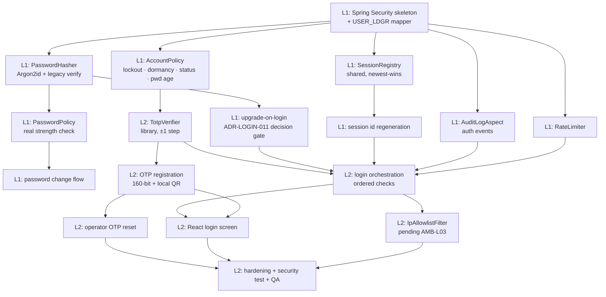

# 개발계획서 — 로그인 (Authentication module)

> **Version**: 1.0
> **Date**: 2026-08-14
> **Predecessor**: [REQUIREMENTS-SPEC-LOGIN.md](../requirements/REQUIREMENTS-SPEC-LOGIN.md) — **G1 PENDING**
> **Companion plan**: [DEV-PLAN.md](DEV-PLAN.md) (문자내역 slice)
> **Status**: DRAFT — awaiting G2

---

## 1. Overview

| Item | Content |
|------|---------|
| Module | Authentication — login, OTP registration, operator OTP reset, password change |
| Duration | 4 weeks — 2 sprints × 2 weeks |
| Team | 1–2 developers + agent team |
| Requirements | 38 FR · 16 NFR · 6 CONST (60 matrix rows) |
| Standard | harness-standards v1.0 (Team-with-Leader) |

**Why this module exists as its own plan.** It closes **RISK-013** — the 문자내역 slice requires an authenticated session but had no login requirements. It is also the system's single entry point: every control in the 문자내역 threat model presumes a correctly-established session, which this module produces.

> ⚠ **G1 not yet approved.** This plan is written against a DRAFT specification. **AMB-L03** (IP allowlist scope) is unanswered; this plan assumes **operators only**, since external client companies do not have stable addresses. If that assumption is wrong, `IpAllowlistFilter` and the deployment topology both change.

## 2. Technology stack

Inherited from [ADR-001](adr/ADR-001-tech-stack.md); module-specific decisions are new:

| Area | Selected | ADR |
|------|----------|-----|
| Language / framework | Java 17 / Spring Boot 3.x | ADR-001 (inherited) |
| Security framework | Spring Security | ADR-008 |
| **TOTP** | **Maintained TOTP library** — not a port of `GoogleOTP.java` | [ADR-LOGIN-010](adr/ADR-LOGIN-010-otp-authentication.md) |
| **Password hashing** | **Argon2id** + upgrade-on-login | [ADR-LOGIN-011](adr/ADR-LOGIN-011-credential-migration.md) — **PM decision required** |
| **Session** | Shared registry, newest-login-wins, id regenerated | [ADR-LOGIN-012](adr/ADR-LOGIN-012-session-management.md) |
| Persistence | MyBatis against existing `USER_LDGR` | ADR-003 |
| Frontend | React login screen | ADR-001 |

## 3. Architecture

See [architecture-overview-LOGIN.md](architecture-overview-LOGIN.md).

Core components: `RateLimiter` · `IpAllowlistFilter` · `AuthenticationService` · `PasswordHasher` · `PasswordPolicy` · `TotpVerifier` · `QrRenderer` · `AccountPolicy` · `SessionRegistry` · `AuditLogAspect`

## 4. Sprint plan

| Sprint | Weeks | Scope | DoD |
|--------|-------|-------|-----|
| **Sprint L1** | 1–2 | Credential path — Argon2id, migration, account policy, session, audit | FR-LOGIN-002…005, 012…020, 023, 025; FR-PWD-001…006. Every control demonstrably **denies** something |
| **Sprint L2** | 3–4 | OTP — verification, registration, operator reset, React screen, hardening | FR-LOGIN-001, 008…011, 021, 022, 024; FR-OTP-001…009. 7-dimension ≥ 90 |

### 4.1 Task DAG

### 4.2 Relationship to the 문자내역 Sprint 1

문자내역 Sprint 1 tasks **T1-07 through T1-11** build a minimal credential store as scaffolding. This module supersedes them.

**Recommended sequencing: build this module first.** Then 문자내역 Sprint 1 drops T1-08 (minimal credential store) and consumes the real authentication instead, saving roughly 4.5 person-days of throwaway work and removing the risk of two components both owning credential verification.

If 문자내역 must start first, the scaffolding must be **deleted, not extended**, when this module lands — and that deletion needs to be an explicit task, not an intention.

## 5. Team composition

| Team | Members | Leader | Write directories |
|------|---------|--------|-------------------|
| Build | `backend-developer`, `frontend-developer`, `code-reviewer` | `code-reviewer` | `src/`, `reviews/` |
| Validation | `security-auditor`, `qa-engineer` | `security-auditor` | `qa/`, `security/` |
| Ops | `docs-writer`, `architect` | `docs-writer` | `docs/` |

> `security-auditor` carries unusual weight in this module: 16 of its 60 requirements are NFR-SEC or security constraints, and 10 legacy defects are security-relevant.

## 6. LLM model assignment

| Agent | Model | Reason |
|-------|-------|--------|
| `architect` | Opus | Design reasoning |
| `security-auditor` | Opus | **Critical here** — authentication logic, crypto choices, four regulatory regimes |
| `backend-developer` | Sonnet | Implementation against a clear spec |
| `frontend-developer` | Sonnet | Login screen |
| `code-reviewer` | Opus | Defect detection |
| `qa-engineer` | Sonnet | Test construction |
| `docs-writer` | Haiku | Document assembly |

## 7. Staffing

| Role | Count | Responsibility |
|------|-------|----------------|
| PM | 1 (human) | Gate approval; **ADR-LOGIN-011 decision**; exposure-history determination |
| Developer | 1–2 (human) | Review agent output |
| 정보보호 | 1 (human, consult) | TM-L002 and TM-L015 acceptance; credential scheme sign-off |
| AI agents | ~8 | Implementation, test, review, audit |

## 8. Risk management

See [risk-register-LOGIN.md](risk-register-LOGIN.md) — 12 entries.

Top 3:
1. **RISK-L01 — password database exposure history unknown.** Blocks ADR-LOGIN-011. If the hashes have leaked, upgrade-on-login re-blesses compromised credentials and a forced reset becomes mandatory
2. **RISK-L02 — live secret in source.** A Kakao `sender_key` and three personal mobile numbers sit in `apc_login_proc_act.jsp`. Rotation is needed now, not at cutover
3. **RISK-L03 — disabled controls pattern.** Three security controls exist but are commented out. Any control not proven to deny a request must be assumed absent

## 9. Quality targets

| Metric | Target |
|--------|--------|
| Line coverage | ≥ 80% |
| Branch coverage | ≥ 70% |
| **`crypto` and `domain` packages** | **≥ 95%** |
| 7-dimension self-assessment | ≥ 90 |
| CVSS ≥ 7.0 defects | 0 (release gate) |
| Defect regression tests | 100% passing (10 legacy defects) |
| ADR count | 3 new (ADR-LOGIN-010/011/012) |

## 10. Governance

| Gate | Timing | Approver | Artifact |
|------|--------|----------|----------|
| G1 Analysis | Skill 2 | PM | REQUIREMENTS-SPEC-LOGIN.md — **PENDING** |
| G2 Design | Skill 3 | PM | This document + TEST-PLAN-LOGIN + threat model |
| Sprint gate | Each sprint end | PM | SPRINT-LOG |
| G3 Release | Skill 5 | PM (+ 정보보호 recommended) | All verification reports |

> For this module specifically I would not recommend a PM-only G3. Two blocking threats (TM-L002, TM-L015) are compliance judgements about past data handling, not engineering decisions — 정보보호 involvement is the appropriate check.

## 11. Backup / rollback

- Legacy login continues to operate for screens not yet migrated
- Rollback = route to the legacy login. **Caveat:** if ADR-LOGIN-011 option A has upgraded some passwords to Argon2id, the legacy cannot verify them — those users cannot log in to the legacy system after rollback
- **This makes rollback partially one-way and must be understood before cutover.** Mitigation: retain the legacy hash for the rollback window rather than discarding it at upgrade, then purge

## 12. Financial-sector obligations

| Item | Applies | Note |
|------|---------|------|
| 전자금융감독규정 | Y | Two factors mandatory (NFR-SEC-AUTH-L01); access records 5 years |
| ISMS-P | Y | Authentication controls in certified scope |
| PII encryption | Y | OTP secret encrypted; `CLPH_NO`/`FLNM` masked |
| Key management | Y | `sender_key` rotation required (RISK-L02) |
| Audit log | Y | 5-year retention (ADR-006) |

---

**G2 approval (design gate)**

| Date | Approver | Comment | Status |
|------|----------|---------|--------|
| 2026-08-14 | PM | ADR-LOGIN-011 option and TM-L002/TM-L015 resolution required | PENDING |
| 2026-08-14 | Architect | Design complete; ADR-LOGIN-011 blocked on a factual question about past data exposure | PENDING |
