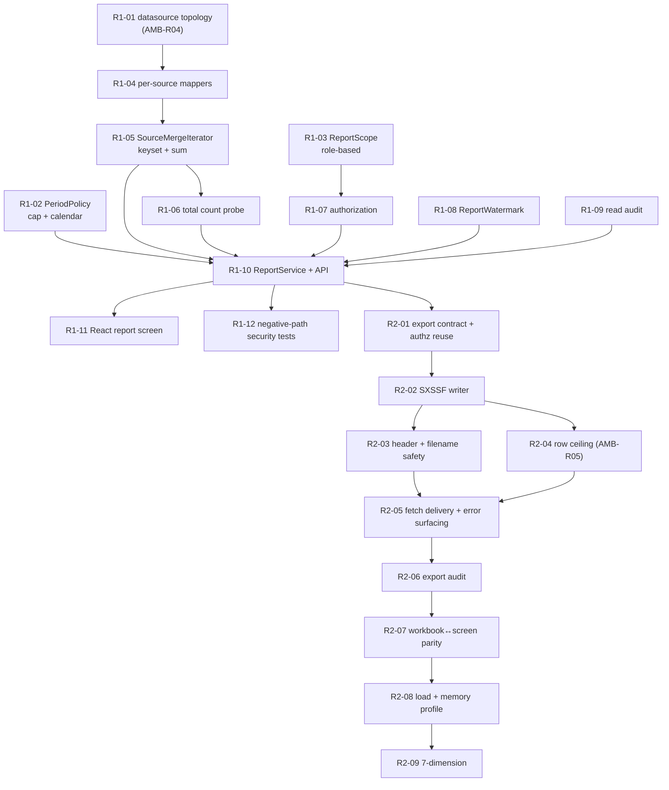

# Development Plan — 이용기관 보고서 (Institution Usage Report)

> **Version**: 1.0
> **Date**: 2026-08-18
> **Predecessor**: [REQUIREMENTS-SPEC-REPORT.md](../requirements/REQUIREMENTS-SPEC-REPORT.md)
> **Siblings**: [DEV-PLAN.md](DEV-PLAN.md), [-LOGIN](DEV-PLAN-LOGIN.md), [-INSTITUTION](DEV-PLAN-INSTITUTION.md), [-SENDERNO](DEV-PLAN-SENDERNO.md)
> **Companion documents**: [TEST-PLAN-REPORT.md](TEST-PLAN-REPORT.md), [architecture-overview-REPORT.md](architecture-overview-REPORT.md), [threat-model-REPORT.md](threat-model-REPORT.md), [risk-register-REPORT.md](risk-register-REPORT.md), [sprint-R1-tasks.md](sprint-R1-tasks.md)

---

## 1. Overview

One legacy screen (20 이용기관 보고서) and its Excel export become one React screen over one **read-only** service package. Twenty-five in-slice defects are fixed; two upstream batch defects are out of scope by PM ruling and are made visible rather than repaired.

> ⚠ **G1 not yet approved.** Written against a DRAFT specification, following the precedent of the three preceding slices. What G1 must cover here is **narrower than any previous slice** — see §10.

### 1.1 What design changed since Skill 2

Three things. Two of them removed work rather than adding it, which is unusual for this programme and worth stating plainly.

**CONFLICT-R02 dissolved.** Skill 2 escalated it as blocking: merging two databases, server-side pagination and a total order looked mutually unsatisfiable, and the working assumption was the weakest option — fetch both sources fully and merge in the application, which is the unbounded fetch D-R8 exists to remove. Design found a fourth shape neither Skill 2 nor the escalation considered. Both sources carry the same table, the same primary key and the same sort key, so two streams ordered identically can be **merge-joined with keyset pagination**, holding at most two page-buffers of rows and needing no DDL, no federated link and no new infrastructure ([ADR-RPT-021](adr/ADR-RPT-021-cross-source-aggregation.md)).

The decisive property is that **the design does not depend on AMB-R04's answer.** If the two aliases are two databases, the merge ships as designed; if they are one, the identical semantics collapse to a `UNION ALL … GROUP BY` behind the same interface, and only the mapper changes. No requirement, test or API shape is contingent. CONFLICT-R02 is therefore closed at design time and does not reach G2 as a condition.

**AMB-R04 answered provisionally, from source, without reading protected configuration.** The authoritative answer lives in `jex.iris_admin.xml`, which is declared under `JEX.config.file` in `jex.prop` — **SEC-002 applies and it was not read.** The inference instead: the bulk and non-bulk aggregate queries are the same statement character for character except that the bulk one replaces the correlated 기관명 subquery with `'' AS IS_NM` and has names patched back in by Java from a `BIZTALK_DB` query. Nobody writes that if the master table is reachable from the bulk datasource. **Working assumption flips to two physical databases**, confirmed empirically by task R1-01.

**The batch is out, by ruling, and that decided the freshness design.** D-R26 (data is at best T-4, and a single day cannot be re-aggregated at all) and D-R27 (bulk failures swallowed while the batch reports success) stay with the batch owner. The report therefore derives its watermark as `max(TRDD)` per source and is explicit that this cannot detect an interior gap ([ADR-RPT-022](adr/ADR-RPT-022-aggregation-freshness.md)). Notably, the batch's *own* run history was rejected as a watermark source because D-R27 means it records success for runs that failed — an unreliable narrator is worse than an admitted gap.

### 1.2 Readiness

| Input | State |
|-------|-------|
| Requirements | 55 requirements, orphan 0, matrix complete |
| PM rulings | CONFLICT-R01, AMB-R01…R03 resolved at Skill 2; OI-R01 scope and FR-RPTX-010 deferral resolved at Skill 3 |
| Conflicts | CONFLICT-R01 resolved; **CONFLICT-R02 dissolved by ADR-RPT-021** — no conflict reaches G2 |
| Open items | AMB-R04 provisional, confirmed by R1-01, **non-blocking by construction**; AMB-R05 set by load test; AMB-R06/R08 carry working assumptions, none blocking |
| Reusable components | `TenantContext`, `AuditService`, `PagedResult`, institution list service — all delivered, all consumed unmodified |
| New infrastructure | One additional read-only datasource. No queue, no job store, no DDL |

## 2. Technology stack

Settled by [ADR-001](adr/ADR-001-tech-stack.md) and not reopened: Java 17, Spring Boot 3.x, MyBatis, React, PostgreSQL. This slice adds **no new technology and no new dependency** — Apache POI is already present in the legacy stack and is **Apache-2.0**, so CODE-004 raises nothing.

The harness requires a ≥2-candidate comparison for stack selection; that was performed for the programme in ADR-001 and re-running it per slice is ceremony. **The genuine ≥2-candidate decisions here are architectural**, and each is recorded with its alternatives and the reason for rejection in [ADR-RPT-021](adr/ADR-RPT-021-cross-source-aggregation.md) (4 options), [ADR-RPT-022](adr/ADR-RPT-022-aggregation-freshness.md) (4 options) and [ADR-RPT-023](adr/ADR-RPT-023-export-generation.md) (4 options).

No candidate scored within 10% of another, so **no stack tie-break decision is referred to the PM** under harness §2.

## 3. Architecture

See [architecture-overview-REPORT.md](architecture-overview-REPORT.md). Package layout follows the established `api` / `domain` / `infra.db` split under `com.webcash.iris.biztalk`, plus one `infra.excel` package.

> **Update 2026-08-19.** `infra.excel.StreamingWorkbookWriter` was built by the 톡전송 내역 slice (its Sprint T2), not here — this slice's Sprint R2 has not run. Sprint R2 therefore **consumes** it, and Apache POI is already in the POM. See [ADR-RPT-023](adr/ADR-RPT-023-export-generation.md) addendum. Cross-cutting concerns are consumed from `common.tenant` and `common.audit` unmodified.

The only structural addition is a **second read-only datasource** with its own `SqlSessionFactory`. Because this slice writes nothing to either aggregate (CONST-DATA-R01), the two datasources need no XA coordination and [ADR-002](adr/ADR-002-transaction-boundary.md)'s boundaries are untouched.

## 4. Sprint plan

| Sprint | Weeks | Scope | DoD |
|--------|-------|-------|-----|
| **Sprint R1** | 1–2 | Foundation and read path — datasource topology, keyset merge, ordering, period policy, authorization and role scope, watermark, read audit, list UI | FR-AZ-R01…R05, FR-RPT-001…016, FR-RPTS-001…005, NFR-SEC-AUTHZ-R01, NFR-SEC-TENANT-R01, NFR-PERF-R01/R02. Closes D-R1, D-R2, D-R5…D-R9, D-R11…D-R14, D-R23, D-R24, D-R25 |
| **Sprint R2** | 3–4 | Export path and hardening — SXSSF writer, `fetch` delivery, header safety, contract completion, workbook parity, load tests, 7-dimension | FR-RPTX-001…013, NFR-PERF-R03, NFR-SCALE-R01, NFR-SEC-HDR-R01, NFR-COMPAT-R01, NFR-OPS-AUDIT-R01. Closes D-R3, D-R4, D-R10, D-R15…D-R22. 7-dimension ≥ 90 |

### 4.1 Task DAG

### 4.2 Why the datasource probe is task one

R1-01 mirrors the S1-03 precedent, but its role is different and the difference is deliberate. In the 발신번호 slice, S1-03 was a **hard gate** — ADR-SND-017's whole mechanism assumed one database and had to be re-derived if it was two. Here ADR-RPT-021 is correct under both answers, so R1-01 is a **performance and simplicity** question: if one database, the mapper layer simplifies to a single statement and the merge iterator becomes dead code worth deleting.

It is still task one, because discovering it in week three means either carrying an unnecessary abstraction or rewriting the data layer late. Discovering it in week one costs half a day.

### 4.3 Why the export is a whole sprint behind the query

Every legacy export defect traces to the export being a **parallel implementation** of the query — the unencoded filename, the environment-dependent sheet set, the undeclared `IS_CD`, the summary sheet missing 실패 and 처리중. The fix is structural: the export consumes the query's own iterator and its own validated request object. That is only possible once the query path is finished, so sequencing R2 behind R1 is a design consequence, not a scheduling preference.

### 4.4 Operational prerequisites, not development tasks

Three items block value, not code. They are named here so they are owned rather than assumed.

| Item | Owner | Why it is not a task |
|------|-------|---------------------|
| **Access-log review for historical exploitation of D-R1/D-R2** — look for `biztalk_admin_20_l001` calls with an empty `IS_CD` | PM + security | An incident-response action on production logs. If it finds anything, it is a disclosure event with its own process (RISK-R04) |
| **Reconciliation of historical bulk aggregates against raw send records** — find days D-R27 silently zeroed | operator team + DBA | A data exercise over production history. The watermark cannot substitute for it (RISK-R03) |
| **Confirm whether T-4 lag is deliberate** | operations owner | If it is intended, FR-RPT-013 merely surfaces a known property; if not, OI-R01 gains urgency (RISK-R02) |

### 4.5 Relationship to the other slices

This slice **consumes and adds nothing** to the shared components: `TenantContext`, `AuditService` and `PagedResult` are used unmodified, and the institution selector is the 이용기관관리 slice's service. It is the first slice to consume all three without extending any of them, which is the expected shape by the fourth slice.

The one programme-level effect is governance: **CONFLICT-R01 refined AMB-02** from "scope is always server-derived" to "scope is server-derived for tenant principals; operator scope is a permission." That refinement is recorded in the question log against AMB-02 itself, because every future internal-operator screen will meet it.

## 5. Team composition

| Role | Count | Responsibility |
|------|-------|---------------|
| `architect` | 1 | ADR-RPT-021/022/023, R1-01 adjudication, two-datasource configuration review |
| `backend-developer` | 2 | Mappers, merge iterator, period policy, service, export writer |
| `frontend-developer` | 1 | Report screen, keyset paging control, watermark display, `fetch` download |
| `data-model-designer` | 1 | Sort-key and counter model, reconciliation identities, no-DDL confirmation |
| `qa-engineer` | 1 | Regression suite for 25 defects, negative-path security suite, load and memory profile |
| `security-auditor` | 1 | Threat model maintenance, authorization sweep on both endpoints, header-safety review |
| `trace-mapper` | 1 | Requirement → task → test coverage |
| `team-leader` | 1 | Dispatch, 7-dimension assessment, single reporting channel to PM |

## 6. LLM model assignment

| Work | Model tier | Reason |
|------|-----------|--------|
| ADR adjudication, merge-and-pagination design, threat model | High reasoning | ADR-RPT-021 turned on noticing that a conflict escalated as blocking had a fourth solution shape; that is the class of judgement that must not be delegated down |
| Merge iterator and period policy implementation | Standard | Well-specified with exact semantics and heavy test coverage |
| Mappers, service, export writer | Standard | Conventional, spec-driven |
| React report screen | Standard | Conventional grid over an existing design system |
| Regression and security test authoring | Standard | Derived from the 25 recorded defects |
| Traceability bookkeeping | Light | Mechanical matrix maintenance |

## 7. Staffing and schedule

Four weeks, two sprints, matching the cadence of the three preceding slices. R1 carries more requirement count; R2 carries more risk, because the export is where the memory profile, the header safety and the parity assertion all land.

Buffer sits in **R2**, for two reasons: the row ceiling (AMB-R05) is set by measurement rather than decision, and the memory profile is the one target that can fail late and force a design change rather than a fix.

## 8. Risk management

See [risk-register-REPORT.md](risk-register-REPORT.md) — 12 risks. The three that shape the plan:

- **RISK-R01** — verification depth is capped by the no-Docker constraint, and this slice adds a *second* database to the problem (inherited and worsened from RISK-S13).
- **RISK-R03** — historical bulk aggregates may already contain silent zeros, which the report will faithfully display as zeros.
- **RISK-R04** — D-R1 + D-R2 may already have been exploited; nothing in the legacy would show it.

## 9. Quality targets

| Dimension | Target |
|-----------|--------|
| Line coverage | ≥ 80% |
| Branch coverage | ≥ 70% |
| 7-dimension self-assessment | ≥ 90 / 100 |
| Defect regression tests | 1+ per fixed defect (25 defects) |
| E2E core scenarios | TOP 5 |
| Load | 2× the NFR-PERF SLA |
| Export memory | Flat across 1k and 100k rows |
| Unmitigated CVSS ≥ 7.0 within our control | 0 |

## 10. Governance

| Gate | Skill | Approver | Status |
|------|-------|----------|--------|
| G1 Analysis | Skill 2 | PM | **PENDING** — CONFLICT-R01 ruled; no DDL condition attached |
| G2 Design | Skill 3 | PM + architect | This document |
| G3 Release | Skill 5 | PM + security | Later |

**What G1 needs to cover, restated after design — and it is less than any previous slice.**

The 발신번호 slice reached G1 carrying an unresolved DDL precedent (CONFLICT-S01) and an accepted security residual (RESIDUAL-S01). The institution slice reached it carrying CONFLICT-I02 until design dissolved it. **This slice carries neither.** CONFLICT-R02 is dissolved by ADR-RPT-021, no DDL is required anywhere (CONST-DATA-R02 holds unmodified), and no security control is knowingly left disabled.

G1 therefore has one substantive item: **confirming CONFLICT-R01's refinement of AMB-02**, because it is a programme-level governance change that every future internal-operator screen inherits, not a decision local to screen 20.

Two items are for the PM's awareness rather than approval: the batch defects stay open under OI-R01, and FR-RPTX-010 is specified but deliberately unbuilt (ADR-RPT-023).

## 11. Backup and rollback

- **No DDL, no data migration, no schema change.** There is nothing to roll back at the database level — the strongest rollback position of any slice so far.
- **Application rollback** to the legacy console is available throughout; `AOA_ADMIN` and the existing IRIS_ADMIN screen continue to operate against the same tables. Rolling back reintroduces all 25 defects, including the unauthenticated read path.
- **The second datasource is read-only** and can be disabled by configuration; the report degrades to API-only with an explicit incomplete-source notice (FR-RPTS-005) rather than failing.
- **The export is stateless.** No generated artifact is retained server-side, so there is nothing to purge on rollback.

## 12. Financial-sector obligations

| Area | ADR | Applied here |
|------|-----|-------------|
| Transaction model | [ADR-002](adr/ADR-002-transaction-boundary.md) | Read-only slice; two datasources need no XA. The only write is the append-only audit event |
| Persistence | [ADR-003](adr/ADR-003-persistence-strategy.md) | MyBatis named binding throughout; no positional mapping, no dynamic SQL concatenation |
| Message integrity | [ADR-004](adr/ADR-004-message-integrity.md) | Not engaged — no message is sent or received by this slice |
| PII encryption | [ADR-005](adr/ADR-005-pii-encryption.md) | **Not engaged — this slice holds no PII.** CONST-LEGAL-R01 records that commercial confidentiality replaces it as the control objective |
| Audit logging | [ADR-006](adr/ADR-006-audit-logging.md) | Append-only; reads, exports and denials audited; export audit carries rows actually written |
| Key management | [ADR-007](adr/ADR-007-key-management.md) | Not engaged — no encrypted column is read or written |
| Channel auth | [ADR-008](adr/ADR-008-channel-auth.md) | No external channel added. One additional internal datasource, service-credentialed |
| Retry / idempotency | [ADR-009](adr/ADR-009-retry-idempotency.md) | Queries are idempotent by nature. Per-source timeouts are bounded and **never infinitely retried** (CODE-002); a failed source degrades the result explicitly instead |
