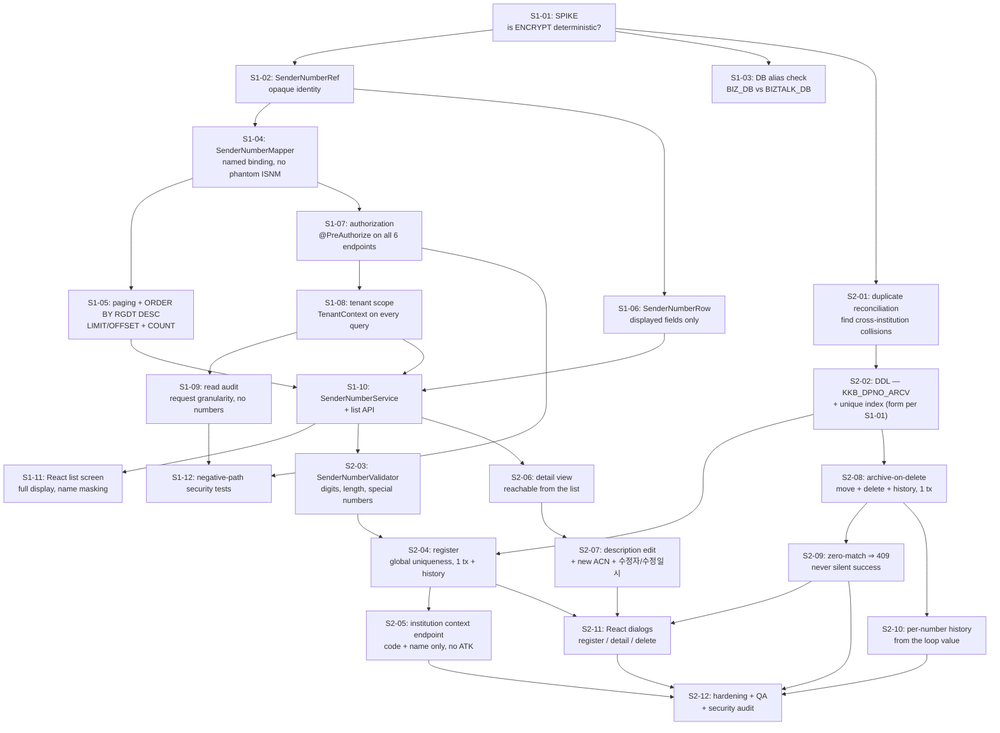

# Development Plan — 발신번호 (Sender Number Management)

> **Version**: 1.0
> **Date**: 2026-08-17
> **Predecessor**: [REQUIREMENTS-SPEC-SENDERNO.md](../requirements/REQUIREMENTS-SPEC-SENDERNO.md) — **G1 PENDING**
> **Siblings**: [DEV-PLAN.md](DEV-PLAN.md) (문자내역), [DEV-PLAN-LOGIN.md](DEV-PLAN-LOGIN.md), [DEV-PLAN-INSTITUTION.md](DEV-PLAN-INSTITUTION.md)
> **Design**: [architecture-overview-SENDERNO.md](architecture-overview-SENDERNO.md), [threat-model-SENDERNO.md](threat-model-SENDERNO.md), [TEST-PLAN-SENDERNO.md](TEST-PLAN-SENDERNO.md), [risk-register-SENDERNO.md](risk-register-SENDERNO.md)
> **ADRs**: [ADR-SND-017](adr/ADR-SND-017-senderno-lifecycle.md), [ADR-SND-018](adr/ADR-SND-018-encrypted-number-uniqueness.md), [ADR-SND-019](adr/ADR-SND-019-senderno-read-audit.md)

---

## 1. Overview

Four legacy screens (10 이용기관 정보 관리, 11 발신번호 상세, 12 발신번호 등록, 13 발신번호 제거) become one React screen with three dialogs over a single service package. Twenty-one defects are in scope; twenty are fixed and one (D-S4, ownership verification) is carried forward by PM ruling.

> ⚠ **G1 not yet approved.** Written against a DRAFT specification, following the precedent of DEV-PLAN-LOGIN and DEV-PLAN-INSTITUTION. G1 must cover **CONFLICT-S01** and **RESIDUAL-S01** — see §10.

### 1.1 What design changed since Skill 2

Three things, all from reading applications outside this repository. They are listed first because two of them changed the plan rather than confirming it.

**CONFLICT-S02 is confirmed, not suspected — and it decided the delete design.** The send runtime is `KAKAOTALK`, and it authorizes a send by selecting the number from `KKB_DPNO_LDGR` and rejecting when nothing returns. It reads no status column. A soft-delete flag would therefore have left every "deleted" number fully sendable — D-I1 rebuilt on purpose. Deletion instead **moves the row to an archive table** ([ADR-SND-017](adr/ADR-SND-017-senderno-lifecycle.md)), which makes the legacy reject it with no legacy change at all.

**`AOA_ADMIN` is a second writer on the same database.** It carries the same four screens against the same `BIZTALK_DB`. This rules out enforcing global uniqueness in application code — `AOA_ADMIN` would bypass it — so the constraint moves into the database ([ADR-SND-018](adr/ADR-SND-018-encrypted-number-uniqueness.md)). It also means the 21 defects stay live in that console after we ship (RISK-S05).

**One send path is not covered by any ledger check.** `ADV_KKO_FT_SEND_act.jsp` uses `sender_number` and never validates it, while its `_BULK` and `_M` siblings do. FR-SNDD-003 is therefore satisfied for five of six send paths by construction and the sixth is a tracked gap (RISK-S03), not a test we can pass.

### 1.2 Readiness

| Input | State |
|-------|-------|
| Requirements | 66 requirements, orphan 0, matrix complete |
| PM rulings | AMB-S01…S04 resolved |
| Open items | AMB-S05 **resolved by ADR-SND-017**; AMB-S06…S09 carry working assumptions, none blocking |
| Reusable components | `TenantContext`, `AuditService`, `PagedResult`, `InstitutionService` — all delivered, all consumed unmodified |
| Unknown gating design | Whether `ENCRYPT` is deterministic — spike S1-01, first task |

## 2. Technology stack

Settled by [ADR-001](adr/ADR-001-tech-stack.md) and not reopened: Java 17, Spring Boot 3.x, MyBatis, React, PostgreSQL. This slice introduces no new technology, no new external integration, and no new dependency.

The harness requires a ≥2-candidate comparison for stack selection. That comparison was performed and recorded in ADR-001 for the programme; re-running it per slice would be ceremony. **The genuine ≥2-candidate decisions in this slice are architectural rather than technological**, and each is recorded with its alternatives and the reason for rejection in ADR-SND-017 (4 options), ADR-SND-018 (4 options) and ADR-SND-019 (4 options).

The `COOCON_SMS` integration is **not** wired — AMB-S01. No external channel is added.

## 3. Architecture

See [architecture-overview-SENDERNO.md](architecture-overview-SENDERNO.md). Package layout follows the established `api` / `domain` / `infra.db` split under `com.webcash.iris.biztalk`; cross-cutting concerns are consumed from `common.tenant` and `common.audit` without modification.

## 4. Sprint plan

| Sprint | Weeks | Scope | DoD |
|--------|-------|-------|-----|
| **Sprint S1** | 1–2 | Foundation and read path — encryption spike, identity model, mapper, paging, ordering, authorization, tenant scope, read audit, list UI | FR-SND-001…011, FR-AZ-D01…D05, NFR-SEC-AUTHZ-D01, NFR-SEC-TENANT-D01, NFR-PERF-D01. Closes D-S2, D-S3, D-S14, D-S17, D-S19, D-S21 |
| **Sprint S2** | 3–4 | Write path and lifecycle — duplicate reconciliation, DDL, uniqueness constraint, server validation, register, detail, description edit, archive-on-delete, history correctness, dialogs | FR-SNDC-\*, FR-SNDU-\*, FR-SNDD-\*, FR-SNDH-\*. Closes D-S1, D-S5…D-S13, D-S15, D-S16, D-S18, D-S20. 7-dimension ≥ 90 |

### 4.1 Task DAG

### 4.2 Why the spike is task one

S1-01 asks one question — does `ENCRYPT(x)` return the same ciphertext for the same `x`? — and the answer selects between two materially different designs:

- **Deterministic:** a unique index on `DP_NO` gives global uniqueness directly, and every lookup in the slice becomes indexable. No new column, no backfill, no second key.
- **Non-deterministic:** a blind-index column, an HMAC key to manage under ADR-007, a backfill across every existing row, and a new threat (T-I7).

The difference is roughly a week of work and one long-lived key. Nothing downstream can be built correctly without the answer, because the identity model (S1-02) and the DDL (S2-02) both depend on it. It is scheduled first and it is expected to take under a day.

### 4.3 Why deletion is late in S2

Deletion is the slice's headline defect and the instinct is to fix it first. It is scheduled after the archive table exists (S2-02) because **the fix is the archive**, not a patch to the delete statement. Fixing the matching bug alone would turn a silent no-op into a working hard delete — which contradicts the PM's logical-delete ruling and would destroy data that is currently, accidentally, being preserved by the bug.

There is a mild irony worth naming for the team: D-S1 means deletion has not actually deleted anything since roughly October 2025, so the ledger currently holds rows operators believe are gone. **Do not "clean those up" before the reconciliation in §4.4 runs** — they are the evidence.

### 4.4 Operational prerequisites, not development tasks

Two items must be scheduled with the operator team and completed before S2 ships:

| Item | Why | Owner |
|------|-----|-------|
| **Deletion reconciliation** — find every number with an `ACN='D'` history row still present in the ledger | These were believed deleted and are still sendable. History rows whose `DP_NO` decrypts to a masked pattern (`01********8`) or to a comma-joined list identify them directly (D-S1, D-S5) | Operator team + PM |
| **Duplicate reconciliation** — find cross-institution duplicates | `CREATE UNIQUE INDEX` fails outright if any exist. This is a prerequisite for S2-02, not a follow-up | Operator team + DBA (task S2-01) |

### 4.5 Relationship to the other slices

- **이용기관관리** supplies `InstitutionService`. Consumed for 기관명 only (FR-SNDC-002) — deliberately *not* the detail service that returns 인증키.
- **로그인** supplies `ROLE_OPERATOR`, `TenantContext` and `AuditService`. All consumed unchanged; this slice adds no authentication surface.
- **문자내역** is unaffected.
- **No sequencing conflict.** This slice can start immediately. It does not modify any existing class.

## 5. Team composition

| Role | Count | Responsibility |
|------|-------|---------------|
| `architect` | 1 | ADR-SND-017/018/019, spike S1-01 adjudication, DDL review |
| `backend-developer` | 2 | Service, mapper, validator, transaction boundaries |
| `frontend-developer` | 1 | List screen and three dialogs |
| `data-model-designer` | 1 | Archive table, index form, identity model, backfill plan |
| `qa-engineer` | 1 | Regression suite for 21 defects, negative-path security suite, load |
| `security-auditor` | 1 | Threat model maintenance, authorization sweep, audit-content review |
| `trace-mapper` | 1 | Requirement → task → test coverage |
| `team-leader` | 1 | Dispatch, 7-dimension assessment, single reporting channel to PM |

## 6. LLM model assignment

| Work | Model tier | Reason |
|------|-----------|--------|
| ADR adjudication, spike interpretation, threat model | High reasoning | Cross-application consequences; the archive-vs-flag decision turned on reading a third codebase correctly |
| Service/mapper implementation, validator | Standard | Well-specified, heavily tested |
| Regression and security test authoring | Standard | Derived from the 21 recorded defects |
| React screens | Standard | Conventional CRUD over an existing design system |
| Traceability bookkeeping | Light | Mechanical matrix maintenance |

## 7. Staffing and schedule

Four weeks, two sprints, following the institution slice's cadence. The write path (S2) carries more scope than the read path (S1) but S1 front-loads the spike and the authorization sweep, which are the two items everything else waits on.

Buffer sits in S2 rather than S1, because S2 owns the two reconciliations (§4.4) whose duration depends on production data nobody has measured yet.

## 8. Risk management

See [risk-register-SENDERNO.md](risk-register-SENDERNO.md) — 12 risks. The three that shape the plan:

- **RISK-S01** — `BIZ_DB` vs `BIZTALK_DB` may not be the same physical database. If they differ, ADR-SND-017's mechanism needs re-derivation. Verified before S2 starts (task S1-03).
- **RISK-S02** — existing cross-institution duplicates block the unique index. Unknown magnitude until S2-01 runs.
- **RISK-S03** — `ADV_KKO_FT_SEND_act.jsp` validates nothing; outside our boundary.

## 9. Quality targets

| Dimension | Target |
|-----------|--------|
| Line coverage | ≥ 80% |
| Branch coverage | ≥ 70% |
| 7-dimension self-assessment | ≥ 90 / 100 |
| Defect regression tests | 1+ per fixed defect (20 defects) |
| E2E core scenarios | TOP 5 |
| Load | 2× the NFR-PERF SLA |
| Unmitigated CVSS ≥ 7.0 within our control | 0 |

## 10. Governance

| Gate | Skill | Approver | Status |
|------|-------|----------|--------|
| G1 Analysis | Skill 2 | PM | **PENDING** — must cover CONFLICT-S01 and RESIDUAL-S01 |
| G2 Design | Skill 3 | PM + architect | This document |
| G3 Release | Skill 5 | PM + security | Later |

**What G1 now needs to cover, restated after design.** CONFLICT-S01 could not be dissolved the way CONFLICT-I02 was — `KKB_DPNO_LDGR` genuinely has no column that can carry state. But design **narrowed it substantially**: all DDL is additive (one new table, one index), `KKB_DPNO_LDGR` is never altered in a way that changes what an existing reader sees, and no legacy application requires modification. The precedent G1 is being asked to set is *"this programme may add tables"*, not *"this programme may alter shared schema"*.

RESIDUAL-S01 is unchanged: registration carries no ownership proof, T-S2 in the threat model is the highest-severity threat in the slice, and it is unmitigated by explicit decision.

## 11. Backup and rollback

- **DDL** is additive and reversible: drop the index, drop the archive table. No existing data is modified by the migration itself.
- **The unique index is the one irreversible step in practice** — creating it requires the duplicate reconciliation to have already resolved collisions, and those resolutions are data changes. They are performed as an auditable, scripted migration with a recorded before-state, not by ad-hoc SQL.
- **Application rollback** to the legacy console is available throughout: `AOA_ADMIN` and the existing IRIS_ADMIN screens continue to operate against the same tables. Note that rolling back to them reintroduces all 21 defects, including the broken delete.
- **Archive restoration** is a supported operation (ADR-SND-017), not a DBA recovery procedure.

## 12. Financial-sector obligations

| Area | ADR | Applied here |
|------|-----|-------------|
| Transaction model | [ADR-002](adr/ADR-002-transaction-boundary.md) | Multi-number delete and register+history are single transactions |
| Persistence | [ADR-003](adr/ADR-003-persistence-strategy.md) | MyBatis, named binding, no positional mapping (CONST-DATA-D03) |
| PII encryption | [ADR-005](adr/ADR-005-pii-encryption.md) | `ENCRYPT`/`decrypt` retained; operator identity consistency per NFR-SEC-PII-D01 |
| Audit logging | [ADR-006](adr/ADR-006-audit-logging.md), [ADR-SND-019](adr/ADR-SND-019-senderno-read-audit.md) | Append-only; reads and denials audited; numbers never written to the audit store |
| Key management | [ADR-007](adr/ADR-007-key-management.md) | Second key only if the spike forces the blind-index branch |
| Channel auth | [ADR-008](adr/ADR-008-channel-auth.md) | No external channel added — `COOCON_SMS` not wired |
| Retry / idempotency | [ADR-009](adr/ADR-009-retry-idempotency.md) | Delete is idempotent per number: a second attempt finds no live row and returns 409, never a false success |
