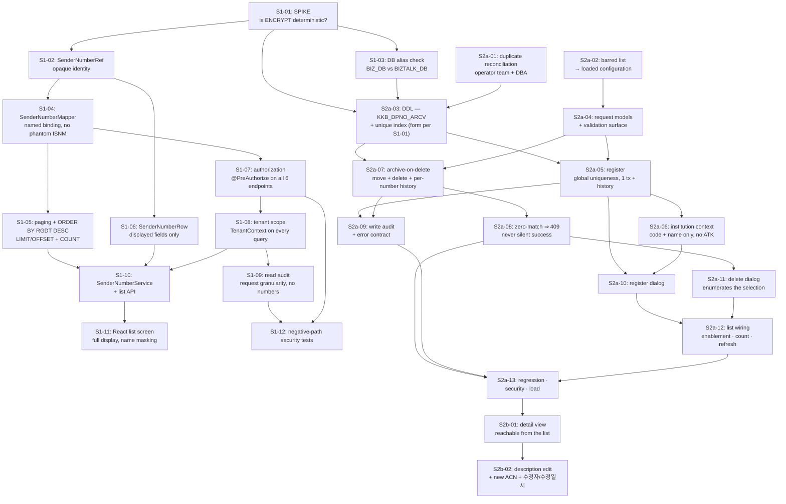

# Development Plan — 발신번호 (Sender Number Management)

> **Version**: 1.1 — write-path pass, 2026-08-20
> **Date**: 2026-08-17 (v1.0) · 2026-08-20 (v1.1)
> **Predecessor**: [REQUIREMENTS-SPEC-SENDERNO.md](../requirements/REQUIREMENTS-SPEC-SENDERNO.md) v1.1 — **G1 APPROVED 2026-08-21**
> **Siblings**: [DEV-PLAN.md](DEV-PLAN.md) (문자내역), [DEV-PLAN-LOGIN.md](DEV-PLAN-LOGIN.md), [DEV-PLAN-INSTITUTION.md](DEV-PLAN-INSTITUTION.md)
> **Design**: [architecture-overview-SENDERNO.md](architecture-overview-SENDERNO.md), [threat-model-SENDERNO.md](threat-model-SENDERNO.md), [TEST-PLAN-SENDERNO.md](TEST-PLAN-SENDERNO.md), [risk-register-SENDERNO.md](risk-register-SENDERNO.md)
> **Sprint task lists**: [sprint-S1-tasks.md](sprint-S1-tasks.md) (delivered), [sprint-S2a-tasks.md](sprint-S2a-tasks.md)
> **ADRs**: [ADR-SND-017](adr/ADR-SND-017-senderno-lifecycle.md), [ADR-SND-018](adr/ADR-SND-018-encrypted-number-uniqueness.md), [ADR-SND-019](adr/ADR-SND-019-senderno-read-audit.md), [ADR-SND-020](adr/ADR-SND-020-write-dialog-presentation.md), [ADR-SND-021](adr/ADR-SND-021-barred-number-list.md)
> **Status**: **APPROVED (G2)** — 2026-08-21, PM · 사후 결재(구현·검증 선행) / retrospective
> **이월 조건 / carried conditions**: G1 결재는 CONFLICT-S01 · RESIDUAL-S01 을 수용했고, AMB-S07 과 OI-02 는 미결로 이월했다. §214 의 "G1 미결이 부과하는 비용" 서술은 G1 결재(2026-08-21) 로 해소되었다 / G1 accepted CONFLICT-S01 and RESIDUAL-S01; AMB-S07 and OI-02 remain open. The §214 note about pending G1 is now resolved

---

## 1. Overview

Four legacy screens (10 이용기관 정보 관리, 11 발신번호 상세, 12 발신번호 등록, 13 발신번호 제거) become one React screen with three dialogs over a single service package. Twenty-one defects are in scope; twenty are fixed and one (D-S4, ownership verification) is carried forward by PM ruling.

> ⚠ **G1 not yet approved.** Written against a DRAFT specification, following the precedent of DEV-PLAN-LOGIN and DEV-PLAN-INSTITUTION. G1 must cover **CONFLICT-S01** and **RESIDUAL-S01** — see §10.

### 1.1 What design changed since Skill 2

Three things, all from reading applications outside this repository. They are listed first because two of them changed the plan rather than confirming it.

**CONFLICT-S02 is confirmed, not suspected — and it decided the delete design.** The send runtime is `KAKAOTALK`, and it authorizes a send by selecting the number from `KKB_DPNO_LDGR` and rejecting when nothing returns. It reads no status column. A soft-delete flag would therefore have left every "deleted" number fully sendable — D-I1 rebuilt on purpose. Deletion instead **moves the row to an archive table** ([ADR-SND-017](adr/ADR-SND-017-senderno-lifecycle.md)), which makes the legacy reject it with no legacy change at all.

**`AOA_ADMIN` is a second writer on the same database.** It carries the same four screens against the same `BIZTALK_DB`. This rules out enforcing global uniqueness in application code — `AOA_ADMIN` would bypass it — so the constraint moves into the database ([ADR-SND-018](adr/ADR-SND-018-encrypted-number-uniqueness.md)). It also means the 21 defects stay live in that console after we ship (RISK-S05).

**One send path is not covered by any ledger check.** `ADV_KKO_FT_SEND_act.jsp` uses `sender_number` and never validates it, while its `_BULK` and `_M` siblings do. FR-SNDD-003 is therefore satisfied for five of six send paths by construction and the sixth is a tracked gap (RISK-S03), not a test we can pass.

### 1.1a What changed at v1.1 (2026-08-20)

Sprint S1 shipped. This revision plans the two controls it left disabled, under a PM directive — **"follow old logic"** — and three PM rulings closing AMB-S06, AMB-S08 and the new AMB-S10 (spec v1.1 §1.5, §6.1a).

**S2 splits into S2a and S2b.** S2a takes 등록 (screen 12) and 삭제 (screen 13); S2b takes 상세/설명수정 (screen 11). Two reasons, and the second is the real one:

- The request was for the two write operations, and the sprint that delivers them should not also be the sprint that reaches a screen the legacy could not reach at all (D-S8).
- **The two halves have different risk shapes.** S2a is where the four critical defects live and where all the DDL is; it is gated on G1 and on an operator-team reconciliation whose duration nobody has measured. S2b is a description field and a third action code — it is gated on nothing. Bundling them puts a two-day change behind a schema-change approval. The 이용기관관리 slice split the same way (I2a) for the same reason.

**Two new ADRs, both ≥2-candidate decisions.** [ADR-SND-020](adr/ADR-SND-020-write-dialog-presentation.md) settles what "the same flow as the legacy popup" means when there is no second window and no `opener.getDat()` — modal dialog, legacy layout preserved, 4 options compared. [ADR-SND-021](adr/ADR-SND-021-barred-number-list.md) takes the barred-number list out of compiled code, with an empty list failing startup rather than silently disabling the rule — 4 options compared.

**One design decision taken without a new ADR.** AMB-S09 (operator identity, D-S16) resolves to option B — keep the email, encrypt it at rest under the existing ADR-005 mechanism. Option A (an internal user ID) needs a user master, a two-table backfill, and would still receive plaintext emails from `AOA_ADMIN` after cutover, producing a column holding two identifier kinds. Reasoning in [questions-log §45](../requirements/questions-log.md); it changes no mechanism, so it extends ADR-005 rather than displacing it.

**A defect class re-entered through our own fix.** FR-SNDD-009 exists because S1's server-side paging — added to fix D-S14 — separates *selected* from *visible*, so a delete can act on rows the operator can no longer see. That is D-S1's shape (an operation acting on something other than what the operator saw) arriving by a new route. It is the one requirement in this pass that is not a legacy defect, and it is planned as task S2a-11/S2a-12 rather than left to UI judgement.

### 1.2 Readiness

| Input | State (v1.1) |
|-------|-------|
| Requirements | **76** slice-specific rows in the matrix — 51 functional, 17 non-functional, 8 constraints — plus 4 inherited constraints. 9 FR and 2 CONST added at v1.1. Orphan 0; matrix re-validated (10 columns, no duplicate IDs) |
| PM rulings | AMB-S01…S04 (v1.0); **AMB-S06, S08, S10 (v1.1)**; directive "follow old logic" recorded in [questions-log §41](../requirements/questions-log.md) |
| Open items | AMB-S05 resolved by ADR-SND-017; **S06/S08 resolved by PM, S09 resolved by architect**; **AMB-S07 alone open**, non-blocking, no cap implemented |
| Reusable components | `TenantContext`, `AuditService`, `PagedResult`, `InstitutionService`, `SenderNumberRef`, `SenderNumberValidator`, `InstitutionEditDialog` pattern — all delivered, all consumed unmodified |
| Delivered | Sprint S1: list, authorization, tenant scope, paging, ordering, read audit. `SenderNumberValidator` already carries the length, digit and barred-number rules |
| Unknown gating design | **S1-01 (ENCRYPT determinism) and S1-03 (`BIZ_DB` alias) must be answered before S2a-03.** Both are S1 tasks; if either is still open, S2a-03 does not start — see RISK-S01, RISK-S07 |

## 2. Technology stack

Settled by [ADR-001](adr/ADR-001-tech-stack.md) and not reopened: Java 17, Spring Boot 3.x, MyBatis, React, PostgreSQL. This slice introduces no new technology, no new external integration, and no new dependency.

The harness requires a ≥2-candidate comparison for stack selection. That comparison was performed and recorded in ADR-001 for the programme; re-running it per slice would be ceremony. **The genuine ≥2-candidate decisions in this slice are architectural rather than technological**, and each is recorded with its alternatives and the reason for rejection in ADR-SND-017 (4 options), ADR-SND-018 (4 options) and ADR-SND-019 (4 options).

The `COOCON_SMS` integration is **not** wired — AMB-S01. No external channel is added.

## 3. Architecture

See [architecture-overview-SENDERNO.md](architecture-overview-SENDERNO.md). Package layout follows the established `api` / `domain` / `infra.db` split under `com.webcash.iris.biztalk`; cross-cutting concerns are consumed from `common.tenant` and `common.audit` without modification.

## 4. Sprint plan

| Sprint | Weeks | Scope | DoD |
|--------|-------|-------|-----|
| **Sprint S1** ✅ | 1–2 | Foundation and read path — encryption spike, identity model, mapper, paging, ordering, authorization, tenant scope, read audit, list UI | FR-SND-001…011, FR-AZ-D01…D05, NFR-SEC-AUTHZ-D01, NFR-SEC-TENANT-D01, NFR-PERF-D01. Closes D-S2, D-S3, D-S14, D-S17, D-S19, D-S21 |
| **Sprint S2a** | 3–4 | **등록 (screen 12) and 삭제 (screen 13)** — duplicate reconciliation, DDL, uniqueness constraint, barred list to configuration, server validation, register, archive-on-delete, history correctness, both dialogs, selection semantics. Task list: [sprint-S2a-tasks.md](sprint-S2a-tasks.md) | FR-SNDC-\*, FR-SNDD-\*, FR-SNDH-\*, FR-SND-012, CONST-BIZ-D03/D04. Closes D-S1, D-S5, D-S6, D-S7, D-S9, D-S11, D-S12, D-S13, D-S15, D-S16, D-S18. 7-dimension ≥ 90 |
| **Sprint S2b** | 5 | **상세 / 설명수정 (screen 11)** — reachable detail view, description edit, third action code, 수정자/수정일시 | FR-SNDU-001…006. Closes D-S8, D-S10, and the remainder of D-S20 |

> **Why the split.** S2a carries all four critical defects, all the DDL, the G1 dependency and an operator-team reconciliation of unmeasured duration. S2b is a description field and an action code, gated on nothing. Bundling them would put a two-day change behind a schema-change approval — see §1.1a.

### 4.1 Task DAG

Sprint S2a's own dependency detail, owners and estimates are in [sprint-S2a-tasks.md](sprint-S2a-tasks.md). The critical path is **S2a-01 → S2a-03 → S2a-07 → S2a-08 → S2a-11 → S2a-12 → S2a-13**; S2a-02 is the only task with no dependency and is the day-one start while S2a-01 sits in the operator team's queue.

### 4.2 Why the spike is task one

S1-01 asks one question — does `ENCRYPT(x)` return the same ciphertext for the same `x`? — and the answer selects between two materially different designs:

- **Deterministic:** a unique index on `DP_NO` gives global uniqueness directly, and every lookup in the slice becomes indexable. No new column, no backfill, no second key.
- **Non-deterministic:** a blind-index column, an HMAC key to manage under ADR-007, a backfill across every existing row, and a new threat (T-I7).

The difference is roughly a week of work and one long-lived key. Nothing downstream can be built correctly without the answer, because the identity model (S1-02) and the DDL (S2-02) both depend on it. It is scheduled first and it is expected to take under a day.

### 4.3 Why deletion is late in S2a

Deletion is the slice's headline defect and the instinct is to fix it first. It is scheduled after the archive table exists (S2a-03) because **the fix is the archive**, not a patch to the delete statement. Fixing the matching bug alone would turn a silent no-op into a working hard delete — which contradicts the PM's logical-delete ruling and would destroy data that is currently, accidentally, being preserved by the bug.

There is a mild irony worth naming for the team: D-S1 means deletion has not actually deleted anything since roughly October 2025, so the ledger currently holds rows operators believe are gone. **Do not "clean those up" before the reconciliation in §4.4 runs** — they are the evidence.

### 4.4 Operational prerequisites, not development tasks

Two items must be scheduled with the operator team and completed before S2a ships:

| Item | Why | Owner |
|------|-----|-------|
| **Deletion reconciliation** — find every number with an `ACN='D'` history row still present in the ledger | These were believed deleted and are still sendable. History rows whose `DP_NO` decrypts to a masked pattern (`01********8`) or to a comma-joined list identify them directly (D-S1, D-S5) | Operator team + PM |
| **Duplicate reconciliation** — find cross-institution duplicates | `CREATE UNIQUE INDEX` fails outright if any exist. This is a prerequisite for S2a-03, not a follow-up | Operator team + DBA (task S2a-01) |

**These two must not be run as one clean-up.** The first *identifies* rows that look deletable and are evidence; the second *resolves* rows that block an index. A single pass over "suspicious rows" would destroy the D-S1 evidence while fixing the duplicates — which is why S2a-01's DoD says so explicitly.

### 4.5 Relationship to the other slices

- **이용기관관리** supplies `InstitutionService`. Consumed for 기관명 only (FR-SNDC-002) — deliberately *not* the detail service that returns 인증키.
- **로그인** supplies `ROLE_OPERATOR`, `TenantContext` and `AuditService`. All consumed unchanged; this slice adds no authentication surface.
- **문자내역** is unaffected.
- **No sequencing conflict.** This slice can start immediately. It does not modify any existing class.

## 5. Team composition

| Role | Count | Responsibility |
|------|-------|---------------|
| `architect` | 1 | ADR-SND-017/018/019, spike S1-01 adjudication, DDL review |
| `backend-developer` | 2 | Service, mapper, validator, transaction boundaries |
| `frontend-developer` | 1 | List screen (S1), 등록·삭제 dialogs and the selection semantics (S2a), 상세/수정 dialog (S2b) |
| `data-model-designer` | 1 | Archive table, index form, identity model, backfill plan |
| `qa-engineer` | 1 | Regression suite for 21 defects, negative-path security suite, load |
| `security-auditor` | 1 | Threat model maintenance, authorization sweep, audit-content review |
| `trace-mapper` | 1 | Requirement → task → test coverage |
| `team-leader` | 1 | Dispatch, 7-dimension assessment, single reporting channel to PM |

## 6. LLM model assignment

| Work | Model tier | Reason |
|------|-----------|--------|
| ADR adjudication, spike interpretation, threat model | High reasoning | Cross-application consequences; the archive-vs-flag decision turned on reading a third codebase correctly |
| Service/mapper implementation, validator | Standard | Well-specified, heavily tested |
| Regression and security test authoring | Standard | Derived from the 21 recorded defects |
| React screens | Standard | Conventional CRUD over an existing design system |
| Traceability bookkeeping | Light | Mechanical matrix maintenance |

## 7. Staffing and schedule

**Five weeks, three sprints** (v1.0 planned four weeks and two; §1.1a explains the split). S1 front-loaded the spike and the authorization sweep, which are the two items everything else waits on.

Buffer sits in S2a, because S2a owns both reconciliations (§4.4), whose duration depends on production data nobody has measured yet, **and** the G1 dependency. S2b needs neither and can be scheduled independently of both — including before S2a, if G1 slips and the team would otherwise be idle. That flexibility is the practical payoff of the split.

## 8. Risk management

See [risk-register-SENDERNO.md](risk-register-SENDERNO.md) — **14 risks** at v1.1. The four that shape this sprint:

- **RISK-S01** — `BIZ_DB` vs `BIZTALK_DB` may not be the same physical database. If they differ, ADR-SND-017's mechanism needs re-derivation. Must be answered before S2a-03 (task S1-03).
- **RISK-S02** — existing cross-institution duplicates block the unique index. Unknown magnitude until S2a-01 runs, and it sits on the critical path.
- **RISK-S03** — `ADV_KKO_FT_SEND_act.jsp` validates nothing; outside our boundary.
- **RISK-S14** *(new at v1.1)* — under CONST-BIZ-D04 numbers outlive their institution in the ledger, so a **re-issued 기관코드 would inherit them**. Depends on whether the institution slice ever reuses a code.

## 9. Quality targets

| Dimension | Target |
|-----------|--------|
| Line coverage | ≥ 80% |
| Branch coverage | ≥ 70% |
| 7-dimension self-assessment | ≥ 90 / 100 |
| Defect regression tests | 1+ per fixed defect (20 defects) |
| E2E core scenarios | TOP 5 |
| Load | 2× the NFR-PERF SLA |
| Unmitigated CVSS ≥ 7.0 within our control | 0 |

## 10. Governance

| Gate | Skill | Approver | Status |
|------|-------|----------|--------|
| G1 Analysis | Skill 2 | PM | ✅ **APPROVED 2026-08-21** — CONFLICT-S01 · RESIDUAL-S01 수용. **S2a-03 차단 해제** (AMB-S07 · OI-02 는 미결 이월) |
| G2 Design | Skill 3 | PM + architect | This document (v1.1) |
| G3 Release | Skill 5 | PM + security | Later |

> **⚠ 2026-08-21 갱신 — 아래 단락은 해소되었다.** G1 이 결재되어 S2a-03 의 DDL 의존 차단이 풀렸고,
> "G1 이 여전히 미결이면 S2b 를 앞당긴다"는 지침은 **더 이상 적용되지 않는다**. 단락은 당시 판단 근거로
> 보존한다.
> **Superseded 2026-08-21.** G1 is approved, so S2a-03's DDL dependency is unblocked and the
> "pull S2b forward" instruction below no longer applies. Retained as a record of the reasoning.
>
> **What G1's status now costs.** Sprint S1 was designed to be independent of G1 and was. Sprint S2a cannot be: logical delete requires the archive table, and the archive table is the DDL. Of S2a's ~10 critical-path days, S2a-02, S2a-04 and S2a-06 (≈2 days) are genuinely G1-independent and are sequenced first for that reason. If G1 is still pending after those, **S2b should be pulled forward rather than S2a-03 started on assumption.**

**What G1 now needs to cover, restated after design.** CONFLICT-S01 could not be dissolved the way CONFLICT-I02 was — `KKB_DPNO_LDGR` genuinely has no column that can carry state. But design **narrowed it substantially**: all DDL is additive (one new table, one index), `KKB_DPNO_LDGR` is never altered in a way that changes what an existing reader sees, and no legacy application requires modification. The precedent G1 is being asked to set is *"this programme may add tables"*, not *"this programme may alter shared schema"*.

RESIDUAL-S01 is unchanged: registration carries no ownership proof, T-S2 in the threat model is the highest-severity threat in the slice, and it is unmitigated by explicit decision.

## 11. Backup and rollback

- **DDL** is additive and reversible: drop the index, drop the archive table. No existing data is modified by the migration itself.
- **The unique index is the one irreversible step in practice** — creating it requires the duplicate reconciliation to have already resolved collisions, and those resolutions are data changes. They are performed as an auditable, scripted migration with a recorded before-state, not by ad-hoc SQL.
- **Application rollback** to the legacy console is available throughout: `AOA_ADMIN` and the existing IRIS_ADMIN screens continue to operate against the same tables. Note that rolling back to them reintroduces all 21 defects, including the broken delete.
- **Archive restoration** is a supported operation (ADR-SND-017), not a DBA recovery procedure.

## 12. Financial-sector obligations

| Area | ADR | Applied here |
|------|-----|-------------|
| Transaction model | [ADR-002](adr/ADR-002-transaction-boundary.md) | Multi-number delete and register+history are single transactions |
| Persistence | [ADR-003](adr/ADR-003-persistence-strategy.md) | MyBatis, named binding, no positional mapping (CONST-DATA-D03) |
| PII encryption | [ADR-005](adr/ADR-005-pii-encryption.md) | `ENCRYPT`/`decrypt` retained; operator identity consistency per NFR-SEC-PII-D01 — **AMB-S09 ruling B: the email is encrypted rather than replaced by an internal ID**, and reads tolerate both forms because `AOA_ADMIN` keeps writing plaintext |
| Business-rule data | [ADR-SND-021](adr/ADR-SND-021-barred-number-list.md) | The barred special/emergency list is loaded data with a fail-loud startup check, not a compiled constant |
| Write-path presentation | [ADR-SND-020](adr/ADR-SND-020-write-dialog-presentation.md) | Legacy popups 12/13 become modal dialogs preserving field set, order and stated rules |
| Audit logging | [ADR-006](adr/ADR-006-audit-logging.md), [ADR-SND-019](adr/ADR-SND-019-senderno-read-audit.md) | Append-only; reads and denials audited; numbers never written to the audit store |
| Key management | [ADR-007](adr/ADR-007-key-management.md) | Second key only if the spike forces the blind-index branch |
| Channel auth | [ADR-008](adr/ADR-008-channel-auth.md) | No external channel added — `COOCON_SMS` not wired |
| Retry / idempotency | [ADR-009](adr/ADR-009-retry-idempotency.md) | Delete is idempotent per number: a second attempt finds no live row and returns 409, never a false success |

## 13. Change history

| Date | Version | Change | Author |
|------|---------|--------|--------|
| 2026-08-17 | 1.0 | Initial plan: two sprints, four weeks, over spec v1.0. ADR-SND-017/018/019 | architect |
| 2026-08-20 | 1.1 | **Write-path pass** over spec v1.1. S2 split into **S2a (등록 + 삭제)** and **S2b (상세/설명수정)**; [sprint-S2a-tasks.md](sprint-S2a-tasks.md) added with 13 tasks; ADR-SND-020 and ADR-SND-021 added; AMB-S09 resolved under ADR-005; RISK-S14 added and RISK-S11 downgraded; G1's cost to the schedule stated explicitly | architect |
