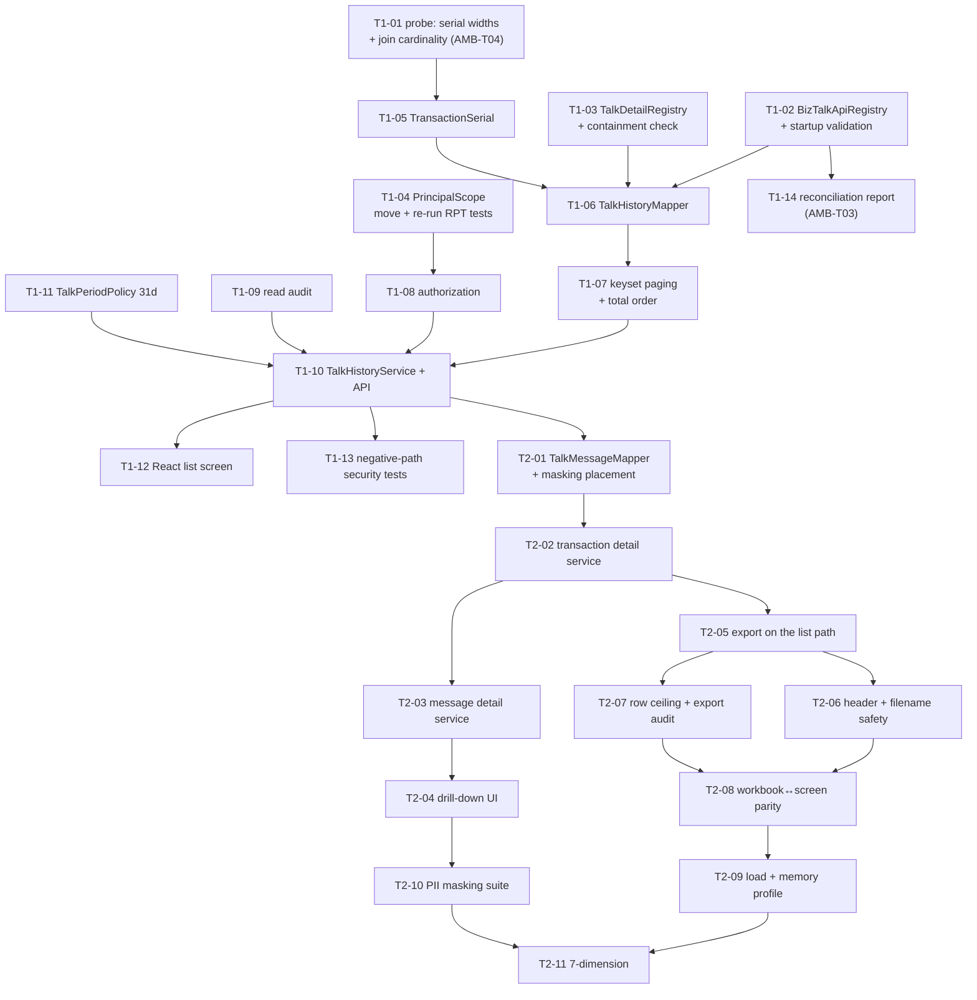

# Development Plan — 톡전송 내역 (BizTalk Transaction History)

> **Version**: 1.0
> **Date**: 2026-08-19
> **Predecessor**: [REQUIREMENTS-SPEC-TALK.md](../requirements/REQUIREMENTS-SPEC-TALK.md)
> **Siblings**: [DEV-PLAN.md](DEV-PLAN.md), [-LOGIN](DEV-PLAN-LOGIN.md), [-INSTITUTION](DEV-PLAN-INSTITUTION.md), [-SENDERNO](DEV-PLAN-SENDERNO.md), [-REPORT](DEV-PLAN-REPORT.md)
> **Companion documents**: [TEST-PLAN-TALK.md](TEST-PLAN-TALK.md), [architecture-overview-TALK.md](architecture-overview-TALK.md), [threat-model-TALK.md](threat-model-TALK.md), [risk-register-TALK.md](risk-register-TALK.md), [sprint-T1-tasks.md](sprint-T1-tasks.md)
> **Status**: **APPROVED (G2)** — 2026-08-21, PM · 사후 결재(구현·검증 선행) / retrospective
> **이월 조건 / carried condition**: G1 결재는 AMB-T01…T05 의 작업 가정을 수용했다. TEST-PLAN §D-T6 의 masking 출력 형식 미검증은 G3 기록 대상으로 남는다 / G1 accepted the AMB-T01…T05 working assumptions; D-T6's unverified masking output format remains for G3 to record

---

## 1. Overview

Three legacy screens (30 BizTalk 내역, 32 거래 상세내역, 31 메시지 상세) and one export become one React screen with two drill-down panels over one **read-only** service package. Thirty-four defects are fixed, five of them Critical.

> ⚠ **G1 not yet approved.** Written against a DRAFT specification, following the precedent of the four preceding slices.

### 1.1 What design changed since Skill 2

Four things. One of them removes a planned reuse; two convert open questions into week-one measurements; one is a small programme-level refactor that this slice makes unavoidable.

**The message tables are not the 문자내역 slice's message tables.** Skill 2 assumed reuse of `MessageDetailMapper` was at least plausible. It is not: 문자내역 reads `KKO_SMS_MSG` / `KKO_MMS_MSG` / `KKF_SMS_MSG` / `KKF_MMS_MSG` and their archives; this slice reads `KKO_MSG` / `KKF_MSG` and theirs. Twelve tables, no overlap. The corroboration is upstream — `IDO.KKB_APITR_SMTN_C001` computes the daily 알림톡 count from `KKO_MSG` + `KKO_MSG_LOG`, not from the SMS/MMS family — and the column sets differ in exactly the way that reading implies (`TEMPLATE_CODE`, `PROFILE_KEY`, `BUTTON_JSON`, `FAILED_*` exist only in the talk family). `TalkMessageMapper` is therefore new code that reuses the sibling's *conventions*, in particular the `masking(decrypt(…))` placement at the outermost projection ([ADR-TLK-027](adr/ADR-TLK-027-sibling-reuse-boundary.md)). Raised as AMB-T06 for the domain owner; **not blocking**, because this slice reads only its own four tables.

**AMB-T03 and AMB-T04 become week-one measurements, not meeting agenda.** The BizTalk API code set is data the codebase does not name (`ADV_COM_GET_STATUS` is in production and in no source file), so it is held in configuration with a **standing reconciliation report** that makes under-inclusion visible ([ADR-TLK-024](adr/ADR-TLK-024-biztalk-api-classification.md)). The `IS_TUNO` ↔ `SERIALNUM` widths are measurable, so task **T1-01** measures them before any mapper is written ([ADR-TLK-025](adr/ADR-TLK-025-transaction-message-identity.md)). Both follow the S1-03 / R1-01 precedent: a half-day probe in week one instead of a rewrite in week three.

**Detail serviceability becomes one decision with three consumers.** The legacy had a client rule, a server branch list and a table-routing branch, all disagreeing. One `TalkDetailRegistry` now answers all three, `detailAvailable` ships as a server-computed field on the row, and a code that is in scope but has no channel mapping is a **startup failure** rather than an empty popup ([ADR-TLK-026](adr/ADR-TLK-026-detail-serviceability.md)).

**`ReportScope` moves to `common.tenant` as `PrincipalScope`.** It already encodes precisely the operator/tenant distinction CONFLICT-T01 requires, including the two properties that matter — a tenant's blank value does not mean "all", and a tenant's supplied value is ignored rather than validated-and-rejected so the error cannot become an enumeration oracle. Copying it would put two implementations of one authorization rule in the codebase, which is the single duplication this programme cannot afford. Task T1-04 performs the move and re-runs the 보고서 slice's authorization tests **unchanged**; if any fails, the generalisation is wrong and is reverted rather than adjusted.

### 1.2 Readiness

| Input | State |
|-------|-------|
| Requirements | 63 requirements, orphan 0, matrix complete |
| PM rulings | SCOPE-T01, CONFLICT-T01, EXPORT-T01, PII-T01 resolved at Skill 2 |
| Conflicts | CONFLICT-T01 and CONFLICT-T02 both resolved at Skill 2 — **no conflict reaches G2** |
| Open items | AMB-T03 answered operationally by ADR-TLK-024; AMB-T04 by T1-01; AMB-T05 dissolved by ADR-TLK-026; AMB-T01/T02 carry working assumptions; **AMB-T06 new, non-blocking** |
| Blocking items | **FR-TLKD-009 is `BLOCKED-AMB-T04` and is unblocked by T1-01 in week one** |
| Reusable components | `TenantContext`, `AuditService`, `PagedResult`, `PeriodPolicy`, `InstitutionName`, the 보고서 streamed export writer — all consumed; `ReportScope` generalised |
| New infrastructure | **None.** No new datasource, no queue, no job store, no DDL |

## 2. Technology stack

Settled by [ADR-001](adr/ADR-001-tech-stack.md) and not reopened: Java 17, Spring Boot 3.x, MyBatis, React, PostgreSQL. This slice adds **no new technology and no new dependency**. Apache POI is already present and is **Apache-2.0**, so CODE-004 raises nothing.

The harness requires a ≥2-candidate comparison for stack selection; that was performed for the programme in ADR-001 and re-running it per slice is ceremony. **The genuine ≥2-candidate decisions here are architectural**, and each is recorded with its alternatives and the reason for rejection in [ADR-TLK-024](adr/ADR-TLK-024-biztalk-api-classification.md) (4 options), [ADR-TLK-025](adr/ADR-TLK-025-transaction-message-identity.md) (4 options), [ADR-TLK-026](adr/ADR-TLK-026-detail-serviceability.md) (4 options) and [ADR-TLK-027](adr/ADR-TLK-027-sibling-reuse-boundary.md) (4 options).

No candidate scored within 10% of another, so **no stack tie-break decision is referred to the PM** under harness §2.

## 3. Architecture

See [architecture-overview-TALK.md](architecture-overview-TALK.md). Package layout follows the established `api` / `domain` / `infra.db` split under `com.webcash.iris.biztalk`, reusing `infra.excel` from the 보고서 slice. Cross-cutting concerns come from `common.tenant` and `common.audit`.

One structural point governs the whole slice. `FT_APITR_HSTR` carries `FIN_ACNO`, `ACNO`, `CANO`, `FIN_CARD`, `TRAM`, `BRNO`, `INTT_DMND_TTNO` and `RSPN_TLGR_CNTN` — account numbers, card numbers, amounts and raw response telegrams for the entire fintech API estate. CONST-SEC-T01 forbids selecting them, and that is enforced **at the projection, not by convention**: the mapper's `resultMap` is closed, the row record has nine fields, and a contract test asserts the response's field set exactly. A `SELECT *` cannot appear in this slice.

Because nothing is written (CONST-DATA-T01) and there is one datasource, [ADR-002](adr/ADR-002-transaction-boundary.md)'s boundaries are untouched.

## 4. Sprint plan

| Sprint | Weeks | Scope | DoD |
|--------|-------|-------|-----|
| **Sprint T1** | 1–2 | Foundation, list and authorization — probes, registries, `PrincipalScope`, serial identity, list query with deterministic paging, operator-only authorization, read audit, list UI | FR-AZ-T01…T06, FR-TLK-001…015, NFR-SEC-AUTHZ-T01, NFR-SEC-TENANT-T01, NFR-PERF-T01. Closes D-T2, D-T3, D-T10, D-T11, D-T15, D-T24…D-T29, D-T31, D-T32 |
| **Sprint T2** | 3–4 | Drill-down and export — transaction detail, message detail, masking, export on the list's own path, load and 7-dimension | FR-TLKD-001…009, FR-TLKM-001…008, FR-TLKX-001…010, NFR-PERF-T02, NFR-SEC-PII-T01, NFR-SEC-HDR-T01, NFR-SCALE-T01, NFR-COMPAT-T01. Closes D-T1, D-T4…D-T9, D-T12…D-T14, D-T16…D-T23, D-T30, D-T33, D-T34. 7-dimension ≥ 90 |

### 4.1 Task DAG

### 4.2 Why two probes lead the sprint

T1-01 and T1-02 are the same shape as S1-03 (발신번호) and R1-01 (보고서), and by now the pattern is deliberate: **when a design rests on a property of production data, measure it in week one.**

T1-01 fixes `TransactionSerial`'s two widths and answers whether one transaction maps to one message or many. Getting this wrong is not a tuning problem — the legacy's version silently truncates a 20-character identifier to ten and returns another transaction's messages (D-T9), which under CONST-BIZ-T01 is a cross-institution disclosure, not a display bug.

T1-02 exists because SCOPE-T01 requires a definition the legacy never had. Its first output is the reconciliation report (T1-14), which is the only thing that makes under-inclusion visible — and under-inclusion is the failure mode this slice introduces by narrowing the screen.

### 4.3 Why the drill-down and the export share a sprint

In the 보고서 slice the export was a whole sprint behind the query, because its defects all traced to it being a parallel implementation. That reasoning holds here and is stronger — D-T1 is the extreme case, an export that queries different tables than the screen it sits on. But the fix is smaller: the writer already exists ([ADR-RPT-023](adr/ADR-RPT-023-export-generation.md)), this grid is one flat sheet rather than two of different shapes, and the export consumes the list iterator T1-07 already produced. The export is therefore roughly a third of R2's effort, which is what allows T2 to carry both drill-down levels as well.

### 4.4 Operational prerequisites, not development tasks

| Item | Owner | Why it is not a task |
|------|-------|---------------------|
| **Access-log review for exploitation of D-T1** — look for `biztalk_admin_30_spreadsheet` invocations, and for `biztalk_admin_30_l002` calls (D-T3, which no screen ever made) | PM + 정보보호 | An incident-response action on production logs. Unlike the 보고서 slice's D-R1, this one **leaves a file behind**, so the question is not only who read but what they kept (RISK-T02, OI-T01) |
| **Confirm the authoritative BizTalk API code set** | Domain owner | ADR-TLK-024 ships without it; the reconciliation report converts the answer from a prerequisite into a measurement (AMB-T03) |
| **State the `KKO_MSG` ↔ `KKO_SMS_MSG` relationship** | Domain owner | Not needed by this slice; needed by any future cross-channel message search (AMB-T06) |
| **Decide whether `biztalk_admin_30_l002` can be retired in the legacy now** | Operations | FR-AZ-T06 removes it from the new application. It stays reachable in `IRIS_ADMIN` until legacy cutover, and it has no caller — so it can be disabled ahead of cutover at near-zero risk (RISK-T03) |

### 4.5 Relationship to the other slices

This is the first slice to **give** as well as take. `PrincipalScope` moves out of the 보고서 slice into `common.tenant`, where every future operator screen will find it. Everything else is consumption: `TenantContext`, `AuditService`, `PagedResult`, `InstitutionName`, `PeriodPolicy` (a second configured instance, not a second class) and the streamed export writer are used unmodified.

The programme-level effect is a **second correction to the proposal's menu classification**. CONFLICT-R01 established that AMB-02 governs tenant principals; CONFLICT-T01 moves legacy 30 from `[Tenant]` to operator, narrowing the MVP's tenant-facing surface from four legacy menus to three (40, 50, 60). Both corrections point the same way, and the pattern is worth stating for the two slices still to come: **the proposal's `[Tenant]`/`[Operator]` labels were inferred from menu names, and the menu names describe intent rather than data.** Each remaining slice should verify its own label against its query before planning against it.

## 5. Team composition

| Role | Count | Responsibility |
|------|-------|---------------|
| `architect` | 1 | ADR-TLK-024…027, T1-01/T1-02 adjudication, `PrincipalScope` move review |
| `backend-developer` | 2 | Registries, serial type, mappers, services, export path |
| `frontend-developer` | 1 | List screen and two drill-down panels |
| `qa-engineer` | 1 | Regression suite for 34 defects, negative-path security, masking suite, load |
| `security-auditor` | 1 | Threat model, PII masking verification, header safety, endpoint inventory |
| `trace-mapper` | 1 | 63 requirements → tasks → tests; orphan 0 maintained through both sprints |
| `team-leader` | 1 | DAG dispatch, 7-dimension assessment, single reporting channel to PM |

## 6. LLM model assignment

| Work | Model tier | Reason |
|------|-----------|--------|
| ADRs, threat model, defect analysis, 7-dimension | High-reasoning | The defects in this slice are compositional — D-T1 is invisible to any single-layer check |
| Mappers, services, registries, React components | Standard | Well-specified against an existing codebase with strong conventions |
| Matrix maintenance, task bookkeeping | Light | Mechanical |

## 7. Staffing and schedule

Four weeks, two sprints, the same cadence as the 보고서 slice. The defect count is higher (34 vs 27) but the per-defect cost is lower: eleven of them are one class (copy-and-diverge) closed by two registries and one deleted literal, and the export arrives with its mechanism already built.

## 8. Risk management

See [risk-register-TALK.md](risk-register-TALK.md) — 12 risks. The two that shape the plan are **RISK-T01** (under-inclusion is silent, mitigated by T1-14's reconciliation report) and **RISK-T02** (D-T1 may already have been exploited, and unlike previous exposures it produces a file).

## 9. Quality targets

| Dimension | Target |
|-----------|--------|
| Unit line / branch coverage | ≥ 80% / ≥ 70% |
| Defect regression tests | 34 defects, ≥ 1 test each, named by `D-T*` |
| E2E core scenarios | TOP 5 (see TEST-PLAN §12) |
| 7-dimension self-assessment | ≥ 90 / 100 |
| Security | OWASP Top 10 automated, SAST, secret scan, endpoint inventory |
| Load | 2× the NFR-PERF SLA |

## 10. Governance

**What G1 must cover.** Four PM rulings (SCOPE-T01, CONFLICT-T01, EXPORT-T01, PII-T01) and the acceptance that SCOPE-T01 removes rows operators can see today. CONFLICT-T01 additionally amends an approved document — PROJECT-PROPOSAL §5.1 — so G1 approval carries that amendment.

**What G2 must cover.** The four ADRs, the `PrincipalScope` move (which touches an already-approved slice), and the acceptance that FR-TLKD-009 enters implementation `BLOCKED-AMB-T04` with T1-01 as its unblocking task.

**No G2 blocking threat.** The threat model's severities are all mitigated within the slice; see [threat-model-TALK.md](threat-model-TALK.md) §6.

## 11. Backup and rollback

Application rollback to the legacy console is available throughout; `AOA_ADMIN` and the existing `IRIS_ADMIN` screens continue to operate against the same tables. **Rolling back reintroduces all 34 defects, including a one-click plaintext export of every institution's recipient phone numbers (D-T1) and a live unmasked-PII endpoint with no caller (D-T3).** That is a materially worse rollback position than any previous slice, and RISK-T02 asks that the legacy export be disabled independently of this project's schedule so the rollback path is not also the exposure path.

No data migration, no DDL, nothing written — rollback is a routing change.

## 12. Financial-sector obligations

| Area | Covered by |
|------|-----------|
| 사용자 인증 | Inherited from the 로그인 slice; FR-AZ-T01 verifies it holds on all five services |
| 개인정보 저장 | [ADR-005](adr/ADR-005-pii-encryption.md); NFR-SEC-PII-T01, CONST-LEGAL-T01 — `masking(decrypt(…))` at the outermost projection |
| 금융 거래 | CONST-SEC-T01 — the account, card, amount and telegram columns of `FT_APITR_HSTR` are never selected |
| 감사 로그 | [ADR-006](adr/ADR-006-audit-logging.md); FR-AZ-T05, FR-TLKX-007, NFR-OPS-AUDIT-T01 (retention blocked on OI-02) |
| 외부 채널 | Not engaged — this slice makes no outbound call |
