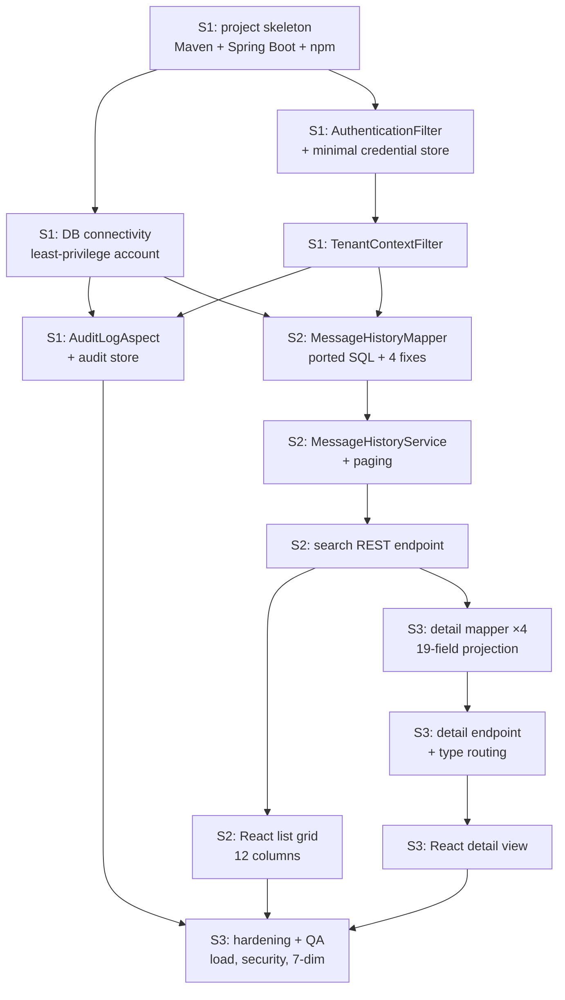

# 개발계획서 — IRIS BizTalk Portal · 문자내역 slice

> **Version**: 1.0
> **Date**: 2026-08-14
> **Predecessor**: [REQUIREMENTS-SPEC.md](../requirements/REQUIREMENTS-SPEC.md) (G1 approved 2026-08-14)
> **Scope**: 문자내역 (screens 40/41) only — per PM instruction "follow Skill 02 that complete only"
> **Status**: **APPROVED (G2)** — 2026-08-21, PM

---

## 1. Project overview

| Item | Content |
|------|---------|
| Project | IRIS BizTalk Portal — 문자내역 vertical slice |
| Scope | Legacy screens 40 (문자내역조회) / 41 (문자상세내역조회) |
| Duration | 6 weeks — 3 sprints × 2 weeks |
| Team | 1–2 developers + agent team (Build / Validation / Ops) |
| Standard | harness-standards v1.0 (Team-with-Leader) |
| Requirements covered | 29 FR · 16 NFR · 7 CONST (52 matrix rows) |

> **This slice is an architecture pilot.** It is the first vertical cut of a much larger migration; ADR-001 through ADR-009 are established here and govern later slices. Three of them (ADR-002, 004, 009) are explicitly scoped to read-only behavior and **must be superseded** when the send path is specified.

## 2. Technology stack (ADR-001)

| Area | Selected | ADR |
|------|----------|-----|
| Language / runtime | Java 17 | [ADR-001](adr/ADR-001-tech-stack.md) |
| Backend framework | Spring Boot 3.x | ADR-001 |
| Frontend | React SPA + REST | ADR-001 — *adopted over the higher-scoring Thymeleaf option by PM decision* |
| Persistence | MyBatis | ADR-001, [ADR-003](adr/ADR-003-persistence-strategy.md) |
| Database | PostgreSQL `BIZTALK_DB` (existing, unchanged) | ADR-003 |
| Auth | Spring Security, server-side session | [ADR-008](adr/ADR-008-channel-auth.md) |
| Messaging | **None** — <10k msg/day requires no broker | ADR-001 |
| Build | Maven (backend) + npm (frontend) | ADR-001 |
| CI/CD | `[보류]` — decide in Sprint 1 | — |

## 3. Architecture

See [architecture-overview.md](architecture-overview.md).

Core components:
- **Cross-cutting Jex-replacement block** — `AuthenticationFilter`, `TenantContextFilter`, `ServiceWindowInterceptor`, `UsageQuotaInterceptor`, `AuditLogAspect`
- **REST API layer** — `MessageHistoryController`
- **Domain services** — `MessageHistoryService`
- **MyBatis mappers** — ported SQL with annotated defect fixes
- **React SPA** — list grid + detail view

## 4. Sprint plan

| Sprint | Weeks | Scope | DoD |
|--------|-------|-------|-----|
| **Sprint 1** | 1–2 | Skeleton, cross-cutting block, authentication and tenant scoping | FR-MSG-001, FR-TEN-001…004, NFR-SEC-AUTH/TENANT, NFR-OPS-AUDIT. Cross-tenant integration test passing |
| **Sprint 2** | 3–4 | 문자내역 list — ported query with all fixes, paging, React grid | FR-MSG-002…017. Regression tests TC-MSG-001-01…20 passing |
| **Sprint 3** | 5–6 | 문자상세내역 detail, 19-field projection, hardening, QA | FR-MSGD-001…008. TC-MSG-002-01…20 passing. 7-dimension ≥ 90 |

### 4.1 Dependency — this slice cannot ship alone

문자내역 requires an authenticated session, but **the login module has not been through Skill 02**; only 문자내역 requirements are G1-approved. Sprint 1 therefore builds authentication *infrastructure* (filters, session handling, tenant resolution per ADR-008) against a **minimal credential store**, not the full login module (SSO, password reset, account provisioning, OTP).

Two consequences the PM should note:
1. **This slice is not independently releasable to end users.** It is releasable to a test environment and demonstrable, but a production cutover needs the login module specified and built.
2. **OI-06 (tenant account provisioning — self-registration or operator-issued) blocks the login module**, and has been open since Skill 01.

### 4.2 Task DAG

## 5. Team composition (Team-with-Leader)

| Team | Members | Leader | Write directories |
|------|---------|--------|-------------------|
| Build | `backend-developer`, `frontend-developer`, `data-model-designer`, `code-reviewer` | `code-reviewer` | `src/`, `reviews/` |
| Validation | `qa-engineer`, `security-auditor`, `code-reviewer` | `security-auditor` | `qa/`, `security/` |
| Ops | `docs-writer`, `architect` | `docs-writer` | `docs/` |

PM (human) coordinates across teams only; within a team the Leader is autonomous.

## 6. LLM model assignment

| Agent | Model | Reason |
|-------|-------|--------|
| `architect` | Opus | Design reasoning depth |
| `backend-developer` | Sonnet | Port-and-implement against a clear spec |
| `frontend-developer` | Sonnet | Component implementation |
| `code-reviewer` | Opus | Pattern recognition, defect detection |
| `security-auditor` | Opus | Security reasoning — four regulatory regimes |
| `qa-engineer` | Sonnet | Test construction |
| `docs-writer` | Haiku | Document assembly |
| Cross-validation (Skill 5) | Different vendor | Avoid model bias |

## 7. Staffing

| Role | Count | Responsibility |
|------|-------|----------------|
| PM | 1 (human) | Gate approval, scope decisions, external communication |
| Developer | 1–2 (human) | Review agent output, supply domain judgement |
| Domain owner | 1 (human, part-time) | **Validate extracted specifications** — the load-bearing dependency from RISK-001 |
| AI agents | ~10 | Implementation, test, review, audit |

> Capacity note: proposal §8 sized the full project at 12–18 person-months against 6–12 available. This slice is scoped to fit; the gap reappears at project level (RISK-004).

## 8. Risk management

See [risk-register.md](risk-register.md) — 13 entries.

Top 3:
1. **RISK-002 — Jex runtime behavior loss.** Time-window gating, audit logging, usage caps and auth flags live in the discarded runtime. Mitigated by making them explicit components in Sprint 1 (architecture §2.1)
2. **RISK-001 — source is the only specification.** No runnable legacy, no Jex expertise. Mitigated by MyBatis near-verbatim porting (ADR-003) and domain-owner sign-off
3. **RISK-011 — React capacity.** Adopted against the weighted score with 1–2 developers; frontend and backend cannot proceed in parallel at this headcount

## 9. Quality targets

| Metric | Target |
|--------|--------|
| Line coverage | ≥ 80% |
| Branch coverage | ≥ 70% |
| 7-dimension self-assessment | ≥ 90 |
| CVSS ≥ 7.0 defects | 0 (release gate) |
| Defect regression tests passing | 100% (16 of 40 test cases target D1–D9) |
| ADR count | 9 (this slice) |

## 10. Governance

| Gate | Timing | Approver | Artifact |
|------|--------|----------|----------|
| G1 Analysis | Skill 2 | PM | REQUIREMENTS-SPEC.md ✅ **APPROVED 2026-08-14** |
| G2 Design | Skill 3 | PM | This document + TEST-PLAN + threat model ✅ **APPROVED 2026-08-21** |
| Sprint gate | Each sprint end | PM | SPRINT-N-LOG |
| G3 Release | Skill 5 | PM | All verification reports |

> Per Skill 01 Q12a the PM is sole approver at all three gates. The harness default adds 정보보호 at G3; with four regulatory regimes in scope, the threat model's residual risks (§4: TM-015, TM-016, 망분리) concentrate on the PM alone.

## 11. Backup / rollback

- The legacy IRIS_ADMIN continues running throughout; this slice adds a parallel read path
- Rollback for this slice = route users back to legacy screen 40. **No data migration means no data rollback problem** — a significant advantage of CONST-DATA-01
- Legacy retained at minimum 6 months after any cutover

## 12. Financial-sector obligations

| Item | Applies | Note |
|------|---------|------|
| 전자금융감독규정 | Y | ADR-005/006/007/008; 망분리 unresolved (RISK-006) |
| ISMS-P | Y | Certification schedule separate |
| PII encryption | Y | DB-tier retained (ADR-005) |
| Key management | Y | Residual TM-015 accepted (ADR-007) |
| Audit log | Y | **5-year retention** (ADR-006, closes OI-02) |

---

**G2 approval (design gate)**

| Date | Approver | Comment | Status |
|------|----------|---------|--------|
| 2026-08-21 | PM | 설계 게이트 결재. §10 (Skill 01 Q12a) 에 따라 PM 단독 결재. 구현(Skill 4)·검증(Skill 5)이 결재에 선행했음을 인지한 **사후 결재**이며, 그 순서 이탈은 아래 Architect 조건과 함께 유효하다 / Design gate approved. PM is sole approver per §10. Recorded as a **retrospective** approval: Skill 4 implementation and Skill 5 verification preceded this signature | ✅ **APPROVED** |
| 2026-08-14 | Architect | Design complete for the read-only slice; ADR-002/004/009 scoped and require superseding before the send path | **ADVISORY** — 결재란 아님 / not a signature row (see below) |

> **결재자 범위 (VS-009).** §10 의 "PM 단독 결재" 근거는 [PROJECT-PROPOSAL.md §12](../planning/PROJECT-PROPOSAL.md)
> 의 **single-approver model** (2026-08-19 PM 결재) 이며, 이는 문자내역만이 아니라 **전 슬라이스·전 게이트**에 적용된다.
> 위 Architect 행은 설계 의견 기록이며 공란이 게이트 미충족을 뜻하지 않는다.
>
> **Approver scope (VS-009).** The "PM is sole approver" basis in §10 is the single-approver model recorded in
> [PROJECT-PROPOSAL.md §12](../planning/PROJECT-PROPOSAL.md), which applies programme-wide, not only to this slice.
> The Architect row is a design opinion of record, not a signature.
