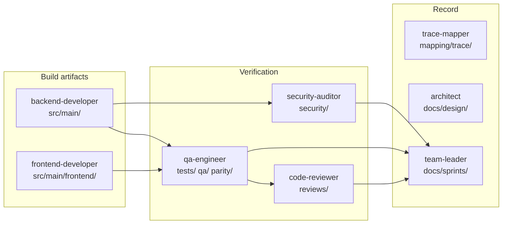

# Project Structure — IRIS BizTalk Portal (implementation skeleton)

> **Version**: 1.0
> **Date**: 2026-08-14
> **Skill**: `04-implement` step [A] — skeleton generation (once, at first sprint entry)
> **Basis**: [DEV-PLAN-LOGIN.md](DEV-PLAN-LOGIN.md) §3, [architecture-overview-LOGIN.md](architecture-overview-LOGIN.md) §5, [DEV-PLAN.md](DEV-PLAN.md) §3
> **Status**: **PROPOSED — awaiting PM approval before creation**

---

## 1. Purpose

This document fixes the directory layout, build topology and per-agent write ownership **before any code is written**. It is created once and governs every subsequent sprint and module.

Two properties it has to satisfy simultaneously:

1. **Agent write isolation** — each agent may only modify its own `write_dirs`, so parallel work cannot collide (harness §3)
2. **Build-tool convention** — Maven and npm expect specific locations, and fighting them costs more than it saves

Where those two conflict, §5 records the conflict and the decision rather than silently picking one.

## 2. Proposed tree

Login module (`auth`) is what Sprint L1/L2 build. `biztalk` and `common` are shown because the layout must accommodate them without rework.

```
harness-clone-v5/
├─ pom.xml                                    Maven root — Java 17, Spring Boot 3.x
│
├─ src/main/                                              ← backend-developer
│  ├─ java/com/webcash/iris/
│  │  ├─ IrisPortalApplication.java
│  │  │
│  │  ├─ auth/                                ← THIS MODULE (Sprint L1/L2)
│  │  │  ├─ api/           AuthenticationController · OtpController
│  │  │  │                 PasswordController · request/response DTOs
│  │  │  ├─ domain/        AuthenticationService · AccountPolicy · PasswordPolicy
│  │  │  ├─ crypto/        PasswordHasher · TotpVerifier · QrRenderer
│  │  │  ├─ session/       SessionRegistry · SessionReaper
│  │  │  ├─ infra/db/      UserMapper · SessionMapper
│  │  │  └─ config/        SecurityConfig · RateLimitConfig · IpAllowlistConfig
│  │  │
│  │  ├─ common/                              ← shared across modules
│  │  │  ├─ audit/         AuditLogAspect · AuditRecord · AuditWriter
│  │  │  ├─ crosscut/      ServiceWindowInterceptor · UsageQuotaInterceptor
│  │  │  └─ tenant/        TenantContext · TenantContextFilter
│  │  │
│  │  └─ biztalk/                             ← LATER (문자내역 slice)
│  │     └─ …               api · domain · infra.db
│  │
│  ├─ resources/
│  │  ├─ application.yml
│  │  ├─ application-local.yml · application-dev.yml
│  │  ├─ mybatis/mapper/auth/UserMapper.xml · SessionMapper.xml
│  │  └─ db/V1__auth_session_audit.sql        new objects only — NOT auto-applied
│  │
│  └─ frontend/                                           ← frontend-developer
│     ├─ package.json · vite.config.ts · tsconfig.json
│     └─ src/
│        ├─ features/auth/  LoginPage · OtpRegisterPage · PasswordChangePage
│        ├─ api/            generated client / fetch wrappers
│        └─ components/     shared UI
│
├─ src/test/java/…                            ← see §5 decision 1
│
├─ tests/                                                 ← qa-engineer
│  ├─ integration/         Testcontainers + @SpringBootTest
│  ├─ security/            the 24 negative-path SEC-L* tests
│  └─ e2e/                 Playwright
│
├─ qa/                     test reports, coverage output   ← qa-engineer
├─ parity/                 spec-parity worksheets          ← qa-engineer
├─ security/               audit findings, gitleaks output  ← security-auditor
│
├─ mapping/
│  ├─ trace/               requirements-trace.csv          ← trace-mapper
│  ├─ port-log/            legacy → new porting log        ← backend-developer
│  └─ architecture/                                        ← architect
│
├─ docs/
│  ├─ planning/ requirements/ design/                      ← existing
│  └─ sprints/             SPRINT-L1-LOG.md · SPRINT-L1-RETRO.md  ← team-leader
│
├─ reviews/                review reports                  ← code-reviewer
│  └─ leader-reports/                                      ← team-leader
│
├─ hooks/
│  └─ pre-commit-gitleaks.sh                               L1 security hook
│
└─ .github/workflows/ci.yml                                build · test · JaCoCo
                                                           gitleaks · dep scan · SBOM
```

## 3. Write ownership

Taken from each agent's `write_dirs` frontmatter, which the harness declares authoritative over its own example table (§3).

| Agent | `write_dirs` | Touches in this sprint |
|-------|--------------|------------------------|
| `backend-developer` | `src/main/`, `mapping/port-log/` | auth module, common, resources |
| `frontend-developer` | `src/main/frontend/`, `web/` | login screens |
| `qa-engineer` | `qa/`, `parity/`, `tests/` | integration, security, E2E suites |
| `security-auditor` | `security/` | audit findings, scan configuration |
| `code-reviewer` | `reviews/` | review reports |
| `trace-mapper` | `docs/requirements/`, `mapping/trace/` | requirements trace |
| `architect` | `mapping/architecture/`, `docs/design/` | ADRs, this document |
| `team-leader` | `docs/sprints/`, `reviews/leader-reports/` | sprint log, retro |



**On the nesting of `src/main/frontend/` inside `src/main/`** — this looks like an ownership overlap but is not one. The harness explicitly permits nested ownership (§3, HARNESS-PROCESS-STANDARD §4.4): a conflict exists only when two agents modify the *same file*. `backend-developer` never edits under `frontend/`, and `frontend-developer` never edits outside it.

## 4. Build topology

| Concern | Choice | Reason |
|---------|--------|--------|
| Backend build | **Single Maven module** at repo root | 1–2 developers; a multi-module reactor adds ceremony without separation benefit at this size |
| Frontend build | **npm/Vite** under `src/main/frontend/` | Matches `frontend-developer`'s `write_dirs` exactly; keeps the SPA a separate deployable per ADR-001 |
| Frontend ↔ backend | REST over a dev proxy | ADR-001 — separate artifacts, one reverse proxy in production |
| Database | Existing `BIZTALK_DB` (PostgreSQL) | CONST-DATA-01 — schema reused, not migrated |
| Messaging | **None** | <10k msg/day needs no broker (ADR-001) |

## 5. Structural decisions requiring PM approval

### Decision 1 — where unit tests live *(genuine conflict)*

`backend-developer`'s `write_dirs` is `src/main/` only. But skill §1[C] requires agents to write **"코드 + 단위 테스트 동시 작성"**, and Maven puts unit tests in `src/test/java`, which **no agent currently owns**.

| Option | Consequence |
|--------|-------------|
| **A — add `src/test/` to `backend-developer`'s `write_dirs`** *(recommended)* | Unit tests sit beside the code they test, per Maven convention and §1[C]. `qa-engineer` retains `tests/` for integration, security and E2E. Costs a one-line frontmatter edit, recorded as an ADR |
| B — point Maven's `testSourceDirectory` at `tests/java/` | Preserves write isolation untouched, but `backend-developer` then cannot write a unit test at all. Every unit test would have to be requested from `qa-engineer`, which contradicts §1[C] and §5 and slows the self-correction loop in §1[D] |

Recommending **A**: option B keeps the letter of the isolation rule while breaking the rule that code and its tests are written together — and the isolation rule exists to prevent collisions, which co-located unit tests do not cause.

### Decision 2 — DDL for new database objects

`CONST-DATA-01` forbids schema change, but this module genuinely requires new objects:

| Object | Why | Requirement |
|--------|-----|-------------|
| Session registry table | Cross-instance concurrent-session control | ADR-LOGIN-012, FR-LOGIN-016/017 |
| Audit store | Replaces the Jex `mntLogYn` runtime behaviour, 5-year retention | ADR-006, NFR-OPS-AUDIT-L01 |
| `PWD` / `OTP_KEY` column format | Argon2id hashes and encrypted secrets do not fit the existing formats | CONST-DATA-L01 |

Proposal: scripts live in `src/main/resources/db/` and are **never auto-applied**. The database is shared with the running legacy, so every change needs DBA review and a rollback script. Confirm this handling.

### Decision 3 — outstanding gates

| Item | State | Effect on this sprint |
|------|-------|-----------------------|
| G1 (login spec) | **PENDING** | Design rests on a DRAFT specification (RISK-L12) |
| G2 (login design) | **PENDING** | — |
| **ADR-LOGIN-011** | **UNDECIDED** | **Blocks T-L1-03 / T-L1-04** (legacy hash verification, upgrade-on-login). All other Sprint L1 tasks proceed |
| AMB-L03 | Open | `IpAllowlistConfig` assumes operators-only |

## 6. Skeleton file inventory

Created in step [A]; ~20 files, no business logic.

| # | File | Purpose |
|---|------|---------|
| 1 | `pom.xml` | Java 17, Spring Boot 3.x, MyBatis, Spring Security, Argon2, TOTP library, JaCoCo, ArchUnit |
| 2 | `IrisPortalApplication.java` | Application entry point |
| 3 | `src/main/resources/application.yml` | Base configuration — **no secrets** (ADR-007) |
| 4–5 | `application-local.yml`, `application-dev.yml` | Profile overrides |
| 6 | `db/V1__auth_session_audit.sql` | New objects, review-gated (§5 decision 2) |
| 7–8 | `mybatis/mapper/auth/{User,Session}Mapper.xml` | Empty mapper shells |
| 9 | `src/main/frontend/package.json` | Vite + React + TypeScript |
| 10–11 | `vite.config.ts`, `tsconfig.json` | Frontend build, dev proxy to the API |
| 12 | `.github/workflows/ci.yml` | build · unit · integration · JaCoCo · gitleaks · dependency scan · SBOM |
| 13 | `hooks/pre-commit-gitleaks.sh` | L1 secret scan — directly targets defect L1 |
| 14 | `.gitignore` additions | `target/`, `node_modules/`, `dist/`, local profiles |
| 15 | `README-BUILD.md` | How to build and run |
| 16–20 | `.gitkeep` in `tests/{integration,security,e2e}`, `qa/`, `parity/`, `security/`, `mapping/{trace,port-log,architecture}`, `docs/sprints/`, `reviews/leader-reports/` | Ownership boundaries exist from day one |

## 7. What the skeleton deliberately does not include

- **No business logic** — step [A] produces structure only; implementation is step [C]
- **No credential code** — blocked on ADR-LOGIN-011 (§5 decision 3)
- **No `biztalk` package** — the directory is reserved in this document but not created until that module's sprint, to avoid empty packages implying work in progress
- **No secrets or connection strings** — externalised per ADR-007; `application.yml` carries placeholders only

## 8. Verification of the skeleton

| Check | Method |
|-------|--------|
| Build succeeds with no source | `mvn clean verify` |
| Frontend builds | `npm ci && npm run build` |
| CI pipeline green on an empty project | Push to a branch |
| gitleaks hook fires | Commit a dummy secret, confirm rejection |
| No write-scope violation | Every created file maps to exactly one agent's `write_dirs` |

---

## Change history

| Date | Version | Change | Author |
|------|---------|--------|--------|
| 2026-08-14 | 1.0 | Initial proposal — awaiting approval before creation | `architect` |

---

**Approval**

| Date | Approver | Comment | Status |
|------|----------|---------|--------|
| 2026-08-14 | PM | Decisions 1–3 in §5 require a ruling | PENDING |
