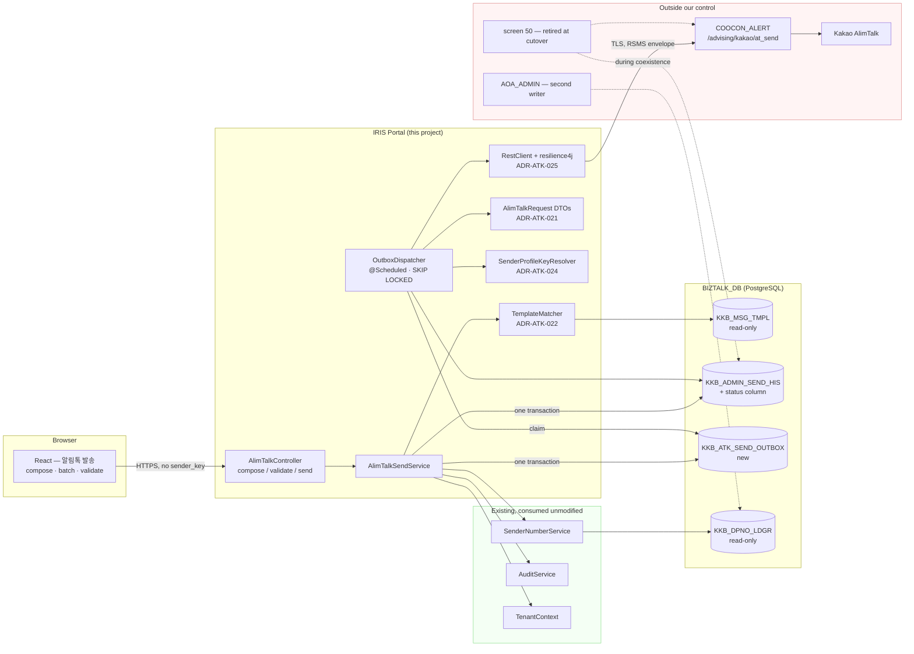
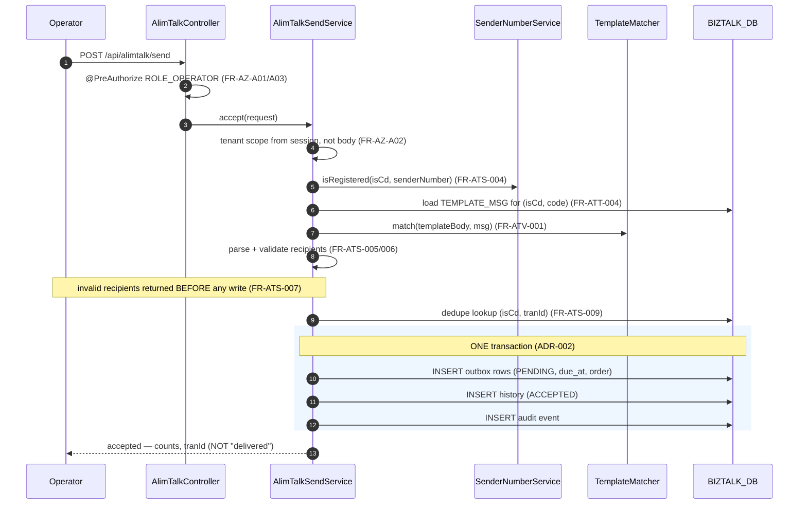
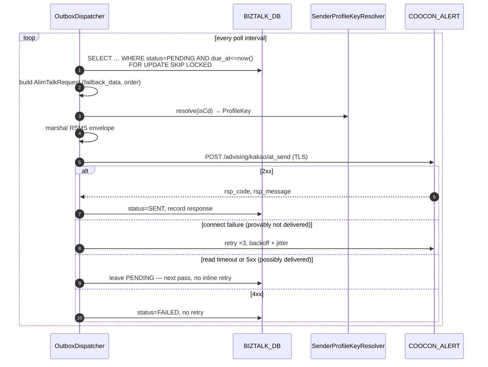

# Architecture Overview — 카카오 알림톡 (AlimTalk Compose · Send · Template Validation)

> **Version**: 1.0
> **Date**: 2026-08-18
> **Slice**: legacy screens **61** (composer/validator) and **50** (send path)
> **Requirements**: [REQUIREMENTS-SPEC-ALIMTALK.md](../requirements/REQUIREMENTS-SPEC-ALIMTALK.md)
> **ADRs**: [ADR-ATK-021](adr/ADR-ATK-021-outbound-contract-conformance.md) · [022](adr/ADR-ATK-022-template-matching.md) · [023](adr/ADR-ATK-023-send-consistency-outbox.md) · [024](adr/ADR-ATK-024-vendor-credential-management.md) · [025](adr/ADR-ATK-025-http-client-resilience.md) · [026](adr/ADR-ATK-026-tran-id-idempotency.md)

---

## 1. Scope

One React screen (compose · batch · validate) over a new `alimtalk` service package, plus **the programme's first outbound integration** and its first asynchronous dispatcher. Thirty-five defects in scope, all fixed. Screen 50's send path is replaced and retired at cutover (PM ruling on CONFLICT-A01).

**What makes this slice architecturally different from the previous four.** Those slices read and wrote tables inside a boundary we control. This one crosses a boundary we do not: a vendor REST endpoint, reached through a contract we did not write, whose acceptance of a request cannot be undone. Every significant decision in this design follows from that single fact — the contract test (ADR-ATK-021), the outbox (ADR-ATK-023) and the conservative retry split (ADR-ATK-025) are three faces of it.

## 2. The boundary picture



Three things this diagram is drawn to make visible:

**The credential never enters the browser.** `SenderProfileKeyResolver` sits on the dispatcher side of the boundary, not the API side. The inbound DTO has no field for it (ADR-ATK-024), so it cannot be supplied from outside even by a malicious client.

**The vendor call happens in the dispatcher, not the request thread.** The operator's request ends at a database commit. This is what makes NFR-OPS-A02 structurally true and what makes reservation (FR-ATS-012) a property of `due_at` rather than a special case.

**Two writers touch `KKB_ADMIN_SEND_HIS` during coexistence.** Screen 50 keeps writing until cutover, which is why `tran_id` uniqueness is a database constraint rather than an application check (ADR-ATK-026).

## 3. Component structure

Package layout follows the established `api` / `domain` / `infra.db` split under `com.webcash.iris.biztalk`, with a new `alimtalk` sub-package. Cross-cutting concerns are consumed from `common.tenant` and `common.audit` **without modification**, as in the previous three slices.

```
com.webcash.iris.biztalk.alimtalk
├── api
│   ├── AlimTalkController              compose / validate / send / batch endpoints
│   ├── AlimTalkComposeRequest          inbound DTO — deliberately has NO sender_key
│   ├── AlimTalkSendResponse            accepted | duplicate | rejected + counts
│   └── TemplateValidateRequest         manual 검증 tab (FR-ATV-007)
├── domain
│   ├── AlimTalkSendService             accept path: validate → dedupe → outbox + history
│   ├── AlimTalkRequest / BatchRequest  OUTBOUND DTOs, contract-checked (ADR-ATK-021)
│   ├── FailbackData                    named for the contract, not for the legacy field
│   ├── AlimTalkLimits                  min(contract, Kakao) constants, one place
│   ├── TemplateMatcher                 regex compilation (ADR-ATK-022)
│   ├── TemplateBody                    cached compiled pattern
│   ├── TranIdGenerator                 env + yyMMdd + base-36 sequence (ADR-ATK-026)
│   ├── ProfileKey / RecipientNumber    redacting wrappers (ADR-ATK-024)
│   ├── RecipientParser                 delimiters, anchored pattern, dedupe
│   ├── FailbackPolicy                  decoded byte length → SMS/LMS/MMS
│   └── OutboxEntry / SendStatus        PENDING · SENT · FAILED · DEAD
├── infra
│   ├── db
│   │   ├── TemplateMapper              KKB_MSG_TMPL — read-only
│   │   ├── SendHistoryMapper           KKB_ADMIN_SEND_HIS
│   │   └── OutboxMapper                claim via FOR UPDATE SKIP LOCKED
│   ├── vendor
│   │   ├── CooconAlertClient           RestClient + resilience4j (ADR-ATK-025)
│   │   ├── RsmsEnvelope                marshalling, verified against a capture
│   │   └── SenderProfileKeyResolver    environment-supplied (ADR-ATK-024)
│   └── OutboxDispatcher                @Scheduled poll, one transaction per row
```

**Consumed unmodified:** `SenderNumberService` (FR-ATS-004 caller-ID verification — a call, not a build), `AuditService.record()`, `TenantContext`, `SecurityConfig`.

**Why two request DTOs.** `AlimTalkComposeRequest` (inbound) and `AlimTalkRequest` (outbound) are separate types with a deliberate mapping between them. Collapsing them into one — the obvious economy — would make `sender_key` a field a client could populate and would let the vendor contract's field names leak into the public API, so that a contract change becomes a breaking API change. The separation is the seam at which ADR-ATK-021's conformance test and ADR-ATK-024's credential rule both operate.

## 4. Request flows

### 4.1 Accept a send (UC-ATK-002, steps 1–16)



The ordering is the fix. Every rejection path — authorization, caller ID, template, recipients, duplicate — sits **before** the first write. The legacy performed its recipient check after both the history insert and the vendor call (D-A26); here there is no code path in which that is expressible.

### 4.2 Dispatch (the flow that did not previously exist)



The `alt` block is ADR-ATK-025's substance: a connect failure proves the request never arrived and is safe to retry immediately; a read timeout does not, and is deferred. Treating those two identically is the default in most resilience configurations and would be the source of duplicate customer notifications here.

### 4.3 Validate a template (UC-ATK-004)

`TEMPLATE_MSG` is loaded from `KKB_MSG_TMPL` by `(IS_CD, TEMPLATE_CODE)`, compiled once and cached, then matched. The manual 검증 tab reaches the **same** `TemplateMatcher` through a validate-only endpoint with an operator-supplied body, so a manual verdict and an automatic verdict cannot disagree (FR-ATV-007).

## 5. Data model changes

| Object | Change | Basis |
|--------|--------|-------|
| `KKB_ATK_SEND_OUTBOX` | **New table** — `is_cd`, `tran_id`, `order`, `payload`, `status`, `due_at`, `attempts`, `rsp_code`, `rsp_message`, timestamps | ADR-ATK-023 |
| `KKB_ADMIN_SEND_HIS` | **New status column** + response fields, so dedupe can return the original outcome | ADR-ATK-023, ADR-ATK-026 |
| index | `(is_cd, status, due_at)` on the outbox for the claim query | ADR-ATK-023 |
| sequence | Per `(is_cd, date)` for `tran_id` | ADR-ATK-026 |
| `KKB_MSG_TMPL` | **None** — read-only | CONST-DATA-A03 |
| `KKB_DPNO_LDGR` | **None** — read-only, via `SenderNumberService` | FR-ATS-004 |

All DDL is additive. **One qualification G2 should note:** the new column sits on `KKB_ADMIN_SEND_HIS`, a **shared** table, whereas ADR-SND-017 needed only a new one. Legacy readers select named columns and are unaffected, but the precedent is marginally wider than the one G1 was previously asked to set — RISK-A06.

## 6. What this slice deliberately does not build

- **Template registration, editing, approval or versioning.** `KKB_MSG_TMPL` is read-only; how templates arrive in it is AMB-A07.
- **친구톡 (FT).** `msg_type` is not a contract field (D-A2) and no FT interface appears in the analysed artifacts.
- **이미지형 and 아이템리스트형** — pending the vendor field definitions. The A1-01 spike decides; the contract test will reject them until the contract is extended (AMB-A05, RISK-A01).
- **A message broker.** The outbox table is a deliberate stepping stone; the dispatcher's source is an interface so a broker can replace it without touching the accept path (ADR-ATK-023 option E).
- **A managed secret store.** `SenderProfileKeyResolver` is shaped like its future Vault-backed implementation (ADR-ATK-024 option D).
- **Delivery-receipt ingestion.** Nothing in the analysed artifacts covers the callback the proposal mentions (§77). Out of scope, and it is the natural successor slice.
