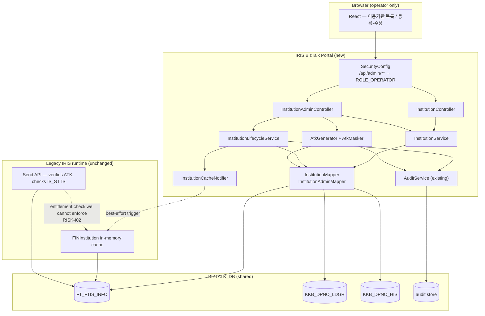

# Architecture Overview — 이용기관관리 (Client Institution Management)

> **Version**: 1.0
> **Date**: 2026-08-14
> **Predecessor**: [REQUIREMENTS-SPEC-INSTITUTION.md](../requirements/REQUIREMENTS-SPEC-INSTITUTION.md)
> **Companions**: [architecture-overview.md](architecture-overview.md) (문자내역), [architecture-overview-LOGIN.md](architecture-overview-LOGIN.md)
> **Status**: DRAFT — awaiting G2

---

## 1. Position in the system

This slice is the **tenant registry**. It issues the `IS_CD` every other slice filters on and the `ATK` client companies authenticate with. It is small in surface — two screens, eight legacy services — and disproportionate in consequence.

It is also the first slice that **writes control data a second running system depends on**. That shapes almost every decision here; see [ADR-INST-016](adr/ADR-INST-016-legacy-coexistence.md).



## 2. Components

| Component | Responsibility | Requirements |
|-----------|----------------|--------------|
| `SecurityConfig` | Existing. `/api/admin/**` already requires `ROLE_OPERATOR` — the foundation this slice needs is in place | FR-AZ-I01/I02 |
| `InstitutionController` | **Exists** — the read-only list used by 문자내역's dropdown. Extended here, and **corrected**: it currently queries a table name that does not exist (§5) | FR-TEN-004 |
| `InstitutionAdminController` | New. Create, update, disable, enable, delete, duplicate-check, key generate/rotate/reveal | FR-INSTC-\*, FR-INSTL-\*, FR-ATK-\* |
| `InstitutionService` | Search, paging, escaping, masking. Read side | FR-INST-001…009 |
| `InstitutionLifecycleService` | State transitions and delete cascade, transactional | FR-INSTL-001…009 |
| `AtkGenerator` / `AtkMasker` | `SecureRandom` 160-bit generation; last-4 masking | FR-ATK-001/002 |
| `InstitutionCacheNotifier` | Best-effort legacy cache refresh with **surfaced** failure | FR-INSTC-008, NFR-OPS-I02 |
| `AuditService` | **Exists**, from the 로그인 slice. Reused unchanged for institution events | FR-AZ-I04, NFR-OPS-AUDIT-I01 |
| `InstitutionMapper` / `InstitutionAdminMapper` | MyBatis. Ported SQL in XML with `-- FIX D-In:` annotations per the established convention | CONST-DATA-I04 |

## 3. Domain model

```java
record Institution(
    String code,           // FINTECH_ISCD — immutable after creation
    String name,           // ISNM
    String englishName,    // ISENGNM
    String businessNumber, // BRNO
    String authKeyMasked,  // ATK, never the full value on a list path
    InstitutionStatus status,
    String description,    // CMOP
    Instant registeredAt,  // RGDT
    Instant lastModifiedAt // LAST_AMDT
)

enum InstitutionStatus { ACTIVE('Y'), SUSPENDED('N'), DELETED('D') }
```

`InstitutionStatus` is the **only** write path to `IS_STTS`, so `'D'` can never be introduced by an ad-hoc string (ADR-INST-014 §3.1).

### 3.1 Legacy column mapping

The legacy IDO maps `SELECT` columns to output fields **positionally**, bridging a naming gap that no code states explicitly. Ported mappers map by name (CONST-DATA-I04).

| Table column | Domain / API field |
|--------------|--------------------|
| `FINTECH_ISCD` | `code` (`IS_CD` in the legacy contract) |
| `ISNM` | `name` (`IS_NM`) |
| `ISENGNM` | `englishName` (`IS_ENGNM`) |
| `IS_STTS` | `status` (`USE_YN`) |
| `BRNO`, `ATK`, `CMOP`, `RGDT`, `LAST_AMDT` | unchanged |

> `FT_FTIS_INFO` has 40+ columns. This slice writes 11 and leaves the rest untouched even on update (ADR-INST-016 rule 4) — a naive full-column `INSERT` would null out 30 columns of operational configuration.

## 4. API surface

| Method | Path | Role | Requirement |
|--------|------|------|-------------|
| `GET` | `/api/admin/institutions` | OPERATOR | FR-TEN-004 — existing, list for dropdowns |
| `GET` | `/api/admin/institutions/search` | OPERATOR | FR-INST-001…006 — paged search |
| `GET` | `/api/admin/institutions/{code}` | OPERATOR | FR-INSTC-001 — detail for the edit form |
| `GET` | `/api/admin/institutions/availability?code=` | OPERATOR | FR-INSTC-005 — **boolean only** |
| `POST` | `/api/admin/institutions` | OPERATOR | FR-INSTC-004 — create, rejects duplicates |
| `PUT` | `/api/admin/institutions/{code}` | OPERATOR | FR-INSTC-004 — update, never creates |
| `POST` | `/api/admin/institutions/{code}/status` | OPERATOR | FR-INSTL-001/002 |
| `DELETE` | `/api/admin/institutions/{code}` | OPERATOR | FR-INSTL-004 — logical |
| `POST` | `/api/admin/institutions/keys` | OPERATOR | FR-ATK-001 — generate for a new institution |
| `POST` | `/api/admin/institutions/{code}/key/rotate` | OPERATOR | FR-ATK-005 |
| `GET` | `/api/admin/institutions/{code}/key` | OPERATOR + audit | FR-ATK-003 — reveal |

**Create and update are separate verbs.** The legacy exposed one upsert endpoint, which is the root of D-I6: a create call with an existing code silently overwrote that institution and its credential. Splitting them makes the defect unrepresentable rather than merely guarded against.

## 5. Correction to already-delivered code

`InstitutionMapper` (delivered in the 문자내역 slice) queries:

```sql
SELECT IS_CD AS code, IS_NM AS name FROM BIZTALK_INSTITUTION WHERE USE_YN = 'Y'
```

Its own Javadoc records the uncertainty honestly — *"컬럼명은 화면 00 의 JS 에서 확인했으나 테이블명은 미확인이다 — DBA 확인 필요"*. The Skill 2 analysis of screen 00 resolves it:

| Guessed | Actual |
|---------|--------|
| `BIZTALK_INSTITUTION` | `FT_FTIS_INFO` |
| `IS_CD` | `FINTECH_ISCD` |
| `IS_NM` | `ISNM` |
| `USE_YN` | `IS_STTS` |

**Every identifier in that query is wrong.** It would fail at runtime against the real database, so the 문자내역 institution dropdown does not currently work outside tests. Correcting it is task **T-I1-01**, scheduled first because the read path builds on it.

The generalisable point: the mapper was written from a JS file that used the *contract's* field names, not the table's. The legacy IDO's positional mapping hides that gap, and it is invisible unless the IDO SQL is read. Any other mapper written from JS alone deserves the same check.

## 6. Cross-cutting

| Concern | Approach | Requirement |
|---------|----------|-------------|
| Authorization | `/api/admin/**` routing rule **plus** controller `@PreAuthorize` — defence in depth, per the existing `InstitutionController` pattern | FR-AZ-I01/I02 |
| Audit | Existing `AuditService`; new actions `institution.create/update/disable/enable/delete/key.rotate/key.reveal` | FR-AZ-I04 |
| Transactions | `@Transactional` at the service boundary; delete cascade is one unit (ADR-002) | FR-INSTL-006 |
| Validation | Bean Validation on the request record **and** service-level rules — never client-only | FR-INSTC-003 |
| Output escaping | React escapes by default; no `dangerouslySetInnerHTML`, no handler built by concatenation | FR-INST-007 |
| SQL | Named binds throughout; `LIKE` operands escaped for `%`/`_` | FR-INST-005, NFR-SEC-INJ-I01 |
| Paging | `LIMIT`/`OFFSET` plus a `COUNT(*)`, returning the existing `PagedResult` | FR-INST-003 |

## 7. What is deliberately not built

| Item | Reason |
|------|--------|
| 담당자관리 (manager add/delete) | Unfinished legacy stub with no write path; excluded per AMB-I02 |
| `biztalk_admin_00_l002` / `_l003` endpoints | Not ported. `_l002` currently returns the full manager roster to any authenticated caller |
| `KKB_FT_FTIS_INFO_D001` physical delete | Superseded by ADR-INST-014, not translated |
| Client-side key generation | Deleted; replaced by a server call |
| Institution list export | No legacy equivalent; consistent with AMB-07 |
