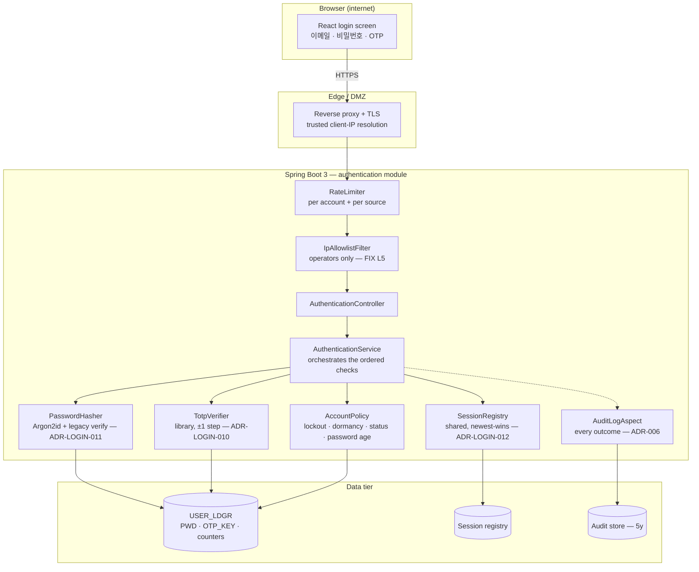
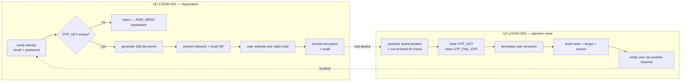
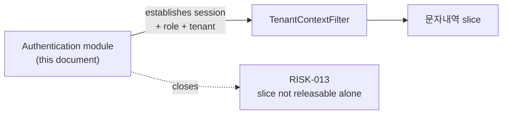

# Architecture Overview — 로그인 (Authentication module)

> **Version**: 1.0
> **Date**: 2026-08-14
> **Scope**: login, OTP registration, operator OTP reset, password change
> **Requirements**: [REQUIREMENTS-SPEC-LOGIN.md](../requirements/REQUIREMENTS-SPEC-LOGIN.md)
> **ADRs**: ADR-001 (stack, inherited), ADR-LOGIN-010 (TOTP), ADR-LOGIN-011 (credential migration), ADR-LOGIN-012 (session)
> **Status**: **APPROVED (G2)** — 2026-08-21, PM (ADR-LOGIN-011 안 선택은 미결 이월 / its option choice remains open)

---

## 1. Guiding principle

The legacy login is not missing controls — it **has** them, disabled. Password strength checking, IP allowlisting and OTP clock tolerance are all present as code, commented out or neutered, while their call sites still look correct.

The architecture therefore places every authentication control on an **explicit, individually testable path**, and the test plan asserts that each one *actually rejects something*. A control that cannot be shown to deny a request is treated as absent.

## 2. Component structure



### 2.1 Legacy control → new component

| Legacy | State in legacy | Replacement | Requirement |
|--------|-----------------|-------------|-------------|
| `kisalib.Cracklib` strength check | **Commented out** — returns `""` for every password | `PasswordPolicy` with real validation | FR-PWD-003 |
| `A_USER_IP_AUTHED_R001` + redirect | **Redirect commented out** — result discarded | `IpAllowlistFilter` that actually denies | FR-LOGIN-024 |
| `GoogleOTP` `window = 0` | Skew tolerance disabled | `TotpVerifier` at ±1 step (ADR-LOGIN-010) | FR-LOGIN-011 |
| `getQRBarcodeURL()` | Secret over plain HTTP to Google | Local QR generation only | FR-OTP-004 |
| `getClientIpAddress()` | Trusts arbitrary request headers | Trusted resolution at the proxy boundary | FR-LOGIN-019 |
| SHA-256 unsalted | Active | Argon2id + upgrade-on-login (ADR-LOGIN-011) | FR-LOGIN-005 |
| `request.getSession()` | No id regeneration | Regenerate at login (ADR-LOGIN-012) | NFR-SEC-SESSION-L01 |
| Hardcoded notification recipients | Three phone numbers in source | Configuration | FR-LOGIN-021 |
| `PTL_RSPR_INFM_R001` | Executed, result unused | Removed | L10 |

## 3. Authentication sequence (UC-LOGIN-001)

**Check order is a security property, not an implementation detail.** Lockout is evaluated before any credential is verified, so a locked account cannot be used as a password oracle; and the generic-failure response is produced by a single code path so that "no such account" and "wrong password" cannot diverge in content or timing.

```mermaid
sequenceDiagram
  participant U as User
  participant P as Proxy
  participant F as RateLimiter → IpAllowlist
  participant S as AuthenticationService
  participant DB as USER_LDGR
  participant R as SessionRegistry
  participant A as Audit

  U->>P: 이메일 + 비밀번호 + OTP (TLS)
  P->>F: request + trusted client IP
  F->>F: rate limit; allowlist (operators)
  F->>S: credentials
  S->>DB: lookup by email
  Note over S: not found → generic failure (same path as wrong password)
  S->>S: 1. lockout? (LOGIN_ATTEMPT / OTP_FAIL_CNT ≥ 5)
  S->>S: 2. password — Argon2id, else legacy verify + upgrade
  S->>S: 3. OTP — TOTP ±1 step
  S->>DB: reset counters on success
  S->>S: 4. dormancy (90d) → 5. JNNG_STTS → 6. password age
  S->>R: terminate existing session, register new
  S->>A: audit outcome (success / failure / lockout)
  S-->>U: session cookie (HttpOnly, Secure, SameSite), role
```

### 3.1 Where the flow exits early

| Exit | Condition | Response |
|------|-----------|----------|
| Rate limit | Too many attempts | Throttled |
| Allowlist | Non-allowlisted operator source | Denied |
| Generic failure | Unknown account **or** wrong password | Identical response |
| Lockout | Either counter ≥ 5 | Locked — before credential verification |
| OTP unregistered | `OTP_KEY` empty | Redirect to UC-LOGIN-002 |
| Dormant | No login ≥ 90 days | Reactivation required |
| Status | `JNNG_STTS` ∈ {0,2,8,9} | Status-specific message |
| Password age | ≥ 90 days or `PWD_INIT_YN='N'` | Forced change, session not established |

## 4. OTP registration and reset



**The secret is persisted only after a code verifies.** An abandoned registration leaves no key, so a user cannot be locked out by a secret they never captured — and the operator reset path is the only loop back in.

## 5. Package structure

```
com.webcash.iris.auth
├─ api          AuthenticationController, OtpController, PasswordController, DTOs
├─ domain       AuthenticationService, AccountPolicy, PasswordPolicy
├─ crypto       PasswordHasher (Argon2id + legacy verify), TotpVerifier, QrRenderer
├─ session      SessionRegistry, session reaper
├─ infra.db     UserMapper, SessionMapper (MyBatis)
└─ config       Spring Security, rate limiting, IP allowlist configuration
```

Shares the cross-cutting block from the 문자내역 slice (`AuthenticationFilter`, `TenantContextFilter`, `AuditLogAspect`) — this module **supplies** what that filter consumes.

## 6. Relationship to the 문자내역 slice



Sprint 1 of the 문자내역 plan builds a *minimal* credential store as scaffolding (tasks T1-07…T1-11). **That scaffolding is superseded by this module** — it should not be hardened or extended, and the two must not both own credential verification. If this module lands before 문자내역 Sprint 1, build it here instead and delete the scaffolding tasks.

## 7. Traceability

| Component | Requirements |
|-----------|--------------|
| `RateLimiter` | FR-LOGIN-025 |
| `IpAllowlistFilter` | FR-LOGIN-024 *(scope pending AMB-L03)* |
| `AuthenticationService` | FR-LOGIN-001…004, 008…020 |
| `PasswordHasher` | FR-LOGIN-005, FR-PWD-002/005, ADR-LOGIN-011 |
| `PasswordPolicy` | FR-PWD-003/004 |
| `TotpVerifier` | FR-LOGIN-009/011, NFR-SEC-AUTH-L03 |
| `QrRenderer` | FR-OTP-003/004 |
| `AccountPolicy` | FR-LOGIN-003/010/012/013/014/015 |
| `SessionRegistry` | FR-LOGIN-016/017/023, NFR-SEC-SESSION-L01/L02 |
| `AuditLogAspect` | FR-OTP-008, NFR-OPS-AUDIT-L01/L02 |
| React login screen | FR-LOGIN-001/022, NFR-USE-L01/L02 |
