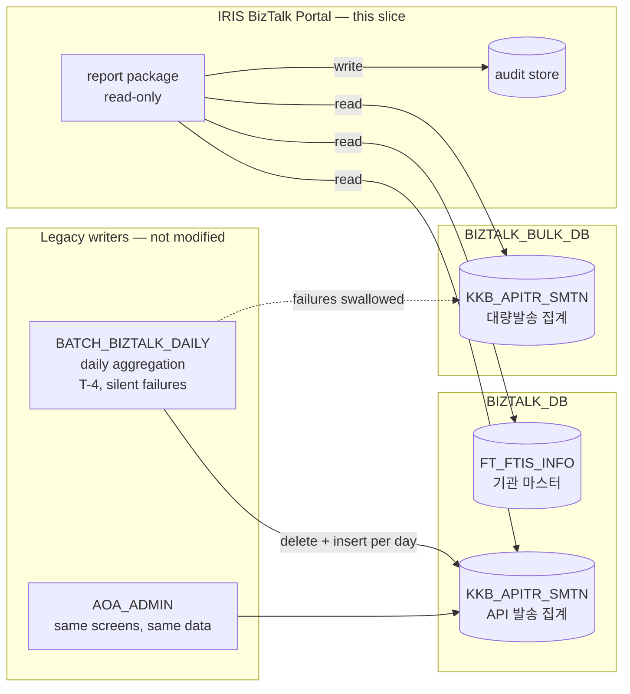
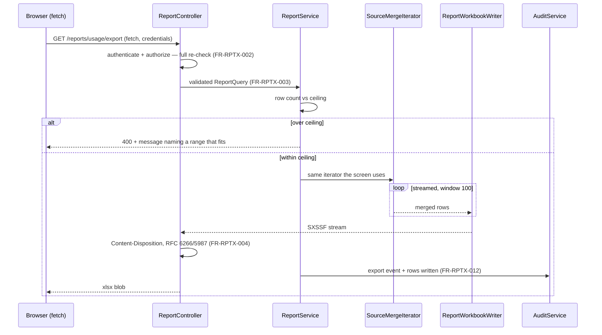

# Architecture Overview — 이용기관 보고서 (Institution Usage Report)

> **Version**: 1.0
> **Date**: 2026-08-18
> **Predecessor**: [REQUIREMENTS-SPEC-REPORT.md](../requirements/REQUIREMENTS-SPEC-REPORT.md)
> **Siblings**: [architecture-overview.md](architecture-overview.md), [-LOGIN](architecture-overview-LOGIN.md), [-INSTITUTION](architecture-overview-INSTITUTION.md), [-SENDERNO](architecture-overview-SENDERNO.md)
> **ADRs**: [ADR-RPT-021](adr/ADR-RPT-021-cross-source-aggregation.md), [ADR-RPT-022](adr/ADR-RPT-022-aggregation-freshness.md), [ADR-RPT-023](adr/ADR-RPT-023-export-generation.md)

---

## 1. Scope

One legacy screen (20 이용기관 보고서) and its Excel export become one React screen over one read-only service package. Twenty-five in-slice defects are fixed; two upstream batch defects (D-R26, D-R27) are out of scope by PM ruling and are made *visible* rather than repaired (ADR-RPT-022).

This is the programme's first **read-only** slice and its first **two-datasource** slice. Both properties shape everything below.

## 2. The two-database picture



Three facts drive the design.

**There is no institution master in the bulk database.** Every bulk-targeted IDO touches only `KKB_APITR_SMTN`; none references `FT_FTIS_INFO`. The legacy worked around this by selecting `'' AS IS_NM` and patching names in Java from a `BIZTALK_DB` query — which is the strongest available evidence that the two aliases are two physical databases (ADR-RPT-021, AMB-R04).

**This slice writes nothing to either aggregate.** CONST-DATA-R01. The only write is the audit event. That removes transaction coordination entirely: two datasources, two `SqlSessionFactory` beans, no XA, ADR-002's boundaries untouched.

**We are not the only reader or writer.** `AOA_ADMIN` carries the same screens against the same data and keeps all 25 defects reachable after we ship (RISK-R05); `BATCH_BIZTALK_DAILY` remains the sole writer and keeps its two defects (RISK-R02, RISK-R03).

## 3. Component structure

```
com.webcash.iris.biztalk
├── api
│   ├── ReportController          GET /api/admin/reports/usage
│   │                             GET /api/admin/reports/usage/watermark
│   │                             GET …/export                    (Sprint R2)
│   └── ReportResponse            displayed fields only (FR-RPT-016)
├── config
│   └── ReportDataSourceConfig    the second datasource; conditional on configuration
├── domain
│   ├── ReportService             orchestration, scope resolution, audit
│   ├── ReportCriteria            validated value object: period, scope, source, seek, size
│   ├── ReportScope               resolved from session + role (FR-AZ-R03)
│   ├── PeriodPolicy              366-day cap, calendar validation (FR-RPT-002/003/004)
│   ├── SendSource                API | BULK | ALL
│   ├── MessageChannel            the seven channels and their column prefixes
│   ├── AggregateKey              (TRDD, IS_CD) — the sort key, ADR-RPT-021
│   ├── AggregateRow              one row as read from one source
│   ├── ChannelCounters           전체/성공/실패/처리중 + reconciliation (FR-RPT-010)
│   ├── ReportRow                 a merged row, screen and export alike
│   ├── SourceMerger              k-way merge of two sorted streams + order validation
│   ├── ReportPage                keyset page: rows, seek, total, watermark, availability
│   ├── ReportWatermark           max(TRDD) per source (ADR-RPT-022)
│   ├── SourceAvailability        which sources were actually read (FR-RPTS-005)
│   └── InstitutionName           code ↔ name pairing for the D-R12 fix
├── infra.db
│   ├── AggregateMapper           the shared contract both sources implement
│   ├── ApiAggregateMapper        → BIZTALK_DB (@Mapper, primary datasource)
│   └── bulk.BulkAggregateMapper  → BIZTALK_BULK_DB (registered explicitly, no @Mapper)
└── infra.excel                                                     (Sprint R2)
    └── ReportWorkbookWriter      SXSSF, two sheets (ADR-RPT-023)
```

> **Package layout, corrected during Sprint R1.** This section first proposed a nested
> `biztalk.report.{api,domain,infra}` package. The three delivered slices all sit flat under
> `biztalk.{api,domain,infra.db}`, and introducing a fourth convention for one slice would make
> the codebase harder to read than the extra nesting is worth. Classes are prefixed `Report`/
> `Aggregate` instead. The one genuine addition is `biztalk.config`, which exists because the
> second datasource must be declared somewhere and does not belong in `domain`.

Consumed unmodified from earlier slices: `common.tenant.TenantContext`, `common.audit.AuditService`, `common.crosscut.PagedResult`, and the institution list service from the 이용기관관리 slice.

**One new cross-cutting element**: a second datasource and its `SqlSessionFactory`. It is configured in this slice but named generically (`bulkAggregateDataSource`) because it is a property of the deployment, not of the report.

## 4. Request flows

### 4.1 Report query (UC-RPT-001)

```mermaid
sequenceDiagram
    participant U as Browser
    participant C as ReportController
    participant S as ReportService
    participant P as PeriodPolicy
    participant A as ApiAggregateMapper
    participant B as BulkAggregateMapper
    participant W as ReportWatermark
    participant AU as AuditService

    U->>C: GET /reports/usage?from&to&isCd&source&seek
    C->>C: authenticate (FR-AZ-R01)
    C->>S: ReportQueryRequest
    S->>S: resolve scope from session + role (FR-AZ-R03)
    S->>P: validate dates, span ≤ 366d (FR-RPT-002/003/004)
    S->>W: max(TRDD) per source (cached 60s)
    par two sorted streams, same sort key
        S->>A: seek page, ORDER BY TRDD DESC, IS_CD ASC
        S->>B: seek page, ORDER BY TRDD DESC, IS_CD ASC
    end
    S->>S: k-way merge; sum on equal key (FR-RPTS-003)
    S->>S: mark days above watermark as 미집계 (FR-RPT-013)
    S->>AU: read event — actor, scope, range, rows (FR-AZ-R05)
    S-->>U: page + total + watermark + source completeness
```

The merge holds at most `2 × fetchSize` rows. `COALESCE` is applied per source **before** the merge, or a NULL would propagate through the summation and null a merged row — D-R11 re-created one layer up (ADR-RPT-021).

### 4.2 Export (UC-RPT-002) — the flow that could not report its own failure



Two structural changes from the legacy, both required rather than cosmetic:

**`fetch` replaces the hidden-iframe form post.** A form posted to an invisible iframe gives the browser no handle on the response, so a server error is *structurally* invisible — D-R16 cannot be fixed by adding error handling to that pattern (ADR-RPT-023). With `fetch`, an error status becomes a message.

**The export reuses the query's iterator.** Every legacy export defect — the unencoded filename, the environment-dependent sheet set, the undeclared `IS_CD`, the summary sheet missing 실패 and 처리중 — traces to the export being a parallel implementation. One path, two renderers.

## 5. Data model changes

**None.** No DDL, no new table, no new index — CONST-DATA-R02 holds unmodified.

The sort key `(TRDD, IS_CD)` that ADR-RPT-021 depends on is already the aggregate's primary key, so the index the design needs exists. This slice therefore sets **no schema-change precedent** and, unlike the 발신번호 slice, adds no DDL condition to its gate.

## 6. What this slice deliberately does not build

| Not built | Why |
|-----------|-----|
| Asynchronous export with notification (FR-RPTX-010) | PM ruling — no job store exists and a `Should` requirement should not be the first consumer of new infrastructure. Row ceiling stands in ([ADR-RPT-023](adr/ADR-RPT-023-export-generation.md)) |
| Batch repair (D-R26, D-R27) | PM ruling — out of slice. Report degrades honestly instead ([ADR-RPT-022](adr/ADR-RPT-022-aggregation-freshness.md)); repair is OI-R01 |
| A run-status table for an exact watermark | Needs DDL and the batch. Both ruled out. `max(TRDD)` with a documented blind spot instead |
| A consolidated read store | The better answer at scale, but needs DDL and the batch. Recorded in ADR-RPT-021 as the successor if volume outgrows the merge |
| Deep random-access pagination | Keyset pagination gives next/previous plus an exact total, not arbitrary page jumps. The legacy's page widget paged in the browser over an unbounded fetch, so it never worked at scale regardless |
| Any write path to the aggregates | CONST-DATA-R01. Discrepancies are reported, never repaired in place |
