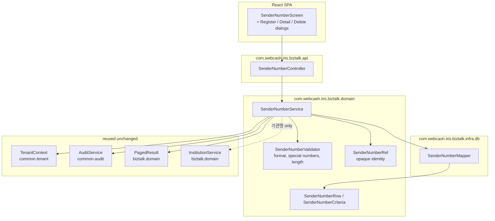
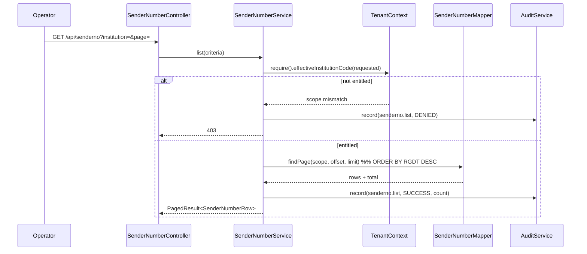
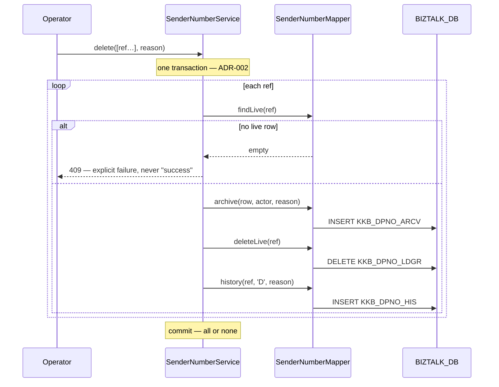

# Architecture Overview — 발신번호 (Sender Number Management)

> **Version**: 1.0
> **Date**: 2026-08-17
> **Predecessor**: [REQUIREMENTS-SPEC-SENDERNO.md](../requirements/REQUIREMENTS-SPEC-SENDERNO.md) — **G1 PENDING**
> **Siblings**: [architecture-overview.md](architecture-overview.md) (문자내역), [architecture-overview-LOGIN.md](architecture-overview-LOGIN.md), [architecture-overview-INSTITUTION.md](architecture-overview-INSTITUTION.md)
> **ADRs**: [ADR-SND-017](adr/ADR-SND-017-senderno-lifecycle.md), [ADR-SND-018](adr/ADR-SND-018-encrypted-number-uniqueness.md), [ADR-SND-019](adr/ADR-SND-019-senderno-read-audit.md)

---

## 1. Scope

Four legacy screens collapse into one React screen with three dialogs, over a single Spring Boot service package. The stack is settled by [ADR-001](adr/ADR-001-tech-stack.md) and not revisited: Java 17 / Spring Boot 3.x / MyBatis / React, PostgreSQL `BIZTALK_DB`.

What is new in this slice is not technology. It is that **this module writes a table two other applications read and write**, and the correctness of the whole slice depends on respecting that.

## 2. The shared-table picture

This is the fact that shapes every decision below.

```mermaid
flowchart LR
  subgraph new["IRIS BizTalk Portal — this project"]
    api["SenderNumberController"] --> svc["SenderNumberService"]
    svc --> map["SenderNumberMapper"]
  end

  subgraph legacy["Legacy applications — not ours"]
    aoa["AOA_ADMIN<br/>same 4 screens<br/>target: BIZTALK_DB"]
    kko["KAKAOTALK send runtime<br/>5 of 6 send paths validate<br/>target: BIZ_DB"]
  end

  subgraph db[("BIZTALK_DB")]
    ldgr[["KKB_DPNO_LDGR<br/>live numbers"]]
    arcv[["KKB_DPNO_ARCV<br/>NEW — deleted rows"]]
    his[["KKB_DPNO_HIS<br/>append-only events"]]
    ftis[["FT_FTIS_INFO<br/>institution master, read-only"]]
  end

  map --> ldgr
  map --> arcv
  map --> his
  map -.read.-> ftis
  aoa --> ldgr
  aoa --> his
  kko -.->|"select dp_no … where decrypt(dp_no)=:n<br/>absent ⇒ send rejected"| ldgr

  style arcv stroke-dasharray: 4 4
  style kko stroke-width:2px
```

Three consequences, each of which drove an ADR:

1. **`KAKAOTALK` treats presence in `KKB_DPNO_LDGR` as authorization to send**, and reads no status column. Deletion must therefore remove the row, not mark it — [ADR-SND-017](adr/ADR-SND-017-senderno-lifecycle.md).
2. **`AOA_ADMIN` writes the same table**, so no application-level rule this project enforces is a global rule. Uniqueness must live in the database — [ADR-SND-018](adr/ADR-SND-018-encrypted-number-uniqueness.md).
3. **`KAKAOTALK` declares `BIZ_DB` where the admin consoles declare `BIZTALK_DB`.** These are datasource aliases; whether they resolve to the same physical database cannot be determined from source. If they do not, the send path is validating against a *replica or a different instance* and every conclusion above needs revisiting. **This is verified before Sprint S2 starts** — RISK-S01.

## 3. Component structure

Follows the established package layout (`api` / `domain` / `infra.db`) and reuses the cross-cutting components delivered by earlier slices without modification.



**Nothing in `shared` is modified.** `TenantContext.effectiveInstitutionCode()` already implements exactly what FR-AZ-D03 requires — an operator may name an institution, a client-company user's requested value is ignored in favour of their own. `AuditService` already writes `REQUIRES_NEW` and already records denials. This slice consumes both as they are; its authorization requirements are new only in that the legacy had none.

**`InstitutionService` is consumed for 기관명 only.** D-S18 exists because the legacy registration popup called the institution *detail* service and pulled 인증키 into the browser. The new dependency is deliberately narrow — FR-SNDC-002 — and the response shape is asserted by TC-S002-12 rather than left to convention.

## 4. Request flows

### 4.1 List (UC-SND-001)



Two things the legacy did not do: the scope is resolved from the session before the query is built (FR-AZ-D03), and the query is ordered and bounded (FR-SND-003/004). The audit write carries a count, never the numbers — [ADR-SND-019](adr/ADR-SND-019-senderno-read-audit.md).

### 4.2 Delete (UC-SND-004) — the flow that was broken



The row is located by `ref` (opaque, [ADR-SND-018](adr/ADR-SND-018-encrypted-number-uniqueness.md)), not by a display string — this is the structural fix for D-S1. The zero-match case is an explicit 409 (FR-SNDD-002); the whole batch is one transaction (FR-SNDD-005); each number gets its own history row built from that iteration's value, not from the request payload (FR-SNDD-004, fixing D-S5).

Once the row leaves `KKB_DPNO_LDGR`, `KAKAOTALK`'s existing check rejects the number with no change on its side.

## 5. Data model changes

| Object | Change | Basis |
|--------|--------|-------|
| `KKB_DPNO_ARCV` | **New table.** Full copy of the ledger columns plus `DEL_DT`, `DEL_ID`, `DEL_NM`, `REASON` | ADR-SND-017 |
| `KKB_DPNO_LDGR` | **Unique index** on the number — form settled by spike S1-01 | ADR-SND-018 |
| `KKB_DPNO_LDGR.DP_NO_IDX` | **Conditional** — added only if the spike shows `ENCRYPT` is non-deterministic | ADR-SND-018 |
| `KKB_DPNO_HIS` | Unchanged. `ACN` gains a third value for description edits (data, not schema) | FR-SNDU-004 |
| `FT_FTIS_INFO` | Read-only | — |

All DDL is additive. `KKB_DPNO_LDGR` is never altered in a way that changes what an existing reader sees — the basis on which CONFLICT-S01 is put to G1.

## 6. What this slice deliberately does not build

| Not built | Why |
|-----------|-----|
| Ownership verification (ARS/SMS OTP) | PM ruling AMB-S01; RESIDUAL-S01. The `COOCON_SMS` integration is not wired |
| 수수료 tab | No contract, no query, no behaviour to port (§2.7 of the spec) |
| Authentication | Inherited from the 로그인 slice unchanged |
| Changes to `KAKAOTALK` or `AOA_ADMIN` | Outside the project boundary. Their coexistence is handled by design and tracked as RISK-S01/S03/S05 |
