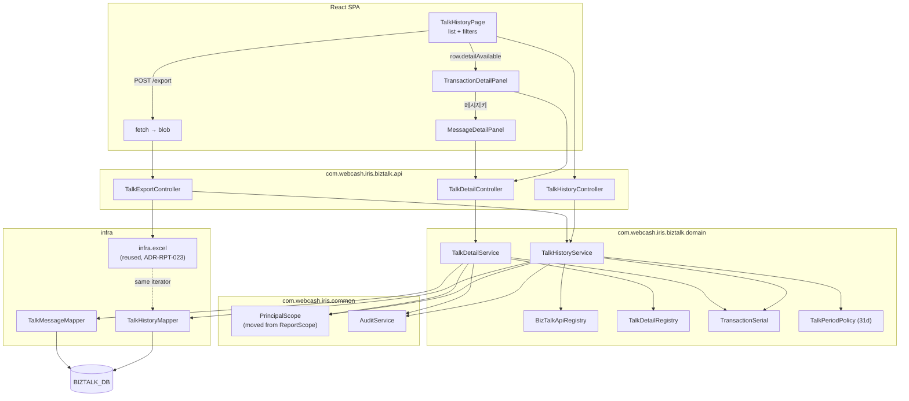

# Architecture Overview — 톡전송 내역 (BizTalk Transaction History)

> **Version**: 1.0
> **Date**: 2026-08-19
> **Predecessor**: [REQUIREMENTS-SPEC-TALK.md](../requirements/REQUIREMENTS-SPEC-TALK.md)
> **Companion**: [DEV-PLAN-TALK.md](DEV-PLAN-TALK.md), [threat-model-TALK.md](threat-model-TALK.md)
> **Programme baseline**: [architecture-overview.md](architecture-overview.md)

---

## 1. Shape of the slice

Three legacy screens become one screen with two drill-down panels, over one read-only service package on one datasource.

## 2. The three properties that carry the design

### 2.1 One decision, several consumers

The slice's dominant defect class is **copy-and-diverge**: eleven of thirty-four defects are one decision implemented in two or three places that then drifted apart. The architecture's answer is uniform — where the legacy had N implementations, there is one component with N consumers.

| Decision | Legacy implementations | Rebuilt |
|----------|----------------------|---------|
| Which transactions are in scope | none (implicitly all) | `BizTalkApiRegistry`, config-held, startup-validated |
| Whether a row has detail | client rule + server branch list, disagreeing | `TalkDetailRegistry` → `detailAvailable` on the row |
| Which channel a message belongs to | the row's own `MSG_TYPE` literal, wrong for 친구톡 | `TalkDetailRegistry`, keyed on the transaction's API service |
| How the transaction number is normalised | three rules, one lossy | `TransactionSerial`, one type, two renderers |
| What the export queries | a different table family entirely | the list's own iterator |
| Who may see what | nothing | `PrincipalScope`, shared with the 보고서 slice |

### 2.2 The projection is the security boundary

`FT_APITR_HSTR` is the shared Open-API transaction log. Its columns include `FIN_ACNO`, `ACNO`, `CANO`, `FIN_CARD`, `TRAM`, `BRNO`, `INTT_DMND_TTNO` and `RSPN_TLGR_CNTN` — account numbers, card numbers, transaction amounts and raw response telegrams for the entire fintech estate, none of which this screen has any business showing.

CONST-SEC-T01 is enforced structurally rather than by review:

- the mapper's `resultMap` is closed and names nine columns;
- `TalkHistoryRow` is a record with nine components;
- a contract test asserts the API response's field set **exactly**, so an added field fails the build rather than shipping;
- `SELECT *` is prohibited in this package by a static check.

The same discipline is why the export cannot widen the disclosure: it consumes `TalkHistoryRow`, not the mapper.

### 2.3 Masking lives in SQL, at the outermost projection

Recipient and sender numbers are stored encrypted and read through the DB functions `decrypt()` then `masking()` ([ADR-005](adr/ADR-005-pii-encryption.md)). The 문자내역 slice established the placement and the reason: filtering runs against `decrypt()`ed values in the inner query so search works, and `masking()` is applied once at the outermost level so nothing downstream can forget it.

`TalkMessageMapper` follows that placement exactly. The legacy's five talk-family queries apply `decrypt()` with **no** `masking()` at all (D-T6), and one of them — `KKO_MSG_L002` — additionally aliases neither call, so PostgreSQL names both output columns `decrypt` and the two fields the popup exists to show are always blank (D-T18). Both are fixed by the same line.

## 3. Data

| Table | Role | Access |
|-------|------|--------|
| `FT_APITR_HSTR` | Open-API transaction log — the list's source | read, 9 of 25 columns |
| `FT_OPENAPI_INFO` | API master — display names for the selector | read, 2 columns |
| `FT_FTIS_INFO` | Institution master — 기관명 by **join**, not correlated subquery (D-T26) | read |
| `KKO_MSG`, `KKO_MSG_LOG` | 알림톡 messages, live + archive | read |
| `KKF_MSG`, `KKF_MSG_LOG` | 친구톡 messages, live + archive | read |
| `KKB_ERRCD_INFO` | Error-code dictionary — 톡결과 / 문자결과 text | read |

**Nothing is written.** One datasource, no XA, [ADR-002](adr/ADR-002-transaction-boundary.md) untouched.

**These are not the 문자내역 slice's tables.** That slice reads `KKO_SMS_MSG` / `KKO_MMS_MSG` / `KKF_SMS_MSG` / `KKF_MMS_MSG` and their archives. Twelve message tables exist across the two slices with no overlap; the corroborating evidence is that the daily aggregation batch computes 알림톡 counts from `KKO_MSG` + `KKO_MSG_LOG`. See [ADR-TLK-027](adr/ADR-TLK-027-sibling-reuse-boundary.md) and AMB-T06.

## 4. Paging and order

`ORDER BY RGDT DESC` with no tiebreaker is not merely untidy under paging — the production screenshot shows eleven consecutive rows sharing one timestamp, so ties are the ordinary case here and rows genuinely repeat across pages and vanish between them (D-T10).

The order is `(RGDT DESC, IS_TUNO DESC)`, which is total because `IS_TUNO` is unique within a transaction day. Keyset pagination on that pair is the default; the total count for the pager comes from a separate count query on the same predicate (FR-TLK-005), which the legacy computed and then never returned even though its own sibling service did it correctly (D-T11).

## 5. Request flow — list

1. `TalkHistoryController` binds a validated request record. Nothing is read from the raw request (the export's version of this omission is D-T14).
2. `PrincipalScope.resolve` decides the institution scope from the session; operator role is required (FR-AZ-T02).
3. `TalkPeriodPolicy` validates the dates and the 31-day cap server-side (FR-TLK-007, FR-TLK-014).
4. `TransactionSerial` normalises 거래일련번호 if present (FR-TLK-009).
5. `BizTalkApiRegistry` supplies the in-scope API service codes (FR-TLK-002).
6. `TalkHistoryMapper` returns one page plus a count, joined to `FT_FTIS_INFO` for 기관명.
7. `TalkDetailRegistry` sets `detailAvailable` per row (FR-TLK-013).
8. `AuditService` records actor, filters, scope and row count (FR-AZ-T05).

The export path is steps 1–6 and 8 with a different renderer — literally the same service method behind a different controller, which is what makes FR-TLKX-001 testable as a set equality rather than as a list of properties.

## 6. What is deliberately absent

| Absent | Why |
|--------|-----|
| A second datasource | The 보고서 slice needed one for `BIZTALK_BULK_DB`; this slice reads one database |
| A job store / async export | [ADR-RPT-023](adr/ADR-RPT-023-export-generation.md) deferred it programme-wide; the row ceiling stands in |
| A message-search endpoint across both table families | Would require AMB-T06's answer; no requirement asks for it |
| Any write path | CONST-DATA-T01 |
| `biztalk_admin_30_l002`'s capability | FR-AZ-T06 — deleted, not ported. It returned unmasked numbers over an arbitrary range and had no caller (D-T3) |
