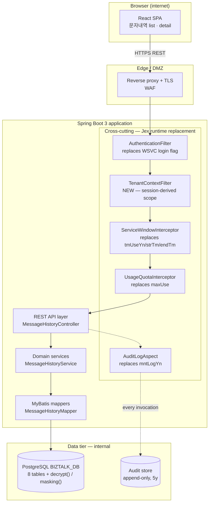
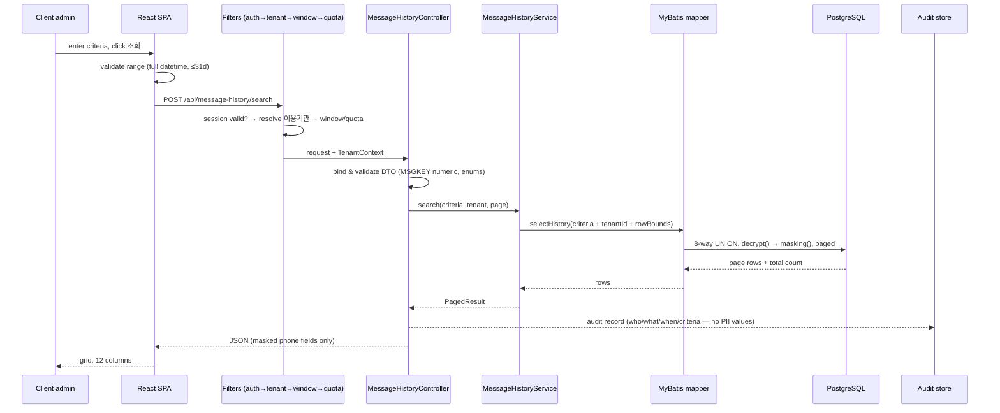
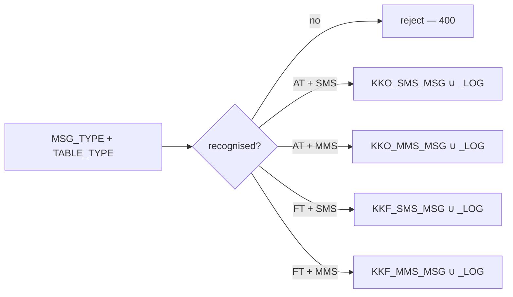
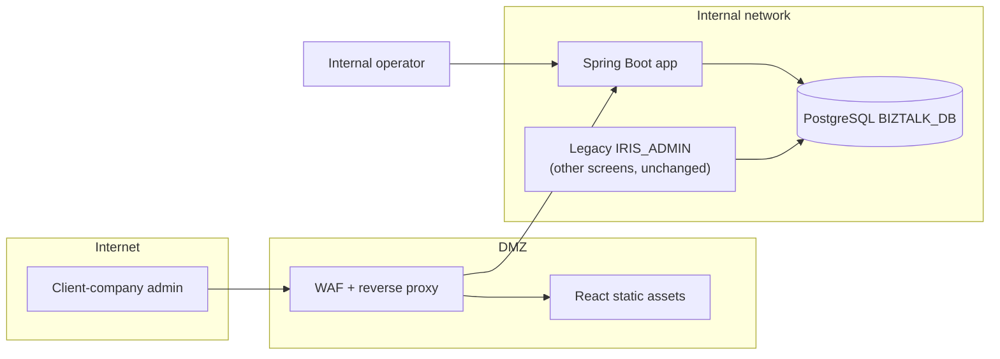

# Architecture Overview — IRIS BizTalk Portal (문자내역 slice)

> **Version**: 1.0
> **Date**: 2026-08-14
> **Scope**: 문자내역 (screens 40/41), the first vertical slice
> **Stack**: ADR-001 · **Status**: **APPROVED (G2)** — 2026-08-21, PM
> **Note**: §6 망분리 topology remains unresolved (RISK-006 / OI-04) — approved as the intended shape, decision still required before the operator surface is built.

---

## 1. Guiding principle

The legacy application's behavior lives in two places: the **JSP/IDO files** (business logic and SQL) and the **Jex runtime** (authentication gating, service time windows, usage caps, audit logging). Porting only the first and discarding the second is the single largest failure mode of this project (proposal RISK-002) — nothing would fail to compile, no test would go red, and the controls would simply be gone.

The architecture therefore makes those runtime behaviors **explicit, first-class components** rather than framework side-effects.

## 2. Component structure



### 2.1 Why the cross-cutting block exists

| Legacy mechanism | Where it lived | Replacement | Requirement |
|------------------|----------------|-------------|-------------|
| `<login>Y/N</login>` per service | Jex runtime | `AuthenticationFilter` — **no opt-out**; the legacy `N` on the list service was defect D1 | FR-MSG-001, NFR-SEC-AUTH |
| *(none — new)* | — | `TenantContextFilter` — resolves 이용기관 from session, binds to request scope | FR-TEN-001, NFR-SEC-TENANT |
| `tmUseYn`, `strTm`/`endTm`, holiday/Sat/Sun windows | Jex runtime | `ServiceWindowInterceptor` — config-driven, inactive by default (both services set `tmUseYn=N`) | NFR-OPS-TIME, BR-003 |
| `maxUse` | Jex runtime | `UsageQuotaInterceptor` — both services set `0` (unlimited) today | BR-004 |
| `mntLogYn=Y`, `logLv` | Jex runtime | `AuditLogAspect` — writes an append-only record per invocation | NFR-OPS-AUDIT, BR-005 |

Four of these five are dormant in this slice (`tmUseYn=N`, `maxUse=0`). They are built anyway, because they are active elsewhere in the biztalk module and because retro-fitting a cross-cutting control after the fact is what produces gaps.

## 3. Request flow — 문자내역 search (UC-MSG-001)



**Note on ordering.** The tenant filter is applied **inside the SQL**, not after retrieval. Filtering in Java would decrypt and transport other tenants' rows before discarding them — an information-disclosure path even if the response looks correct.

## 4. Data access design

### 4.1 The list query

Ported from `IDO.KKB_MSG_L002` with four corrections (D2, D6, D7 and the tenant predicate):

| Aspect | Legacy | New |
|--------|--------|-----|
| Sources | 8-way `UNION ALL` (live + `_LOG` × 4 classes) | Unchanged |
| Date boundary | 7 branches exclusive `<`, `KKO_MMS_MSG_LOG` inclusive `BETWEEN` | **Uniform**: `>= start AND < end` (FR-MSG-011) |
| Tenant scope | Optional client-supplied `ID` | **Mandatory server-injected predicate** (FR-TEN-001) |
| MSGKEY filter | `to_char(MSGKEY,'9') LIKE …` → overflows to `#` | Numeric comparison (FR-MSG-008) |
| Paging | Commented out | `LIMIT`/`OFFSET` + count query (FR-MSG-007) |
| PII | `masking(decrypt(col))` | Unchanged — CONST-DATA-02 |

### 4.2 The detail query

`MSG_TYPE` × `TABLE_TYPE` selects one of four mappers. The legacy dispatched with a bare `else`, so any unrecognised `MSG_TYPE` silently queried the 친구톡 tables; the new router rejects unknown values (FR-MSGD-003).



All four return the full 19-field projection (FR-MSGD-004) with a 4-digit year format (FR-MSGD-005), correcting D9 and D5.

## 5. Package structure

```
com.webcash.iris.biztalk
├─ api            REST controllers, request/response DTOs, validation
├─ domain         MessageHistory service, criteria model, paging
├─ infra.db       MyBatis mappers + XML, result maps
├─ security       AuthenticationFilter, TenantContextFilter, TenantContext
├─ crosscut       ServiceWindowInterceptor, UsageQuotaInterceptor, AuditLogAspect
└─ config         Spring configuration, proxy/CORS, error handling
```

Directory isolation follows the harness Team-with-Leader model: Build Team writes `src/`, Validation Team writes `qa/` and `security/`.

## 6. Deployment topology



> **Unresolved at G2 — RISK-006.** 전자금융감독규정 network separation versus one application serving both external tenants and internal operators (including 수수료 data on screens 00/10). This slice is read-only and tenant-facing, so it does not force the issue; the operator screens will. The topology above shows the intended shape, not an approved one. **Decision required before the operator surface is built** (OI-04).

Note also that the new application and legacy IRIS_ADMIN **share the same database** during coexistence — writes from either are visible to both. For this read-only slice that is benign.

## 7. Traceability

| Component | Requirements |
|-----------|--------------|
| `AuthenticationFilter` | FR-MSG-001, FR-MSGD-001, NFR-SEC-AUTH |
| `TenantContextFilter` | FR-TEN-001…004, NFR-SEC-TENANT |
| `MessageHistoryController` | FR-MSG-002…016, FR-MSGD-002…008 |
| `MessageHistoryMapper` | FR-MSG-003, 007, 008, 011, 015, 016; CONST-DATA-01/02/03 |
| `AuditLogAspect` | NFR-OPS-AUDIT, NFR-OPS-AUDIT-02 |
| `ServiceWindowInterceptor` | NFR-OPS-TIME |
| React SPA | FR-MSG-004/005/006/009/012/014, NFR-USE-01, NFR-COMPAT-01 |
