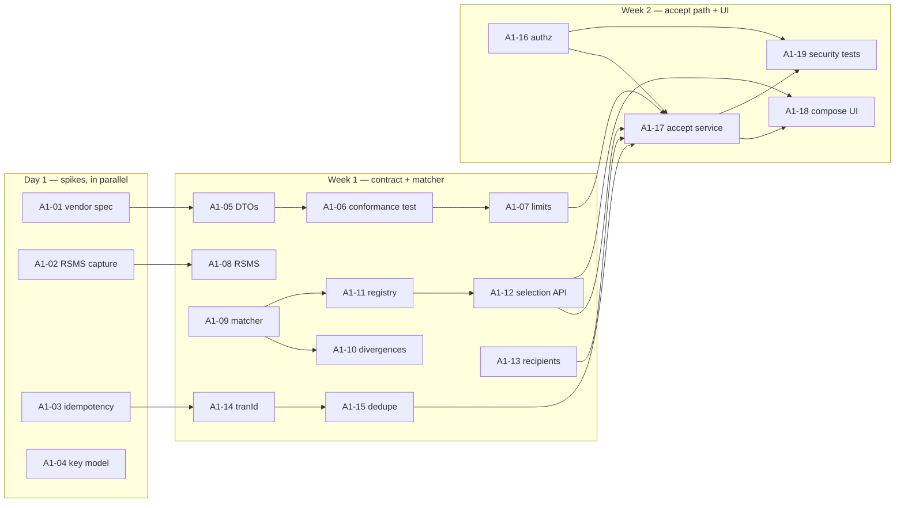

# Sprint A1 Task List — contract, validation and the accept path

> **Version**: 1.0
> **Date**: 2026-08-18
> **Sprint**: A1 (weeks 1–2)
> **Plan**: [DEV-PLAN-ALIMTALK.md](DEV-PLAN-ALIMTALK.md)
> **Requirements**: [REQUIREMENTS-SPEC-ALIMTALK.md](../requirements/REQUIREMENTS-SPEC-ALIMTALK.md)

---

## Scope

Everything that can be built and tested **without a vendor call, without DDL and without the profile key**. That boundary is not arbitrary: 23 of the slice's 35 defects live in composition, validation and contract conformance, and all of them are closable here. Despatch waits for A2 because sending before A2-01 would mean sending with the leaked credential (T-A1).

**In:** four spikes · outbound DTOs + bidirectional contract test · limits · `RSMS` marshalling · template matcher + registry read · recipient parsing · `tran_id` + dedupe · authorization + tenant scope · accept-path service (without the outbox write) · compose UI · negative-path security tests.

**Out:** outbox table, dispatcher, vendor client, resilience policy, failback policy, reservation, batch despatch, screen 50 retirement — all A2.

**No DDL and no cutover in this sprint**, so all 19 tasks are safe under any G1 outcome (RISK-A13).

---

## Tasks

### A1-01 · SPIKE: vendor field specification for 이미지형 and 아이템리스트형
Obtain the current `COOCON_ALERT` AlimTalk field specification. Neither IMO contract declares any image field, `kko_header`, `highlight`, `items` or `summary`, yet the composer emits five of them (D-A2, D-A8).
**Deliverable:** either the field definitions, or a recorded "not available" that triggers the AMB-A05 fallback at the sprint gate.
**Blocks:** A1-05 (which fields exist in the DTO), FR-ATC-003, FR-ATC-008. **Owner:** architect + PM. **Risk:** RISK-A01.
> Do this on day 1. It is the only task in the sprint whose duration depends on a third party.

### A1-02 · SPIKE: capture the `RSMS` envelope
`IMO.ADV_KKO_AT_SEND2` declares a single input field `RSMS`. Capture a real value from the legacy send path (log capture, DBA assistance, or the staging endpoint) and record how a bound request becomes that string.
**Deliverable:** a captured payload checked in as a test fixture. **Blocks:** A1-08. **Owner:** adapter-builder. **Risk:** RISK-A02, RISK-A08.

### A1-03 · SPIKE: does the vendor deduplicate a repeated `tran_id`?
Send the same `(is_cd, tran_id)` twice and observe. If no staging endpoint exists, obtain a written vendor statement.
**Deliverable:** a recorded answer. **Blocks:** A1-14 default policy, A2-06 retry sign-off. **Owner:** architect + adapter-builder. **Risk:** RISK-A07, RISK-A08.
> The design already assumes the worse answer, so a "no" costs no rework. It is scheduled early because it decides whether at-least-once despatch is safe, and that is the one assumption in ADR-ATK-023 unverifiable from source.

### A1-04 · SPIKE: one profile key or one per institution?
Source shows a single hardcoded key used for every send. Establish whether that is correct (a shared key) or a long-standing misconfiguration (one institution's key used for all).
**Deliverable:** the key model, and the per-institution mapping if there is one. **Blocks:** A2-01 resolver shape. **Owner:** architect + Ops + vendor. **Risk:** RISK-A03.

### A1-05 · Outbound DTOs — `AlimTalkRequest` / `AlimTalkBatchRequest`
Records mirroring `IMO.ADV_KKO_AT_SEND` and `_M`. **`failback_data`, not `failback`** (D-A1). `order` on every `msg_data` item (D-A3). No field the contract does not declare (D-A2). Jakarta Validation constraints on every bounded field.
**Requirements:** FR-ATC-002, FR-ATC-003, FR-ATC-004. **Depends:** A1-01. **ADR:** ATK-021.

### A1-06 · `ContractConformanceTest` — bidirectional, driven by the IMO XML
Parse checked-in copies of both IMO contracts and assert, per field and recursively through `RECORD`/`GROUP` sub-rules: every contract `<item>` has a serialised property; **every serialised property has a contract `<item>`**; every `length` has a matching constraint. Assert the contract `<version>` and `<hash>`.
**Requirements:** FR-ATC-001, CONST-DATA-A01/A02. **Depends:** A1-05. **ADR:** ATK-021.
> The reverse direction is the point. A one-directional test passes on the legacy payload, because `failback` and `msg_type` are *extra* fields rather than missing ones — which is exactly why a year of code review never caught them.

### A1-07 · `AlimTalkLimits` — one place for every bound
Contract lengths read from the XML; business limits declared once and tagged `[ASSUMED-KAKAO-SPEC]`; effective bound is `min(contract, Kakao)` per CONFLICT-A02. No number transcribed by hand into an annotation.
**Requirements:** FR-ATC-005, CONST-DATA-A02. **Depends:** A1-06. **Risk:** RISK-A09.

### A1-08 · `RsmsEnvelope` + `RsmsEnvelopeTest`
Marshal the bound request into the vendor's single `RSMS` field; assert byte-for-byte reproduction of the A1-02 capture.
**Requirements:** FR-ATC-001. **Depends:** A1-02. **Risk:** RISK-A02.
> If A1-02 produced no capture, this task ships the marshalling with the test **explicitly marked unverified** — not silently assumed correct.

### A1-09 · `TemplateMatcher` — compile to a pattern
Tokenize into literal and variable segments; `Pattern.quote()` every literal; `(?<name>.+?)` per variable. `#{…}` only — `${…}` rejected with an explicit message. Match under a bounded executor; cap variable count; **reject adjacent variables with no intervening literal**.
**Requirements:** FR-ATV-004, FR-ATV-005, FR-ATV-008. **ADR:** ATK-022. **Risk:** RISK-A10.
> The behavioural break lands here. `#{name}님 안녕` against `김님철수님 안녕` must **pass**. Tests TC-A004-02 and TC-A004-03 assert the fix; they are not parity regressions.

### A1-10 · Multi-divergence report
On mismatch, re-match incrementally over the token list to locate **every** divergence, each with its token, offset and the value read for each variable.
**Requirements:** FR-ATV-006, NFR-USE-A03. **Depends:** A1-09.

### A1-11 · `TemplateMapper` + compiled-pattern cache
Read `TEMPLATE_MSG` from `KKB_MSG_TMPL` by `(IS_CD, TEMPLATE_CODE)`. Read-only. Cache compiled patterns by `(is_cd, code, body hash)`.
**Requirements:** FR-ATV-001, CONST-DATA-A03. **Depends:** A1-09.

### A1-12 · Template selection API, tenant-scoped
List templates for the session's entitled institutions; return code, title and body. Populate 강조표기제목 from `TEMPLATE_TITLE`.
**Requirements:** FR-ATT-001, FR-ATT-002, FR-ATT-003. **Depends:** A1-11.
> Legacy `KKB_MSG_TMPL_L003` returns every active institution's templates in one unscoped query. Do not port that shape.

### A1-13 · `RecipientParser`
Parse on the delimiters operators actually use (comma, newline, space, tab, mixed); trim; drop empties; validate against a **correctly anchored** pattern; de-duplicate; count.
**Requirements:** FR-ATC-012, FR-ATS-005. **Fixes:** D-A12, D-A28, D-A35.
> `abc01012345678` must be rejected. The legacy used `find()` on an unanchored pattern, so it passed.

### A1-14 · `TranIdGenerator`
`env + yyMMdd + base-36 per-institution daily sequence`, 10 characters. One scheme for single and batch.
**Requirements:** FR-ATS-008, FR-ATS-010, FR-ATC-005. **Depends:** A1-03. **ADR:** ATK-026.

### A1-15 · Dedupe pre-check
Look up `(is_cd, tran_id)` before accepting; on a hit return the **original outcome**, not a generic conflict. Window per AMB-A08 (match history retention).
**Requirements:** FR-ATS-009. **Depends:** A1-14. **ADR:** ATK-026.
> Returning the original outcome rather than an error is what stops an operator retrying — the behaviour that produced the duplicate customer messages in specification §6.5.

### A1-16 · Authorization and tenant scope
`@PreAuthorize` on every endpoint; send authorized separately from compose; institution scope from `TenantContext`, never from the request body.
**Requirements:** FR-AZ-A01, FR-AZ-A02, FR-AZ-A03, NFR-SEC-AUTHZ-A01. **Reuses:** `TenantContext`, `SecurityConfig`.

### A1-17 · `AlimTalkSendService` — accept path
Order: authorize → tenant scope → caller ID via `SenderNumberService` → template exists → template match → recipients → dedupe → **then** write. Audit via `AuditService`. Returns accepted / duplicate / rejected with counts.
**Requirements:** FR-ATS-004, FR-ATS-006, FR-ATS-007, FR-ATT-004, FR-ATH-001. **Depends:** A1-07, A1-12, A1-13, A1-15, A1-16.
> **Every rejection path sits before the first write.** The legacy checked recipients *after* the history insert and the vendor call (D-A26); here that ordering must not be expressible. In A1 the "write" is the history row only — the outbox write arrives in A2-04.

### A1-18 · React compose screen
Compose form with per-field length feedback from `AlimTalkLimits`; template **selection** not free text; caller-ID selection from registered numbers; recipient entry with live count and dedupe; **no `sender_key` field**; working 초기화 that clears every field, group and output.
**Requirements:** FR-ATC-005, FR-ATC-009, FR-ATC-010, FR-ATC-013, FR-AZ-A05, NFR-USE-A01, NFR-USE-A03. **Fixes:** D-A4, D-A9, D-A18, D-A19, D-A20, D-A21, D-A22. **Depends:** A1-12, A1-17.
> Externalise all text for i18n and use the design system — no screen-local stylesheet (D-A22). Do not reassign `window.onload` (D-A21).

### A1-19 · Negative-path security tests
Unauthenticated and non-operator calls to every endpoint; crafted `is_cd`; another institution's `template_code`; unregistered caller ID; a request body carrying `sender_key`; regex-metacharacter template bodies; backtracking bound.
**Requirements:** FR-AZ-A01…A05, FR-ATT-003, FR-ATT-004, NFR-SEC-AUTHZ-A01. **Threats:** T-A2, T-A3, T-A4, T-A5, T-A7, T-A16, T-A20, T-A24. **Depends:** A1-16, A1-17.

---

## Dependency order

**Critical path:** A1-01 → A1-05 → A1-06 → A1-07 → A1-17 → A1-18. The spike is on it, which is why it runs on day 1.

**Parallelisable from day 1:** the template matcher chain (A1-09…A1-12) and recipient parsing (A1-13) depend on no spike and can start immediately. If A1-01 stalls, these keep the sprint moving.

---

## Sprint DoD

- [ ] All four spikes answered, or a recorded "unavailable" with its consequence stated
- [ ] `ContractConformanceTest` green **in both directions**, driven by the IMO XML, with version/hash asserted
- [ ] D-A1, D-A2, D-A3, D-A7 demonstrably closed by that test
- [ ] Template matcher passes TC-A004-01…10, including the corrected-behaviour cases and the regex-metacharacter case
- [ ] Backtracking bounded — 20 adjacent variables against 4 KB completes within the timeout
- [ ] `abc01012345678` rejected; mixed delimiters counted correctly
- [ ] `tran_id` unique under 500 concurrent accepts, zero collisions
- [ ] Duplicate submission returns the original outcome
- [ ] Every rejection path proven to occur **before** any write
- [ ] No `sender_key` field in any inbound DTO, client bundle or page source
- [ ] Compose screen: 초기화 clears everything; no console error; all text externalised
- [ ] Negative-path suite green; no endpoint reachable without an operator role
- [ ] Line ≥ 80 %, branch ≥ 70 % on the new package
- [ ] 23 of 35 defects closed with a regression test each
- [ ] Traceability matrix updated: requirement → task → test
- [ ] **No DDL and no cutover performed** — A2's preconditions still open

---

## Handover to A2

| Item | State expected at handover |
|------|---------------------------|
| Vendor field spec | Answered, or fallback triggered with PM acknowledgement |
| `RSMS` envelope | Verified against a capture, or explicitly marked unverified |
| Vendor idempotency | Answered — sets A2-06's retry policy |
| Profile-key model | Answered — sets A2-01's resolver shape |
| Accept path | Complete except the outbox write (A2-04) |
| G1 | **Required before A2-02** — the first irreversible commitment |
| Key rotation | Requested and tracked; **not** a blocker for A2 development, but a blocker for G3 |
| Staging endpoint | Confirmed present or absent; if absent, the load-test strategy is re-derived |
