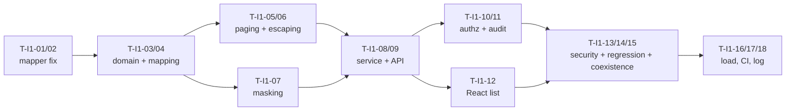

# Sprint I1 Task List — 이용기관관리 read path + foundation correction

> **Sprint**: I1 (weeks 1–2)
> **Predecessor**: [DEV-PLAN-INSTITUTION.md](DEV-PLAN-INSTITUTION.md)
> **Goal**: A correct, authorized, paginated registry read path — and repair of the delivered code that queries a table which does not exist
> **Status**: **G2 APPROVED** — 2026-08-21, PM · **Leader 합의 미기록 / Leader agreement not recorded**

---

## Sprint goal

By the end of I1 an operator can search the registry through a **server-paginated, credential-masked, operator-only** endpoint, and every access-control and disclosure defect on the read path is closed with a test proving a refusal.

No write path in this sprint. That is deliberate: the read path is what proves the mapper corrections are right, and shipping writes against a mapper whose column names were guessed would compound RISK-I05.

## Definition of Done

- FR-INST-001…009, FR-AZ-I01…I04, FR-ATK-002, NFR-PERF-I01/I02
- Defects closed: D-I5, D-I10, D-I11, D-I12 · read-side half of D-I1 · D-I2 for read endpoints
- Every endpoint has a negative authorization test proving a **403**
- Line ≥ 80% / branch ≥ 70%; `AtkMasker` and `InstitutionStatus` at 100%
- Zero DDL — verified in CI

## Tasks

| ID | Task | Owner | Depends | Est | Requirement |
|----|------|-------|---------|-----|-------------|
| **T-I1-01** | **Fix `InstitutionMapper`** — `BIZTALK_INSTITUTION`→`FT_FTIS_INFO`, `IS_CD`→`FINTECH_ISCD`, `IS_NM`→`ISNM`, `USE_YN`→`IS_STTS`. Every identifier in the delivered query is wrong | `backend-developer` | — | 0.5d | RISK-I05, CONST-DATA-I04 |
| T-I1-02 | Integration test for T-I1-01 against Testcontainers PostgreSQL with a seeded `FT_FTIS_INFO` — proves the fix, and would have caught the original | `qa-engineer` | T-I1-01 | 0.5d | RISK-I05 |
| T-I1-03 | `Institution` record + `InstitutionStatus` enum (`Y`/`N`/`D`), sole write path to `IS_STTS` | `data-model-designer` | T-I1-01 | 0.5d | ADR-INST-014, RISK-I07 |
| T-I1-04 | Explicit name-based column mapping in mapper XML with `-- FIX D-In:` annotations per convention | `backend-developer` | T-I1-03 | 0.5d | CONST-DATA-I04 |
| T-I1-05 | Search mapper — `LIMIT`/`OFFSET` + `COUNT(*)`, returning existing `PagedResult` | `backend-developer` | T-I1-04 | 1d | FR-INST-003, D-I10 |
| T-I1-06 | `LIKE` escaping for `%`/`_`; NULL-safe 기관명 filter | `backend-developer` | T-I1-05 | 0.5d | FR-INST-004/005, D-I11 |
| T-I1-07 | `AtkMasker` — last-4 masking, 100% covered | `backend-developer` | T-I1-03 | 0.5d | FR-ATK-002, D-I5 |
| T-I1-08 | `InstitutionService` — search, status rendering incl. unmapped-verbatim, masking applied | `backend-developer` | T-I1-05, T-I1-06, T-I1-07 | 1d | FR-INST-001/002/006 |
| T-I1-09 | `GET /search` + `GET /{code}` on `InstitutionAdminController`, `@PreAuthorize` on each | `backend-developer` | T-I1-08 | 0.5d | FR-INST-001, FR-AZ-I01 |
| **T-I1-10** | **Authorization sweep** — every institution endpoint carries both the `/api/admin/**` rule and a controller `@PreAuthorize` | `security-auditor` | T-I1-09 | 0.5d | FR-AZ-I01/I02, D-I2 |
| T-I1-11 | Audit wiring — `institution.*` actions through the existing `AuditService` | `backend-developer` | T-I1-09 | 0.5d | FR-AZ-I04 |
| T-I1-12 | React list screen — 8 columns, paging, status filter, escaped rendering | `frontend-developer` | T-I1-09 | 1.5d | FR-INST-002/007/008 |
| T-I1-13 | Negative-path security tests S-01…S-14 (read endpoints) | `security-auditor` | T-I1-10 | 1d | TM-I001/I002/I003 |
| T-I1-14 | Defect regression tests for D-I5, D-I10, D-I11, D-I12 | `qa-engineer` | T-I1-08 | 1d | TEST-PLAN §3 |
| T-I1-15 | Coexistence test C-01 — legacy `KKB_FT_FTIS_INFO_L001` SQL run verbatim against our data | `qa-engineer` | T-I1-04 | 0.5d | ADR-INST-016 |
| T-I1-16 | Load test — search P95 < 1 s at 2× | `qa-engineer` | T-I1-08 | 0.5d | NFR-PERF-I01 |
| T-I1-17 | CI check — zero DDL in this slice's migrations | `architect` | — | 0.25d | CONST-DATA-01 |
| T-I1-18 | Sprint log + 7-dimension self-assessment | `docs-writer` | all | 0.5d | Governance |

**Total ≈ 11.75 person-days** across ~10 working days with parallel agents.

## Parallel tracks

## Blocked / carried

| Item | Blocker | Needed by |
|------|---------|-----------|
| RISK-I01 operational data audit | PM action, not code | Before Sprint I2 |
| RISK-I06 `FT_FTIS_INFO` column semantics, `BSNN_STTS_CKYN` | DBA review (AMB-I08) | Before Sprint I2 write path |
| RISK-I10 기관코드 format authority | Domain owner (AMB-I06) | Before Sprint I2 validation |
| RISK-I09 legacy instance in staging | Environment | T-I1-15 degrades without it — **state it in the sprint log** |

## Out of scope for I1

Create, update, delete, status transitions, key generation, rotation and reveal — all Sprint I2. The read path must be provably correct first, because everything else writes through the same mappers.
