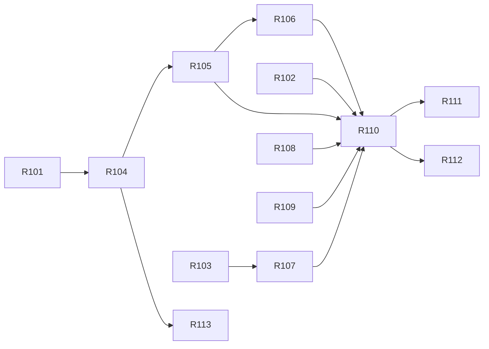

# Sprint R1 Task List — 이용기관 보고서 foundation and read path

> **Version**: 1.0
> **Date**: 2026-08-18
> **Sprint**: R1 (weeks 1–2)
> **Predecessor**: [DEV-PLAN-REPORT.md](DEV-PLAN-REPORT.md)
> **Siblings**: [sprint-1-tasks.md](sprint-1-tasks.md), [sprint-L1](sprint-L1-tasks.md), [sprint-I1](sprint-I1-tasks.md), [sprint-S1](sprint-S1-tasks.md)

---

## Scope

The read path, end to end: two datasources, the keyset merge, validation, role-based scope, the freshness watermark, read auditing, and the report screen.

**Closes**: D-R1, D-R2, D-R5, D-R6, D-R7, D-R8, D-R9, D-R11, D-R12, D-R13, D-R14 (screen), D-R23, D-R24, D-R25
**Delivers**: FR-AZ-R01…R05, FR-RPT-001…016, FR-RPTS-001…005, NFR-SEC-AUTHZ-R01, NFR-SEC-TENANT-R01, NFR-PERF-R01/R02, NFR-USE-R01, NFR-OPS-R01
**Defers to R2**: everything export (FR-RPTX-*), the load and memory profile, the 7-dimension assessment

**No DDL in this sprint or the next.** CONST-DATA-R02 holds for the whole slice.

---

## Tasks

### R1-01 · Confirm datasource topology (AMB-R04)
- **Owner**: architect + DBA · **Est**: 0.5d · **Req**: AMB-R04, RISK-R10
- Confirm with the DBA or platform owner whether `BIZTALK_DB` and `BIZTALK_BULK_DB` resolve to one physical database or two. **Do not read `jex.iris_admin.xml`** — it is declared under `JEX.config.file` in `jex.prop` and SEC-002 applies. Ask the owner instead.
- Also capture: connection limits, statement timeout defaults, and whether the bulk source has an independent maintenance window (needed for R1-05 timeouts and F-R01…F-R04).
- **DoD**: written confirmation recorded in ADR-RPT-021. **If one database**, raise immediately — the mapper layer simplifies to a single `UNION ALL … GROUP BY` and the merge iterator (R1-05) becomes dead code to delete rather than build.
- **Note**: unlike S1-03 in the 발신번호 slice, this is **not a gate**. ADR-RPT-021 is correct under either answer; this task decides simplicity, not viability.

### R1-02 · `PeriodPolicy` — cap and calendar validation
- **Owner**: backend-developer · **Est**: 0.5d · **Req**: FR-RPT-002, FR-RPT-003, FR-RPT-004 · **Fixes**: D-R9
- 8-digit `YYYYMMDD` calendar validation, 시작 ≤ 종료, span ≤ 366 days. Server-side only; the browser check is a convenience, never the enforcement.
- **DoD**: unit tests for `00000000`/`99999999`, inverted range, 367 days, `20261332`, non-numeric — 400 in every case.

### R1-03 · `ReportScope` — role-based scope resolution
- **Owner**: backend-developer · **Est**: 1d · **Req**: FR-AZ-R03, FR-AZ-R04 · **Fixes**: D-R2
- Resolve scope from the session and role: operator may request 전체 or any institution; a tenant principal is narrowed to their own and a supplied `IS_CD` is **ignored, not validated**.
- Implements CONFLICT-R01's refinement of AMB-02. Consumes `TenantContext` unmodified.
- **DoD**: unit tests per role × per supplied parameter, including empty `IS_CD` (the legacy's "all").

### R1-04 · Per-source mappers
- **Owner**: backend-developer · **Est**: 1d · **Req**: FR-RPTS-001, FR-RPT-011, FR-RPT-012 · **Fixes**: D-R11, D-R12, D-R13 · **Depends**: R1-01
- `ApiAggregateMapper` (BIZTALK_DB) and `BulkAggregateMapper` (BIZTALK_BULK_DB), two `SqlSessionFactory` beans, MyBatis named binding throughout.
- `COALESCE` on every counter **in SQL, per source** — a NULL surviving into the merge nullifies a merged row, which is D-R11 one layer up.
- 기관명 by **join**, not per-row correlated subquery; unresolved codes yield an explicit marker, never a blank.
- **DoD**: mapper tests; query plan shows no per-row subquery (tier 1 where available).

### R1-05 · `SourceMergeIterator` — keyset merge
- **Owner**: backend-developer · **Est**: 2.5d · **Req**: FR-RPT-005, FR-RPT-006, FR-RPTS-003 · **Fixes**: D-R7, D-R8 · **Depends**: R1-04
- k-way merge of two streams sorted by `(TRDD DESC, IS_CD ASC)`; equal keys sum into one row; 발송구분 narrows to a single stream.
- Per-source statement timeouts, bounded, **no retry loop** (CODE-002). A failed source degrades the result and marks it incomplete (FR-RPTS-005).
- **DoD**: the property suite P-1…P-6 (TEST-PLAN §3.1) passes, including page boundaries falling exactly on a key present in both sources. This is the task where a wrong result looks plausible, so property tests are the DoD, not a follow-up.

### R1-06 · Total-count key probe
- **Owner**: backend-developer · **Est**: 1d · **Req**: FR-RPT-005 · **Depends**: R1-05
- Exact merged total from the union of both sources' `(TRDD, IS_CD)` key sets; `MAX_KEY_PROBE` ceiling above which `hasMore` is returned instead, and said so in the response.
- **DoD**: P-7 passes; probe cost measured at the 366-day cap (L-R06).

### R1-07 · Authorization on both endpoints
- **Owner**: backend-developer + security-auditor · **Est**: 1d · **Req**: FR-AZ-R01, FR-AZ-R02, NFR-SEC-AUTHZ-R01 · **Fixes**: D-R1 · **Depends**: R1-03
- Authentication and role authorization server-side on the query endpoint **and** the export endpoint, even though export lands in R2 — the endpoint is secured when it is created, not afterwards.
- **DoD**: S-R01, S-R05 pass; endpoint inventory confirms no anonymous endpoint exists in the slice.

### R1-08 · `ReportWatermark`
- **Owner**: backend-developer · **Est**: 1d · **Req**: FR-RPT-013, FR-RPT-014, NFR-USE-R01 · **Fixes**: D-R25 · **ADR**: ADR-RPT-022
- `max(TRDD)` per source, cached 60 s. Days above the watermark are 미집계; empty below it is 조회된 내용이 없습니다.
- **DoD**: W-R01, W-R02, W-R03 pass. The known blind spot (interior gaps) is documented in the code where the derivation lives, not only in the ADR.

### R1-09 · Read auditing
- **Owner**: backend-developer · **Est**: 0.5d · **Req**: FR-AZ-R05, NFR-OPS-AUDIT-R01 · **Fixes**: D-R17 (query half)
- Actor, timestamp, scope, range, 발송구분, row count — successes **and** denials. Consumes `AuditService` unmodified. Figures themselves are never written (T-R15).
- **DoD**: S-R12 passes; audit content reviewed by security-auditor.

### R1-10 · `ReportService` + query API
- **Owner**: backend-developer · **Est**: 1.5d · **Req**: FR-RPT-001, FR-RPT-007, FR-RPT-008, FR-RPT-016 · **Fixes**: D-R5, D-R6, D-R24 · **Depends**: R1-02, R1-05, R1-06, R1-07, R1-08, R1-09
- One response shape, environment-independent, structured records — **no serialized collection the client must parse**. Displayed fields only; `RGDT` and `FT_CNT` are not shipped.
- **DoD**: contract test asserts identical shape and field types across every environment profile; 기관명 containing `"` and `\` round-trips intact.

### R1-11 · React report screen
- **Owner**: frontend-developer · **Est**: 2d · **Req**: FR-RPT-009, FR-RPT-010, FR-RPT-015, FR-RPTS-002 · **Fixes**: D-R14 (screen), D-R23 · **Depends**: R1-10
- Grid with 구분 · 기관명 · 일자 and **전체 / 성공 / 실패 / 처리중** per channel; 발송구분 filter defaulting to 전체; keyset next/previous with total; watermark banner.
- No query until the selector has loaded and scope is known.
- **DoD**: E-R1, E-R2, E-R4 pass; W-R04…W-R06 reconciliation identities visible and correct on screen.

### R1-12 · Negative-path security tests
- **Owner**: qa-engineer + security-auditor · **Est**: 1.5d · **Req**: NFR-SEC-TENANT-R01 · **Depends**: R1-10
- S-R01…S-R05, S-R09, S-R11…S-R15 from TEST-PLAN §4. **S-R04** — enumerate 50 institution codes — is the gate test for T-R10, the highest-severity threat in the programme.
- **DoD**: all listed tests pass; results reviewed by security-auditor before sprint exit.

### R1-13 · Synthetic volume in both sources
- **Owner**: qa-engineer · **Est**: 1d · **Req**: RISK-R06 · **Depends**: R1-04
- Generate 366 days × the real institution count in **both** aggregates. Staging has probably never held bulk data at all, because the legacy only queried it when `TSTCL_DV=REAL`.
- No PII to anonymise — the aggregate is counts only, which makes this cheap.
- **DoD**: both sources carry production-shape volume; L-R01/L-R02 can run in R2.

---

## Dependency order

Critical path: **R1-01 → R1-04 → R1-05 → R1-10 → R1-11**, roughly 8 days of the 10 available. R1-05 carries the buffer, because it is the task where correctness is hardest to see.

R1-02, R1-03, R1-08, R1-09 and R1-13 are independent and parallelisable from day one.

---

## Sprint DoD

- [ ] AMB-R04 confirmed and recorded in ADR-RPT-021 (R1-01)
- [ ] Merge property suite P-1…P-7 passing, including boundary-on-shared-key cases
- [ ] Both endpoints authenticated and authorized; **no anonymous endpoint in the slice**
- [ ] S-R04 (50-code enumeration) passing on the query endpoint
- [ ] Period cap and calendar validation enforced server-side
- [ ] Watermark displayed; 미집계 distinguished from 0 and from error
- [ ] Reconciliation identities (FR-RPT-010) asserted and passing
- [ ] Read auditing live, content reviewed
- [ ] Response shape identical across environment profiles
- [ ] Line ≥ 80% / branch ≥ 70% on the report package
- [ ] Synthetic volume present in both sources
- [ ] Traceability matrix updated: every R1 requirement → task → test

---

## Handover to R2

R2 receives a finished query path and builds the export on top of it, **not beside it**. The single most important property carried across is that the export consumes R1's `SourceMergeIterator` and R1's validated request object — every legacy export defect traces to the export having been a parallel implementation, and R1-10's interface is what makes that impossible to repeat.

Three items land on R2's desk from R1:

- **R1-01's answer**, which either simplifies the mapper layer or confirms the merge stays.
- **R1-07's authorization**, already applied to the export endpoint, so R2 adds a body to a door that is already locked.
- **R1-13's synthetic volume**, without which L-R03 and L-R04 cannot run — and those two tests are what set the row ceiling (AMB-R05). RISK-R07 asks for them **early in R2**, not at the end.
