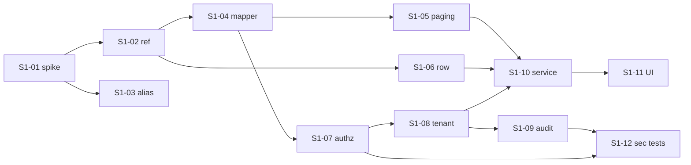

# Sprint S1 Task List — 발신번호 foundation and read path

> **Version**: 1.0
> **Date**: 2026-08-17
> **Sprint**: S1 (weeks 1–2)
> **Predecessor**: [DEV-PLAN-SENDERNO.md](DEV-PLAN-SENDERNO.md)
> **Sprint goal**: the list screen works correctly, is authorized server-side, is tenant-scoped, is paged and ordered, and is audited — **with no DDL and no schema dependency**, so the sprint is unblocked by G1.

---

## Scope

| In | Out |
|----|-----|
| Encryption spike, identity model, mapper, paging, ordering | All DDL — deferred to S2-02 |
| Authorization on all 6 endpoints, tenant scope, read audit | Register / edit / delete write paths |
| List UI, negative-path security tests | Archive table, unique index |
| Alias verification (`BIZ_DB` vs `BIZTALK_DB`) | Ownership verification — not built (AMB-S01) |

**Closes**: D-S2, D-S3, D-S14, D-S17, D-S19, D-S21.
**Deliberately not closed**: D-S1 — the fix is the archive, which is S2 work. See DEV-PLAN §4.3.

---

## Tasks

### S1-01 · SPIKE: is `ENCRYPT` deterministic?
- **Owner**: DBA (execution) + architect (adjudication) · **Est**: minutes · **Blocks**: S1-02, S2-02
- **Question**: does `ENCRYPT(x)` return identical ciphertext for identical `x`?
- **Method** — **corrected 2026-08-17.** This was originally specified against Testcontainers. **Docker is not permitted in this environment**, and the spike never needed it: determinism is a property of the *production* DB function, so a container running stock PostgreSQL could not have answered it authoritatively anyway. The definitive test is one statement run against any database carrying the real function:

  ```sql
  SELECT ENCRYPT('01012345678') = ENCRYPT('01012345678') AS is_deterministic;
  -- and, to confirm the indexable lookup form works:
  SELECT count(*) FROM KKB_DPNO_LDGR WHERE DP_NO = ENCRYPT('<a known live number>');
  ```

  If direct access is unavailable, the function's DDL (`\df+ encrypt`) answers it equally well by inspection.
- **DoD**: a written answer recorded in ADR-SND-018 selecting the branch; if non-deterministic, RISK-S07 is escalated and the blind-index design activated.
- **Note**: everything downstream waits on this, and it is now a request to a person rather than a development task. **Raise it on day one** — the turnaround, not the effort, is the critical path.

### S1-02 · `SenderNumberRef` — opaque row identity
- **Owner**: backend-developer · **Est**: 1d · **Depends**: S1-01 · **Req**: FR-SND-007
- Identity value carried by the API — deterministic ciphertext or blind index per S1-01. Never the display string.
- **DoD**: `SenderNumberRef` type; a property test asserting the identifier in any response never equals the rendered number. **This is the structural fix for the D-S1 defect class**; the delete path in S2 depends on it existing first.

### S1-03 · Verify `BIZ_DB` / `BIZTALK_DB` resolve to the same database
- **Owner**: architect · **Est**: 0.5d · **Req**: RISK-S01, test C-S04
- Resolve both datasource aliases against deployed configuration; confirm empirically by writing through the portal and reading through the `BIZ_DB` alias.
- **DoD**: written confirmation. **If they differ, raise immediately — ADR-SND-017 must be re-derived before any S2 delete work.**

### S1-04 · `SenderNumberMapper` — corrected query
- **Owner**: backend-developer · **Est**: 1d · **Depends**: S1-02 · **Req**: CONST-DATA-D03, D-S17
- Port `KKB_DPNO_LDGR_L002` with **named** column binding, aliases on the two masked columns, and the phantom `ISNM` field dropped.
- **DoD**: integration test against Testcontainers; TC-S001-08 passes.

### S1-05 · Server-side paging and deterministic ordering
- **Owner**: backend-developer · **Est**: 1d · **Depends**: S1-04 · **Req**: FR-SND-003, FR-SND-004, D-S14
- `LIMIT`/`OFFSET` plus a `COUNT` query; `ORDER BY RGDT DESC` with a tiebreak that makes the order total.
- **DoD**: TC-S001-05/06. Requesting page 2 twice returns identical rows.

### S1-06 · `SenderNumberRow` — displayed fields only
- **Owner**: backend-developer · **Est**: 0.5d · **Depends**: S1-02 · **Req**: NFR-SEC-PII-D02, D-S21
- Response carries 기관명, 발신번호, 등록자, 등록일자, 수정자, 수정일자, 설명 and the ref. **No `RGSR_ID`/`UDT_ID`.**
- **DoD**: TC-S001-09.

### S1-07 · Authorization on all six endpoints
- **Owner**: backend-developer + security-auditor · **Est**: 1d · **Depends**: S1-04 · **Req**: FR-AZ-D01, FR-AZ-D02, FR-AZ-D04, D-S2
- Server-side operator-role enforcement on every endpoint, including the write endpoints S2 will fill in — the annotation lands now so no endpoint is ever briefly unguarded.
- **DoD**: TC-S001-02 and the T-E1 sweep; every endpoint returns 403 to a non-operator.

### S1-08 · Tenant scope on every query
- **Owner**: backend-developer · **Est**: 1d · **Depends**: S1-07 · **Req**: FR-AZ-D03, NFR-SEC-TENANT-D01, D-S3
- Institution scope from `TenantContext.require().effectiveInstitutionCode(requested)`; the body value is never used on its own.
- **DoD**: TC-S001-03/04. Enumerating 50 institution codes recovers nothing.

### S1-09 · Read auditing
- **Owner**: backend-developer · **Est**: 1d · **Depends**: S1-08 · **Req**: FR-SND-011, ADR-SND-019
- One `AuditService` event per list/detail request with institution, count, page and outcome. `DENIED` recorded as well as `SUCCESS`. **No sender numbers in the audit payload.**
- **DoD**: TC-S001-12; the T-I4 audit-store scan finds no numbers.

### S1-10 · `SenderNumberService` + list API
- **Owner**: backend-developer · **Est**: 1d · **Depends**: S1-05, S1-06, S1-08 · **Req**: FR-SND-001, FR-SND-002
- Assembles scope resolution, paging, mapping and audit. No query issued before an institution is selected (D-S19).
- **DoD**: TC-S001-01, TC-S001-07, TC-S001-13.

### S1-11 · React list screen
- **Owner**: frontend-developer · **Est**: 2d · **Depends**: S1-10 · **Req**: FR-SND-005, FR-SND-006, FR-SND-008, FR-SND-009, FR-SND-010
- Institution selector (entitled institutions, 사용여부 indicated), grid, paging. **발신번호 in full; 등록자/수정자 masked.** Row actions carry the ref, never the rendered number.
- **DoD**: TC-S001-10/11/14; E2E scenario 1.

### S1-12 · Negative-path security tests
- **Owner**: qa-engineer + security-auditor · **Est**: 1.5d · **Depends**: S1-07, S1-09
- The read-path half of the §4 suite in the test plan: T-S1, T-I1, T-I3, T-I4, T-I6, T-D1, T-E1, T-E2.
- **DoD**: all pass; results feed the 7-dimension assessment.

---

## Dependency order



Critical path: **S1-01 → S1-02 → S1-04 → S1-07 → S1-08 → S1-10 → S1-11** (≈ 8.5 d). S1-03, S1-06 and S1-12 run in parallel.

---

## Sprint DoD

- [ ] Spike S1-01 answered and ADR-SND-018 updated with the selected branch
- [ ] `BIZ_DB` alias verified (S1-03) — **or RISK-S01 escalated to PM**
- [ ] All six endpoints reject non-operators and cross-tenant requests, verified by direct call
- [ ] List paged, ordered, stable across repeat requests
- [ ] Read audit emits per request, contains no sender numbers
- [ ] D-S2, D-S3, D-S14, D-S17, D-S19, D-S21 regression tests green
- [ ] Line ≥ 80% / branch ≥ 70% on the delivered package
- [ ] E2E scenario 1 green
- [ ] **No DDL introduced** — S1 stays independent of G1

---

## Handover to S2

S2 starts with the two reconciliations (DEV-PLAN §4.4), which need production data access and are **operator-team work, not developer work** — request access during S1 so S2-01 is not blocked on it.

**G1 must be approved before S2-02** (the DDL task). S1 carries no schema dependency, so the sprint completes regardless; only the write path is gated. Design has already narrowed what G1 approves: one new table, one index, no alteration to `KKB_DPNO_LDGR`'s meaning for existing readers, and no change to any legacy application.
