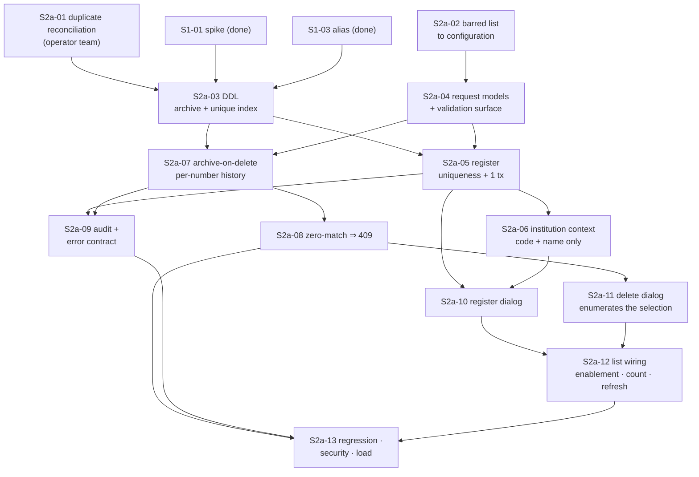

# Sprint S2a Task List — 발신번호 등록 · 삭제 (write path)

> **Version**: 1.0
> **Date**: 2026-08-20
> **Sprint**: S2a (weeks 3–4)
> **Predecessor**: [DEV-PLAN-SENDERNO.md](DEV-PLAN-SENDERNO.md) v1.1 · [REQUIREMENTS-SPEC-SENDERNO.md](../requirements/REQUIREMENTS-SPEC-SENDERNO.md) v1.1
> **ADRs**: [ADR-SND-017](adr/ADR-SND-017-senderno-lifecycle.md), [ADR-SND-018](adr/ADR-SND-018-encrypted-number-uniqueness.md), [ADR-SND-020](adr/ADR-SND-020-write-dialog-presentation.md), [ADR-SND-021](adr/ADR-SND-021-barred-number-list.md)
> **Sprint goal**: the two buttons Sprint S1 left disabled do exactly what they say — a registration that enforces every rule the screen states, and **a deletion that deletes**.

---

## Scope

| In | Out |
|----|-----|
| 등록 (legacy screen 12): dialog, server validation, global uniqueness, ledger + history in one transaction | 상세/설명수정 (legacy screen 11) — Sprint S2b |
| 삭제 (legacy screen 13): archive-on-delete, per-number history, zero-match ⇒ explicit failure | Ownership verification — not built (AMB-S01) |
| DDL: `KKB_DPNO_ARCV` + the uniqueness index | A cap on numbers per institution (AMB-S07, no cap) |
| Barred-number list to loaded configuration | 수수료 tab — no behaviour to port (§2.7) |
| Selection semantics, button enablement, post-write refresh | Cascade from institution deletion (CONST-BIZ-D04, ruled out) |

**Closes**: D-S1, D-S5, D-S6, D-S7, D-S9, D-S11, D-S12, D-S13, D-S15, D-S16, D-S18, and the register/delete half of D-S20.
**Left to S2b**: D-S8, D-S10 — both belong to screen 11.

**The legacy logic is the baseline** (PM directive, [questions-log §41](../requirements/questions-log.md)): field set, field order, stated rules, length branches and flow are ported as they stand. The defects listed above are not part of "the old logic" — they are why the slice exists.

---

## Tasks

### S2a-01 · Duplicate reconciliation (operator team + DBA)
- **Owner**: operator team + DBA · **Est**: elapsed, not effort · **Blocks**: S2a-03 · **Req**: CONST-BIZ-D01, RISK-S02
- Count and resolve cross-institution duplicates. `CREATE UNIQUE INDEX` **fails outright** if any exist, so this is a prerequisite rather than a follow-up.
- Resolutions are a scripted, auditable migration with a recorded before-state — not ad-hoc SQL.
- **DoD**: a written count, a resolution decision per collision, and the migration script reviewed. **Raise on day one** — like S1-01, the critical path here is turnaround, not work.
- **Do not** clean up rows with an `ACN='D'` history record that are still in the ledger. They are D-S1's evidence and belong to the separate reconciliation in DEV-PLAN §4.4.

### S2a-02 · Barred-number list to loaded configuration
- **Owner**: backend-developer · **Est**: 0.5d · **Req**: FR-SNDC-006, CONST-BIZ-D03, [ADR-SND-021](adr/ADR-SND-021-barred-number-list.md)
- Move `SenderNumberValidator.BARRED_NUMBERS` to a classpath resource with `#` comments and an external-path override. **Empty, missing or malformed ⇒ startup failure.**
- Keep 112/114/119/1335 as fixed test assertions independent of the resource.
- **DoD**: TC-S002-29, TC-S002-30; existing validator tests re-parameterised over the loaded set and still green.

### S2a-03 · DDL — `KKB_DPNO_ARCV` + uniqueness index
- **Owner**: data-model-designer + DBA · **Est**: 1d · **Depends**: S2a-01, S1-01 (index form), S1-03 (alias) · **Req**: CONST-DATA-D04, FR-SNDD-001, [ADR-SND-017](adr/ADR-SND-017-senderno-lifecycle.md), [ADR-SND-018](adr/ADR-SND-018-encrypted-number-uniqueness.md)
- Archive table: every `KKB_DPNO_LDGR` column plus deletion metadata (who, when, 사유, originating operation). Additive only; the ledger is not altered.
- Index form follows the S1-01 spike answer — direct unique index if `ENCRYPT` is deterministic, blind-index column if not.
- **DoD**: DDL reviewed, applied to a non-production instance, rollback (drop index, drop table) rehearsed. **Gated on G1** — see §Gate below.

### S2a-04 · Write request models and validation surface
- **Owner**: backend-developer · **Est**: 1d · **Req**: FR-SNDC-003, FR-SNDC-007, FR-SNDC-011, FR-SNDD-006, NFR-USE-D02
- `SenderNumberRegisterRequest` (institution from context, 발신번호, 설명 ≤ 200, 사유 ≤ 100 **mandatory**) and `SenderNumberDeleteRequest` (a set of `SenderNumberRef`, 사유 mandatory).
- Every rejection names the field and the rule — reuse `SenderNumberValidator.Result`'s message set; extend it for 사유/설명 rather than adding a second error vocabulary.
- **DoD**: TC-S002-02/03/10/11/23, TC-S004-14; unit tests per branch.

### S2a-05 · Register write path
- **Owner**: backend-developer · **Est**: 2d · **Depends**: S2a-03, S2a-04 · **Req**: FR-SNDC-001…011, FR-SNDH-001…003, NFR-OPS-D01/D02
- Uniqueness check **over live rows only** (so FR-SNDD-008 re-registration falls out); ledger insert; history `ACN='C'` with 사유 — one transaction, `@Transactional`, result of *each* statement checked.
- Actor from the session, `ENCRYPT`ed, consistent with `RGSR_NM` (AMB-S09 ruling B). **Reads must tolerate plaintext too** — `AOA_ADMIN` keeps writing it (RISK-S05).
- **DoD**: TC-S002-01/07/08/09/18/19/20/21; the D-S7 forced-failure test is the one that matters.

### S2a-06 · Institution-context endpoint
- **Owner**: backend-developer + security-auditor · **Est**: 0.5d · **Req**: FR-SNDC-002, D-S18, threat T-I2
- 기관코드 + 기관명 only, from `InstitutionService`. **Not** the detail service — that one returns 인증키 (D-I3).
- **DoD**: TC-S002-12 asserts the response shape contains no credential field.

### S2a-07 · Archive-on-delete write path
- **Owner**: backend-developer · **Est**: 2d · **Depends**: S2a-03, S2a-04 · **Req**: FR-SNDD-001…005, FR-SNDH-003, NFR-OPS-D01
- Per selected ref, inside **one** transaction: resolve to a live row, insert into `KKB_DPNO_ARCV`, delete from `KKB_DPNO_LDGR`, insert history `ACN='D'` **with that number alone** (D-S5: never `putAll(input)` over the joined list).
- **DoD**: TC-S004-01/05/06/07/08/11/15; delete 3 ⇒ exactly 3 history rows, each one number.

### S2a-08 · Zero-match is a failure, never a success
- **Owner**: backend-developer + qa-engineer · **Est**: 0.5d · **Depends**: S2a-07 · **Req**: FR-SNDD-002, NFR-OPS-D02
- A ref that resolves to no live row ⇒ **409**, whole transaction rolled back, nothing archived, no history written. A second delete of the same number is idempotent in this sense (ADR-009): it fails, it does not falsely succeed.
- **DoD**: TC-S004-02/03. **This is the acceptance criterion for D-S1** — the defect was not "delete was wrong" but "delete was wrong and said it was fine".

### S2a-09 · Write-path audit and error contract
- **Owner**: backend-developer + security-auditor · **Est**: 1d · **Depends**: S2a-05, S2a-07 · **Req**: FR-AZ-D05, NFR-OPS-AUDIT-D01, FR-SNDC-014, ADR-SND-019
- One audit record per write with actor, timestamp, institution, affected numbers and outcome, written `REQUIRES_NEW` so it survives a business rollback (T-R3). **Numbers stay out of the audit payload** — ADR-SND-019 applies to writes as it does to reads; the audit names the count and the institution.
- Error responses follow the `InstitutionExceptionHandler` precedent: a code, a field, a message.
- **DoD**: TC-S004-20; T-I4 audit-store scan finds no numbers; TC-S002-27.

### S2a-10 · Register dialog
- **Owner**: frontend-developer · **Est**: 1.5d · **Depends**: S2a-05, S2a-06 · **Req**: FR-SNDC-012, FR-SNDC-013, FR-SNDC-014, [ADR-SND-020](adr/ADR-SND-020-write-dialog-presentation.md)
- Legacy screen 12's fields in legacy order, its three stated rules, 이용기관 read-only from the list's selection. Rejection keeps the form and the input.
- **DoD**: TC-S002-24/25/26/27; dialog tests following `InstitutionEditDialog.test.tsx`.

### S2a-11 · Delete confirmation dialog
- **Owner**: frontend-developer · **Est**: 1.5d · **Depends**: S2a-07, S2a-08 · **Req**: FR-SNDD-006, FR-SNDD-007, FR-SNDD-009, [ADR-SND-020](adr/ADR-SND-020-write-dialog-presentation.md)
- Legacy screen 13's layout. Enumerates **every** selected number including those selected on a page no longer displayed, sends refs, takes a mandatory 사유.
- **DoD**: TC-S004-16/21/22.

### S2a-12 · List wiring — enablement, count, refresh
- **Owner**: frontend-developer · **Est**: 1d · **Depends**: S2a-10, S2a-11 · **Req**: FR-SND-012, FR-SNDD-010, FR-SNDD-011
- Enable 등록 on institution selection and 삭제 on a non-empty selection; show the selected count beside 삭제; invalidate the list query after a write and clear the selection; keep the selection across paging and clear it on an institution change.
- **DoD**: TC-S002-28, TC-S004-23/24/25/26. **Delete the "Sprint S2 에서 제공됩니다" placeholders** in [SenderNumberPage.tsx](../../src/main/frontend/src/features/biztalk/SenderNumberPage.tsx#L300-L315) and the S1 comment that says this screen offers list only.

### S2a-13 · Write-path regression, security and load suite
- **Owner**: qa-engineer + security-auditor · **Est**: 2d · **Depends**: S2a-08, S2a-09, S2a-12
- The write half of the test plan: the 11 defect regressions this sprint closes, threats T-S3, T-T1…T-T6, T-R1, T-R3, T-R4, T-D3, T-D4, T-E1, T-E3, and load L-S02/L-S03.
- Coexistence tests C-S01 (deleted number refused by the send path), C-S02 (archive round-trip), C-S05 (`AOA_ADMIN` duplicate blocked).
- **DoD**: all green or explicitly recorded as blocked by RISK-S13; results feed the 7-dimension assessment.

---

## Dependency order

Critical path: **S2a-01 → S2a-03 → S2a-07 → S2a-08 → S2a-11 → S2a-12 → S2a-13** (≈ 10 d, plus S2a-01's turnaround). S2a-02, S2a-04 and S2a-06 run in parallel; **S2a-02 is the only task with no dependency at all and is the right place to start on day one while S2a-01 is in someone else's queue.**

---

## Sprint DoD

- [ ] G1 approved before S2a-03 — covering CONFLICT-S01 (additive DDL) and RESIDUAL-S01
- [ ] Duplicate reconciliation complete; the unique index created successfully
- [ ] **A delete removes the number from the ledger, and a delete that matches nothing returns 409** — D-S1 closed on both halves
- [ ] Deleting 3 numbers writes 3 history rows, each holding one number
- [ ] A forced history-write failure rolls back both register and delete
- [ ] Every rule the registration screen states is enforced server-side, verified in both directions
- [ ] 사유 refused when empty, on register as well as delete
- [ ] Selection made on page 1 is enumerated and deleted when the operator is on page 3
- [ ] No control on screen that cannot act; no placeholder text left in the UI
- [ ] Line ≥ 80% / branch ≥ 70% on the delivered package
- [ ] E2E scenarios 2 and 4 green; C-S01 and C-S02 green
- [ ] 7-dimension self-assessment ≥ 90
- [ ] Unmitigated CVSS ≥ 7.0 within our control: 0

---

## Gate

**G1 blocks S2a-03 and everything downstream of it** — which, unlike Sprint S1, is most of the sprint. S2a-02, S2a-04 and S2a-06 are genuinely independent of it and are sequenced first for that reason, but they are about 2 days of the 10.

What G1 is being asked to approve has been narrowed as far as design can narrow it: **one new table and one index, additive only.** `KKB_DPNO_LDGR` is not altered, no existing reader's behaviour changes, and no legacy application needs modification. The precedent is *"this programme may add tables"* — not *"this programme may alter shared schema"* ([ADR-SND-017](adr/ADR-SND-017-senderno-lifecycle.md)). RESIDUAL-S01 is unchanged and must be acknowledged, not merely noted: registration carries no ownership proof, and T-S2 is the highest-severity threat in the slice.

## Handover to S2b

S2b (screen 11 — 상세 / 설명수정, closing D-S8 and D-S10) inherits from this sprint: the dialog pattern, the write-request validation surface, the audit and error contract, and the history-write path. Its own new ground is the third action code for a description change (FR-SNDU-004) and making the detail view reachable at all. Nothing in S2b blocks or is blocked by anything left open here.
