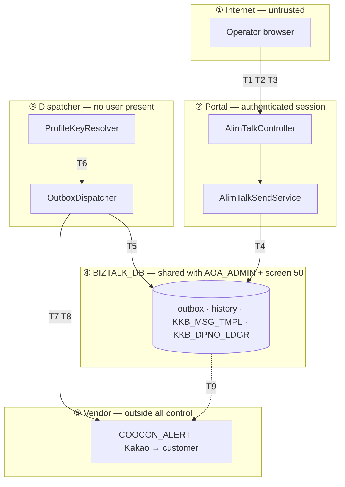

# Threat Model — 카카오 알림톡 (AlimTalk Compose · Send · Template Validation)

> **Version**: 1.0
> **Date**: 2026-08-18
> **Slice**: legacy screens 61, 50
> **Method**: STRIDE across every trust boundary + attack-surface analysis
> **Requirements**: [REQUIREMENTS-SPEC-ALIMTALK.md](../requirements/REQUIREMENTS-SPEC-ALIMTALK.md)
> **Architecture**: [architecture-overview-ALIMTALK.md](architecture-overview-ALIMTALK.md)
> **Gate**: G2 blocking condition — no unmitigated threat at CVSS ≥ 7.0 within our control

---

## 1. What is actually being protected

Not data at rest. **The ability to send a message that appears to come from a bank.**

An AlimTalk message arrives on a customer's phone inside a KakaoTalk channel the customer already trusts, bearing a registered 발신번호 and a template the institution registered. It is the ideal phishing vehicle — and this slice is the machinery that produces it. The asset is *legitimacy of origin*, and it is composed of three credentials this design touches: the vendor profile key (`sender_key`), the caller ID (`sender_number`), and the template registration (`template_code`).

A secondary asset is the recipient list. Phone numbers are personal data under 개인정보보호법 (BR-007), and a batch send carries up to the FR-ATS-014 cap of them in one request.

**The legacy's posture on the primary asset was: no protection at all.** The profile key was a literal in a JSP (D-A24), logged on every send (D-A30), and the composer asked operators to type it in by hand. Anyone with repository read access, log access, or a screenshot of the compose screen held the authority to send as the institution.

## 2. Trust boundaries

Five boundaries, and the fifth is the one that distinguishes this slice: **crossing it is irreversible.** A delivered message cannot be recalled. Every other slice in this programme could repair a bad write; here the consequence of a mistake is on a customer's phone.

| # | Boundary | Crossing data | New in this slice |
|---|----------|--------------|-------------------|
| ① → ② | Browser → API | Compose/send request; recipients; message | No |
| ② → ④ | Service → DB | Outbox intent, history, audit | No |
| ③ → ④ | Dispatcher → DB | Claim, status update | **Yes** — no prior slice had an unattended actor |
| ③ → ⑤ | Dispatcher → vendor | `RSMS` payload with profile key + recipients | **Yes** — first outbound channel in the programme |
| ④ ↔ legacy | Shared DB | Screen 50 and `AOA_ADMIN` write the same tables | Partly — inherited from the 발신번호 slice |

## 3. STRIDE analysis

### 3.1 Spoofing

| ID | Threat | Sev | Mitigation |
|----|--------|-----|-----------|
| **T-A1** | **An attacker sends as the institution using the leaked profile key.** The key is committed in cleartext and written to logs on every send — it must be assumed known outside the authorised set | **Critical** (CVSS ~9.1) | FR-ATS-003, NFR-SEC-CRED-A01, ADR-ATK-024 remove it from source, client and logs. **But the existing key is already exposed and rotation is outside our control** — RISK-A03, specification §6.5 action 1. **Until rotated, this threat is open regardless of what we ship** |
| T-A2 | Operator supplies a caller ID belonging to another institution, so messages appear to originate from it | High | FR-ATS-004 verifies `sender_number` against the ledger for the *session's* institution via `SenderNumberService`. This is where the 발신번호 slice's controls are actually spent |
| T-A3 | Operator sends using another institution's `template_code` | High | FR-ATT-004 rejects server-side; FR-ATT-003 scopes the registry read |
| T-A4 | Forged request with another institution's `is_cd` in the body | High | FR-AZ-A02 — scope from session, body never trusted alone. Inherited pattern from FR-AZ-D03 |
| T-A5 | Unauthenticated or non-operator caller reaches the send endpoint | High | FR-AZ-A01/A03, NFR-SEC-AUTHZ-A01. Note the legacy screen carried `login=Y` and nothing else, which sufficed only because `actUseYn=N` made it inert |

### 3.2 Tampering

| ID | Threat | Sev | Mitigation |
|----|--------|-----|-----------|
| T-A6 | Message body altered so the delivered text differs from the registered template — a phishing payload inside a legitimate template code | High | FR-ATV-001/002 match against `TEMPLATE_MSG` server-side **before despatch**. This is the control that makes template registration mean something |
| **T-A7** | **Regex injection through operator-authored template text.** `TEMPLATE_MSG` is operator-supplied and becomes a match pattern | Medium | `Pattern.quote()` on every literal segment (ADR-ATK-022). Closed by construction — but it is a genuinely new surface this design introduces, and it exists only because validation moved server-side |
| T-A8 | Outbox row modified between accept and dispatch, changing recipient or body after approval | High | Only the dispatcher writes outbox status; the payload column is never updated after insert. Direct DB access is the residual path (T-A14) |
| T-A9 | Payload does not conform to the contract, so fields are dropped in transit — the fallback silently lost | High | ADR-ATK-021 bidirectional contract test. **This is D-A1 recast as a threat**: a dropped `failback_data` means a notification the customer never receives |
| T-A10 | SQL injection via `template_code` or recipient input | Medium | NFR-SEC-INJ-A01, MyBatis named binding per ADR-003 |

### 3.3 Repudiation

| ID | Threat | Sev | Mitigation |
|----|--------|-----|-----------|
| T-A11 | An operator denies having sent a message, or a send cannot be attributed | High | FR-AZ-A04, FR-ATH-001, NFR-SEC-TX-A01, ADR-006. Legacy `KKB_ADMIN_SEND_HIS` recorded actor and serial only — no template, no counts, no outcome |
| T-A12 | History and delivery disagree, so records cannot be relied on as evidence | High | ADR-ATK-023 outbox; FR-ATH-003. **The legacy's records are already unreliable** — colliding `tran_id`s and post-send failure reporting mean existing history may under- or over-state what happened (§6.5 action 2) |
| T-A13 | A duplicate customer message with no record that it was a duplicate | Medium | ADR-ATK-026 dedupe returns the original outcome; at-least-once retries are attributed to the same `tran_id` |

### 3.4 Information disclosure

| ID | Threat | Sev | Mitigation |
|----|--------|-----|-----------|
| **T-A14** | **Recipient numbers and the profile key in application logs.** The legacy serialises the whole request at `debug` on every send | **High** (CVSS ~7.5) | NFR-SEC-PII-A02, NFR-SEC-CRED-A01. `ProfileKey` and `RecipientNumber` wrappers make `toString()` redact, so the defect is unreachable rather than merely removed (ADR-ATK-024) |
| T-A15 | Operator extracts recipient numbers via the composer's copy function, unrecorded | Medium | **Accepted — RESIDUAL-A01.** PM declined clipboard auditing. Compensating: NFR-SEC-PII-A01 masking beyond the entry field, FR-AZ-A01/A03. Narrower than the legacy, where copy-paste was the only way to send |
| T-A16 | Template registry read returns other institutions' templates | Medium | FR-ATT-003. Legacy `KKB_MSG_TMPL_L003` returns every active institution's templates in one unscoped query |
| T-A17 | Recipients visible in an error message or a stack trace | Medium | NFR-USE-A03 names the field and rule, never the value; redacting wrappers apply to exception messages |
| T-A18 | Payload at rest in the outbox contains recipients in clear | Medium | New exposure created by ADR-ATK-023. Outbox rows are purged on a short cycle; the payload column is not returned by any API. Recorded rather than eliminated — the intent must be stored to be dispatched |

### 3.5 Denial of service

| ID | Threat | Sev | Mitigation |
|----|--------|-----|-----------|
| T-A19 | Unbounded batch exhausts memory or the vendor quota | Medium | FR-ATS-014 configurable cap, server-enforced; NFR-SCALE-A01. Legacy had no cap |
| **T-A20** | **Catastrophic regex backtracking** from a template with many adjacent variables against long non-matching content | Medium | Match timeout, variable-count cap, rejection of adjacent variables with no intervening literal (ADR-ATK-022). **A surface this design introduces** — RISK-A10 |
| T-A21 | Vendor outage consumes the dispatcher pool | Medium | resilience4j circuit breaker + bulkhead (ADR-ATK-025); degrades to visible backlog |
| T-A22 | Outbox backlog grows silently and delivery stops | Medium | Micrometer/actuator backlog metrics with alerting. **The failure mode this design trades for the legacy's** — an outbox that stops draining is quiet by nature |
| T-A23 | Sequence exhaustion (1.6 M/institution/day) fails all sends | Low | Monitored; ADR-ATK-026 |

### 3.6 Elevation of privilege

| ID | Threat | Sev | Mitigation |
|----|--------|-----|-----------|
| T-A24 | Client supplies `sender_key` in the request body and sends with an arbitrary profile | High | Structural: `AlimTalkComposeRequest` has no such field, and the outbound DTO is a different type (ADR-ATK-024). Not a filter that can be forgotten |
| T-A25 | Compose authorization treated as sufficient for send | High | FR-AZ-A03 — send authorized separately and at least as strictly |
| T-A26 | Dispatcher runs with broader rights than the operator who queued the work | Medium | The dispatcher performs no authorization decisions; entitlement is settled at accept time and frozen into the outbox row. It cannot widen scope because it never evaluates scope |

## 4. Attack surface

| Surface | Exposure | Controls |
|---------|----------|----------|
| `POST /api/alimtalk/send`, `/batch` | Authenticated operators | FR-AZ-A01…A05, validation, dedupe, cap |
| `POST /api/alimtalk/validate` | Authenticated operators | Regex-injection quoting, match timeout (T-A7, T-A20) |
| `GET /api/alimtalk/templates` | Authenticated operators | FR-ATT-003 tenant scoping |
| Compose form fields | Operator input, 12 bounded fields | FR-ATC-005 length + charset from `min(contract, Kakao)` |
| Recipient input | Free text, up to the cap | Anchored pattern, dedupe, count (FR-ATS-005) |
| **Template body** | Operator-authored, becomes a regex | `Pattern.quote()`, ADR-ATK-022 |
| **Outbound vendor call** | Egress to a third party | TLS, host allowlist, profile key, conservative retry |
| **Outbox table** | Contains recipients + payload at rest | Short purge cycle, no API exposure (T-A18) |
| Shared `KKB_ADMIN_SEND_HIS` | Screen 50 + `AOA_ADMIN` also write | DB constraint on `(is_cd, tran_id)` binds both (ADR-ATK-026) |
| Application logs | Ops staff, log shipping | Redacting wrappers (T-A14) |
| Repository | Developers, CI | `gitleaks` in CI; the existing key treated as compromised |

**Surfaces this slice adds to the programme:** the outbound vendor channel, an unattended dispatcher identity, an at-rest payload store containing PII, and operator-authored text compiled into a regex. All four are consequences of the design choices, and all four are named here rather than discovered later.

## 5. Threats that cannot be closed here

| ID | Threat | Why it stays open |
|----|--------|-------------------|
| **T-A1 (residual)** | The **already-leaked** profile key | Rotation happens at the vendor, by the operator team. No code we ship closes it. **Go-live must not precede rotation** — RISK-A03 |
| T-A27 | Screen 50 keeps all 12 of its defects during the coexistence window | Retired at cutover per CONFLICT-A01, not before. Until then the hardcoded key is live and `tran_id` collisions are possible from that path — the DB constraint limits the damage to a failed insert |
| T-A28 | **Vendor may not deduplicate a repeated `tran_id`**, making at-least-once despatch a duplicate-message risk | Unknowable from source. Task A1-03 establishes it; RISK-A07. If the answer is "no", ADR-ATK-025's conservative retry split becomes permanent rather than provisional |
| T-A29 | `AOA_ADMIN` reads `KKB_DPNO_LDGR` and could register a caller ID that bypasses our controls | Inherited RISK-S05; outside this slice's boundary |
| T-A30 | The vendor's own handling of our payload — logging, retention, onward transmission of recipient numbers | Contractual, not technical. Worth naming: we ship PII across this boundary and cannot verify its treatment |
| T-A31 | Template bodies arrive in `KKB_MSG_TMPL` by an unidentified process | AMB-A07. A compromised writer of that table could alter what messages are permitted to say — a supply-chain path into T-A6 that our validation would *endorse* rather than catch |

> **T-A31 deserves emphasis.** FR-ATV-001 makes `TEMPLATE_MSG` authoritative for what may be sent. That is a security improvement over the legacy's "no check at all" — but it also makes whoever writes that table an unaudited authority over message content. We have made the registry load-bearing without knowing who loads it.

## 6. Severity and gate impact

| Threat | CVSS (est.) | Within our control | G2 impact |
|--------|------------:|--------------------|-----------|
| T-A1 — leaked profile key | 9.1 | Partly — we remove it from code; **rotation is not ours** | **Blocking for go-live, not for G2.** Mitigations designed; §6.5 action 1 must complete before first send |
| T-A14 — PII + credential in logs | 7.5 | Yes | Mitigated by ADR-ATK-024 — not blocking |
| T-A2/A3/A4 — origin spoofing | 7.1–7.4 | Yes | Mitigated by FR-ATS-004, FR-ATT-004, FR-AZ-A02 — not blocking |
| T-A6 — template tampering | 7.0 | Yes | Mitigated by FR-ATV-001/002 — not blocking |
| T-A9 — silent field loss | 6.8 | Yes | Mitigated by ADR-ATK-021 — not blocking |
| T-A28 — vendor non-idempotency | 6.5 | No | **Spike A1-03 required before Sprint A2 commits to retry policy** |
| T-A7, T-A20 — regex surfaces | 5.3 | Yes | Mitigated by ADR-ATK-022 — not blocking |
| T-A15 — clipboard egress | 4.3 | Accepted by PM | RESIDUAL-A01, G1 acknowledgement |

**Orphan check: 0.** Every threat T-A1…T-A31 maps to a requirement (FR/NFR), an ADR, an accepted residual, or a named out-of-boundary risk.

**G2 assessment.** No threat at CVSS ≥ 7.0 that is within our control is unmitigated by design. T-A1 is the highest-severity threat in the slice and its residual portion is an **operational precondition to go-live**, recorded as such rather than as a design gap.

## 7. Maintenance

Revised when: the vendor contract changes (ADR-ATK-021's version/hash assertion will force this); the profile-key model changes from one key to per-institution keys (A1-04); the dispatcher becomes broker-backed (ADR-ATK-023 option E); image or item-list fields are added (AMB-A05); or delivery-receipt ingestion is built. Each revision is recorded as an ADR amendment, per §3.5 of the harness standard.
