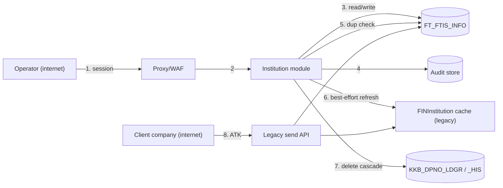

# Threat Model — 이용기관관리 (Client Institution Management)

> **Version**: 1.1
> **Date**: 2026-08-14 · **Revised**: 2026-08-20 (screen-01 gap pass — TM-I021…I024 added; TM-I012 and TM-I015 revised)
> **Method**: STRIDE across every trust-boundary-crossing flow + attack surface analysis
> **Predecessor**: [REQUIREMENTS-SPEC-INSTITUTION.md](../requirements/REQUIREMENTS-SPEC-INSTITUTION.md)
> **Companions**: [threat-model.md](threat-model.md) (문자내역), [threat-model-LOGIN.md](threat-model-LOGIN.md)
> **Status**: **APPROVED (G2)** — 2026-08-21, PM (TM-I005 · TM-I007 수용된 잔존 위험 / accepted as residual)

---

## 1. Scope and trust boundaries

This module manages the **tenant registry and the credentials client companies authenticate with**. Compromising it is not equivalent to compromising one tenant's data — it grants control over who exists on the platform and what credential each holds.

| Boundary | Crossing | Trust change |
|----------|----------|--------------|
| B1 | Internet → portal | Untrusted → authenticated operator |
| B2 | Portal → `FT_FTIS_INFO` | Application → shared control data |
| B3 | Portal → audit store | Application → append-only record |
| B4 | Portal → legacy `FINInstitution` cache | Our process → **another system we do not control** |
| B5 | Legacy send API → `FT_FTIS_INFO` | **Enforcement point outside our boundary** |

B4 and B5 are new to this slice. Every earlier module lived entirely inside B1–B3.

### Data flow diagram

## 2. STRIDE analysis

| ID | Component / flow | STRIDE | Threat scenario | Impact | Mitigation | ADR / REQ |
|----|------------------|--------|-----------------|--------|-----------|-----------|
| TM-I001 | All admin endpoints (2) | **E**oP | Any authenticated user — including a client-company tenant — calls the delete or upsert endpoint directly. **The legacy gated all eight services on `<login>Y</login>` and nothing else** | **High** | `/api/admin/**` → `ROLE_OPERATOR` routing rule plus controller `@PreAuthorize`; every endpoint security-tested as a non-operator | ADR-008 / FR-AZ-I01/I02, D-I2 |
| TM-I002 | Duplicate check (5) | **I**nfo disclosure | Enumerate 기관코드 (`K0` + 4 chars ≈ 15M, far fewer in practice) and harvest each institution's full record **including its `ATK`**. The legacy endpoint ran the full detail query | **High** | Availability boolean only; rate-limited; audited | ADR-INST-015 / FR-INSTC-005, FR-ATK-004, D-I3 |
| TM-I003 | Institution list (2,3) | **I**nfo disclosure | Every institution's `ATK` rendered unmasked in the grid — one screenshot exposes every customer credential | **High** | Masked to last 4; full value never in a list payload; reveal is a separate audited endpoint | ADR-INST-015 / FR-ATK-002/003, D-I5 |
| TM-I004 | Create endpoint (2,3) | **T**ampering | A create call with an **existing** 기관코드 silently overwrites that institution and replaces its `ATK`, cutting off a live customer. The legacy IDO is a blind UPSERT guarded only by a JS flag | **High** | Create and update are separate verbs; create rejects an existing code server-side | ADR-INST-016 / FR-INSTC-004, D-I6 |
| TM-I005 | `ATK` at rest (3) | **I**nfo disclosure | Database read yields **plaintext live credentials** for every institution; existing keys carry only browser-`Math.random()` entropy | **High** | Exposure paths closed (TM-I002/I003); generation moved to `SecureRandom`. **Storage stays plaintext and existing keys are retained — accepted residual** | ADR-INST-015 §2.1 / RESIDUAL-I01 |
| TM-I006 | Key generation (2) | **S**poofing | `Math.random()` output is predictable — V8's xorshift128+ state is recoverable from a short sequence, letting an attacker derive other institutions' keys generated in the same session | **High** | Server-side `SecureRandom`, 160 bits; client generator deleted | ADR-INST-015 / FR-ATK-001, D-I4 |
| TM-I007 | Status update (3) | **T**ampering | Disable writes a table nothing reads, so an institution an operator believes is stopped keeps its API access. **This is D-I1, present in production today** | **High** | Writes `FT_FTIS_INFO`; round-trip asserted by test; operational data audit for institutions already in this state | ADR-INST-014 / FR-INSTL-001, D-I1 |
| TM-I008 | Delete cascade (7) | **R**epudiation | Institution deleted with no record of who or when; 문자발송내역 orphaned so past activity is no longer attributable | **High** | Logical delete, row retained, audit event with actor and prior state | ADR-INST-014 / FR-INSTL-004, D-I7 |
| TM-I009 | Delete transaction (3,7) | **T**ampering | A sub-operation fails, the transaction commits anyway, leaving 발신번호 half-processed with no history. The legacy tests the **wrong result object** in its loop | Medium | Single transaction; forced-failure rollback test | ADR-002 / FR-INSTL-006, D-I8 |
| TM-I010 | Grid rendering (2) | **T**ampering | Stored XSS — 기관코드 is concatenated into an inline `onclick`, and its format is enforced only in the browser, so a direct API call can plant a payload | Medium | Server-side format validation; React escaping; no concatenated handlers | — / FR-INST-007, FR-INSTC-003, D-I12/D-I19 |
| TM-I011 | Search (3) | **D**oS | Unbounded result set — no `LIMIT` in the legacy query, so the full registry is decrypted, serialised and shipped per request | Medium | Server-side paging, default 20 / max 200; `LIKE` operands escaped | — / FR-INST-003, NFR-PERF-I02, D-I10 |
| TM-I012 | Legacy cache (6, B4) | **T**ampering | A committed change never reaches the `FINInstitution` cache, so the legacy serves stale entitlement. The legacy swallows the refresh failure in `catch(Throwable)` | Medium | **Revised 2026-08-20 (AMB-I11).** The portal cannot refresh an in-process cache in another process, and building a notifier into a system we do not own was declined. The portal invalidates its own view so the operator never reads back a stale record; the legacy cache's staleness window is **accepted and tracked** as RISK-I02, closing at cutover with the legacy screens | ADR-INST-016 §2.2, ADR-INST-017 / FR-INSTC-008, NFR-OPS-I02, D-I17 |
| TM-I013 | Send API entitlement (8, B5) | **E**oP | A disabled or deleted institution continues to send, because enforcement lives in the legacy runtime which this portal cannot control | **High** | State written correctly and verified to our boundary. **Enforcement gap is accepted for the coexistence window** | ADR-INST-016 §2.3 / RISK-I02 |
| TM-I014 | Manager endpoints (2) | **I**nfo disclosure | `biztalk_admin_00_l002` returns the full platform manager roster to any authenticated caller; its only gate is a client-side `alert('권한 없음')` | Medium | **Not ported.** The screen is out of scope and the endpoint does not exist in the new system | — / AMB-I02, D-I13 |
| TM-I015 | Update path (3) | **T**ampering | A full-column `INSERT`/`UPDATE` nulls out 30 operational columns (`SRVR_IP`, `GRAMT`, `BSNN_STTS_CKYN` …) this slice does not own | Medium | Writes restricted to 11 columns on create and **8 on update**; the others are not named in any statement; test asserts them unchanged | ADR-INST-016 rule 4 |
| TM-I016 | Audit trail (4) | **R**epudiation | An operator denies creating, disabling or deleting an institution, or a key reveal leaves no trace | Medium | Every state change and every reveal audited with actor, target and before/after; append-only | ADR-006 / FR-AZ-I04, NFR-OPS-AUDIT-I01 |
| TM-I017 | Logs | **I**nfo disclosure | `ATK` or an encrypted 발신번호 written to logs. Every legacy action JSP logs error payloads at debug level | Medium | No credential or personal data in logs; gitleaks and log-scan in CI | ADR-005 / NFR-SEC-LOG-I01 |
| TM-I018 | Key reveal (2) | **E**oP | The reveal endpoint becomes a routine convenience, restoring the exposure that masking removed | Medium | Separate authorization, individually audited, rate-limited; reveals reviewed in the operational audit | ADR-INST-015 / FR-ATK-003 |
| TM-I019 | Concurrent legacy edit (B2) | **T**ampering | The legacy admin screens 00/01 remain live and edit the same row; last write wins with no lock spanning both systems | Medium | Legacy screens disabled at deployment (T-I2-12); optimistic check on `LAST_AMDT` | ADR-INST-016 / RISK-I04 |
| TM-I020 | Dependent-count preview (7) | **I**nfo disclosure | The pre-delete confirmation reveals message volumes for an institution | Low | Operator-only path; counts only, no message content | — / FR-INSTL-008 |
| TM-I021 | Detail endpoint (2,3) | **I**nfo disclosure | **D-I20.** The legacy detail service declared `ATK` in its `<out>` rule and the popup wrote it into the DOM, gated on `<login>Y</login>` alone — so any authenticated caller could post any 기관코드 and read that institution's plaintext credential. Identical to TM-I002, through a service the first pass read for its field list rather than as an exposure | **High** | Detail response carries the masked value only; the plaintext never leaves the service layer. Security test asserts the response contains no key-shaped value | ADR-INST-015 / FR-INSTC-010, FR-ATK-002, D-I20 |
| TM-I022 | Update path (3) | **T**ampering | The masked value the form holds (`•••••7f3a`) is written back as the credential by a client that echoes the field, silently replacing a live key with asterisks and cutting off the customer | **High** | **Unrepresentable:** the update statement has no `ATK` column and the request record no key field. A key changes only through rotation, which generates server-side and accepts no caller-supplied value. `AtkGenerator.isWellFormed` rejects mask characters as a second line | ADR-INST-015 / FR-INSTC-011, FR-ATK-001 |
| TM-I023 | Update path (3) | **E**oP / **R**epudiation | `IS_STTS='D'` submitted through the edit form — a logical delete with no confirmation, no dependent-record preview and no deletion audit entry, recorded as an ordinary field edit | Medium | 사용여부 accepts `Y`/`N` only on this path; `D` is rejected server-side. Delete keeps its own endpoint, confirmation and audit action | ADR-INST-014 / FR-INSTC-015, FR-INSTL-003/004 |
| TM-I024 | Key rotation (2,3) | **D**oS | Rotation is a per-tenant kill switch: one confirmed click breaks that institution's live integration until the new key is distributed. A compromised or mistaken operator session can do it repeatedly, and it is indistinguishable from legitimate use | Medium | Explicit confirmation naming the consequence; the new key returned once for distribution; audited under its own action with actor and target. **No dual control** — see §4 | ADR-INST-015 / FR-ATK-005, FR-INSTC-011, FR-AZ-I04 |

> **STRIDE coverage** — Spoofing ✅ (TM-I006) · Tampering ✅ (TM-I004/007/009/010/012/015/019) · Repudiation ✅ (TM-I008/016) · Information disclosure ✅ (TM-I002/003/005/014/017/020) · DoS ✅ (TM-I011) · Elevation of privilege ✅ (TM-I001/013/018). All six categories reviewed against every boundary-crossing flow (B1–B5). **Orphan threats: 0** — every entry maps to an ADR or an NFR-SEC/FR requirement.

## 3. Attack surface

| Surface | Exposure | Auth / authz | Input validation | Note |
|---------|----------|--------------|------------------|------|
| `GET /api/admin/institutions/search` | Internet | Session + OPERATOR | Name length, status enum, page bounds | TM-I003, TM-I011 |
| `GET …/availability` | Internet | Session + OPERATOR | Code format | **TM-I002 — the enumeration surface**; rate-limited |
| `POST /api/admin/institutions` | Internet | Session + OPERATOR | Full server-side validation | TM-I004 |
| `PUT …/{code}` | Internet | Session + OPERATOR | Full server-side validation | TM-I015 |
| `POST …/{code}/status` | Internet | Session + OPERATOR | Status enum | TM-I007 |
| `DELETE …/{code}` | Internet | Session + OPERATOR | Code exists | TM-I008, TM-I009 |
| `POST …/keys`, `…/key/rotate` | Internet | Session + OPERATOR | — | TM-I006 |
| `GET …/{code}/key` | Internet | Session + OPERATOR + audit | — | **TM-I018 — the deliberate exposure path** |
| `FT_FTIS_INFO` | Internal, **shared** | App account + legacy runtime | — | TM-I005, TM-I019 |
| `FINInstitution` refresh | Outbound to legacy | — | — | TM-I012 |

The registry has **no unauthenticated surface**. Unlike 로그인, every endpoint sits behind an established operator session — so the dominant risk class is elevation and disclosure by an already-authenticated actor, not perimeter attack.

## 4. Unresolved threats / residual risk

| ID | Threat | Status | Residual | Decision | Approver |
|----|--------|--------|----------|----------|----------|
| TM-I005 | Plaintext `ATK` at rest; existing keys retain `Math.random()` entropy | **ACCEPTED** | **H** | PM ruled (AMB-I04) to preserve keys so client integrations keep working. Exposure paths close; entropy does not improve. Hashing is impossible while the legacy send path verifies the value directly. FR-ATK-005 makes a future reissue an operational decision | PM · **정보보호 recommended before G3** |
| TM-I013 | Disabled/deleted institution may still send during coexistence | **ACCEPTED (bounded)** | **M–H** | Enforcement is in the legacy runtime (ADR-INST-016 §2.3). Bounded — closes at cutover. **Named cutover action required**: confirm the send path honours non-`'Y'` `IS_STTS` before the legacy is decommissioned | PM (RISK-I02) |
| TM-I007 | Institutions already in the D-I1 state — believed stopped, actually active | **OPEN** | **H** | The code fix does not repair existing data. PM approved an operational audit (AMB-I01) to find institutions disabled through the legacy screen whose `FT_FTIS_INFO.IS_STTS` still reads `'Y'`. **Not closable by code** | PM (RISK-I01) |
| TM-I012 | Legacy cache staleness window | ACCEPTED (revised) | M | **Revised 2026-08-20 (AMB-I11).** The portal does not trigger a legacy refresh — it cannot reach an in-process cache in another process, and adding a call into a system we do not own was declined. It invalidates its own view instead. The legacy window stays open until the legacy screens are disabled at cutover; cadence unmeasured | PM (RISK-I02, RISK-I13) |
| TM-I024 | Key rotation has no dual control | ACCEPTED | M | One operator can break one customer's integration with one confirmed action. Mitigated by confirmation, single-use display of the new key, and audit — **not** by a second approver. Reconsider if operator headcount grows or if rotation becomes routine (it should not: FR-ATK-005 exists for scheduled campaigns, not daily use) | PM |
| TM-I019 | Concurrent edits from still-live legacy screens | MITIGATED (partial) | M | Legacy screens 00/01 disabled at deployment; until then, last write wins | PM (RISK-I04) |
| TM-I018 | Key reveal as a sanctioned exposure path | MITIGATED | L–M | Accepted — support staff need it. Its real control is the audit review, a **procedure outside the software** | PM |

> **Two items reach CVSS ≥ 7.0 equivalence unmitigated and are therefore G2/G3 blocking conditions: TM-I005 and TM-I007.**
>
> Neither is closable by writing code. TM-I005 is a deliberate business trade-off that warrants a 정보보호 sign-off rather than a PM-only one, because it accepts plaintext storage of live customer credentials. TM-I007 needs an operational data audit — the code fix stops the bleeding but does not identify institutions already in the bad state.
>
> TM-I013 sits just below the line only because it is bounded by cutover. If cutover slips indefinitely, it should be re-rated.

## 5. DoD

- [x] STRIDE applied to every boundary-crossing flow (B1–B5), all six categories
- [x] Attack surface enumerated with auth/authz and validation per entry
- [x] Every threat mapped to an ADR or NFR-SEC/FR requirement — **orphan threats: 0**
- [x] Residual risks recorded with a named approver
- [x] Blocking conditions for G2/G3 identified (TM-I005, TM-I007)
- [ ] 정보보호 review of TM-I005 — **recommended before G3**
