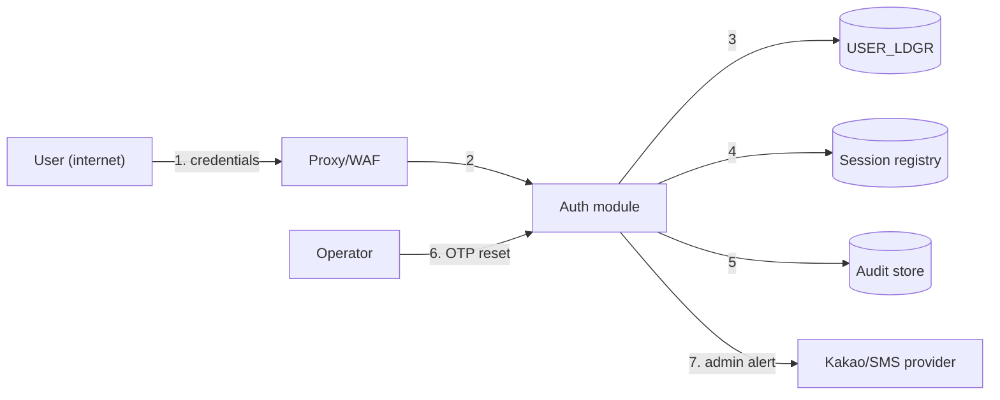

# Threat Model — 로그인 (Authentication module)

> **Skill**: `03-draft-dev-plan` (design stage, pre-G2)
> **Lead**: `architect` / **Review**: `security-auditor`
> **Method**: STRIDE + attack surface analysis
> **Date**: 2026-08-14
> **Companion**: [threat-model.md](threat-model.md) (문자내역 slice)

---

## 1. Scope and trust boundaries

**System under analysis**: login, OTP registration, operator OTP reset, password change.

This module is the **single point of entry** to the portal. Every threat mitigated in the 문자내역 model assumes an authenticated, correctly-scoped session — which this module produces. A failure here invalidates the controls downstream.

| # | Boundary | Note |
|---|----------|------|
| TB-L1 | Internet ↔ DMZ | Login is the most-probed endpoint on any internet-facing system |
| TB-L2 | DMZ ↔ application | Trusted client-IP resolution happens here |
| TB-L3 | Application ↔ `USER_LDGR` | Password hashes and OTP secrets |
| TB-L4 | Application ↔ session registry | Session identity, shared across instances |
| TB-L5 | Operator ↔ user account | **The OTP reset path crosses this** — an operator can remove any user's second factor |
| TB-L6 | Application ↔ notification channel | Admin-login alerts leave the system |

**Assets**

| Asset | Sensitivity |
|-------|-------------|
| Password hashes | Compromise → account takeover across the portal. Currently unsalted SHA-256 |
| OTP secrets (`OTP_KEY`) | Compromise → the second factor is defeated silently and permanently |
| Session identifiers | Bearer of all authority |
| Account metadata (`FLNM`, `CLPH_NO`, `EML`) | PII |
| Failure counters | Integrity matters — tampering disables lockout |
| Kakao `sender_key` | **Currently hardcoded in source (L1)** |

### Data flow diagram

## 2. STRIDE analysis

| ID | Component / flow | STRIDE | Threat scenario | Impact | Mitigation | ADR / REQ |
|----|------------------|--------|-----------------|--------|-----------|-----------|
| TM-L001 | Login endpoint (1) | **S**poofing | Credential stuffing or brute force against an internet-exposed login | High | Lockout at 5 (FR-LOGIN-003/010) **plus** independent rate limiting per account and source (FR-LOGIN-025); two factors required | ADR-LOGIN-010 / NFR-SEC-AUTH-L01 |
| TM-L002 | Password store (3) | **I**nfo disclosure | Stolen database yields passwords — unsalted SHA-256 is rainbow-table and fast-guess exposed | **High** | Argon2id with per-user salt and work factor; upgrade-on-login **conditional on the database never having been exposed** (ADR-LOGIN-011 §3) | ADR-LOGIN-011 / FR-LOGIN-005 |
| TM-L003 | Session establishment (2,4) | **S**poofing | Session fixation — an attacker plants a session id, the victim authenticates into it | High | Session id regenerated at login; HttpOnly/Secure/SameSite cookie | ADR-LOGIN-012 / NFR-SEC-SESSION-L01 |
| TM-L004 | OTP verification (3) | **S**poofing | Replay of an observed OTP code within its validity window | Medium | ±1 step tolerance is the **minimum** necessary, not more; single-use enforcement per (account, step) prevents replay inside the window | ADR-LOGIN-010 / FR-LOGIN-011 |
| TM-L005 | OTP secret (3) | **I**nfo disclosure | Secret exfiltrated → attacker generates valid codes indefinitely, undetectably | **High** | Secret encrypted at rest, displayed once at registration, never returned by any API | ADR-LOGIN-010 / NFR-SEC-PII-L01 |
| TM-L006 | OTP registration (2) | **S**poofing | Attacker with a stolen password enrols **their own** OTP device on an account that has none | **High** | Registration requires email + password; only accounts with an empty `OTP_KEY` are eligible; registration audited and the user notified | — / FR-OTP-001, FR-OTP-005 |
| TM-L007 | QR generation | **I**nfo disclosure | The secret is transmitted to a third party — the legacy helper builds a `http://chart.apis.google.com` URL containing it, in cleartext | High | QR generated locally; the helper is not ported in any form | ADR-LOGIN-010 / FR-OTP-004 |
| TM-L008 | **Operator OTP reset (6)** | **E**oP | An operator — or anyone who compromises an operator account — removes a user's second factor and takes the account over | **High** | Operator role required; every reset audited with actor, target and reason; user notified through a different channel; self-reset prohibited (AMB-L08) | ADR-006 / FR-OTP-007/008 |
| TM-L009 | Session registry (4) | **T**ampering | Forged or replayed session record grants access without authenticating | High | Session ids are unguessable and server-generated; registry writable only by the application account | ADR-LOGIN-012 / NFR-SEC-SESSION-L01 |
| TM-L010 | Failure counters (3) | **T**ampering | Counters reset or suppressed, disabling lockout entirely | Medium | Counters updated only through the application's least-privilege DB account; no client-influenced path | ADR-007 / FR-LOGIN-003/010 |
| TM-L011 | Client IP (2) | **T**ampering | Forged `X-Forwarded-For` defeats the IP allowlist and poisons login history — the legacy trusts a list of client-supplied headers including `HTTP_VIA` | High | IP resolved only at the trusted proxy boundary; application ignores raw headers | — / FR-LOGIN-019 |
| TM-L012 | Login responses (2) | **I**nfo disclosure | Account enumeration through differing messages or response times | Medium | Single response path for unknown-account and wrong-password; lockout evaluated before credential verification so it cannot act as an oracle | — / FR-LOGIN-002 |
| TM-L013 | Audit trail (5) | **R**epudiation | A user denies an action, or an attacker's login leaves no trace | Medium | Every outcome audited — success, failure, lockout, reset, password change — append-only, 5-year retention | ADR-006 / NFR-OPS-AUDIT-L01 |
| TM-L014 | Logs | **I**nfo disclosure | Credentials or session ids in logs. **The legacy logs email, session id and IP at debug level** on every duplicate-login detection | Medium | No credential, OTP code, secret or session id in logs; static analysis in CI | ADR-005 / NFR-SEC-LOG-L01 |
| TM-L015 | Notification channel (7) | **I**nfo disclosure | The admin-alert path carries a masked name to three hardcoded numbers using a **hardcoded `sender_key` present in source** | **High** | Recipients and keys move to configuration; secret rotated; gitleaks in CI | ADR-007 / FR-LOGIN-021, NFR-SEC-SECRET-L01 |
| TM-L016 | Login endpoint (1) | **D**oS | Argon2id is deliberately expensive; unauthenticated request floods turn that cost into a CPU exhaustion vector | Medium | Rate limiting **before** hashing; work factor tuned against measured capacity; WAF-level protection | ADR-LOGIN-011 / FR-LOGIN-025 |
| TM-L017 | Account lockout | **D**oS | Deliberate lockout of a known account by submitting five wrong passwords | Medium | Accepted residual — the alternative (no lockout) is worse. Rate limiting by source reduces breadth; operator unlock path exists | — / FR-LOGIN-003 |
| TM-L018 | Password change (2) | **E**oP | Session hijacker changes the password to gain persistence | Medium | Current password required for any change (FR-PWD-002) | — / FR-PWD-002 |
| TM-L019 | Dormancy / status checks | **E**oP | A terminated (`JNNG_STTS='9'`) or dormant account regains access | Medium | Status and dormancy enforced on login **and** on OTP registration and reset (FR-OTP-009, UC-LOGIN-003 E-3) | — / FR-LOGIN-012/013 |

> STRIDE coverage: Spoofing ✅ (TM-L001/003/004/006) · Tampering ✅ (TM-L009/010/011) · Repudiation ✅ (TM-L013) · Information disclosure ✅ (TM-L002/005/007/012/014/015) · DoS ✅ (TM-L016/017) · Elevation of privilege ✅ (TM-L008/018/019). **All six categories reviewed against every boundary-crossing flow. Orphan threats: 0.**

## 3. Attack surface

| Surface | Exposure | Auth / authz | Input validation | Note |
|---------|----------|--------------|------------------|------|
| `POST /api/auth/login` | **Internet, unauthenticated** | — (entry point) | Email format, password length, OTP 6 numeric digits | The most-attacked endpoint in the system |
| `POST /api/auth/otp/register` | **Internet** | Email + password required | 6 numeric digits | TM-L006 — enrolment on a password-only account |
| `POST /api/auth/password` | Internet, authenticated | Session + current password | Strength policy | TM-L018 |
| `POST /api/admin/otp/reset` | Internet (operator) | Session + operator role | Target account, reason | TM-L008 — the second-factor bypass path |
| `POST /api/auth/logout` | Internet, authenticated | Session | — | |
| Session registry | Internal | App account only | — | TM-L009 |
| Notification egress | Outbound to provider | Provider credential | — | TM-L015 |

## 4. Unresolved threats / residual risk

| ID | Threat | Status | Residual | Decision | Approver |
|----|--------|--------|----------|----------|----------|
| TM-L002 | Upgrade-on-login re-blesses credentials if the hash database has already leaked | **OPEN** | **H** if exposed, L if not | **Blocks ADR-LOGIN-011.** Requires confirmation that the `USER_LDGR` password column has never been exposed in a backup, extract, or vendor handover. If it cannot be confirmed, ADR-LOGIN-011 option B (forced reset) is mandatory | PM + 정보보호 |
| TM-L015 | `sender_key` and three personal mobile numbers currently in application source | **OPEN** | **H** | Treat the key as disclosed and rotate it **now**, independently of this project's timeline. If the source tree has ever left the organisation, the numbers are also disclosed | PM + 정보보호 |
| TM-L008 | Operator OTP reset is a sanctioned second-factor bypass | MITIGATED (partial) | **M** | Accepted — it is the only recovery path (AMB-L02). Its real strength is the out-of-band identity check, which is a **procedure outside the software** and must be documented and owned | PM |
| TM-L017 | Deliberate account lockout | ACCEPTED | **M** | Accepted; the alternative is no lockout | PM |
| TM-L005 | Existing 80-bit OTP secrets remain in use for already-enrolled users | ACCEPTED | **M** | Re-issuing all secrets would force every user to re-enrol. Proposed: re-issue at the next operator reset (ADR-LOGIN-010 §4.3) | PM |

> **Two items reach CVSS ≥ 7.0 equivalence unmitigated and are therefore G2/G3 blocking conditions: TM-L002 and TM-L015.** Neither is resolved by writing code — one needs a factual answer about past data exposure, the other needs a key rotation.

## 5. DoD

- [x] STRIDE 6 categories reviewed against every trust-boundary-crossing flow
- [x] Every threat mapped to a mitigation + ADR/REQ — **orphan threats: 0**
- [x] Attack surface table with auth and input validation stated
- [x] Residual risks listed for PM / 정보보호 acceptance
- [x] CVSS ≥ 7.0 equivalents linked to G2/G3 blocking conditions
- [ ] PM / 정보보호 decision on TM-L002 (exposure history) and TM-L015 (key rotation)
