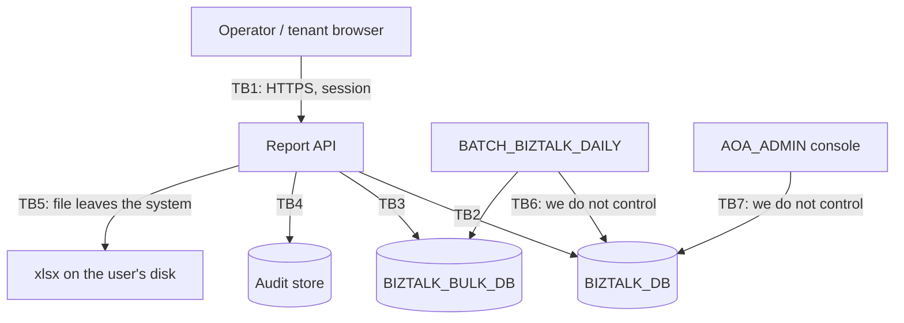

# Threat Model — 이용기관 보고서 (Institution Usage Report)

> **Version**: 1.0
> **Date**: 2026-08-18
> **Method**: STRIDE over trust-boundary-crossing flows + attack-surface analysis
> **Predecessor**: [REQUIREMENTS-SPEC-REPORT.md](../requirements/REQUIREMENTS-SPEC-REPORT.md), [architecture-overview-REPORT.md](architecture-overview-REPORT.md)
> **Siblings**: [threat-model.md](threat-model.md), [-LOGIN](threat-model-LOGIN.md), [-INSTITUTION](threat-model-INSTITUTION.md), [-SENDERNO](threat-model-SENDERNO.md)
> **Orphan threats**: 0 — every threat maps to an NFR-SEC / FR or is listed in §5 as unclosable here

---

## 1. What is actually being protected

This is the programme's first slice with **no personal information**. Every field is an aggregate count; there is no phone number, no name, no credential, nothing the 개인정보보호법 controls in the earlier slices were built for.

It would be easy to read that as lower risk. It is the opposite.

What this screen holds is **every customer's business volume, by day and by channel** — 알림톡 campaign timing, SMS fallback rates, growth curves, and the relative size of every institution against every other. For a competitor, a broker, or a departing employee, that is a more directly monetisable asset than any single phone number in the 발신번호 slice. And in the legacy it is available to an **unauthenticated** caller who omits one parameter (D-R1 + D-R2).

**The control objective here is commercial confidentiality, not personal privacy.** CONST-LEGAL-R01 states it; this model is built around it.

Secondary asset: **integrity of the figures themselves**. These numbers plausibly feed 수수료 reconciliation (BR-012). A report that under-reports silently — which is exactly what D-R27 already causes upstream — is a billing problem, not just a display problem.

## 2. Trust boundaries

| ID | Boundary | Crossing data | Notes |
|----|----------|---------------|-------|
| TB1 | Browser ↔ Report API | query parameters, aggregate rows, xlsx bytes | The only boundary an attacker reaches directly |
| TB2 | API ↔ `BIZTALK_DB` | bound parameters, aggregate + institution rows | Read-only |
| TB3 | API ↔ `BIZTALK_BULK_DB` | bound parameters, aggregate rows | Read-only; **second datasource, second surface** |
| TB4 | API ↔ audit store | actor, scope, range, row counts | Append-only (ADR-006) |
| TB5 | API → downloaded file | complete result set as a file | **One-way; no control after it crosses** |
| TB6 | Batch → both databases | daily aggregates | Outside our control; already defective |
| TB7 | `AOA_ADMIN` → `BIZTALK_DB` | same screens, all 25 defects | Outside our control |

TB5 and TB7 are the boundaries that produce this slice's unclosable threats (§5).

## 3. STRIDE analysis

### 3.1 Spoofing

| ID | Threat | Pre-state | Mitigation |
|----|--------|-----------|------------|
| T-R01 | **Unauthenticated caller reads the report service directly.** `WSVC.biztalk_admin_20_l001` declares `<login>N</login>` while the screen and export around it declare `Y` — the one service that returns the figures is the one requiring no session | **D-R1, live** | FR-AZ-R01, NFR-SEC-AUTHZ-R01. Endpoint inventory test asserts no anonymous endpoint remains |
| T-R02 | Session replay / fixation against the report endpoints | Inherited | Settled by [ADR-LOGIN-012](adr/ADR-LOGIN-012-session-management.md); not re-specified |
| T-R03 | CSRF on the export endpoint causing a victim's browser to generate and leak a report | Latent | Export is `GET` and side-effect-free apart from audit; [ADR-014](adr/ADR-014-csrf-token-transport.md) applies to state-changing calls. `fetch` with same-origin credentials plus `SameSite` cookies closes the drive-by case |

### 3.2 Tampering

| ID | Threat | Pre-state | Mitigation |
|----|--------|-----------|------------|
| T-R04 | **Institution-scope tampering.** `IS_CD` is taken verbatim from the request and an empty value means *all institutions* | **D-R2, live** | FR-AZ-R03 — scope resolved server-side from session + role; a supplied `IS_CD` is ignored for tenant principals, not merely validated |
| T-R05 | Date-parameter tampering to force a full-table scan (`START_DT=00000000`, `END_DT=99999999`) | **D-R9, live** | FR-RPT-002/003/004 — calendar validation and a 366-day cap, server-side. Also DoS (T-R08) |
| T-R06 | SQL injection through report parameters | **Not present** | All IDOs use named binds (`:START_DT`). Preserved by MyBatis `#{}` per [ADR-003](adr/ADR-003-persistence-strategy.md). Recorded because its absence is a property to keep, not luck |
| T-R07 | **Response-splitting via the export filename.** `START_DT`/`END_DT` flow raw from `request.getParameter` into `Content-Disposition`; the non-IE branch performs no encoding | **D-R3, live** | FR-RPTX-004, NFR-SEC-HDR-R01 — validated inputs, RFC 6266/5987 encoding, CR/LF rejected before a header is composed |

### 3.3 Repudiation

| ID | Threat | Pre-state | Mitigation |
|----|--------|-----------|------------|
| T-R08 | **A user exports every institution's volumes and no record exists that they did.** `mntLogYn=Y` yields a Jex service-monitor entry that disappears with Jex (BR-002…005) | **D-R17, live** | FR-AZ-R05, FR-RPTX-012 — actor, scope, range, 발송구분 and **rows actually written**, append-only via [ADR-006](adr/ADR-006-audit-logging.md) |
| T-R09 | Denied access attempts leave no trace, so enumeration is invisible | Latent | FR-AZ-R05 covers denials as well as successes, per the [ADR-SND-019](adr/ADR-SND-019-senderno-read-audit.md) precedent |

### 3.4 Information disclosure — the slice's headline

| ID | Threat | Pre-state | Mitigation |
|----|--------|-----------|------------|
| T-R10 | **Unauthenticated dump of every customer's message volume.** T-R01 ∘ T-R04: one request, no credentials, `IS_CD=''` and a wide range. Pre-fix CVSS v3.1 ≈ **9.1** (AV:N/AC:L/PR:N/UI:N/S:U/C:H/I:N/A:L) | **D-R1 + D-R2, live** | FR-AZ-R01 + FR-AZ-R03 + NFR-SEC-TENANT-R01. Verified by enumeration test across 50 institution codes on **both** endpoints |
| T-R11 | **The exported file leaves the trust boundary permanently.** Once saved it carries per-institution volumes with no expiry, no watermark, no DLP | Structural | **Partially mitigated.** Ceiling limits bulk extraction; audit records who took what and how much. Control of the file afterwards is not available — §5, accepted residual |
| T-R12 | Over-fetch leaks fields the UI never shows (`RGDT`, `FT_CNT`, and pre-ruling every `*_PCSNG_CNT`) | **D-R24, live** | FR-RPT-016 — response carries displayed fields only |
| T-R13 | Institution list discloses the full customer roster to a tenant user | Latent (legacy loads `USE_YN=ALL` for everyone) | FR-AZ-R04 — selector lists only entitled institutions; 전체 offered only to entitled roles |
| T-R14 | In-flight (`처리중`) counts expose queue backlog and operational state | New, from AMB-R02 | AMB-R06 open: visible to both roles under the working assumption that a tenant's own backlog is their own data. Revisit if a cross-tenant inference emerges |
| T-R15 | Aggregates written to application logs in clear during debugging | Latent — the legacy logs `[SERVER=...]` per request | Logging policy per [ADR-006](adr/ADR-006-audit-logging.md); figures are not written to application logs |

### 3.5 Denial of service

| ID | Threat | Pre-state | Mitigation |
|----|--------|-----------|------------|
| T-R16 | **Unbounded range × all institutions exhausts the database.** No cap, no pagination, correlated subquery per row | **D-R8, D-R9, D-R13, live** | FR-RPT-002 (366-day cap), FR-RPT-005 (keyset pagination, [ADR-RPT-021](adr/ADR-RPT-021-cross-source-aggregation.md)), institution join instead of per-row subquery |
| T-R17 | **Export OOMs the application.** `XSSFWorkbook` materialises up to four sheets before writing a byte | **D-R15, live** | FR-RPTX-009, NFR-SCALE-R01 — SXSSF streaming, bounded window, hard row ceiling ([ADR-RPT-023](adr/ADR-RPT-023-export-generation.md)) |
| T-R18 | **Two datasources double the DoS surface**; a slow or unavailable bulk database stalls every merged query | New, structural | FR-RPTS-005 + NFR-OPS-R01 — per-source timeouts, degrade to the surviving source, mark the result incomplete. **Never an infinite retry** (CODE-002) |
| T-R19 | The total-count key probe becomes the expensive query it was meant to avoid | New, from ADR-RPT-021 | `MAX_KEY_PROBE` ceiling; above it the response returns `hasMore` instead of an exact total, and says so |

### 3.6 Elevation of privilege

| ID | Threat | Pre-state | Mitigation |
|----|--------|-----------|------------|
| T-R20 | **A tenant user obtains operator-level 전체 scope** by requesting it | **D-R2, live** | FR-AZ-R03/R04 — 전체 is a permission resolved server-side, never a request parameter |
| T-R21 | Export used as a privilege-escalation path because it is less protected than the query | **D-R10, live** | FR-RPTX-002 — export re-applies every rule the query applies; asserted by a dedicated security test rather than by inspection |

## 4. Attack surface

| Entry point | Auth | Inputs | Primary threats |
|-------------|------|--------|-----------------|
| `GET /api/biztalk/reports/usage` | session + role | from, to, isCd, source, seek, size | T-R01, T-R04, T-R05, T-R10, T-R16 |
| `GET /api/biztalk/reports/usage/export` | session + role | same | T-R07, T-R11, T-R17, T-R21 |
| Institution selector (cross-slice) | session + role | none | T-R13 |
| Downloaded `.xlsx` | none — outside the boundary | — | T-R11 |
| `BIZTALK_BULK_DB` connection | service credential | bound parameters | T-R18 |

Two endpoints — a small surface, and the smallest of any slice so far. Its risk is concentrated rather than distributed: **one endpoint, one omitted parameter, everything.**

## 5. Threats that cannot be closed here

| ID | Threat | Why it stays open | Tracking |
|----|--------|-------------------|----------|
| T-R-X1 | `AOA_ADMIN` carries the same screens against the same data, so T-R01, T-R04 and T-R10 remain fully reachable through that console after we ship | A second production application, outside this project's boundary | RISK-R05; programme-level, carried from RISK-S05 |
| T-R-X2 | The batch reports success on runs whose bulk aggregation failed, so the report can present a silent zero as fact — a **data-integrity** threat we can flag heuristically but not detect | Batch ruled out of slice (OI-R01) | RISK-R03, [ADR-RPT-022](adr/ADR-RPT-022-aggregation-freshness.md), FR-RPTS-005 |
| T-R-X3 | An exported workbook is uncontrolled once it reaches the user's disk | No DLP capability in the programme | T-R11, accepted residual; audit is the compensating control |
| T-R-X4 | D-R1/D-R2 may already have been exploited; nothing in the legacy would record it | The service-monitor log predates any business audit and may not retain enough | RISK-R04 — access-log review requested as an operational action |

## 6. Severity and gate impact

| Threat | Pre-fix CVSS v3.1 (est.) | Post-design | Gate |
|--------|--------------------------|-------------|------|
| T-R10 (unauth cross-tenant dump) | **9.1 Critical** | Mitigated — FR-AZ-R01/R03 | Blocks G3 if any endpoint test fails |
| T-R07 (response splitting) | **7.5 High** | Mitigated — FR-RPTX-004 | Blocks G3 |
| T-R17 (export OOM) | 7.5 High | Mitigated — SXSSF + ceiling | Blocks G3 |
| T-R16 (unbounded query DoS) | 7.5 High | Mitigated — cap + keyset paging | Blocks G3 |
| T-R21 (export as weaker door) | 7.1 High | Mitigated — FR-RPTX-002 | Blocks G3 |
| T-R11 / T-R-X3 (file after download) | 4.3 Medium | **Accepted residual** | Does not block |
| T-R-X1 (`AOA_ADMIN`) | 9.1 Critical **elsewhere** | Not closable here | Programme risk; does not block this G3 |
| T-R-X2 (silent zeros) | 5.3 Medium (integrity) | Flagged, not detected | Does not block; OI-R01 |

**Unmitigated CVSS ≥ 7.0 within our control after this design: 0.** Two threats at or above 7.0 remain outside our control (T-R-X1) or outside our slice (T-R-X2) and are tracked rather than closed.

## 7. Maintenance

Re-run this model when: a third datasource appears; the export gains an asynchronous delivery path (FR-RPTX-010, currently deferred); the batch is taken into scope (OI-R01) and the trust boundary TB6 becomes ours; AMB-R06 is answered and 처리중 visibility changes; or `AOA_ADMIN` is decommissioned, which closes T-R-X1. Every change is recorded as an ADR per harness §3.5.
