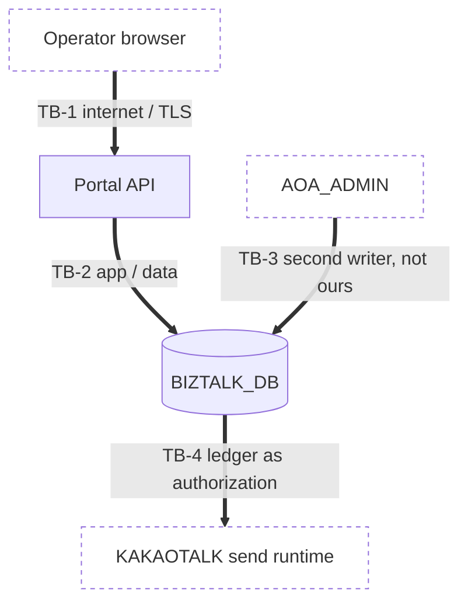

# Threat Model — 발신번호 (Sender Number Management)

> **Version**: 1.0
> **Date**: 2026-08-17
> **Method**: STRIDE across trust boundaries + attack-surface analysis
> **Predecessor**: [REQUIREMENTS-SPEC-SENDERNO.md](../requirements/REQUIREMENTS-SPEC-SENDERNO.md), [architecture-overview-SENDERNO.md](architecture-overview-SENDERNO.md)
> **Siblings**: [threat-model.md](threat-model.md), [threat-model-LOGIN.md](threat-model-LOGIN.md), [threat-model-INSTITUTION.md](threat-model-INSTITUTION.md)
> **Orphan threats: 0** — every threat maps to an ADR or an NFR-SEC requirement.

---

## 1. What is actually being protected

Most screens in this programme protect data. This one protects a **capability**: a row in `KKB_DPNO_LDGR` is what `KAKAOTALK` accepts as permission to send messages bearing that caller ID. Compromising this screen does not primarily leak information — it grants the ability to send messages that appear to come from someone else.

That framing matters because it inverts the usual severity ordering. Tampering and elevation-of-privilege outrank information disclosure here, and the highest-value target is not the data at rest but the **write path**.

It is also why RESIDUAL-S01 is load-bearing throughout this document. With ownership verification declined (AMB-S01), nothing in the system establishes that a registered number belongs to the institution registering it. Every mitigation below therefore assumes the actor is a vetted internal operator, and several of them fail if that assumption ever changes.

## 2. Trust boundaries

| ID | Boundary | Why it matters here |
|----|----------|--------------------|
| TB-1 | Browser → Portal API | The legacy put every control on this side of the line. All of them were bypassable |
| TB-2 | Application → Database | Encryption keys live in the DB (ADR-005); uniqueness must be enforced here to bind all writers |
| TB-3 | `AOA_ADMIN` → Database | **A writer we do not control, on the same table.** No application rule of ours constrains it |
| TB-4 | Database → `KAKAOTALK` | Presence of a row *is* the authorization decision. This boundary is crossed by data, not by a call |

TB-3 and TB-4 have no analogue in the earlier slices and are where this model does most of its work.

## 3. STRIDE analysis

### 3.1 Spoofing

| ID | Threat | Existing state | Mitigation | Maps to |
|----|--------|---------------|------------|---------|
| T-S1 | An unauthenticated caller invokes any of the six services | `<login>Y</login>` was the only gate | Authenticated session required on every endpoint | FR-AZ-D01, NFR-SEC-AUTHZ-D01 |
| T-S2 | **An operator registers a number belonging to a third party**, causing messages to appear to originate from that party | No ownership check at all; still none after AMB-S01 | **Not fully mitigated.** Partial: only authorized operators may register (FR-AZ-D01…D05) and a number already claimed cannot be taken (FR-SNDC-004). Residual: first claim wins | RESIDUAL-S01, CONST-BIZ-D02, ADR-SND-018 |
| T-S3 | An actor forges 등록자/수정자 in the request body | Legacy took them from the session — correct | Retained: actor from session only | FR-SNDC-009 |

**T-S2 is the highest-severity unmitigated threat in this slice** and it is unmitigated by an explicit PM decision, not by oversight. It is recorded here so that the decision remains visible to anyone reading the threat model rather than only to whoever read the question log.

### 3.2 Tampering

| ID | Threat | Existing state | Mitigation | Maps to |
|----|--------|---------------|------------|---------|
| T-T1 | A caller registers a number against an institution they have no relationship with | `IS_CD` taken from the request body | Scope resolved from the session; body value not trusted | FR-AZ-D03, NFR-SEC-TENANT-D01 |
| T-T2 | A caller deletes another institution's numbers, denying them the ability to send | Delete had **no** permission check, not even client-side | Server-side authorization at least as strict as register | FR-AZ-D04 |
| T-T3 | SQL injection through 발신번호, 설명 or 사유 | Bound parameters throughout | Retained; asserted by test | NFR-SEC-INJ-D01 |
| T-T4 | Malformed or special numbers registered (112, 114, 1335, non-numeric) | Rule stated to users, implemented nowhere; no digit check | Server-side validation of format, digits and the special-number list | FR-SNDC-005, FR-SNDC-006, AMB-S06 |
| T-T5 | **A duplicate is introduced through `AOA_ADMIN`, bypassing our uniqueness rule** | Nothing prevents it | DB-level unique constraint binds every writer | ADR-SND-018, CONST-BIZ-D01 |
| T-T6 | Over-length 설명/사유 used to bloat storage or break downstream rendering | HTML `maxlength` only | Server-side length validation | FR-SNDC-007, FR-SNDU-006 |

### 3.3 Repudiation

| ID | Threat | Existing state | Mitigation | Maps to |
|----|--------|---------------|------------|---------|
| T-R1 | An operator denies having registered or deleted a number | History existed but was **wrong** — multi-delete wrote the whole CSV list into every row (D-S5) | One accurate history row per number, from that iteration's value | FR-SNDD-004, FR-SNDH-003 |
| T-R2 | A description change leaves no trace | No history written at all (D-S10) | Dedicated action code on every description change | FR-SNDU-004 |
| T-R3 | A failed write leaves no evidence it was attempted | Error checks tested the wrong result object, swallowing failures (D-S7) | Audit written `REQUIRES_NEW`, survives business rollback | ADR-006, ADR-SND-019, NFR-OPS-AUDIT-D01 |
| T-R4 | History is altered to remove evidence | No update/delete path existed | Append-only, structurally — no update or delete method is declared | FR-SNDH-002, ADR-006 |

### 3.4 Information disclosure

| ID | Threat | Existing state | Mitigation | Maps to |
|----|--------|---------------|------------|---------|
| T-I1 | An authenticated user enumerates every institution's sender numbers | Fully possible — `IS_CD` from the body, no scope check | Session-derived scope; denied reads audited so enumeration is visible | FR-AZ-D03, ADR-SND-019 |
| T-I2 | **The institution's 인증키 is exposed to the registration screen** | The popup called the institution detail service, which returns 인증키 (D-S18 / D-I3) | Narrow endpoint returning 기관코드 and 기관명 only | FR-SNDC-002, inherits FR-ATK-004 |
| T-I3 | Sender numbers leak through application logs | `getLogger().debug()` used liberally across the action JSPs | Never logged in clear | NFR-SEC-LOG-D01 |
| T-I4 | **Sender numbers leak into the audit store**, which has longer retention and a different access model | Would be introduced by a naive reading of FR-SND-011 | Audit records counts and institution, never numbers | ADR-SND-019 |
| T-I5 | Operator PII exposure — 등록자ID is a plaintext email while 등록자명 is encrypted | Inconsistent by construction | Consistent identity handling | NFR-SEC-PII-D01, AMB-S09 |
| T-I6 | Over-fetching — `RGSR_ID`/`UDT_ID` shipped to the browser but never rendered | Present in the contract | Response carries only displayed fields | NFR-SEC-PII-D02 |
| T-I7 | Blind-index key compromise reveals which numbers exist (dictionary attack over a small domain) | N/A — new | Only if the non-deterministic branch is taken: HMAC key held with the application, not the DB, and managed under ADR-007 | ADR-SND-018, ADR-007 |

T-I7 deserves a note: a phone number has a small enough keyspace that an unkeyed hash would be trivially reversible. The blind index is an HMAC precisely so that compromising the database alone does not reveal the numbers — which is the whole point of encrypting the column in the first place.

### 3.5 Denial of service

| ID | Threat | Existing state | Mitigation | Maps to |
|----|--------|---------------|------------|---------|
| T-D1 | Unbounded list query exhausts memory or connections | No `LIMIT`, no `ORDER BY`; whole list fetched every time | Server-side paging with bounded page size | FR-SND-003, NFR-PERF-D01 |
| T-D2 | Full-table scans under load — every lookup applies `decrypt()` to the column | Inherent to the legacy design | Indexable lookup if the spike permits; otherwise measured and bounded | ADR-SND-018, NFR-PERF-D01 |
| T-D3 | Connection exhaustion — no transaction, connections not released on every path | Present in the legacy | Explicit transactions; pool stability tested | NFR-OPS-D01, TC-S002-22, TC-S004-19 |
| T-D4 | **An operator deletes an institution's numbers, disabling its ability to send entirely** | Trivially possible today | Authorization + confirmation + mandatory 사유 + recoverable archive | FR-AZ-D04, FR-SNDD-006/007, ADR-SND-017 |

T-D4 is a genuine availability threat rather than a data one: an institution with no live sender numbers cannot send at all, and under the legacy this was one unauthenticated-in-practice call away. The archive is what makes it recoverable in minutes rather than from backups.

### 3.6 Elevation of privilege

| ID | Threat | Existing state | Mitigation | Maps to |
|----|--------|---------------|------------|---------|
| T-E1 | A non-operator performs operator actions by calling services directly | The role check ran **in the browser**; the server had none | Server-side role enforcement on every endpoint | FR-AZ-D01, FR-AZ-D02, NFR-SEC-AUTHZ-D01 |
| T-E2 | A client-company user reaches this module | Nothing prevented it | Module restricted to operators | FR-AZ-D03 |
| T-E3 | **Registering a number is itself an elevation** — it grants the sending capability described in §1 | The entire write path was reachable by any authenticated user | Authorization is the only control (RESIDUAL-S01); every write audited | FR-AZ-D01…D05, ADR-SND-019 |

## 4. Attack surface

| Surface | Exposure | Principal risk | Control |
|---------|----------|----------------|---------|
| 6 REST endpoints (list, detail, register, edit, delete, institution context) | Authenticated operators | T-E1, T-T1 | Server-side authorization + tenant scope on each |
| `KKB_DPNO_LDGR` write path | Portal **and `AOA_ADMIN`** | T-T5 | DB constraint, not application logic |
| `KKB_DPNO_LDGR` read path | `KAKAOTALK` send runtime | T-S2, T-D4 | Row presence = authorization; archive-on-delete |
| Free-text 설명 / 사유 | Authenticated operators | T-T3, T-T6 | Bound parameters, server-side length limits, output escaping |
| Audit store | Operators, auditors | T-I4 | No numbers written |
| Institution context endpoint | Authenticated operators | T-I2 | Narrow response shape, asserted by test |

**Surface removed:** the `COOCON_SMS` external integration is not wired (AMB-S01), so the outbound channel and its `JexSystemConfig` credential are absent from this slice entirely. This is the one security benefit of the AMB-S01 ruling and it is worth stating plainly alongside its cost — declining OTP removed an external attack surface at the price of T-S2.

## 5. Threats that cannot be closed here

| ID | Threat | Why it stays open | Tracking |
|----|--------|-------------------|----------|
| T-S2 | Registration without ownership proof | PM ruling AMB-S01 | RESIDUAL-S01; revisit before client-company self-service |
| T-X1 | **`ADV_KKO_FT_SEND_act.jsp` never validates the sender number** against the ledger, while its `_BULK` and `_M` siblings do. A deleted or never-registered number is accepted on that path regardless of anything this project does | The code is in `KAKAOTALK`, outside the project boundary | RISK-S03, cutover checklist |
| T-X2 | `AOA_ADMIN` continues to offer the legacy screens with all 21 defects, against the same data | Outside the project boundary | RISK-S05 |

T-X1 and T-X2 are recorded rather than mitigated. Both are cases where this project can make its own behaviour correct and cannot make the system's behaviour correct, and saying so explicitly is the point — the alternative is a threat model that reads as though FR-SNDD-003 holds universally when it holds for five of six paths.

## 6. Severity and gate impact

No threat rated CVSS ≥ 7.0 remains **unmitigated by a decision within this project's control**.

Two carry that severity and are accepted or externalised by explicit decision:

- **T-S2** (CVSS ~7.4 equivalent — integrity impact via caller-ID assertion) — accepted by PM ruling, compensated by FR-AZ-D01…D05 and FR-SNDC-004, recorded as RESIDUAL-S01. **G1 must acknowledge this.**
- **T-X1** (CVSS ~7.1 equivalent) — outside the boundary, tracked as RISK-S03 with a named cutover action.

Neither blocks G2 on this project's deliverables. Both must appear in the G3 release evidence rather than being discovered at that point.

## 7. Maintenance

Per harness §3.5, this model is updated when the architecture, the external channels or the PII handling changes. Two specific triggers for this slice:

- **Spike S1-01 result.** If `ENCRYPT` proves non-deterministic, T-I7 becomes live and ADR-007 gains a second key to manage.
- **RISK-S01 resolution.** If `BIZ_DB` and `BIZTALK_DB` turn out to be different physical databases, TB-4 changes shape and ADR-SND-017's central mechanism needs re-derivation.
