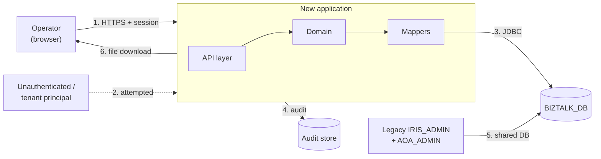

# Threat Model — 톡전송 내역 (BizTalk Transaction History)

> **Version**: 1.0
> **Date**: 2026-08-19
> **Method**: STRIDE across trust boundaries + attack-surface analysis
> **Author**: `security-auditor`
> **Predecessor**: [REQUIREMENTS-SPEC-TALK.md](../requirements/REQUIREMENTS-SPEC-TALK.md)
> **Companion**: [architecture-overview-TALK.md](architecture-overview-TALK.md), [risk-register-TALK.md](risk-register-TALK.md)
> **Programme baseline**: [threat-model.md](threat-model.md)

---

## 1. What is actually being protected

Three things, and they are not equally obvious.

**Recipient and sender phone numbers.** Personal information under 개인정보보호법 (BR-007, CONST-LEGAL-T01), stored encrypted, read through `decrypt()` and — in this slice's legacy queries — **never masked**. The 문자내역 slice masks the same class of column on its own tables; five queries here do not (D-T6).

**Message content.** `KKO_MSG.MSG`, `TEMPLATE_CODE`, `BUTTON_JSON` and the `FAILED_*` group are the actual text sent to a named individual, with the template that produced it. This is a category the previous five slices did not hold: 문자내역 shows message rows, 이용기관 보고서 shows counts, but the 메시지 상세 popup shows **what was said to whom**.

**Every institution's transaction volume and timing.** `FT_APITR_HSTR` is the shared Open-API log. Even with the account and card columns excluded by CONST-SEC-T01, the rows that remain disclose which institution called which API, when, how often and whether it failed — commercially sensitive in the same way the 보고서 slice's figures were, at finer grain.

A fourth thing is protected by *not being touched*: `FT_APITR_HSTR` also carries `FIN_ACNO`, `ACNO`, `CANO`, `FIN_CARD`, `TRAM`, `BRNO` and `RSPN_TLGR_CNTN` for the entire fintech API estate. This screen has no business with them, and CONST-SEC-T01 makes that structural rather than incidental.

## 2. Trust boundaries

| # | Boundary | Crossing |
|---|----------|----------|
| 1 | Browser → application | Authenticated operator; all filters, keys and export parameters |
| 2 | Unauthorized caller → application | Attempted; the legacy's five services all required a session but **none required a role** |
| 3 | Application → database | Read-only, nine-column projection; masking applied in SQL |
| 4 | Application → audit store | Actor, filters, scope, row count |
| 5 | Legacy → same database | Coexistence. **The legacy's defective services remain live throughout** |
| 6 | Application → browser | Export file — the only artifact that leaves the perimeter and persists |

## 3. STRIDE analysis

| ID | Flow | STRIDE | Threat | Likelihood | Mitigation | Req / ADR |
|----|------|--------|--------|-----------|------------|-----------|
| TM-T01 | 2 | **E**oP | Any authenticated principal reads every institution's transactions — the legacy has no institution predicate and no role check, only `<login>Y</login>` | High | Operator role enforced server-side on all five services; `PrincipalScope` decides scope from the session | FR-AZ-T02, NFR-SEC-AUTHZ-T01 / [ADR-TLK-027](adr/ADR-TLK-027-sibling-reuse-boundary.md) |
| TM-T02 | 1 | **I**nfo | **The export returns every institution's messages with plaintext phone numbers.** `fn_makeExcel()` reads filters from DOM ids that do not exist on the screen, so all resolve to `''`, every `CASE WHEN :X = ''` branch opens, and `decrypt()` runs with no `masking()` | High | Export consumes the list's own iterator, scope and filters; masking applied in SQL; row ceiling; audit with row count | FR-TLKX-001, FR-TLKX-008, NFR-SEC-PII-T01 / [ADR-RPT-023](adr/ADR-RPT-023-export-generation.md) |
| TM-T03 | 2 | **I**nfo | `biztalk_admin_30_l002` is registered, authenticated and reachable, returns unmasked recipient and sender numbers over an arbitrary date range with no institution requirement and no pagination — **and has no caller who would notice** | Medium | Capability not carried forward; endpoint-inventory test asserts no equivalent exists | FR-AZ-T06 |
| TM-T04 | 1 | **I**nfo | A message key alone retrieves any institution's message body, template and numbers — the detail query keys on `REQDATE` + `STATUS` + `MSGKEY` with no institution | Medium | Detail key includes the owning institution; drill-down enforced as a hierarchy | FR-AZ-T04, CONST-BIZ-T01 |
| TM-T05 | 1 | **T**ampering | The transaction-detail popup takes its institution from a hidden form input the browser supplies | Medium | Institution re-derived server-side from `TRDD` + `IS_TUNO` | FR-AZ-T03 |
| TM-T06 | 1 → 6 | **T**ampering | Response splitting: `START_DT`/`END_DT` reach `Content-Disposition` unvalidated; the non-IE branch only recodes bytes | Medium | Filename composed server-side from validated values, RFC 6266 + RFC 5987 encoded; CR/LF rejected at validation | FR-TLKX-003, NFR-SEC-HDR-T01 |
| TM-T07 | 1 | **E**oP | The export bypasses its declared contract entirely — all ten parameters read via `request.getParameter`, so declared lengths and `fullChar` rules never apply | Medium | Every input through the validated request record; the export re-runs authorization and validation in full | FR-TLKX-002 |
| TM-T08 | 1 | **D**oS | No period cap, no row cap, no pagination on the export; `XSSFWorkbook` fully materialised over a four-way union calling `decrypt()` twice per row | Medium | 31-day cap server-side, keyset paging, streamed writer, hard row ceiling | FR-TLK-007, FR-TLKX-005, NFR-SCALE-T01 |
| TM-T09 | 3 | **I**nfo | A widened projection leaks `ACNO` / `CANO` / `TRAM` / `RSPN_TLGR_CNTN` from the shared API log | Low | Closed `resultMap`, nine-field record, exact-field-set contract test, `SELECT *` prohibited in the package | CONST-SEC-T01 |
| TM-T10 | 1 | **I**nfo | Error messages become an enumeration oracle — "that institution exists / does not" | Low | Out-of-scope values are **ignored, not validated-then-rejected**; the `PrincipalScope` rule inherited from the 보고서 slice | FR-AZ-T03 |
| TM-T11 | 4 | **R**epudiation | No business audit. `mntLogYn=Y` produces a Jex service-monitor record that disappears with Jex, so nothing records who exported which institutions' recipient numbers | High | `AuditService` on every list, detail open and export, with row count | FR-AZ-T05, FR-TLKX-007 / [ADR-006](adr/ADR-006-audit-logging.md) |
| TM-T12 | 1 | **S**poofing | Session fixation / hijack reaching an operator screen | Low | Inherited from the 로그인 slice unchanged | [ADR-LOGIN-012](adr/ADR-LOGIN-012-session-management.md) |
| TM-T13 | 5 | **T**ampering | Legacy `IRIS_ADMIN` retains broad DB rights on the same tables; a legacy compromise reaches the same data | Medium | Least-privilege read-only account for the new application; **legacy hardening out of scope — residual** | [ADR-007](adr/ADR-007-key-management.md) / TM-016 |
| TM-T14 | 6 | **I**nfo | Exported files persist outside the perimeter with no expiry and no recall | Medium | Masked content (FR-TLKX-008) and audited extraction (FR-TLKX-007) bound the damage; the file itself cannot be recalled — **residual, accepted** | RISK-T02 |
| TM-T15 | 1 | **I**nfo | Under-inclusion by misclassification hides real transactions from an operator without any indication | Medium | Reconciliation report counts transactions excluded by classification; startup validation of the allow-list | FR-TLK-002 / [ADR-TLK-024](adr/ADR-TLK-024-biztalk-api-classification.md) |
| TM-T16 | 1 | **I**nfo | A lossy identifier match returns **another transaction's** messages — `lpad(…, 10, '0')` truncates a 20-character serial | Medium | One canonical `TransactionSerial`; widths measured by T1-01; padding never in SQL | FR-TLKD-009 / [ADR-TLK-025](adr/ADR-TLK-025-transaction-message-identity.md) |

**Orphan threats: 0.** Every threat maps to at least one requirement and, where a design choice was involved, to an ADR.

## 4. Attack surface

| Entry point | Auth | Role | Inputs | Notes |
|-------------|------|------|--------|-------|
| `GET /api/biztalk/talk-history` | Session | Operator | dates, times, serial, status, API code, institution, page | Period-capped, keyset-paged |
| `GET /api/biztalk/talk-history/api-services` | Session | Operator | none | Returns allow-listed codes + display names only |
| `GET /api/biztalk/talk-history/{trdd}/{serial}/messages` | Session | Operator | phone, status, talk result, msg result, page | Institution re-derived server-side |
| `GET /api/biztalk/talk-history/messages/{key}` | Session | Operator | institution-qualified key | Not addressable by message key alone |
| `POST /api/biztalk/talk-history/export` | Session | Operator | same as list | Row-capped, streamed, audited |

Five endpoints, five requiring the operator role. The legacy exposed **nine** services for the same three screens, of which one (`biztalk_admin_30_l002`) had no caller and returned unmasked PII, and one (`biztalk_admin_30_spreadsheet`) read a different table family than the screen it belonged to. Reducing nine to five is itself a control.

## 5. Threats that cannot be closed here

| Threat | Why | Owner |
|--------|-----|-------|
| TM-T13 — legacy shares the database with broad rights | Legacy hardening is outside this project's scope; accepted for the coexistence period | PM / 정보보호 |
| TM-T14 — exported files persist | No technical control recalls a delivered file. Masking and audit bound it | 정보보호 |
| **Historical exploitation of TM-T02** | The defective export has been live for the life of the screen and **produces a file**. Unlike the 보고서 slice's exposure, the question is not only who read but what they kept | 정보보호 (OI-T01, RISK-T02) |
| **The legacy endpoints stay live until cutover** | FR-AZ-T06 removes `biztalk_admin_30_l002` from the new application; it remains reachable in `IRIS_ADMIN`. It has no caller, so it can be disabled ahead of cutover at near-zero risk | Operations (RISK-T03) |

## 6. Severity and gate impact

| Threat | CVSS v3.1 (legacy, pre-fix) | Post-mitigation |
|--------|------------------------------|-----------------|
| TM-T02 | **8.6** — AV:N/AC:L/PR:L/UI:N/S:C/C:H/I:N/A:N | Mitigated in-slice |
| TM-T01 | **7.7** — AV:N/AC:L/PR:L/UI:N/S:C/C:H/I:N/A:N | Mitigated in-slice |
| TM-T03 | **7.7** | Removed (capability deleted) |
| TM-T04 | **6.5** | Mitigated in-slice |
| TM-T06 | **6.1** | Mitigated in-slice |
| TM-T11 | **5.3** | Mitigated in-slice |
| TM-T13 | **5.9** | **Residual, accepted** — programme-level, TM-016 |
| TM-T14 | **4.3** | **Residual, accepted** |

**No unmitigated threat at CVSS ≥ 7.0 remains within the slice**, so nothing here blocks G2 or G3. The two residuals are both below 7.0 and both already carry programme-level acceptance.

The three findings scoring ≥ 7.0 pre-fix are the reason this slice's rollback position is worse than any predecessor's (DEV-PLAN §11): rolling back reinstates an 8.6.

## 7. Maintenance

This model is revised when the API classification changes (ADR-TLK-024's allow-list), when a table is added to the read set, when the export's delivery mechanism changes, or when AMB-T06's answer alters the message read path. Each revision is recorded as an ADR amendment, per the programme baseline.
