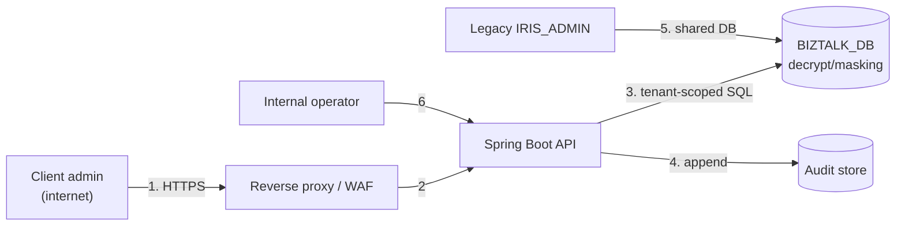

# Threat Model — IRIS BizTalk Portal (문자내역 slice)

> **Skill**: `03-draft-dev-plan` (design stage, pre-G2)
> **Lead**: `architect` / **Review**: `security-auditor`
> **Method**: STRIDE + attack surface analysis
> **Update trigger**: architecture change, new external channel, new PII processing (changes recorded as ADR)
> **Date**: 2026-08-14

---

## 1. Scope and trust boundaries

**System under analysis**: 문자내역 list and detail (screens 40/41) of the new portal — React SPA, Spring Boot 3 API, PostgreSQL `BIZTALK_DB`.

**Trust boundaries**

| # | Boundary | Note |
|---|----------|------|
| TB-1 | Internet ↔ DMZ | **New.** The legacy was intranet-only; the portal is externally exposed (proposal §3) |
| TB-2 | DMZ ↔ internal application | Reverse proxy to Spring Boot |
| TB-3 | Application ↔ database | `BIZTALK_DB`, shared with the still-running legacy |
| TB-4 | **Tenant ↔ tenant** | Logical, not network. Enforced only by application code — the most fragile boundary in this design |
| TB-5 | Application ↔ audit store | Append-only; integrity must survive application compromise |

**Assets**

| Asset | Sensitivity |
|-------|-------------|
| Recipient / sender phone numbers (`PHONE`, `CALLBACK`) | PII — 개인정보보호법 |
| Message content (`MSG`) | May contain PII, financial or authentication data (인증번호전송 path exists) |
| Message metadata (`MSGKEY`, `STATUS`, timestamps) | Business-confidential; reveals send volumes per client |
| 이용기관 identity and list | Customer list — competitively sensitive |
| Session credentials | Access to all of the above |
| Audit log | Regulatory evidence — 전자금융감독규정 |
| DB `decrypt()` function and key material | Compromise exposes all historical PII |

### Data flow diagram

Flows 1–6 all cross a trust boundary and are analysed below.

## 2. STRIDE analysis

| ID | Component / flow | STRIDE | Threat scenario | Impact | Mitigation | ADR / REQ |
|----|------------------|--------|-----------------|--------|-----------|-----------|
| TM-001 | Login / session (flow 1) | **S**poofing | Credential theft or reuse; legacy used **MD5** password hashing, now internet-facing | High | Modern password hash (Argon2id/bcrypt); MD5 eliminated; rate limiting on login | ADR-008 / NFR-SEC-AUTH, RISK-005 |
| TM-002 | Search API (flow 2) | **S**poofing | Unauthenticated call to the history endpoint — **the legacy list service ran with `<login>N</login>` (D1)** | High | `AuthenticationFilter` with no per-service opt-out | ADR-008 / FR-MSG-001 |
| TM-003 | Session token (flow 1) | **T**ampering | Token forged or altered to change identity or tenant | High | Signed, integrity-protected tokens; server-side session validation; tenant never read from the token payload alone | ADR-008 / NFR-SEC-AUTH |
| TM-004 | Search criteria (flow 2) | **T**ampering | Client supplies another tenant's 이용기관 id — **the legacy accepted a client-supplied `ID`** | High | Tenant derived from session server-side; client value ignored, attempt logged | ADR-008 / FR-TEN-001, NFR-SEC-TENANT |
| TM-005 | SQL parameters (flow 3) | **T**ampering | Injection through search fields into the 8-way UNION | High | Named parameter binding only (legacy already does this — preserve); input validation on enums and numerics | ADR-003 / NFR-SEC-INJ, CONST-DATA-03 |
| TM-006 | Audit log (flow 4) | **R**epudiation | User denies having queried another party's records; or an attacker deletes their trail | Medium | Append-only store, integrity protection, separate write path, 5-year retention | ADR-006 / NFR-OPS-AUDIT |
| TM-007 | API responses (flow 2) | **I**nfo disclosure | Unmasked phone numbers returned to the client | High | Masking applied in the database (`masking(decrypt(...))`); unmasked values never leave the DB tier | ADR-005 / NFR-SEC-PII |
| TM-008 | **Tenant boundary (TB-4)** | **I**nfo disclosure | One client company reads another's message history — combined D1+client-supplied ID made this trivially possible in the legacy | **High** | Tenant predicate injected into SQL, not applied post-fetch; cross-tenant integration test is a release gate | ADR-003 / FR-TEN-002, NFR-SEC-TENANT |
| TM-009 | Detail endpoint (flow 2) | **I**nfo disclosure | Enumerating `MSGKEY` values to read others' messages | High | Ownership verified before disclosure; not-found response indistinguishable from not-owned | — / FR-MSGD-001 |
| TM-010 | Application logs | **I**nfo disclosure | PII written to logs — legacy action JSPs call `logger.debug()` on error payloads | Medium | No PII in logs; static analysis in CI | ADR-005 / NFR-SEC-LOG |
| TM-011 | 이용기관 list endpoint | **I**nfo disclosure | Tenant user enumerates the full customer list — legacy `fn_getIsList()` called it with `USE_YN=ALL` for every user | Medium | Endpoint restricted to operator roles | — / FR-TEN-004 |
| TM-012 | Search API (flow 2) | **D**oS | Wide date range over an 8-table UNION with per-row `decrypt()` — legacy had **no paging and no range cap** (D7) | Medium | 31-day cap (FR-MSG-013); server-side paging (FR-MSG-007); per-session rate limiting | ADR-009 / NFR-PERF-01 |
| TM-013 | DB connection pool | **D**oS | Long-running queries exhaust the pool, taking down the app for all tenants | Medium | Query timeout, pool sizing, circuit breaker on the data source | ADR-009 / NFR-PERF-01 |
| TM-014 | Role handling | **E**oP | Tenant user obtains operator capability and gains access to all institutions and 수수료 data | High | Role checks server-side on every endpoint; least privilege; operator endpoints separately authorised | ADR-008 / FR-TEN-003/004 |
| TM-015 | DB credentials / `decrypt()` key | **E**oP | Application compromise yields the decryption capability for all historical PII | High | Secrets outside source; least-privilege DB account; key custody in the DB tier | ADR-007 / CONST-DATA-02 |
| TM-016 | Shared DB with legacy (flow 5) | **T**ampering | Legacy IRIS_ADMIN retains broad DB rights; a legacy compromise reaches the same tables | Medium | Separate DB account for the new app with least privilege; legacy hardening out of scope — **residual** | ADR-007 / — |
| TM-017 | React SPA (flow 1) | **T**ampering | XSS executing in the tenant's browser, exfiltrating session or displayed PII | High | Framework escaping; CSP; no `dangerouslySetInnerHTML` on message content; HttpOnly cookie if session-based | ADR-008 / NFR-SEC-CHANNEL |
| TM-018 | npm dependencies | **T**ampering | Supply-chain compromise in a frontend package — new surface introduced by ADR-001 | Medium | Dependency scanning + SBOM in CI; lockfile pinning | ADR-001 / TEST-PLAN §5 |

> STRIDE coverage: Spoofing ✅ (TM-001/002) · Tampering ✅ (TM-003/004/005/016/017/018) · Repudiation ✅ (TM-006) · Information disclosure ✅ (TM-007…011) · DoS ✅ (TM-012/013) · Elevation of privilege ✅ (TM-014/015). **All six categories reviewed against every boundary-crossing flow. Orphan threats: 0** — each row maps to an ADR and/or a requirement.

## 3. Attack surface

| Surface | Exposure | Auth / authz | Input validation | Note |
|---------|----------|--------------|------------------|------|
| `POST /api/message-history/search` | **Internet** | Session required; tenant server-derived | Enum whitelist (`AT`/`FT`, `SMS`/`MMS`), numeric `MSGKEY`, date range ≤31d | Highest-value target — returns PII in bulk |
| `GET /api/message-history/{key}` | **Internet** | Session + ownership check | Numeric key, mandatory type params | Enumeration target (TM-009) |
| `GET /api/institutions` | **Internet** (operator only) | Session + operator role | — | Customer list (TM-011) |
| Login / session endpoints | **Internet** | — (entry point) | Credential format, rate limit | MD5 replacement mandatory (RISK-005) |
| React static assets | **Internet** | None (public) | — | CSP, SRI; no secrets in bundle |
| Database | Internal | Least-privilege app account | Parameter binding | `decrypt()` capability is the crown jewel |
| Audit store | Internal | Append-only writer | — | Must resist app-tier compromise |

**Not present in this slice** (and therefore not analysed): file upload, outbound provider calls, message send, batch execution. These arrive with the send-path slice and **require this model to be updated** before that work starts.

## 4. Unresolved threats / residual risk

| ID | Threat | Status | Residual | Decision | Approver |
|----|--------|--------|----------|----------|----------|
| TM-016 | Legacy IRIS_ADMIN shares `BIZTALK_DB` with broad privileges | OPEN | **M** | Accept for the coexistence period; new app uses a least-privilege account. Legacy hardening is outside this project's scope | PM / 정보보호 |
| TM-015 | Key custody remains in the database tier (CONST-DATA-02) | MITIGATED (partial) | **M** | Accepted — moving key management into the application would require re-encrypting historical data and re-implementing `decrypt()`, out of scope for this slice. Revisit if a KMS is adopted (ADR-007) | PM / 정보보호 |
| — | 망분리 vs. one app serving external tenants and internal operators | **OPEN** | **H** | **Not resolvable in this slice.** This slice is tenant-facing and read-only; the operator surface forces the decision. Blocks the operator screens, not this one (OI-04, RISK-006) | PM + architect |

> No threat in this model is currently rated at CVSS ≥ 7.0 **unmitigated**. TM-002, TM-004 and TM-008 would each exceed that threshold if implemented as the legacy does — they are the reason D1 and the tenant retrofit are Must-priority requirements rather than improvements.

## 5. DoD

- [x] STRIDE 6 categories reviewed against every trust-boundary-crossing flow
- [x] Every threat mapped to a mitigation + ADR/REQ — **orphan threats: 0**
- [x] Attack surface table with auth and input validation stated
- [x] Residual risks listed for PM / 정보보호 acceptance
- [x] CVSS ≥ 7.0 threats linked to G2/G3 blocking conditions
- [ ] PM / 정보보호 sign-off on the three residual items in §4
