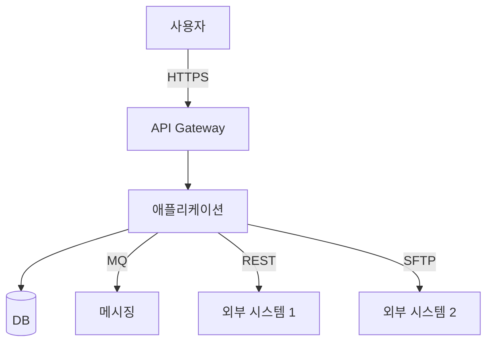
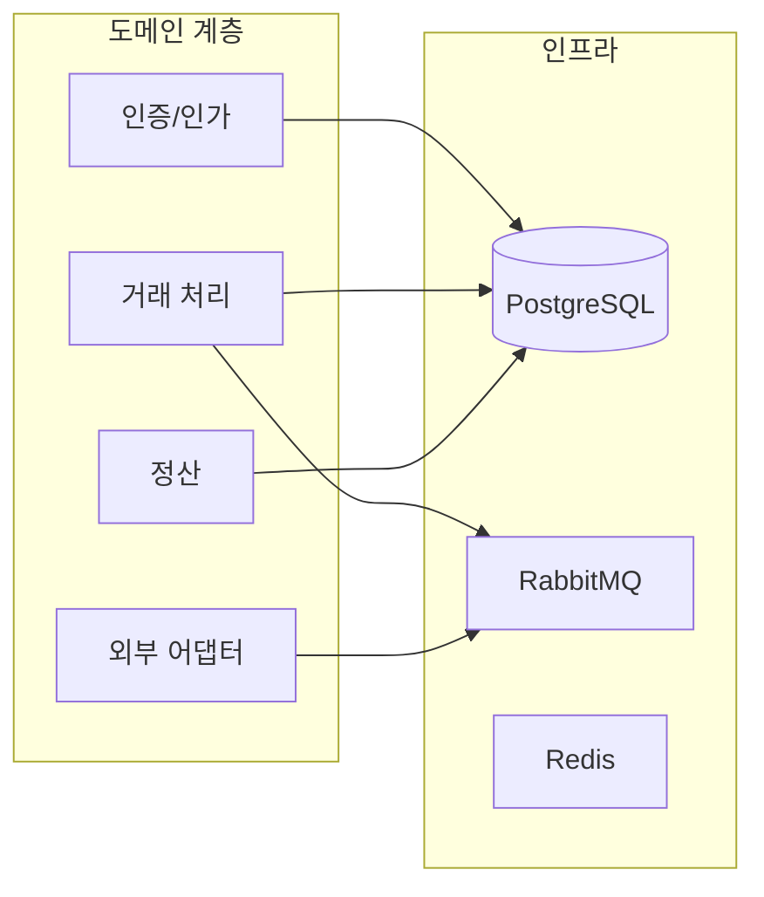
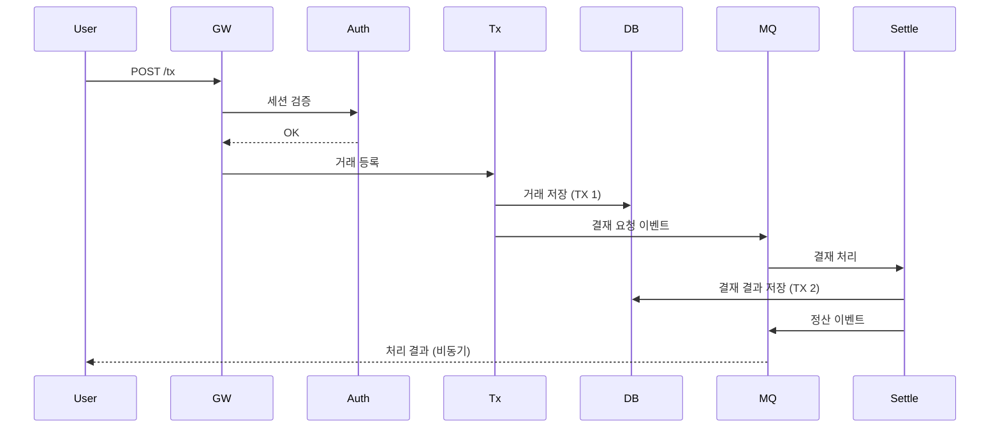

# 아키텍처 개요 — {프로젝트명}

> **버전**: 1.0
> **일자**: {YYYY-MM-DD}
> **대상**: 임원 / 신규 인력 / 외부 감사
> **선행 ADR**: ADR-001 ~ ADR-NNN

---

## 1. 시스템 컨텍스트 (C4 Level 1)

## 2. 컴포넌트 (C4 Level 2)

## 3. 도메인 패키지 격리

| 패키지 | 도메인 | 외부 채널 | ADR |
|--------|--------|----------|-----|
| `com.{domain}.{prj}.auth` | 인증·인가 | - | ADR-008 |
| `com.{domain}.{prj}.tx` | 거래 처리 | RabbitMQ | ADR-002 |
| `com.{domain}.{prj}.settle` | 정산 | - | ADR-003 |
| `com.{domain}.{prj}.ext.kftc` | 결제대행 | REST OAuth2 | ADR-008 |
| `com.{domain}.{prj}.ext.bnp` | 본점 연동 | TCP / MQ | ADR-008 |

> **격리 원칙**: 도메인 간 직접 의존 절대 금지 (ArchUnit 빌드 시 강제). 크로스 도메인은 이벤트 또는 명시적 인터페이스 경유.

## 4. 데이터 흐름 (예시 시나리오)

### 4.1 거래 등록 → 결재 → 정산

## 5. 트랜잭션 경계 (ADR-002)

| 경계 | 범위 | 격리 수준 |
|------|------|---------|
| 거래 등록 | 단일 DB | READ_COMMITTED |
| 결재 처리 | 거래 + 결재 | READ_COMMITTED + Outbox |
| 정산 | 정산 + 회계 | SERIALIZABLE |
| 외부 송신 | Outbox + 재시도 | REQUIRES_NEW |

> **Outbox 패턴**: 거래 → DB 저장 + Outbox 이벤트 저장이 동일 트랜잭션. 별도 publisher 가 Outbox → MQ 송신.

## 6. 비기능 아키텍처

### 6.1 성능
- Connection Pool: HikariCP (max 50)
- Cache: Caffeine (local) + Redis (shared)
- Async: `@Async` + Virtual Thread (Java 21+)

### 6.2 보안
- 인증: OAuth2 + JWT (RS256) — ADR-008
- 인가: RBAC + ABAC 혼합
- 암호화: PII = AES-256-GCM (KMS) — ADR-005
- 통신: TLS 1.3 / mTLS (외부) — ADR-008
- 키 관리: AWS KMS / HSM — ADR-007

### 6.3 가용성
- 배포: Blue-Green (K8s)
- DR: Multi-AZ + Cross-Region replica
- 백업: 매시간 + 매일 풀백업

### 6.4 확장성
- 수평 확장: Stateless 서비스 → K8s HPA
- DB: Read replica + 샤딩 가능한 키 설계
- 메시징: 큐 파티션 분산

## 7. 외부 채널 통합

| 채널 | 프로토콜 | 인증 | 재시도 |
|------|---------|------|------|
| {결제대행} | REST + OAuth2 | Client Credentials + TLS | Resilience4j (4회 exponential) |
| {본점 MQ} | RabbitMQ AMQP | TLS + SASL | DLX + 재처리 |
| {외부 TCP} | TCP 고정폭 / 4B prefix | mTLS | 큐 적재 + 재송신 |
| {파일 전송} | SFTP | SSH Key | 매시간 폴링 + 중복 검출 |

## 8. ADR 카탈로그 (요약)

| ADR | 제목 | 상태 |
|-----|------|------|
| ADR-001 | 기술 스택 결정 | ACCEPTED |
| ADR-002 | 트랜잭션 모델 | ACCEPTED |
| ADR-003 | 영속성 전략 | ACCEPTED |
| ADR-004 | 메시지 무결성 | ACCEPTED |
| ADR-005 | PII 암호화 | ACCEPTED |
| ADR-006 | 감사 로깅 | ACCEPTED |
| ADR-007 | 키 관리 | ACCEPTED |
| ADR-008 | 외부 채널 인증 | ACCEPTED |
| ADR-009 | 재시도 / 멱등성 | ACCEPTED |
| ADR-010 | 도메인 격리 | ACCEPTED |

전체 ADR: `docs/design/adr/`

## 9. 운영 / 모니터링

| 영역 | 도구 |
|------|------|
| 메트릭 | Prometheus + Grafana |
| 로그 | ELK Stack (Elasticsearch + Kibana) |
| APM | DataDog / New Relic |
| 트레이싱 | OpenTelemetry + Jaeger |
| 알람 | Slack + PagerDuty + SMS |

## 10. 향후 확장

- 분기 1: 추가 도메인 통합
- 분기 2: 이벤트 소싱 도입 검토
- 분기 3: AI 추천 / 예측 기능

---

**결재**
| 일자 | 결재자 | 의견 |
|------|--------|------|
| {YYYY-MM-DD} | 아키텍트 | |
| {YYYY-MM-DD} | PM | |
