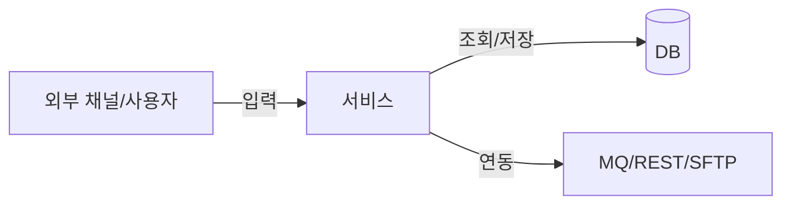

# 위협 모델 (Threat Model) — {프로젝트명}

> **작성 스킬**: `03-draft-dev-plan` (설계 단계, G2 전)
> **Lead**: `architect` / **검토**: `security-auditor`
> **방법론**: STRIDE + 공격 표면(Attack Surface) 분석
> **갱신 시점**: 아키텍처 변경·신규 외부 채널·신규 PII 처리 시 (변경은 ADR로 이력)

---

## 1. 범위 / 신뢰 경계 (Trust Boundaries)

- 분석 대상 시스템 / 컴포넌트: {…}
- 신뢰 경계: {예) 인터넷 ↔ DMZ ↔ 내부망 ↔ DB, 외부 채널(MQ/REST/SFTP) 경계}
- 자산(보호 대상): {PII / 계좌·거래 데이터 / 키·시크릿 / 감사로그 …}

### 데이터 흐름(DFD) 개요

> 신뢰 경계를 가로지르는 모든 흐름이 §2 위협 분석 대상이다.

## 2. STRIDE 위협 분석

각 컴포넌트/데이터 흐름별로 식별. (해당 없으면 `N/A` + 근거)

| ID | 컴포넌트/흐름 | STRIDE | 위협 시나리오 | 영향 | 완화책 | 연계 ADR / REQ |
|----|--------------|--------|--------------|------|--------|----------------|
| TM-001 | {로그인 API} | **S**poofing | 자격증명 도용 | 높음 | MFA/OAuth2 | NFR-SEC-AUTH / ADR-008 |
| TM-002 | {거래 처리} | **T**ampering | 전문 위변조 | 높음 | HMAC/서명 | ADR-004 |
| TM-003 | {감사 로그} | **R**epudiation | 행위 부인 | 중간 | 무결성 로그·서명 | ADR-006 |
| TM-004 | {PII 저장} | **I**nfo Disclosure | 평문 유출 | 높음 | AES-256-GCM·마스킹 | ADR-005 |
| TM-005 | {외부 채널} | **D**oS | 과부하/연결 고갈 | 중간 | 타임아웃·레이트리밋·서킷브레이커 | NFR-SCALE / ADR-009 |
| TM-006 | {관리 기능} | **E**oP | 권한 상승 | 높음 | 최소권한·RBAC | NFR-SEC-AUTH |

> STRIDE 6개 범주를 모든 신뢰 경계 횡단 흐름에 1회 이상 검토했는가? □

## 3. 공격 표면 (Attack Surface)

| 표면 | 노출 | 인증/인가 | 입력 검증 | 비고 |
|------|------|-----------|-----------|------|
| 공개 API/엔드포인트 | {인터넷/내부} | {mTLS/OAuth2} | {스키마 검증} | |
| 외부 채널(MQ/REST/SFTP) | {파트너} | {mTLS/화이트리스트} | {전문 검증} | |
| 관리/운영 인터페이스 | {내부} | {RBAC+MFA} | | |
| 파일 업로드/파싱 | {…} | | {타입·크기·악성} | 프롬프트 인젝션 주의 |

## 4. 미해결 위협 / 잔여 위험

| ID | 위협 | 현재 상태 | 잔여 위험 | 결정(수용/완화/이관) | 결재 |
|----|------|----------|-----------|---------------------|------|
| TM-… | | OPEN/MITIGATED | H/M/L | | PM/정보보호 |

## 5. 완료 기준 (DoD)

- [ ] 모든 신뢰 경계 횡단 흐름에 STRIDE 6범주 검토 (해당없음은 근거 명시)
- [ ] 각 위협에 완화책 + 연계 ADR/REQ 매핑 (orphan 위협 0)
- [ ] 공격 표면 표 작성 (인증·입력검증 명시)
- [ ] 잔여 위험은 PM/정보보호 결재로 수용/완화 결정
- [ ] CVSS ≥ 7.0 상응 위협은 G2/G3 차단 조건과 연계
